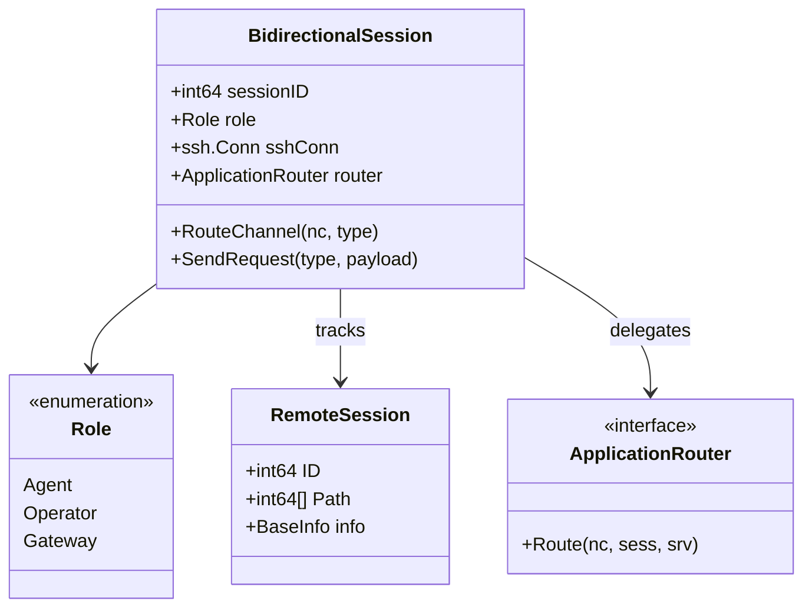
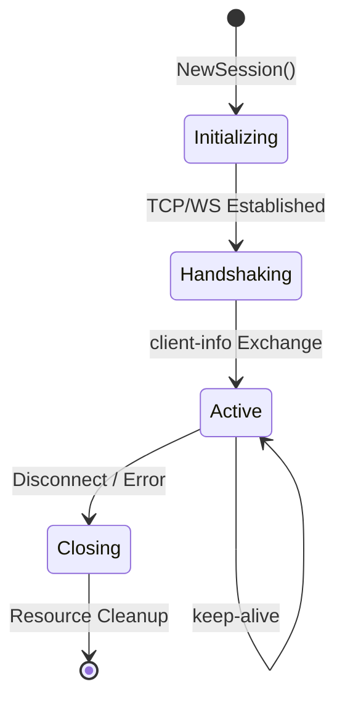
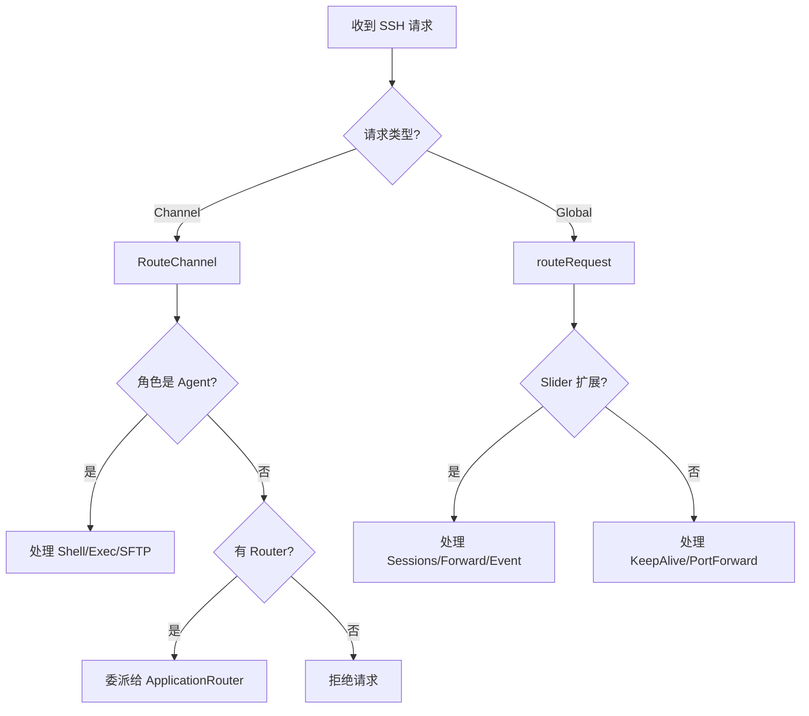
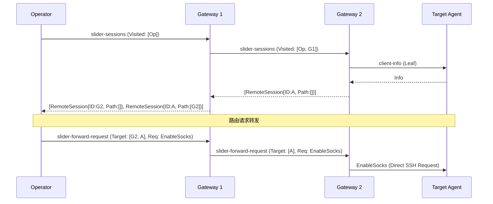
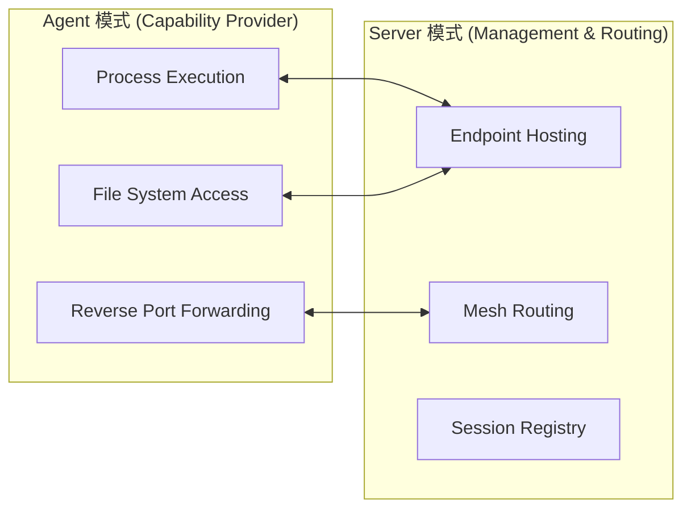
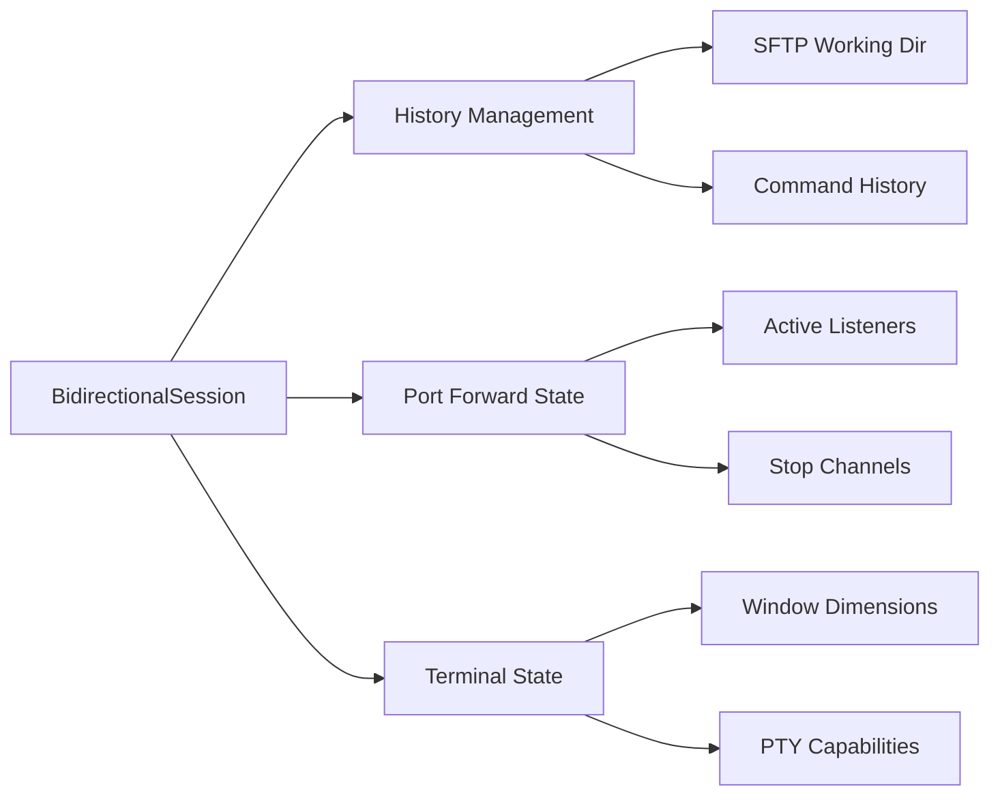

# 会话管理与路由系统

## 目录
1. [模块概览](#模块概览)
2. [引言](#引言)
3. [核心组件](#核心组件)
   - [BidirectionalSession：统一会话对象](#bidirectionalsession统一会话对象)
   - [Role：安全意图与角色定义](#role安全意图与角色定义)
   - [RemoteSession：网格元数据](#remotesession网格元数据)
4. [会话生命周期管理](#会话生命周期管理)
   - [创建阶段：多样化的连接模式](#创建阶段多样化的连接模式)
   - [握手阶段：信息交换与身份验证](#握手阶段信息交换与身份验证)
   - [销毁阶段：资源清理与通知](#销毁阶段资源清理与通知)
5. [请求路由系统](#请求路由系统)
   - [通道路由 (Channel Routing)](#通道路由-channel-routing)
   - [全局请求处理 (Global Request Handling)](#全局请求处理-global-request-handling)
6. [多级跳板与网格路由算法](#多级跳板与网格路由算法)
   - [递归会话发现协议](#递归会话发现协议)
   - [基于路径的请求转发算法](#基于路径的请求转发算法)
   - [环路检测机制](#环路检测机制)
7. [客户端模式与服务端模式差异](#客户端模式与服务端模式差异)
   - [Agent 模式：执行与转发](#agent-模式执行与转发)
   - [Operator/Gateway 模式：管控与路由](#operatorgateway-模式管控与路由)
8. [状态维护与历史记录](#状态维护与历史记录)
9. [文件参考](#文件参考)

## 模块概览

`pkg/session` 模块是 Slider 的核心逻辑枢纽，负责管理所有网络连接的生命周期、安全角色以及跨节点的请求路由。该模块实现了 Slider 独特的“会话即路由”架构，使得复杂的跨内网穿透和多级跳板操作对用户透明。

**模块统计：**
- **总文件数**：12 个 Go 源文件。
- **核心文件**：
  - `session.go`: 定义了核心的 `BidirectionalSession` 结构。
  - `lifecycle.go`: 负责会话的创建与销毁逻辑。
  - `routing.go`: 实现 SSH 通道级别的路由分发。
  - `requests.go`: 处理 SSH 全局请求及 Slider 自定义扩展请求。
  - `client_mode.go` & `server_mode.go`: 分别实现客户端（Agent）和服务端（Operator/Gateway）的特有逻辑。
  - `gateway_mode.go`: 实现多级跳板相关的网格管理功能。
  - `history.go`: 维护会话状态和操作历史。

该模块将被深度覆盖，重点分析其在多级跳板场景下的路由寻址算法和会话状态维护机制。

## 引言

Slider 的设计目标是在高度受限的网络环境中提供灵活的远程访问能力。为了实现这一目标，Slider 并没有采用传统的“客户端-服务器”固定模式，而是引入了**双向会话 (Bidirectional Session)** 的概念。

在 Slider 系统中，每一个连接都被抽象为一个 `BidirectionalSession`。无论连接是由 Agent 主动发起的（反向连接），还是由 Operator 主动发起的（正向连接），一旦握手完成，该会话就具备了双向通信的能力。这种设计使得 Slider 能够轻松应对防火墙限制、NAT 穿透以及多级内网跳转等复杂拓扑。

路由系统则是建立在会话之上的逻辑层。通过在会话中嵌入路由信息，Slider 能够构建起一个动态的、可扩展的通信网格。每一个 Gateway 节点不仅管理本地会话，还能够感知并路由指向远程节点的请求。本章节将深入探讨这一系统的实现细节。

## 核心组件

### BidirectionalSession：统一会话对象

`BidirectionalSession` 是 Slider 中最重要的数据结构。它封装了底层的 SSH 连接（无论是作为客户端还是服务端），并维护了该连接的所有状态信息。

```go
type BidirectionalSession struct {
    sessionID int64
    role      Role
    peerRole  Role

    // 网络连接
    wsConn  *websocket.Conn // WebSocket 封装
    rawConn net.Conn        // 原始 TCP/Unix 封装

    // SSH 连接 - 根据角色二选一
    sshClient     *ssh.Client
    sshServerConn *ssh.ServerConn

    // 会话状态
    peerBaseInfo     interpreter.BaseInfo
    parentSessionID  int64 // 用于跟踪 Beacon 隧道

    // 路由与扩展
    router ApplicationRouter
    applicationServer ApplicationServer

    // 远程会话跟踪（网格模式）
    remoteSessions      map[string]RemoteSession
    remoteSessionsMutex sync.RWMutex
}
```

该结构的设计体现了“角色无关性”。通过 `sshClient` 和 `sshServerConn` 的抽象，上层逻辑无需关心当前节点是连接的发起方还是接受方。

### Role：安全意图与角色定义

Slider 定义了六种细分角色，用于精确控制会话的行为和权限：

1.  **AgentConnector/Listener**: 目标节点（受控端），提供 Shell/Exec 等能力。
2.  **OperatorConnector/Listener**: 控制端，发起指令和管理请求。
3.  **GatewayConnector/Listener**: 中继节点，负责流量转发和网格路由。

这些角色决定了 `RouteChannel` 如何处理接入的通道请求。例如，只有 `Agent` 角色会接受 `shell` 通道请求，而 `Gateway` 角色则会优先处理 `slider-connect` 路由请求。

### RemoteSession：网格元数据

在多级跳板场景下，节点需要了解网格中其他节点的信息。`RemoteSession` 结构体用于描述一个远程可达的会话：

```go
type RemoteSession struct {
    ID                int64
    ParentSessionID   int64
    ServerFingerprint string
    Role           string
    Path           []int64 // 路由路径：[Hop1_ID, Hop2_ID, ..., Target_ID]
}
```

`Path` 字段是路由系统的核心，它记录了从当前节点到达目标节点所需经过的所有中间会话 ID。

**核心组件关系图**：



该类图展示了 `BidirectionalSession` 如何作为核心容器，通过组合 `Role` 和 `ApplicationRouter` 来实现其功能。`RemoteSession` 则作为其管理远程节点信息的载体。

**Section sources**:
- [pkg/session/types.go](pkg/session/types.go)
- [pkg/session/session.go](pkg/session/session.go)

## 会话生命周期管理

### 创建阶段：多样化的连接模式

Slider 支持多种连接建立方式，由 `lifecycle.go` 中的工厂函数负责实例化：

- `NewClientToServerSession`: 用于 Agent 主动连接到控制中心（反向 Beacon）。
- `NewServerFromClientSession`: 控制中心接受来自 Agent 或 Operator 的连接。
- `NewServerToServerSession`: 用于构建多级跳板，一个 Gateway 连接到另一个 Gateway。
- `NewServerToListenerSession`: 控制中心连接到一个处于监听模式的 Agent。

每个会话在创建时都会分配一个全局唯一的 `sessionID`，并初始化相关的端点实例（如 SOCKS、SSH、Shell 服务端）。

### 握手阶段：信息交换与身份验证

会话建立后，双方会立即进行 `client-info` 扩展请求的交换。这一步至关重要，因为它完成了以下任务：
1.  **身份识别**：交换主机名、操作系统、用户、进程 ID 等元数据。
2.  **指纹校验**：如果是基于证书的认证，会记录对端的证书指纹。
3.  **网格同步**：Gateway 节点会在此阶段开始发现对端节点背后的更多级联会话。

### 销毁阶段：资源清理与通知

当底层连接断开或收到 `shutdown` 请求时，`Close()` 方法会被调用。它确保：
1.  **停止 KeepAlive**：关闭保活心跳协程。
2.  **清理通道**：强制关闭所有打开的 SSH 通道（Shell, SFTP 等）。
3.  **关闭端点**：停止本地运行的 SOCKS 代理或 SSH 服务端实例。
4.  **撤销转发**：关闭所有已建立的反向端口转发监听器。

**会话状态转换图**：



会话从初始化开始，经过握手确认身份后进入活跃状态。在活跃状态下，通过持续的心跳维持连接。一旦检测到异常或收到关闭指令，系统将进入清理流程，释放所有占用的系统资源。

**Section sources**:
- [pkg/session/lifecycle.go](pkg/session/lifecycle.go)
- [pkg/session/requests.go](pkg/session/requests.go)

## 请求路由系统

Slider 的路由系统分为两个维度：**通道路由 (Channel Routing)** 和 **全局请求处理 (Global Request Handling)**。

### 通道路由 (Channel Routing)

通道路由处理 SSH 协议中的 `OpenChannel` 请求。`routing.go` 中的 `RouteChannel` 函数是分发中心：

```go
func (s *BidirectionalSession) RouteChannel(nc ssh.NewChannel, channelType string) error {
    switch channelType {
    case conf.SSHRequestShell, conf.SSHRequestExec:
        if s.role.IsAgent() {
            return s.HandleShell(nc)
        }
    case conf.SSHChannelSliderConnect:
        if s.router != nil {
            return s.router.Route(nc, s, s.applicationServer)
        }
    // ... 其他通道类型
    }
}
```

**路由逻辑的核心原则**：
- **权限校验**：例如，只有 `Agent` 角色允许开启 `shell` 或 `exec` 通道。如果 `Operator` 收到此类请求，会直接拒绝。
- **动态委派**：对于 Slider 自定义的 `slider-connect`（用于多级跳板连接）和 `slider-beacon` 通道，会委派给 `ApplicationRouter` 进行处理，这实现了业务逻辑与基础会话层的解耦。

### 全局请求处理 (Global Request Handling)

全局请求处理 SSH 协议中的 `GlobalRequest`。这是 Slider 实现跨节点管理功能的关键。

1.  **协议级请求**：如 `keepalive@openssh.com`，用于维持长连接。
2.  **端口转发请求**：`tcpip-forward` 和 `cancel-tcpip-forward`，用于实现反向端口转发。Slider 在此基础上扩展了对 UDP 转发的支持。
3.  **Slider 扩展请求**：
    - `slider-sessions`: 请求获取节点及其后续跳板的所有会话列表。
    - `slider-forward-request`: 将一个管理请求（如开启 SOCKS）转发到网格中的特定节点。

**请求分发流程图**：



此流程图展示了 Slider 如何根据请求的性质（通道 vs 全局）以及当前会话的角色进行决策。这种分层处理机制确保了系统的安全性和可扩展性。

**Section sources**:
- [pkg/session/routing.go](pkg/session/routing.go)
- [pkg/session/requests.go](pkg/session/requests.go)

## 多级跳板与网格路由算法

这是 Slider 最具技术深度的部分。Slider 通过递归发现和路径路由实现了无限级的跳板能力。

### 递归会话发现协议

当 Operator 请求获取会话列表时，请求会沿着网格递归传播：

1.  Operator 发送 `slider-sessions` 给第一个 Gateway。
2.  Gateway 获取本地所有活跃会话。
3.  对于每一个作为“下游连接”的会话，Gateway 递归调用 `GetRemoteSessions`。
4.  下游节点返回其感知的会话列表，Gateway 将自己的 `sessionID` 插入到这些远程会话的 `Path` 头部。
5.  最终汇总成一张包含完整路由路径的全局会话表返回给 Operator。

### 基于路径的请求转发算法

当需要对远程节点执行操作（如在 Hop3 上开启 SOCKS）时，Slider 使用 `slider-forward-request` 进行精准投递：

```go
func (s *BidirectionalSession) handleSliderForwardRequest(req *ssh.Request) {
    // 1. 解析目标路径 Path: [Hop1, Hop2, Target]
    // 2. 提取 nextID = Path[0]
    // 3. 在本地注册表中查找 nextID 对应的会话
    // 4. 如果 Path 还有剩余，则修改 Payload 转发给 nextID
    // 5. 如果 Path 已到终点，则将原始请求解包发送给目标 Agent
}
```

这种算法保证了中间节点无需维护复杂的路由表，只需要根据请求中携带的 `Path` 信息进行简单的“剥洋葱”式转发。

### 环路检测机制

为了防止在复杂的对等连接中出现无限递归，Slider 引入了 `Visited` 链机制。在 `slider-sessions` 请求中携带已访问过的 `ServerIdentity`（指纹+端口）。如果节点发现自己已在 `Visited` 列表中，则立即终止递归并报错。

**多级跳板路由序列图**：



序列图清晰地展示了会话发现的递归过程以及请求转发的路径剥离过程。通过这种方式，Slider 能够构建起跨越多个网络边界的通信链路。

**Section sources**:
- [pkg/session/gateway_mode.go](pkg/session/gateway_mode.go)
- [pkg/session/requests.go](pkg/session/requests.go)

## 客户端模式与服务端模式差异

虽然 Slider 使用统一的 `BidirectionalSession` 结构，但通过角色判断实现了功能上的隔离。

### Agent 模式：执行与转发

Agent 模式（`AgentRole`）侧重于**能力提供**：
- **执行器响应**：处理 `shell` 和 `exec` 通道，对接本地系统的进程执行。
- **反向转发管理**：维护 `revPortFwdMap`，管理由服务端请求开启的本地监听端口。
- **SFTP 服务**：提供文件系统访问能力。

在 Agent 模式下，`client_mode.go` 提供了对反向端口转发的精细控制，包括端口的动态绑定和生命周期跟踪。

### Operator/Gateway 模式：管控与路由

服务端模式（`OperatorRole`, `GatewayRole`）侧重于**资源管理**：
- **端点托管**：为每个接入的 Agent 开启对应的 SOCKS5、SSH 或 WebShell 代理端点。
- **网格路由**：维护 `remoteSessions` 缓存，处理跨节点的流量中继。
- **SFTP 客户端**：主动发起 SFTP 通道以管理远程文件。

`server_mode.go` 实现了对这些管理功能的封装，使得控制中心能够像操作本地资源一样操作网格深处的 Agent。

**模式功能对比图**：



该图展示了两种模式之间的功能互补关系。Agent 提供基础的计算和网络能力，而 Server 则将其转化为用户可用的服务，并通过路由系统扩展其覆盖范围。

**Section sources**:
- [pkg/session/client_mode.go](pkg/session/client_mode.go)
- [pkg/session/server_mode.go](pkg/session/server_mode.go)

## 状态维护与历史记录

Slider 的会话系统不仅是瞬时的通信链路，还具备一定的状态持久化能力，这主要体现在 `history.go` 中。

1.  **SFTP 状态**：
    - `sftpWorkingDir`: 记录用户在 SFTP 交互中的当前工作目录。即使 SFTP 通道关闭，只要会话保持，下次开启时仍能恢复到同一目录。
    - `sftpHistory`: 维护 SFTP 操作的历史记录，支持命令回溯。

2.  **端口转发状态**：
    - `revPortFwdMap`: 实时跟踪所有活跃的反向端口转发任务。每个任务都关联了一个 `StopChan`，确保在会话结束时能够优雅地关闭监听器。

3.  **终端尺寸状态**：
    - `initTermSize`: 记录对端请求的初始终端尺寸。这对于后续开启的 `shell` 通道能够正确渲染界面至关重要。

**状态管理流图**：



Slider 通过这种多维度的状态维护，确保了用户在复杂操作过程中的体验连贯性，同时也为系统的自我清理提供了依据。

**Section sources**:
- [pkg/session/session.go](pkg/session/session.go)
- [pkg/session/history.go](pkg/session/history.go)

## 文件参考

以下是本章节涉及的核心源文件，建议在深入理解 Slider 路由逻辑时进行阅读：

- `pkg/session/session.go`: 核心结构体 `BidirectionalSession` 定义。
- `pkg/session/types.go`: 角色（Role）与路由接口定义。
- `pkg/session/lifecycle.go`: 会话工厂函数与资源清理逻辑。
- `pkg/session/routing.go`: SSH 通道路由分发实现。
- `pkg/session/requests.go`: SSH 全局请求与 Slider 扩展请求处理。
- `pkg/session/gateway_mode.go`: 网格发现与多级跳板递归算法。
- `pkg/session/client_mode.go`: Agent 特有的反向转发处理逻辑。
- `pkg/session/server_mode.go`: Operator/Gateway 特有的端点管理逻辑。
- `pkg/session/history.go`: 会话历史与目录状态维护。
- `pkg/session/handler_shell.go`: Shell 通道具体处理器（由路由系统调用）。
- `pkg/session/handler_exec.go`: Exec 通道具体处理器。
- `pkg/session/handler_sftp.go`: SFTP 通道具体处理器。
