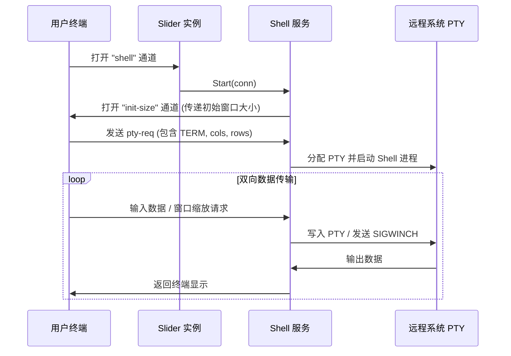
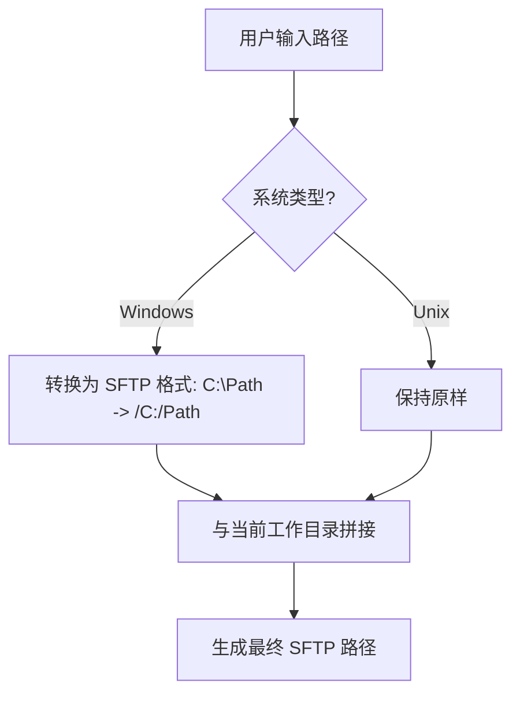
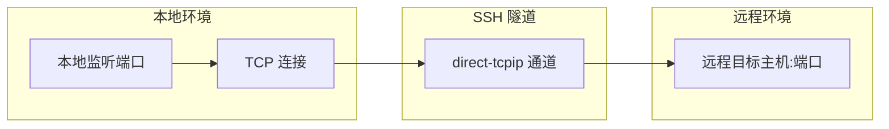
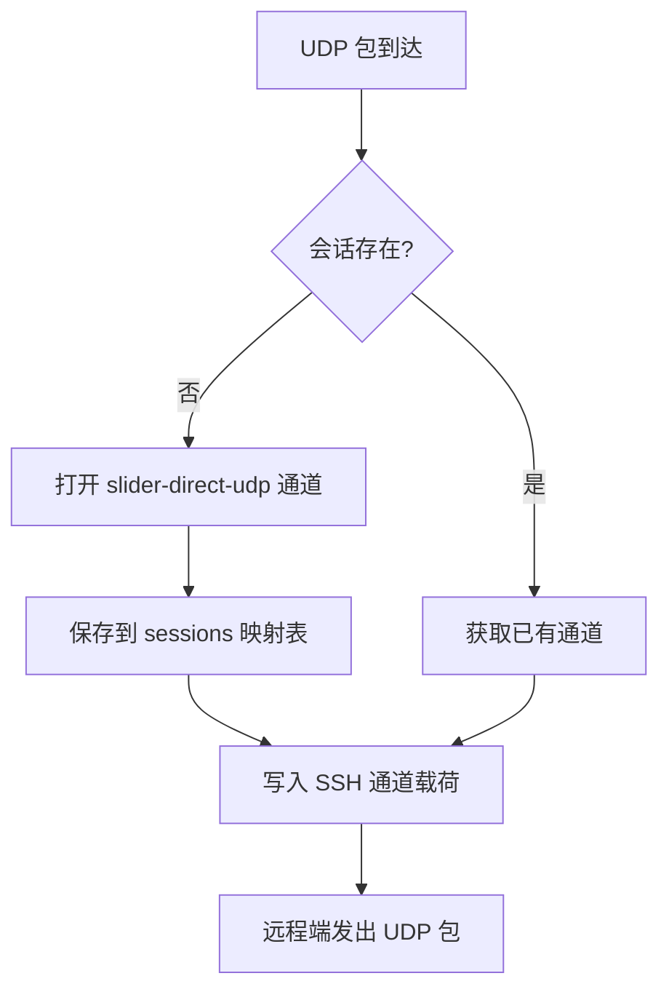
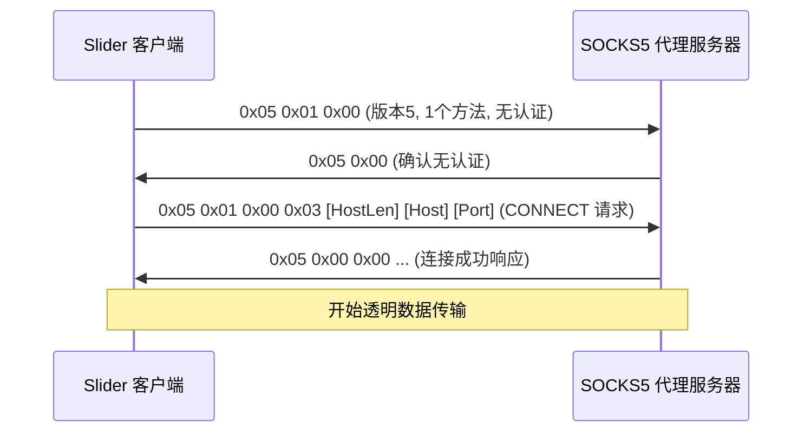
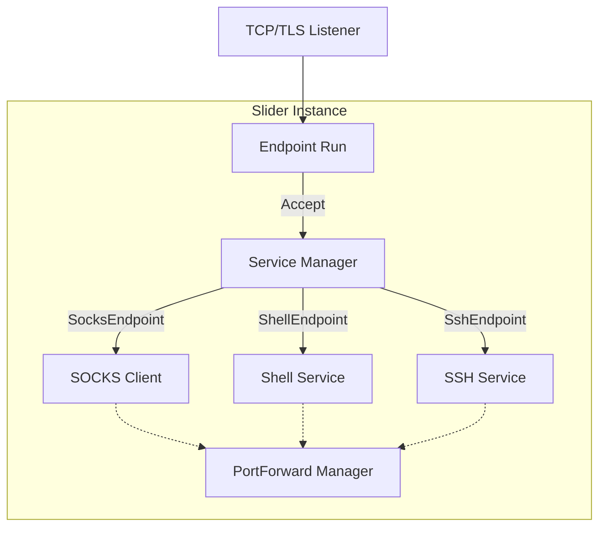

# 功能模块：Shell、SFTP 与代理

## 目录
1. [模块概览](#模块概览)
2. [引言](#引言)
3. [交互式 Shell 与 PTY 控制](#交互式-shell-与-pty-控制)
   - [PTY 会话生命周期](#pty-会话生命周期)
   - [终端控制序列 (escseq)](#终端控制序列-escseq)
4. [SFTP 文件管理协议实现](#sftp-文件管理协议实现)
   - [跨平台路径处理 (spath)](#跨平台路径处理-spath)
   - [SFTP 命令执行流程](#sftp-命令执行流程)
5. [端口转发与隧道技术](#端口转发与隧道技术)
   - [TCP 转发机制](#tcp-转发机制)
   - [UDP 转发实现](#udp-转发实现)
6. [SOCKS5 代理实现](#socks5-代理实现)
   - [SOCKS5 服务端](#socks5-服务端)
   - [SOCKS5 客户端与握手](#socks5-客户端与握手)
7. [SSH 服务集成](#ssh-服务集成)
8. [核心组件与接口](#核心组件与接口)
9. [文件参考](#文件参考)

## 模块概览

本章节深入探讨了 Slider 的核心功能模块，这些模块构成了其作为远程运维工具的基础。通过对代码库的系统性探索，我们识别并分析了以下关键子模块：

- **Shell 服务** (`pkg/instance/shell`): 处理交互式 PTY 会话，支持窗口缩放和环境变量传递。
- **终端控制** (`pkg/escseq`): 提供 ANSI 转义序列支持，用于控制终端颜色、光标位置等 UI 元素。
- **SFTP 客户端** (`server/command_sftp.go` 及相关文件): 在控制台中集成了功能完备的 SFTP 客户端，支持文件上传、下载、目录遍历等操作。
- **路径工具** (`pkg/spath`): 关键的跨平台路径处理库，确保 SFTP 在 Windows 和 Unix 系统间的一致性。
- **端口转发** (`pkg/instance/portforward`): 管理 TCP 和 UDP 的本地/远程端口转发。
- **SOCKS5 代理** (`pkg/instance/socks`): 提供反向 SOCKS5 代理能力，允许通过 Slider 实例进行网络中转。
- **SSH 服务集成** (`pkg/instance/sshservice`): 在实例中嵌入完整的 SSH 服务端，支持标准 SSH 客户端接入。

**统计信息**：
- **涉及文件总数**：约 25 个核心 Go 源文件。
- **覆盖范围**：涵盖了从底层协议实现到上层控制台交互的完整链路。
- **重点覆盖**：本章节将详细说明上述所有子模块的实现原理、交互流程及核心代码逻辑。

## 引言

Slider 的核心价值在于其提供的丰富运维功能。与传统的命令执行工具不同，Slider 旨在提供一个全功能的远程工作环境。这意味着它不仅需要能够执行简单的命令，还需要支持复杂的交互式操作，如全功能的 Shell 环境、高效的文件传输、以及灵活的网络隧道。

这些功能模块由 `instance.Config` 作为轻量协调器持有，并静态注册到 `ServiceManager`。`Config` 只负责监听、活动连接和停止流程，`ServiceManager` 根据强类型 `EndpointType` 将连接交给 Shell、SOCKS 或 SSH 子服务；协议细节保留在各自子包中。所有功能都建立在 SSH 协议之上，利用 SSH 的多路复用能力，在单一底层连接中承载多种业务流量。

## 交互式 Shell 与 PTY 控制

Slider 的 Shell 模块负责为用户提供一个真实的交互式终端体验。它不仅是简单的标准输入输出重定向，还涉及到了伪终端 (PTY) 的管理。

### PTY 会话生命周期

在 Slider 中，Shell 会话的建立是一个多阶段的过程。首先，客户端会发起一个 `shell` 类型的通道请求。如果是交互式会话，客户端通常还会发送 `pty-req` 请求来分配一个伪终端。

以下图表展示了 Shell 会话从初始化到数据交换的完整生命周期：



上述时序图描述了从用户发起连接到数据持续交换的过程。重点在于 `init-size` 通道的引入，它解决了在 Shell 进程启动前同步终端尺寸的问题。随后，`pty-req` 请求携带了详细的终端属性，使得远程 PTY 能够正确模拟用户的本地环境。在数据传输阶段，Slider 实现了透明的双向拷贝，确保了命令输入和程序输出的实时性。

在 `pkg/instance/shell/service.go` 中，`Start` 方法是处理 Shell 连接的核心入口。它首先确定初始的终端大小，通过 `init-size` 通道告知客户端，然后建立起双向的数据管道。

```go
// pkg/instance/shell/service.go

func (s *Service) Start(conn net.Conn) error {
    // ... 获取终端大小逻辑 ...

    // 发送初始大小消息
    initChan, reqs, oErr := s.opener.OpenChannel(conf.SSHChannelInitSize, initSize)
    // ...

    // 处理窗口大小变更
    winChange := make(chan []byte, 10)
    s.mutex.Lock()
    s.winChannels[conn] = winChange
    s.mutex.Unlock()

    // 建立交互式连接管道
    return s.interactiveConnPipe(conn, conf.SSHRequestShell, nil, winChange, envChange)
}
```

`interactiveConnPipe` 函数利用 `sio.PipeWithCancel` 实现了高效的异步双向拷贝。同时，它还开启了两个后台协程，分别监听 `winChange` 和 `envChange` 通道，将窗口缩放和环境变量变更实时同步到远程 PTY。

### 终端控制序列 (escseq)

为了提供更好的用户体验，Slider 在控制台输出中大量使用了 ANSI 转义序列。`pkg/escseq` 包封装了这些序列，使得代码能够以一种可读性更高的方式控制终端行为。

例如，在 SFTP 文件列表中，目录显示为亮蓝色加粗，符号链接显示为青色加粗。如果符号链接失效，则会以红色闪烁显示。这些视觉反馈极大地提升了运维效率。

```go
// pkg/escseq/escseq.go

func BlueBrightBoldText(m string) string {
    return fmt.Sprintf("%s%s%s", string(blueBrightBold), m, string(resetColor))
}

func BlinkText(m string) string {
    return fmt.Sprintf("%s%s%s", string(blink), m, string(resetBlink))
}
```

这些工具函数在 `server/commands_sftp_ls.go` 中被广泛调用，用于美化文件列表输出。通过这种方式，Slider 在纯文本的控制台中构建出了层次分明、信息丰富的 UI 界面。

**Section sources**:
- [pkg/instance/shell/service.go](pkg/instance/shell/service.go)
- [pkg/escseq/escseq.go](pkg/escseq/escseq.go)

## SFTP 文件管理协议实现

Slider 的 SFTP 功能并非简单的文件传输，而是一个完整的交互式文件管理系统。它在控制台中模拟了一个类似 `ftp` 或 `sftp` 命令行工具的交互环境。

### 跨平台路径处理 (spath)

SFTP 协议内部始终使用 Unix 风格的路径（斜杠 `/` 分隔）。然而，远程目标可能是 Windows 系统。`pkg/spath` 模块解决了这一差异，它提供了在不同操作系统规则下进行路径拼接、拆分和转换的能力。



该流程图展示了 Slider 如何处理跨平台的路径歧义。对于 Windows 目标，Slider 会自动识别驱动器盘符并将其转换为 SFTP 规范要求的根路径格式（如 `/C:/`）。这种转换对用户是透明的，用户可以像在本地一样输入路径，而 `spath` 库负责在底层进行规范化处理，确保 SFTP 客户端能够正确寻址。

`spath.UserInputToSFTPPath` 函数是这一逻辑的核心，它确保了无论用户输入的是相对路径还是绝对路径，无论是在 Windows 还是 Unix 上，最终生成的都是 SFTP 协议能够理解的路径格式。

```go
// pkg/spath/path.go

func UserInputToSFTPPath(userPath, currentSFTPPath, system string) string {
    if system != "windows" {
        if strings.HasPrefix(userPath, "/") {
            return userPath
        }
        return UnixJoin(currentSFTPPath, userPath)
    }

    // Windows 系统处理
    if len(userPath) >= 2 && userPath[1] == ':' {
        path := strings.ReplaceAll(userPath, "\\", "/")
        if !strings.HasPrefix(path, "/") {
            path = "/" + path
        }
        return path
    }
    // ...
}
```

### SFTP 命令执行流程

Slider 的 SFTP 客户端实现了一套命令注册机制。在 `server/command_sftp.go` 中，定义了 `SftpCommandContext`，它持有 SFTP 客户端连接、当前工作目录（本地和远程）以及 UI 接口。

当用户在 SFTP 模式下输入命令（如 `get`, `put`, `ls`）时，系统会根据命令名分发到对应的处理器。以 `get` 命令为例，其执行流程如下：

1. **参数解析**：解析 `-r` 等标志和远程路径。
2. **路径补全**：利用 `spath` 将相对路径补全为绝对 SFTP 路径。
3. **状态检查**：通过 SFTP `Stat` 检查目标是否存在，是文件还是目录。
4. **递归下载**（如果是目录）：遍历远程目录树，在本地同步创建对应的目录结构。
5. **带进度的拷贝**：使用 `copyFileWithProgress` 进行数据传输，并实时在控制台更新进度百分比和传输速率。

```go
// server/commands_sftp_get.go 中的核心逻辑片段
rFile, rErr := sftpCtx.sftpCli.Open(remotePath)
// ...
lFile, cErr := os.Create(localFilePath)
// ...
bytesWritten, cpErr := sftpCtx.copyFileWithProgress(rFile, lFile, rpFi.Size(), "Download", ui)
```

这种实现方式不仅保证了功能的完备性，还通过进度条等细节提升了用户体验。Slider 甚至会根据文件大小自动选择合适的缓冲区大小，以优化大文件的传输效率。

**Section sources**:
- [server/command_sftp.go](server/command_sftp.go)
- [pkg/spath/path.go](pkg/spath/path.go)
- [server/commands_sftp_get.go](server/commands_sftp_get.go)

## 端口转发与隧道技术

端口转发是 Slider 最强大的功能之一，它允许用户在复杂的网络环境中建立隧道。Slider 支持标准的 TCP 转发以及自定义的 UDP 转发。

### TCP 转发机制

Slider 实现了两种方向的 TCP 转发：
- **本地转发 (Local Forwarding)**：在本地机器上监听端口，将流量转发到远程目标。
- **远程转发 (Remote/Reverse Forwarding)**：在远程机器上监听端口，将流量转发回本地目标。

这是通过 `pkg/instance/portforward/manager.go` 中的 `Manager` 结构体实现的。它利用了 SSH 协议的 `direct-tcpip` 通道类型。



该图展示了本地转发的逻辑链路。本地监听器接收到的每个 TCP 连接都会触发一个新的 SSH 通道请求。Slider 负责在底层连接中复用这些通道，使得多个并发的端口转发任务可以高效运行而互不干扰。这种机制对于绕过防火墙或访问内网服务至关重要。

在 `StartLocalForward` 方法中，Slider 启动一个本地 TCP 监听器。每当有新连接接入时，它会通过 SSH 连接打开一个 `direct-tcpip` 通道，并使用 `sio.PipeWithCancel` 将两个连接“焊”在一起。

### UDP 转发实现

由于标准 SSH 协议并不直接支持 UDP 转发，Slider 实现了一套自定义的机制。它使用自定义的通道类型 `slider-direct-udp` 来承载 UDP 报文。

由于 UDP 是无连接的，`Manager` 维护了一个 `sessions` 映射表，根据源地址（IP:Port）来跟踪活跃的 UDP 会话。每个会话对应一个独立的 SSH 通道。



这个流程图详细说明了 Slider 如何模拟 UDP 的“连接”状态。通过 `sessions` 映射表，Slider 能够将来自同一源地址的 UDP 报文路由到同一个 SSH 通道中，并等待回程流量。如果通道在一定时间内没有活动，Slider 会自动清理会话以释放资源。

```go
// pkg/instance/portforward/manager.go

func (m *Manager) StartLocalUDPForward(msg types.TcpIpChannelMsg, notifier chan error) {
    // ... 监听本地 UDP 端口 ...
    sessions := make(map[string]ssh.Channel)

    for {
        n, addr, err := conn.ReadFromUDP(buffer)
        clientAddr := addr.String()

        sshCh, exists := sessions[clientAddr]
        if !exists {
            // 为新客户端打开自定义 SSH 通道
            newChannel, reqs, openErr := m.conn.OpenChannel(conf.SSHChannelDirectUDP, reqPayload)
            // ... 启动协程处理回程流量 ...
        }

        // 将 UDP 载荷写入 SSH 通道
        _, wErr := sshCh.Write(buffer[:n])
    }
}
```

这种设计巧妙地利用了 SSH 的多路复用能力来传输不可靠的 UDP 数据，同时通过会话管理保证了响应流量能够正确返回给客户端。

**Section sources**:
- [pkg/instance/portforward/manager.go](pkg/instance/portforward/manager.go)
- [pkg/instance/portforward/handler.go](pkg/instance/portforward/handler.go)

## SOCKS5 代理实现

Slider 提供了内置的 SOCKS5 代理支持，这在需要访问远程内网资源时非常有用。它包含服务端和客户端两部分实现。

### SOCKS5 服务端

`pkg/instance/socks/server.go` 封装了 `github.com/armon/go-socks5` 库，提供了一个简单的接口来启动本地代理服务。Slider 可以将此服务暴露在本地回环地址或所有网卡上。

```go
// pkg/instance/socks/server.go

func (ls *LocalServer) Start() {
    // ...
    for {
        conn, aErr := ls.listener.Accept()
        go func(c net.Conn) {
            defer func() { _ = c.Close() }()
            // 在此连接上提供 SOCKS5 服务
            if sErr := ls.server.ServeConn(c); sErr != nil {
                // ...
            }
        }(conn)
    }
}
```

### SOCKS5 客户端与握手

更为关键的是 `pkg/instance/socks/client.go`。它实现了 SOCKS5 协议的客户端侧握手逻辑。当 Slider 需要通过代理连接到某个目标时，它会执行 RFC 1928 定义的标准握手流程。



握手时序图展示了 SOCKS5 协议的核心交互。Slider 客户端首先协商认证方式（目前主要支持无认证），然后发送 `CONNECT` 请求，其中包含了目标主机的域名或 IP 地址。代理服务器在成功建立到目标的连接后返回响应，此后 Slider 即可在建立的通道上进行透明的数据传输。

`performHandshake` 函数精确地实现了这一流程，包括处理 IPv4、IPv6 和域名三种地址类型。一旦握手成功，Slider 就会将底层的 SSH 通道与目标连接进行对接，实现透明代理。

**Section sources**:
- [pkg/instance/socks/server.go](pkg/instance/socks/server.go)
- [pkg/instance/socks/client.go](pkg/instance/socks/client.go)

## SSH 服务集成

Slider 不仅仅是一个 SSH 客户端，它还可以在实例内部运行一个完整的 SSH 服务端。这允许用户使用现有的 SSH 客户端（如 OpenSSH, PuTTY）直接连接到 Slider 实例，从而利用 Slider 建立的隧道网络。

`pkg/instance/sshservice/service.go` 负责这一集成的核心逻辑。它使用 `golang.org/x/crypto/ssh` 构建了一个符合规范的 SSH 服务器。

关键特性包括：
- **身份验证**：支持基于公钥指纹的身份验证。
- **通道分发**：能够处理 `session` 通道（用于 Shell 或命令执行）以及 `direct-tcpip` 通道（用于端口转发）。
- **请求处理**：支持 `pty-req`, `env`, `shell`, `exec` 等标准 SSH 请求。

```go
// pkg/instance/sshservice/service.go

func (s *Service) Start(conn net.Conn) error {
    sshConf := &ssh.ServerConfig{NoClientAuth: true}
    // ... 配置身份验证回调 ...

    sshServerConn, sshClientChannel, reqChan, cErr := ssh.NewServerConn(conn, sshConf)
    // ...

    // 监听并处理新通道请求
    for nc := range sshClientChannel {
        if s.channelHandler != nil {
            go s.channelHandler(nc, nc.ChannelType())
        } else {
            _ = nc.Reject(ssh.UnknownChannelType, "")
        }
    }
    return nil
}
```

这种嵌入式 SSH 服务器的设计，极大地扩展了 Slider 的互操作性，使其能够无缝融入现有的运维工具链中。

**Section sources**:
- [pkg/instance/sshservice/service.go](pkg/instance/sshservice/service.go)
- [pkg/instance/instance.go](pkg/instance/instance.go)

## 核心组件与接口

Slider 的功能模块化依赖于几个核心的接口和结构体定义。

### ChannelOpener 接口
这是最基础的接口，定义了打开 SSH 通道和发送请求的能力。它抽象了底层的连接细节，使得 Shell、SOCKS 等服务可以透明地运行在不同类型的连接上。

```go
type ChannelOpener interface {
    OpenChannel(name string, payload []byte) (ssh.Channel, <-chan *ssh.Request, error)
    SendRequest(name string, wantReply bool, payload []byte) (bool, []byte, error)
}
```

### Instance 配置结构体
`pkg/instance/instance.go` 中的 `Config` 结构体（实际上充当了 Instance 对象）是 endpoint 协调者。它持有固定服务和 `ServiceManager`，并负责监听器、已接受连接和停止状态；Manager 根据 `EndpointType` 完成分发。



架构图展示了 Slider 内部的组件关系。`Endpoint Run` 拥有 listener、活动连接和幂等停止流程，`ServiceManager` 只负责类型到服务的静态映射。底层的 `PortForward Manager` 与 endpoint 服务同层，专门管理隧道状态，不实现单连接 `EndpointService`。

**Section sources**:
- [pkg/instance/instance.go](pkg/instance/instance.go)
- [pkg/instance/service.go](pkg/instance/service.go)

## 文件参考

本章节涉及的核心源文件及其在项目中的位置如下：

| 文件路径 | 描述 |
| :--- | :--- |
| `pkg/instance/instance.go` | 实例核心编排器，负责服务初始化与连接分发 |
| `pkg/instance/shell/service.go` | 交互式 Shell 服务实现，处理 PTY 与数据管道 |
| `pkg/escseq/escseq.go` | 终端转义序列工具库，用于控制台 UI 美化 |
| `server/command_sftp.go` | SFTP 客户端命令注册与上下文管理 |
| `server/commands_sftp_get.go` | SFTP 下载命令实现，包含递归下载与进度显示 |
| `pkg/spath/path.go` | 跨平台路径处理核心逻辑 |
| `pkg/instance/portforward/manager.go` | 端口转发管理器，支持 TCP/UDP 本地与远程转发 |
| `pkg/instance/socks/server.go` | SOCKS5 本地代理服务器实现 |
| `pkg/instance/socks/client.go` | SOCKS5 客户端握手协议实现 |
| `pkg/instance/sshservice/service.go` | 嵌入式 SSH 服务器实现 |
| `pkg/sio/sio.go` | 底层 I/O 管道工具，提供带取消功能的双向拷贝 |

**Section sources**:
- [pkg/instance/instance.go](pkg/instance/instance.go)
- [pkg/instance/shell/service.go](pkg/instance/shell/service.go)
- [pkg/instance/portforward/manager.go](pkg/instance/portforward/manager.go)
- [pkg/instance/socks/client.go](pkg/instance/socks/client.go)
- [pkg/instance/sshservice/service.go](pkg/instance/sshservice/service.go)
