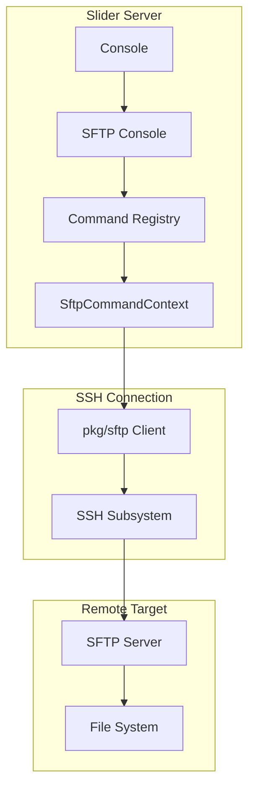
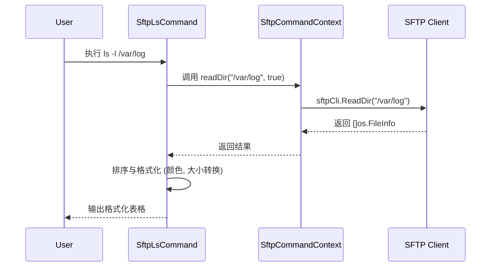
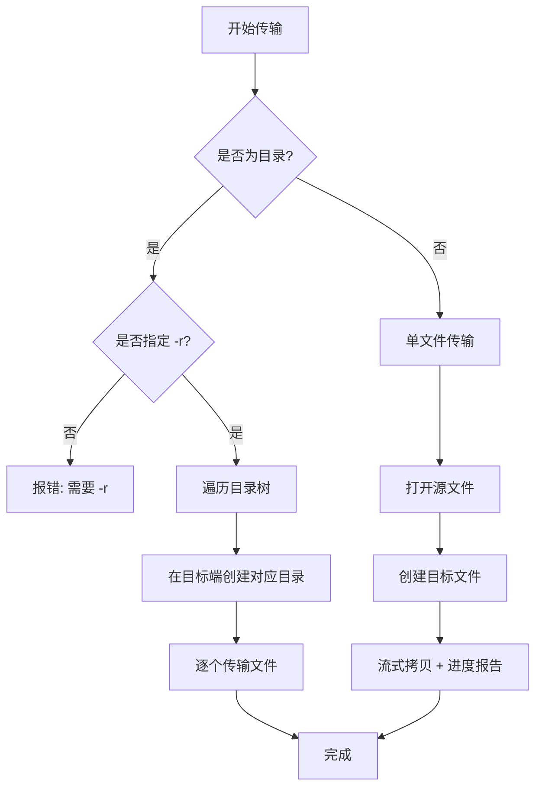
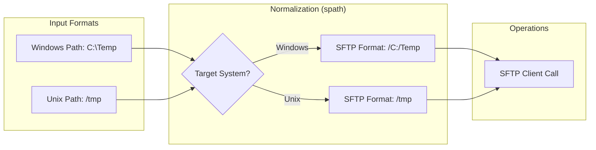
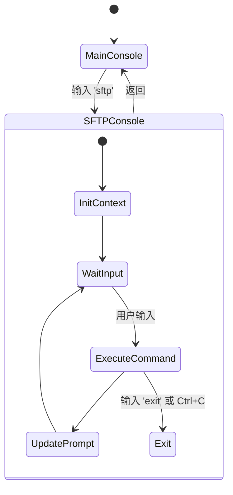
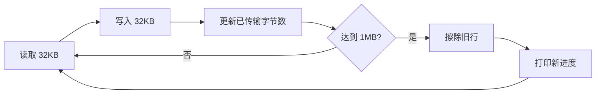

# SFTP 文件系统操作实现

## 目录
1. [模块概览](#模块概览)
2. [SFTP 协议集成](#sftp-协议集成)
   - [基于 SSH Subsystem 的实现](#基于-ssh-subsystem-的实现)
   - [SftpCommandContext 核心上下文](#sftpcommandcontext-核心上下文)
3. [核心命令实现](#核心命令实现)
   - [文件列表与浏览 (ls, cd, pwd)](#文件列表与浏览-ls-cd-pwd)
   - [文件传输逻辑 (get, put)](#文件传输逻辑-get-put)
   - [管理与操作 (mkdir, rm, chmod, mv)](#管理与操作-mkdir-rm-chmod-mv)
4. [跨平台路径处理](#跨平台路径处理)
   - [pkg/spath 的设计哲学](#pkgspath-的设计哲学)
   - [路径规范化与转换逻辑](#路径规范化与转换逻辑)
   - [Windows 路径的特殊处理](#windows-路径的特殊处理)
5. [交互式 SFTP 控制台](#交互式-sftp-控制台)
   - [控制台架构与生命周期](#控制台架构与生命周期)
   - [自动补全与交互优化](#自动补全与交互优化)
6. [文件传输优化与可靠性](#文件传输优化与可靠性)
   - [流式传输与缓冲机制](#流式传输与缓冲机制)
   - [进度报告机制](#进度报告机制)
7. [核心组件](#核心组件)
8. [文件参考](#文件参考)

## 模块概览

Slider 的 SFTP 模块是一个功能丰富的文件管理子系统，它在 SSH 协议之上提供了类似于传统 FTP 客户端的交互体验。该模块不仅支持基础的文件上传和下载，还实现了一套完整的交互式控制台，允许用户在远程系统上进行复杂的目录导航和文件操作。

**核心统计信息**：
- **涉及文件总数**：约 20 个 Go 源文件。
- **主要子模块**：
  - `server/commands_sftp*.go`：实现具体的 SFTP 命令逻辑（如 `ls`, `get`, `put` 等）。
  - `pkg/spath/`：跨平台路径处理库，统一 Windows 和 Unix 路径风格。
  - `server/command_sftp.go`：SFTP 基础框架与上下文管理。
  - `server/console_sftp.go`：交互式控制台实现。

本章节将深入探讨 Slider 如何集成 `github.com/pkg/sftp` 库，如何通过 `pkg/spath` 解决跨平台路径不一致的难题，以及如何构建高性能的流式文件传输机制。

## SFTP 协议集成

Slider 的 SFTP 功能是构建在 SSH subsystem 之上的。当用户通过 Slider 连接到远程服务器并请求 SFTP 服务时，Slider 会在现有的 SSH 连接中开启一个 SFTP 子系统会话。

### 基于 SSH Subsystem 的实现

Slider 使用了成熟的 `github.com/pkg/sftp` 库作为后端驱动。它将 SSH 会话包装成一个 SFTP 客户端，从而能够执行文件系统级别的操作。



上面的架构图展示了从用户输入到远程文件系统操作的完整链路。`SftpCommandContext` 作为中间层，屏蔽了底层协议的复杂性，为上层命令提供了一致的操作接口。

### SftpCommandContext 核心上下文

`SftpCommandContext` 是整个 SFTP 模块的灵魂。它维护了当前会话的所有状态，包括 SFTP 客户端实例、本地和远程的当前工作目录（CWD）以及远程系统的元数据。

```go
type SftpCommandContext struct {
	sftpCli          *sftp.Client
	session          *session.BidirectionalSession
	localCwd         *string
	remoteCwd        *string
	localInterpreter *interpreter.Interpreter
	remoteInfo       interpreter.BaseInfo
	targetID         int64
}
```

该上下文结构体不仅存储状态，还封装了大量辅助方法，如 `readDir`、`pathStat` 和 `copyFileWithProgress`。这些方法会自动根据 `isRemote` 标志决定是调用 SFTP 接口还是本地操作系统接口，实现了代码的高度复用。

**Section sources**:
- [server/command_sftp.go](server/command_sftp.go)

## 核心命令实现

Slider 实现了一套完整的 SFTP 命令集，这些命令被注册到一个专用的 `CommandRegistry` 中，并在交互式控制台中被调用。

### 文件列表与浏览 (ls, cd, pwd)

`ls` 命令（及其本地版本 `lls`）在 `server/commands_sftp_ls.go` 中实现。它不仅支持基础的文件列出，还具备以下特性：
- **彩色输出**：使用 `pkg/escseq` 为目录和符号链接提供不同的颜色。
- **符号链接解析**：自动读取符号链接的目标，并检测目标是否存在（若不存在则以红色闪烁显示）。
- **跨平台适配**：在 Windows 系统上自动隐藏 UID/GID 列，因为这些信息在 Windows 上没有意义。



在执行 `ls` 时，Slider 会根据远程系统的类型（Windows 或 Unix）动态调整路径解析逻辑。例如，如果用户在 Windows 目标上输入 `ls C:\Windows`，Slider 会将其转换为 SFTP 标准的 `/C:/Windows` 格式。

### 文件传输逻辑 (get, put)

文件传输是 SFTP 模块的核心功能。`get` 和 `put` 命令分别负责下载和上传。

1.  **单文件传输**：直接打开源文件和目标文件，调用 `copyFileWithProgress` 进行流式拷贝。
2.  **递归目录传输**：使用 `walkRemoteDir`（下载）或 `walkLocalDir`（上传）递归遍历目录树，在目标端重建目录结构并传输所有文件。



### 管理与操作 (mkdir, rm, chmod, mv)

这些命令提供了对远程文件系统的管理能力。
- `mkdir`：支持 `-p` 参数，通过 `sftpCli.MkdirAll` 递归创建目录。
- `chmod`：仅在非 Windows 系统上可用。Slider 会在注册命令时检查 `sess.GetPeerInfo().System`，如果是 Windows 则跳过该命令的注册。
- `mv`：实现文件重命名和移动。
- `rm`：删除远程文件或目录。

**Section sources**:
- [server/commands_sftp_ls.go](server/commands_sftp_ls.go)
- [server/commands_sftp_get.go](server/commands_sftp_get.go)
- [server/commands_sftp_put.go](server/commands_sftp_put.go)
- [server/commands_sftp_mkdir.go](server/commands_sftp_mkdir.go)

## 跨平台路径处理

跨平台路径处理是 Slider SFTP 模块中最具挑战性的部分。SFTP 协议规定路径必须使用 Unix 风格（正斜杠 `/`），但 Slider 的目标可能是 Windows 系统。

### pkg/spath 的设计哲学

`pkg/spath` 库被设计为独立于运行环境的路径处理工具。它不依赖于 `os.PathSeparator`，而是显式地接受一个 `system` 参数来决定使用哪种规则。

### 路径规范化与转换逻辑

Slider 定义了两种主要的转换逻辑：
1.  **NormalizeToSFTPPath**：将系统原生路径转换为 SFTP 格式。
    - Windows: `C:\Users` -> `/C:/Users`
    - Unix: `/home/user` -> `/home/user`
2.  **NormalizeToSystemPath**：将 SFTP 格式转换为系统原生路径（用于显示或本地操作）。
    - Windows: `/C:/Users` -> `C:\Users`



### Windows 路径的特殊处理

在处理 Windows 路径时，Slider 特别注意了驱动器盘符的处理。SFTP 协议本身并不原生支持盘符，因此 Slider 采用了一种通用的约定：将 `C:` 映射为根目录下的 `C:` 目录。`pkg/spath/path.go` 中的 `UserInputToSFTPPath` 函数专门负责处理这种复杂的转换，确保用户输入的 `.\file`、`..\dir` 或 `D:\data` 都能被正确转换为 SFTP 客户端理解的路径。

**Section sources**:
- [pkg/spath/path.go](pkg/spath/path.go)
- [pkg/spath/pathwin.go](pkg/spath/pathwin.go)
- [pkg/spath/pathunix.go](pkg/spath/pathunix.go)

## 交互式 SFTP 控制台

`server/console_sftp.go` 实现了一个功能完备的交互式控制台，它为用户提供了沉浸式的文件管理体验。

### 控制台架构与生命周期

当用户输入 `sftp` 命令时，Slider 会启动一个新的控制台循环。这个循环接管了终端的输入输出，并切换了命令注册表。



在 SFTP 控制台中，Slider 会自动保存和恢复命令历史。它为 SFTP 会话维护了一个独立的 `sftpHistory`，确保文件操作命令不会与主控制台的系统命令混淆。

### 自动补全与交互优化

控制台提供了强大的自动补全功能，支持：
- **命令补全**：补全 `ls`, `get`, `put` 等 SFTP 命令。
- **路径补全**：这是最复杂的功能。Slider 会根据当前输入的命令类型（远程操作还是本地操作），动态调用 `RemotePathCompleter` 或 `LocalPathCompleter`。
  - 对于远程路径补全，Slider 会实时通过 SFTP 客户端读取远程目录内容并返回匹配项。
  - 补全逻辑同样适配了 Windows 和 Unix 的路径差异。

**Section sources**:
- [server/console_sftp.go](server/console_sftp.go)

## 文件传输优化与可靠性

为了处理大文件和不稳定的网络环境，Slider 在文件传输层进行了多项优化。

### 流式传输与缓冲机制

Slider 不会将整个文件加载到内存中，而是使用固定大小的缓冲区进行流式传输。

```go
func (ctx *SftpCommandContext) copyFileWithProgress(src io.Reader, dst io.Writer, totalSize int64, operation string, ui UserInterface) (int64, error) {
	buffer := make([]byte, conf.SFTPBufferSize) // 默认 32KB
	// ... 循环读取并写入 ...
}
```

通过 `conf.SFTPBufferSize`（通常为 32KB），Slider 可以在保持低内存占用的同时，获得较高的传输吞吐量。

### 进度报告机制

进度报告是提升用户体验的关键。Slider 的报告机制具有以下特点：
- **定时更新**：每传输 1MB 数据或百分比发生变化时更新一次 UI。
- **原地刷新**：使用 ANSI 转义序列（`escseq.CursorEraseLine()`）清除旧的进度行，使输出保持整洁。
- **详细信息**：显示当前百分比、已传输大小和总大小。



这种机制确保了即使在传输数 GB 的大文件时，用户也能实时了解任务进度，而不会感到程序“卡死”。

**Section sources**:
- [server/command_sftp.go](server/command_sftp.go)
- [pkg/conf/conf.go](pkg/conf/conf.go)

## 核心组件

本模块的核心组件构成了 SFTP 功能的基石：

- **`SftpCommandContext`**: 核心状态容器，管理 SFTP 客户端连接和 CWD。
- **`CommandRegistry`**: 命令注册表，负责 SFTP 专用命令的分发与执行。
- **`spath` 路径库**: 提供 `Join`, `NormalizeToSFTPPath`, `NormalizeToSystemPath` 等关键路径操作。
- **`SftpConsole`**: 交互式循环，处理用户输入、自动补全和历史记录。
- **`copyFileWithProgress`**: 通用的流式拷贝引擎，集成了进度反馈。

## 文件参考

以下是实现 SFTP 文件系统操作的关键源文件：

- [server/command_sftp.go](server/command_sftp.go): SFTP 基础框架、上下文定义及通用拷贝逻辑。
- [server/commands_sftp_ls.go](server/commands_sftp_ls.go): 远程与本地目录列表实现。
- [server/commands_sftp_get.go](server/commands_sftp_get.go): 文件下载逻辑，包含递归下载。
- [server/commands_sftp_put.go](server/commands_sftp_put.go): 文件上传逻辑，包含递归上传。
- [server/console_sftp.go](server/console_sftp.go): 交互式 SFTP 控制台与自动补全。
- [pkg/spath/path.go](pkg/spath/path.go): 跨平台路径处理核心逻辑。
- [pkg/spath/pathwin.go](pkg/spath/pathwin.go): Windows 特有的路径处理实现。
- [pkg/spath/pathunix.go](pkg/spath/pathunix.go): Unix 特有的路径处理实现。
- [server/commands_sftp_cd.go](server/commands_sftp_cd.go): 目录切换逻辑。
- [server/commands_sftp_mkdir.go](server/commands_sftp_mkdir.go): 目录创建逻辑。
- [server/commands_sftp_rm.go](server/commands_sftp_rm.go): 文件与目录删除逻辑。
- [server/commands_sftp_chmod.go](server/commands_sftp_chmod.go): 权限修改逻辑（非 Windows）。
