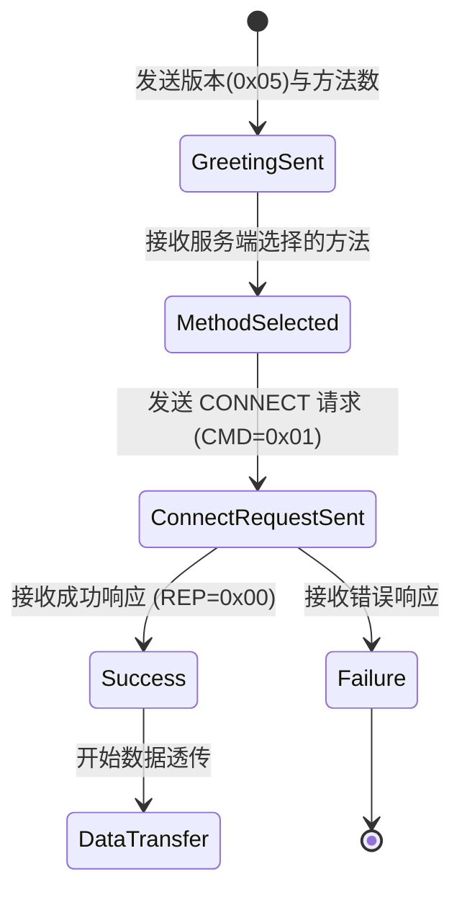
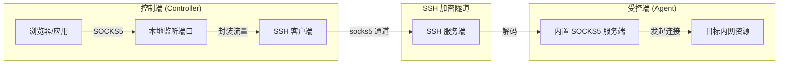
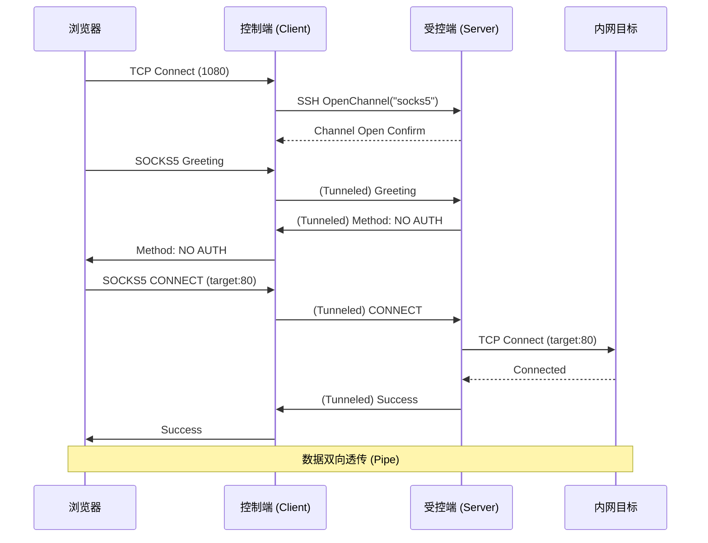

# SOCKS5 代理服务器实现

## 目录
1. [模块概览](#模块概览)
2. [SOCKS5 协议处理](#socks5-协议处理)
   - [握手流程与状态机](#握手流程与状态机)
   - [支持的验证方式与请求解析](#支持的验证方式与请求解析)
3. [反向代理架构](#反向代理架构)
   - [连接拓扑图](#连接拓扑图)
   - [SSH 隧道集成机制](#ssh-隧道集成机制)
4. [核心组件分析](#核心组件分析)
   - [LocalServer：独立本地服务端](#localserver独立本地服务端)
   - [socks.Client：SSH 通道中转器](#socksclientssh-通道中转器)
   - [Agent 端处理器](#agent-端处理器)
5. [连接调度与数据流](#连接调度与数据流)
   - [请求生命周期](#请求生命周期)
6. [性能与并发处理](#性能与并发处理)
7. [集成与应用示例](#集成与应用示例)
8. [文件参考](#文件参考)

## 模块概览

Slider 的 SOCKS5 代理模块是其内网穿透能力的核心组成部分。它不仅提供了一个标准的本地 SOCKS5 服务器，更重要的是，它通过 SSH 隧道实现了“反向代理”功能，允许控制端（Controller）通过受控端（Agent）的视角访问内网资源。

该模块主要由三部分组成：
1. **协议实现层** (`pkg/instance/socks`)：封装了 SOCKS5 服务端和客户端的逻辑，当前使用 `github.com/things-go/go-socks5` 提供的 `ServeConn` API 处理协议细节，并实现了自定义的 SSH 通道中转逻辑。
2. **控制指令层** (`server/commands_socks.go`, `server/socks_local.go`, `server/socks_session.go`, `server/socks_list.go`)：提供 `socks` 命令行接口，并将本地 SOCKS、会话 SOCKS 和列表展示拆分到独立文件。
3. **会话路由层** (`pkg/session/routing.go`)：在 Agent 端处理来自控制端的 SOCKS5 通道请求，实现流量的最终落地。

**模块统计**：
- 核心文件数：约 7 个
- 涉及子模块：`pkg/instance/socks`, `server`, `pkg/session`
- 覆盖深度：全面覆盖协议握手、通道转换及反向代理实现。

## SOCKS5 协议处理

SOCKS5 协议（RFC 1928）是一种灵活的代理协议，位于传输层和应用层之间。Slider 实现了该协议的子集，重点在于高效的连接转发和免认证支持。

### 握手流程与状态机

在 Slider 中，SOCKS5 的握手过程分为两个阶段：验证阶段和请求阶段。对于反向代理，Slider 的 `socks.Client` 会手动构造这些请求包。

以下是 SOCKS5 握手协议的状态转换图：



**图表说明**：
该状态机描述了 `socks.Client` 在 `performHandshake` 函数中实现的逻辑。首先发送客户端问候语（Greeting），声明支持的验证方法（Slider 默认仅支持 `NO AUTH`）。服务端响应后，客户端进入请求阶段，发送目标主机的地址和端口。一旦收到成功的响应，连接即建立，后续进入双向数据透传阶段。

### 支持的验证方式与请求解析

Slider 目前主要支持 `NO AUTHENTICATION REQUIRED` (0x00) 验证方式。这种设计是为了在受控环境内提供最快的连接速度，同时安全性由底层的 SSH 加密隧道保证。

在解析 CONNECT 请求时，Slider 支持以下地址类型：
- **IPv4 (0x01)**：4 字节地址。
- **Domain Name (0x03)**：变长域名，首字节为长度。
- **IPv6 (0x04)**：16 字节地址。

**代码示例：构造 CONNECT 请求**
```go
// pkg/instance/socks/client.go

// 构造连接请求：版本(5), 命令(CONNECT=1), 保留位(0), 地址类型(Domain=3), 主机名长度, 主机名, 端口
req := []byte{0x05, 0x01, 0x00, 0x03, byte(len(destination.DstHost))}
req = append(req, []byte(destination.DstHost)...)

portBytes := make([]byte, 2)
binary.BigEndian.PutUint16(portBytes, uint16(destination.DstPort))
req = append(req, portBytes...)

_, err = socksChannel.Write(req)
```

**Section sources**:
- [pkg/instance/socks/client.go](pkg/instance/socks/client.go)
- [pkg/instance/socks/server.go](pkg/instance/socks/server.go)

## 反向代理架构

Slider 的反向代理（Reverse Proxy）是其最强大的功能之一。它允许攻击者或管理员在本地机器上开启一个 SOCKS5 端口，而所有的网络请求都会透明地通过受控端发往目标内网。

### 连接拓扑图

下图展示了从本地浏览器发起请求到访问目标内网资源的完整路径：



**图表说明**：
1. **浏览器**配置 SOCKS5 代理指向控制端的监听端口。
2. **控制端**的 `socks.Client` 接收到连接后，并不直接处理，而是向受控端发起一个类型为 `socks5` 的 SSH 自定义通道。
3. **受控端**收到通道请求后，在通道内启动一个临时的 SOCKS5 服务端实例。
4. **流量流转**：应用层的 SOCKS5 握手和数据传输被完整地封装在 SSH 隧道中，实现了安全的内网漫游。

### SSH 隧道集成机制

Slider 利用了 SSH 的通道（Channel）机制来多路复用 SOCKS5 流量。每个新的 SOCKS5 TCP 连接都会对应一个独立的 SSH 通道。这种设计的优势在于：
- **安全性**：利用 SSH 的强加密和身份验证。
- **穿透性**：只要 SSH 隧道能通，代理就能用。
- **隔离性**：每个连接互不干扰，单个连接的阻塞不会影响其他通道。

**Section sources**:
- [server/commands_socks.go](server/commands_socks.go)
- [pkg/session/routing.go](pkg/session/routing.go)

## 核心组件分析

### LocalServer：独立本地服务端

`LocalServer` 用于在控制端开启一个标准的 SOCKS5 服务，不依赖于特定的 Agent 会话。它主要用于本地测试或作为其他代理链的一环。服务端命令层已拆分为 `socks_local.go`、`socks_session.go` 和 `socks_list.go`，分别负责本地服务、会话服务和状态列表，`commands_socks.go` 只保留参数解析和分派。

```go
// pkg/instance/socks/server.go

type LocalServer struct {
    listener net.Listener
    port     int
    server   *socks5.Server // 使用 things-go/go-socks5
    logger   *slog.Logger
}
```

它通过 `net.Listen` 监听指定的端口，并在 `Start()` 方法中循环接受连接。每当有新连接进入时，都会启动一个 goroutine 调用 `ls.server.ServeConn(c)` 进行处理。

### socks.Client：SSH 通道中转器

`socks.Client` 是连接控制端监听端口与 SSH 隧道的桥梁。它的 `HandleConnection` 方法是核心：

```go
// pkg/instance/socks/client.go

func (c *Client) HandleConnection(conn net.Conn) error {
    defer func() { _ = conn.Close() }()

    // 向 Agent 发起 "socks5" 类型的 SSH 通道
    socksChan, reqs, oErr := c.opener.OpenChannel(conf.SSHChannelSocks5, nil)
    if oErr != nil {
        return oErr
    }
    defer func() { _ = socksChan.Close() }()
    go ssh.DiscardRequests(reqs)

    // 在本地连接和 SSH 通道之间进行双向数据拷贝 (Pipe)
    _, _ = sio.PipeWithCancel(socksChan, conn)
    return nil
}
```

### Agent 端处理器

当 Agent 收到 `socks5` 通道请求时，`pkg/session/routing.go` 中的 `HandleSocks` 函数会被触发。它将 SSH 通道包装成 `net.Conn` 对象，并直接交给 SOCKS5 服务端处理。

```go
// pkg/session/routing.go

func (s *BidirectionalSession) HandleSocks(nc ssh.NewChannel) error {
    socksChan, req, _ := nc.Accept()
    // 将 SSH 通道转换为 net.Conn 接口
    socksConn := sconn.SSHChannelToNetConn(socksChan)

    server, _ := socks.NewServer()
    // 在该连接上运行 SOCKS5 协议
    return server.ServeConn(socksConn)
}
```

**Section sources**:
- [pkg/instance/socks/server.go](pkg/instance/socks/server.go)
- [pkg/instance/socks/client.go](pkg/instance/socks/client.go)
- [pkg/session/routing.go](pkg/session/routing.go)

## 连接调度与数据流

### 请求生命周期

理解一个请求如何从开始到结束是非常重要的。以下是基于反向代理模式的请求生命周期：

1. **触发**：用户在控制端执行 `socks --session 1 --port 1080`。
2. **监听**：控制端在 `127.0.0.1:1080` 开启 TCP 监听。
3. **接入**：本地应用（如浏览器）连接到 `1080` 端口。
4. **隧道建立**：控制端捕获连接，通过 Session 1 的 SSH 客户端向 Agent 发起 `OpenChannel("socks5")`。
5. **协议握手**：
   - 浏览器发送 SOCKS5 问候语。
   - 该问候语通过 SSH 通道传给 Agent。
   - Agent 的 SOCKS5 服务端解析并回复。
   - 浏览器发送 CONNECT 请求（例如连接 `192.168.1.1:80`）。
   - Agent 收到请求，在**受控端本地**发起对 `192.168.1.1:80` 的 TCP 连接。
6. **数据传输**：连接成功后，控制端的 `sio.PipeWithCancel` 开始在本地 Socket 和 SSH 通道间搬运数据；Agent 端的 SOCKS5 服务端在 SSH 通道和目标内网 Socket 间搬运数据。
7. **销毁**：任何一方关闭连接，整个链条上的资源（Socket、SSH 通道、Goroutine）都会被回收。



**图表说明**：
该序列图展示了 SOCKS5 握手是如何在 SSH 通道内嵌套进行的。关键点在于，实际的 DNS 解析和目标连接是由 Agent 在其所在网络环境中完成的，这正是实现内网穿透的基础。

**Section sources**:
- [pkg/instance/socks/client.go](pkg/instance/socks/client.go)
- [pkg/session/routing.go](pkg/session/routing.go)

## 性能与并发处理

Slider 的 SOCKS5 实现充分利用了 Go 语言的并发特性：

1. **轻量级线程**：每个 SOCKS5 连接都运行在独立的 goroutine 中。由于 goroutine 的栈空间很小且调度由 Go 运行时管理，Slider 可以轻松处理成百上千个并发代理连接。
2. **非阻塞 I/O**：底层使用 Go 的标准库 `net` 包，结合 SSH 库的异步处理，确保了高吞吐量。
3. **资源限制**：
   - 虽然 SOCKS5 模块本身没有硬性的连接数限制，但受限于操作系统的文件描述符（FD）限制。
   - SSH 隧道的多路复用虽然节省了 TCP 连接，但过多的通道会增加 SSH 层的处理开销。
4. **内存管理**：使用 `sio.PipeWithCancel` 进行数据交换时，内部使用了高效的缓冲区复用机制，减少了频繁的内存分配。

> 💡 **提示**：在高并发场景下，建议增加控制端和受控端的 `ulimit -n` 值，以防止因 FD 耗尽导致代理失效。

## 集成与应用示例

### 浏览器配置
使用 Slider 提供的代理最简单的方法是配合浏览器的代理插件（如 Proxy SwitchyOmega）：
- **代理协议**：SOCKS5
- **服务器**：127.0.0.1
- **端口**：你在 `socks` 命令中指定的端口（默认随机分配）。

### Proxychains 使用
在 Linux 环境下，可以使用 `proxychains` 让任何命令行工具通过 Slider 代理：
1. 编辑 `/etc/proxychains.conf`。
2. 在 `[ProxyList]` 下添加：`socks5 127.0.0.1 <PORT>`。
3. 执行：`proxychains4 curl http://internal-service.local`。

### 代理链条
由于 Slider 支持多级跳板，你可以通过 Session 链条建立多级 SOCKS 代理，实现跨多个隔离网络的访问。

## 文件参考

以下是实现 SOCKS5 代理功能的关键源文件：

- `pkg/instance/socks/server.go`: SOCKS5 服务端核心实现，管理本地监听器。
- `pkg/instance/socks/client.go`: SOCKS5 客户端逻辑，负责 SSH 通道建立与握手。
- `server/commands_socks.go`: `socks` 控制命令入口，处理 CLI 参数解析与分派。
- `server/socks_local.go`: 本地 SOCKS5 服务的创建、停止和状态保存。
- `server/socks_session.go`: 本地/远程会话 SOCKS endpoint 的创建与销毁。
- `server/socks_list.go`: 汇总展示本地、直接会话和远程会话上的 SOCKS 服务。
- `pkg/session/routing.go`: Agent 端通道路由，将 `socks5` 通道映射到协议处理器。
- `pkg/conf/ssh.go`: 定义了 `SSHChannelSocks5` 等协议常量。
- `pkg/sconn/sshchanconn.go`: 提供 SSH 通道与 `net.Conn` 接口的转换工具。

**Section sources**:
- [pkg/instance/socks/server.go](pkg/instance/socks/server.go)
- [pkg/instance/socks/client.go](pkg/instance/socks/client.go)
- [server/commands_socks.go](server/commands_socks.go)
- [server/socks_local.go](server/socks_local.go)
- [server/socks_session.go](server/socks_session.go)
- [server/socks_list.go](server/socks_list.go)
- [pkg/session/routing.go](pkg/session/routing.go)
