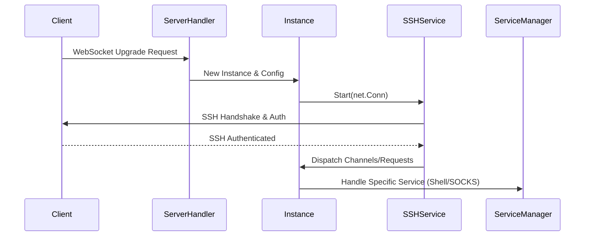
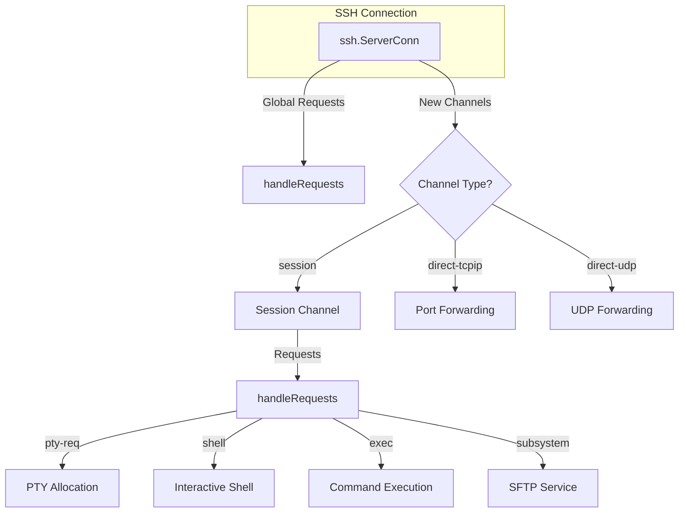
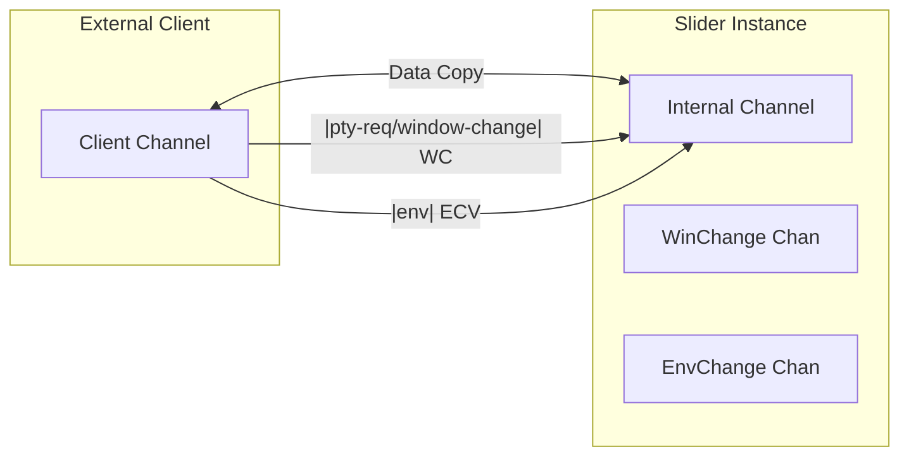

# SSH 基础设施与会话管理

## 目录
1. [模块概览](#模块概览)
2. [引言](#引言)
3. [核心组件解析](#核心组件解析)
   - [Instance 抽象与 Config 枢纽](#instance-抽象与-config-枢纽)
   - [SSH 服务封装 (sshservice)](#ssh-服务封装-sshservice)
   - [插件化服务架构 (Service & ServiceManager)](#插件化服务架构-service--servicemanager)
4. [架构设计与连接流程](#架构设计与连接流程)
   - [连接生命周期](#连接生命周期)
   - [SSH 通道多路复用 (Multiplexing)](#ssh-通道多路复用-multiplexing)
5. [关键逻辑实现](#关键逻辑实现)
   - [身份验证机制](#身份验证机制)
   - [请求分发处理 (handleRequests)](#请求分发处理-handlerequests)
   - [交互式通道管道 (Interactive Pipe)](#交互式通道管道-interactive-pipe)
6. [会话生命周期管理](#会话生命周期管理)
7. [文件参考](#文件参考)

## 模块概览

在对 `pkg/instance` 及其子目录进行系统性扫描后，该模块的规模及构成如下：

- **总文件数**: 11 个 Go 源文件。
- **子模块**:
  - `sshservice`: 提供 SSH 协议的深度封装，处理握手、验证及通道分发。
  - `shell`: 实现交互式 Shell 服务。
  - `socks`: 实现 SOCKS5 代理服务。
  - `portforward`: 管理 TCP 和 UDP 的端口转发逻辑。
- **覆盖范围**: 本文档将深度解析 `instance.go`、`sshservice` 以及核心接口定义，并简要提及 `shell` 和 `portforward` 的集成方式。

## 引言

Slider 的核心竞争力在于其基于 SSH 协议构建的强大、灵活且安全的通信基础设施。`pkg/instance` 模块不仅是 Slider 实例的管理中心，更是 SSH 协议多路复用（Multiplexing）能力的集中体现。

通过将复杂的 SSH 协议细节封装在 `sshservice` 中，并利用 `Service` 接口实现插件化的功能扩展，Slider 能够在一个单一的加密连接上同时承载交互式 Shell、文件传输（SFTP）、SOCKS 代理以及复杂的端口转发任务。这种设计确保了通信的高效性，同时也极大地简化了安全边界的管理。

## 核心组件解析

### Instance 抽象与 Config 枢纽

`instance.Config` 是整个模块的核心结构体，它扮演着“控制中心”的角色。它不仅持有当前实例的所有状态信息，还负责协调 SSH 连接与各个子服务之间的交互。

```go
type Config struct {
    Logger               *slog.Logger
    SessionID            int64
    ServerKey            ssh.Signer          // SSH 服务端私钥
    AuthOn               bool                // 是否开启身份验证
    sshServerConn        *ssh.ServerConn     // 底层 SSH 服务端连接
    sshSessionConn       ChannelOpener       // 抽象的通道开启接口
    serviceManager       *ServiceManager     // 服务管理器
    portFwdManager       *portforward.Manager
    shellService         *shell.Service
    sshService           *sshservice.Service
    // ... 其他配置项
}
```

`Config` 的设计采用了“组合”模式，将 `ServiceManager`、`PortForwardManager` 等组件集成在一起。通过 `New` 函数初始化时，它会自动注册核心服务：

```go
func New(config *Config) *Config {
    c := config
    c.serviceManager = NewServiceManager()

    if c.sshSessionConn != nil {
        c.portFwdManager = portforward.NewManager(c.Logger, c.SessionID, c.sshSessionConn)
        c.shellService = shell.NewService(c.Logger, c.SessionID, c.sshSessionConn)

        _ = c.serviceManager.RegisterService(c.socksClient)
        _ = c.serviceManager.RegisterService(c.shellService)
    }
    // ...
}
```

**Section sources**:
- [pkg/instance/instance.go](pkg/instance/instance.go)

### SSH 服务封装 (sshservice)

`sshservice.Service` 是对 `golang.org/x/crypto/ssh` 的高级封装。它隐藏了 SSH 握手、密钥交换和加密协商的复杂性，为上层提供了简洁的接口。

主要职责包括：
1. **配置 SSH 服务端**: 设置 `ssh.ServerConfig`，包括身份验证回调。
2. **处理握手**: 调用 `ssh.NewServerConn` 完成协议协商。
3. **分发通道与请求**: 监听并分发新开启的 SSH 通道（Channels）和全局请求（Requests）。

```go
func (s *Service) Start(conn net.Conn) error {
    sshConf := &ssh.ServerConfig{NoClientAuth: true}
    if s.authOn {
        sshConf.PublicKeyCallback = s.clientVerification
    }
    sshConf.AddHostKey(s.serverKey)

    sshServerConn, sshClientChannel, reqChan, cErr := ssh.NewServerConn(conn, sshConf)
    // ... 处理请求和通道
}
```

**Section sources**:
- [pkg/instance/sshservice/service.go](pkg/instance/sshservice/service.go)

### 插件化服务架构 (Service & ServiceManager)

为了实现功能的灵活扩展，Slider 定义了 `Service` 接口。任何实现了 `Start`、`Stop` 和 `Type` 方法的组件都可以作为一个服务运行在 Slider 实例中。

```go
type Service interface {
    Start(conn net.Conn) error
    Stop() error
    Type() string
}
```

`ServiceManager` 则负责这些服务的生命周期管理。它维护一个服务映射表，并根据连接类型（如 `socks`、`shell`）将传入的 `net.Conn` 路由到对应的服务。这种设计允许 Slider 在不修改核心逻辑的情况下，轻松添加新的协议支持。

**Section sources**:
- [pkg/instance/service.go](pkg/instance/service.go)

## 架构设计与连接流程

### 连接生命周期

Slider 的连接通常始于 WebSocket，随后升级为 SSH 协议。以下流程图展示了一个典型连接的建立过程：



连接的生命周期由 `Instance` 严格管控。当底层的 SSH 连接断开时，`Instance` 会触发 `stopSignal`，关闭所有关联的监听器和子服务，确保资源得到彻底释放。

此流程确保了连接的安全性（通过 SSH）和灵活性（通过服务分发）。

**Diagram sources**:
- [server/handler.go:L87-L174](server/handler.go#L87-L174)
- [pkg/instance/instance.go:L220-L302](pkg/instance/instance.go#L220-L302)

### SSH 通道多路复用 (Multiplexing)

SSH 的核心优势在于多路复用。Slider 充分利用了这一特性，在同一个 `ssh.ServerConn` 上处理多种类型的请求。



这种架构允许用户在保持一个 SSH 会话的同时，开启多个并发的端口转发通道或执行多个命令，而不需要重新进行身份验证或建立新的 TCP 连接。

**Diagram sources**:
- [pkg/instance/instance.go:L331-L385](pkg/instance/instance.go#L331-L385)
- [pkg/instance/instance.go:L450-L551](pkg/instance/instance.go#L450-L551)

## 关键逻辑实现

### 身份验证机制

Slider 支持基于公钥的身份验证。在 `sshservice` 中，`clientVerification` 函数负责验证客户端提供的公钥指纹是否与配置中允许的指纹匹配。

```go
func (si *Config) clientVerification(conn ssh.ConnMetadata, key ssh.PublicKey) (*ssh.Permissions, error) {
    fp, _ := scrypt.GenerateFingerprint(key)
    if fp == si.allowedFingerprint {
        si.Logger.DebugWith("Authenticated Client", slog.F("fingerprint", fp))
        return &ssh.Permissions{Extensions: map[string]string{"fingerprint": fp}}, nil
    }
    return nil, fmt.Errorf("client key not authorized")
}
```

这种机制确保了只有持有特定私钥的合法用户才能访问 Slider 实例提供的功能。

**Section sources**:
- [pkg/instance/instance.go:L1030-L1049](pkg/instance/instance.go#L1030-L1049)

### 请求分发处理 (handleRequests)

`handleRequests` 方法是 Slider 处理 SSH 协议逻辑的核心。它根据请求类型（`req.Type`）执行不同的操作：

- **`pty-req`**: 处理伪终端请求。Slider 会解析负载中的终端大小，并通过 `init-size` 通道通知客户端同步。
- **`shell` & `exec`**: 开启交互式 Shell 或执行特定命令。这通常涉及到建立一个双向的管道（Pipe）。
- **`window-change`**: 动态调整终端窗口大小。
- **`subsystem`**: 处理如 `sftp` 之类的子系统请求。
- **自定义请求**: 如 `slider-tcpip-forward`，用于处理 Slider 特有的端口转发逻辑。

**Section sources**:
- [pkg/instance/instance.go:L450-L551](pkg/instance/instance.go#L450-L551)

### 交互式通道管道 (Interactive Pipe)

对于 Shell 和 Exec 请求，Slider 使用 `interactiveChannelPipe` 来桥接外部 SSH 会话和内部服务。它不仅负责数据的双向拷贝，还负责转发环境变量和窗口大小变更事件。



这种桥接机制确保了用户在远程终端上的操作（如调整窗口、设置环境变量）能够无缝传递到实际执行的进程中。

**Diagram sources**:
- [pkg/instance/instance.go:L813-L870](pkg/instance/instance.go#L813-L870)

## 会话生命周期管理

Slider 的会话管理遵循“安全退出”原则。

1.  **建立期**: `StartEndpoint` 启动 TCP 监听，并在接受连接后通过 `ServiceManager` 启动对应服务。
2.  **运行期**: 实例持续监控底层连接状态。通过 `conn.Wait()` 阻塞等待，一旦连接异常或正常关闭，立即触发清理逻辑。
3.  **清理期**: `Stop` 方法被调用时，会依次停止所有注册的服务，关闭 `portFwdManager` 管理的所有转发通道，并最终关闭 TCP 监听器。

```go
func (si *Config) Stop() error {
    si.stopSignal <- true
    <-si.done

    if si.serviceManager != nil {
        _ = si.serviceManager.StopAll()
    }
    // ... 重置状态
}
```

这种严谨的生命周期管理防止了孤儿进程和僵尸连接的产生，保证了系统的长期稳定性。

**Section sources**:
- [pkg/instance/instance.go:L994-L1028](pkg/instance/instance.go#L994-L1028)

## 文件参考

以下是本章节涉及的核心源文件：

- `pkg/instance/instance.go`: 实例管理与 SSH 请求分发核心。
- `pkg/instance/sshservice/service.go`: SSH 协议封装与服务端实现。
- `pkg/instance/service.go`: 服务接口与管理器定义。
- `pkg/instance/shell/service.go`: 交互式 Shell 服务实现。
- `pkg/instance/portforward/manager.go`: 端口转发管理器。
- `server/handler.go`: 服务器端连接处理与实例初始化。
- `pkg/types/types.go`: 核心数据结构定义。
