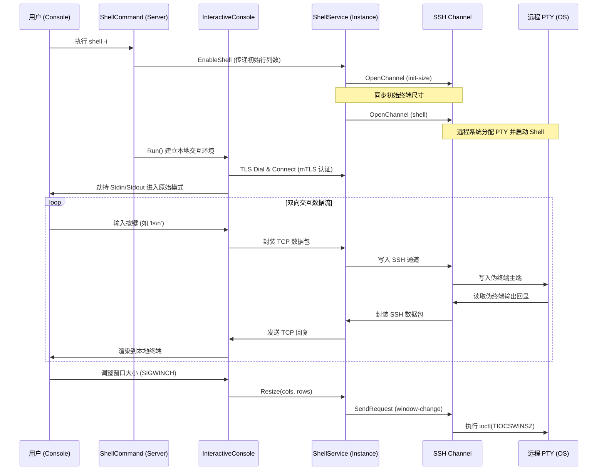
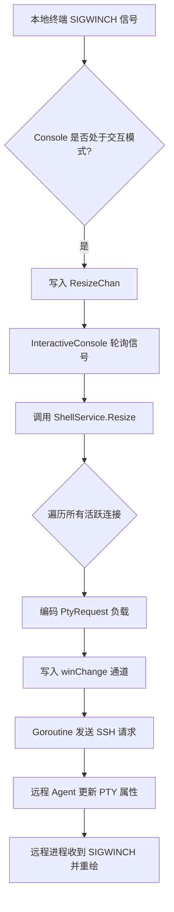
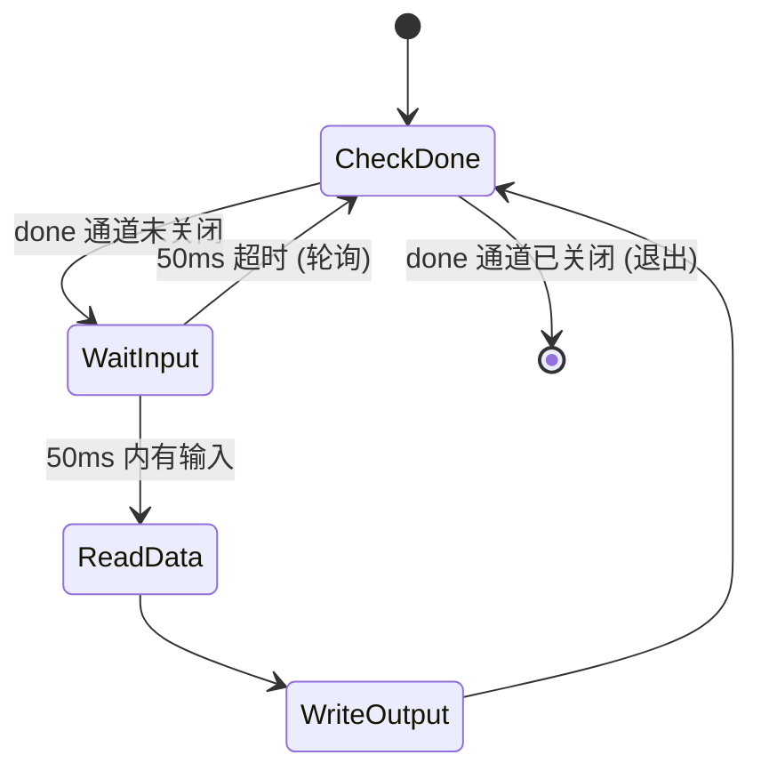
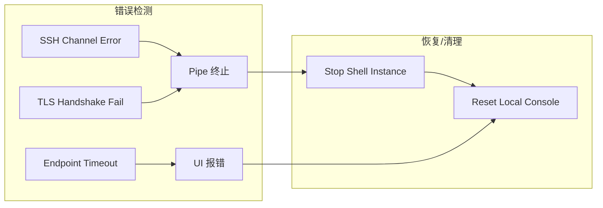

# 交互式 Shell 与终端仿真业务

## 目录
1. [模块概览](#模块概览)
2. [引言](#引言)
3. [架构概览](#架构概览)
4. [PTY 管理与分配机制](#pty-管理与分配机制)
5. [终端大小同步深度解析](#终端大小同步深度解析)
6. [转义序列处理与仿真技术](#转义序列处理与仿真技术)
7. [交互式 IO 管道与取消机制](#交互式-io-管道与取消机制)
8. [跨平台兼容性实现方案](#跨平台兼容性实现方案)
9. [核心组件与接口定义](#核心组件与接口定义)
10. [集成点与错误处理](#集成点与错误处理)
11. [文件参考](#文件参考)

## 模块概览

本模块负责 Slider 系统中全功能的交互式 PTY (Pseudo-Terminal) Shell 实现。它涵盖了从服务端命令触发、网络传输协议绑定到跨平台终端 IO 处理的完整链路，旨在为用户提供与原生 SSH 几乎无异的远程终端体验。

**统计信息**：
- **涉及文件总数**：8 个 Go 源文件。
- **核心子模块**：
  - `pkg/instance/shell`: 提供 Shell 服务核心逻辑，负责 SSH 通道管理、环境变量注入及 PTY 生命周期维护。
  - `pkg/escseq`: 提供 ANSI 转义序列的封装、解析与过滤工具，支持复杂的终端 UI 交互。
  - `pkg/sio`: 提供跨平台的、高性能且可取消的交互式双向 IO 拷贝工具。
  - `server/commands_shell.go`: 实现控制台 `shell` 命令及其交互式 UI 逻辑，处理本地终端状态切换。

本页面将系统性地阐述这些组件如何协同工作，实现诸如 `vim`、`top` 等全屏交互式程序的支持，以及如何在不同操作系统上保持一致的交互行为。

## 引言

在现代远程运维工具中，交互式 Shell 不仅是简单的字符输入输出，更是一个涉及设备仿真、信号同步和流控的复杂系统。Slider 的 Shell 业务通过在底层实现 PTY 分配、终端大小协商和复杂的转义序列处理，解决了远程终端在网络延迟、窗口调整和跨平台兼容性方面的诸多挑战。

**关键挑战与解决方案**：
- **布局错乱**：通过 `pty-req` 和 `window-change` 请求实时同步终端行列数。
- **交互卡死**：通过 `sio` 提供的非阻塞/可取消拷贝机制，确保本地 `Ctrl+C` 能立即中断远程操作。
- **渲染异常**：通过 `pkg/escseq` 对 ANSI 转义序列进行精确控制，支持颜色、光标定位和屏幕对齐。

## 架构概览

Slider 的交互式 Shell 架构采用了典型的客户端-服务端模式，并针对 SSH 协议进行了深度优化。

以下序列图展示了从用户在控制台输入 `shell -i` 命令到建立完整交互式会话的详细过程：



该架构的核心在于**多级解耦**：
1. **传输解耦**：`ShellService` 将底层的 SSH 通道细节屏蔽，对外提供标准的 TCP/TLS 接口。
2. **交互解耦**：`InteractiveConsole` 负责管理本地终端状态（如进入 Raw 模式），而业务逻辑则保留在 `ShellCommand` 中。
3. **IO 解耦**：通过 `sio` 包提供的工具函数，将复杂的跨平台文件描述符操作与业务流程分离。

**Diagram sources**:
- [server/commands_shell.go:L48-L252](server/commands_shell.go#L48-L252)
- [pkg/instance/shell/service.go:L82-L171](pkg/instance/shell/service.go#L82-L171)

## PTY 管理与分配机制

PTY 的管理是 Shell 业务的基石，主要由 `pkg/instance/shell/service.go` 中的 `Service` 结构体负责。

### SSH 通道生命周期
当 `Start` 方法被调用时，`Service` 会启动一个复杂的初始化流程：
1. **尺寸预同步**：在开启主 Shell 通道前，先通过 `conf.SSHChannelInitSize` 通道发送当前的终端行列数。这解决了某些 Shell 在启动时如果不知道尺寸会导致渲染错乱的问题。
2. **环境注入**：通过 `conf.SSHRequestEnv` 请求发送环境变量。Slider 会注入 `TERM=xterm-256color` 以及内部标识位。
3. **PTY 请求与 Shell 激活**：发送 `conf.SSHRequestShell` 请求。此时，远程 Agent 会调用系统 API 分配 PTY，并将标准输入输出重定向到该 PTY。

### 核心代码片段：通道开启逻辑
```go
// pkg/instance/shell/service.go
func (s *Service) Start(conn net.Conn) error {
    // ... 获取尺寸逻辑 ...
    initChan, reqs, oErr := s.opener.OpenChannel(conf.SSHChannelInitSize, initSize)
    if oErr == nil {
        _ = initChan.Close() // 仅用于同步初始尺寸
    }

    // 准备环境变量变更通道
    envChange := make(chan []byte, 10)
    // ... 填充环境变量 ...

    // 进入主管道逻辑
    return s.interactiveConnPipe(conn, conf.SSHRequestShell, nil, winChange, envChange)
}
```

**Section sources**:
- [pkg/instance/shell/service.go:L81-L171](pkg/instance/shell/service.go#L81-L171)

## 终端大小同步深度解析

Slider 实现了从本地控制台到远程 PTY 的实时尺寸透传，这是支持 `vim`、`htop` 等程序动态调整布局的关键。

### 同步链路分析
1. **捕获层**：`InteractiveConsole` 在本地启动时，会通过 `ic.ResizeChan` 接收来自 UI 框架的尺寸变化通知。
2. **传播层**：调用 `Service.Resize`。由于一个 `Service` 实例可能服务于多个连接（虽然通常是一对一），它维护了一个 `winChannels` 映射。
3. **协议层**：在 `interactiveConnPipe` 中，专门的 goroutine 监听 `winChange` 通道，并将尺寸信息编码为 SSH `window-change` 请求发送给远程端。

以下流程图展示了尺寸同步的决策与执行路径：



这种多级缓冲设计确保了即使在网络抖动的情况下，尺寸调整请求也不会丢失或导致死锁。

**Section sources**:
- [pkg/instance/shell/service.go:L54-L74](pkg/instance/shell/service.go#L54-L74)
- [server/commands_shell.go:L298-L311](server/commands_shell.go#L298-L311)

## 转义序列处理与仿真技术

`pkg/escseq` 包是 Slider 处理终端仿真的核心工具集。它不仅提供了颜色和光标控制的封装，还包含了一些解决特定交互问题的“黑科技”。

### 屏幕对齐 (Screen Alignment) 算法
在进入交互式 Shell 时，为了保持控制台的整洁，Slider 经常需要将当前光标位置对齐到屏幕顶部。
该算法的实现逻辑如下：
1. **发送 DSR (Device Status Report)**：向终端写入 `\x1b[6n`。
2. **解析响应**：终端会返回类似 `\x1b[24;1R` 的字符串，表示光标当前在第 24 行。
3. **计算偏移**：根据返回的行号，生成对应数量的向上滚动序列。
4. **执行对齐**：发送滚动序列和光标归位序列。

```mermaid
graph TD
    subgraph "pkg/escseq 逻辑"
        A[发送 \x1b[6n] --> B[等待响应]
        B --> C[解析 \x1b[row;colR]
        C --> D[生成 \x1b[rowS 滚动序列]
        D --> E[发送滚动 + 光标归位]
    end
```

### 核心转义序列定义
```go
// pkg/escseq/escseq.go
var (
    resetColor    = []byte{27, '[', '0', 'm'}
    eraseLine     = []byte{27, '[', '2', 'K'}
    cursorRequest = []byte{27, '[', '6', 'n'} // DSR
    // ... 更多颜色定义 ...
)
```

**Section sources**:
- [pkg/escseq/escseq.go](pkg/escseq/escseq.go)

## 交互式 IO 管道与取消机制

为了实现高效且可控的双向数据流，Slider 在 `pkg/sio` 中实现了一套增强的 IO 工具。

### PipeWithCancel 的原子性
`PipeWithCancel` 解决了传统 `io.Copy` 无法同步关闭的问题。它使用 `sync.Once` 确保一旦任何一侧发生错误（如网络断开或 Shell 退出），另一侧的 `Close()` 也会被立即触发。

### 可取消的交互式拷贝 (CopyInteractiveCancellable)
这是处理标准输入 (Stdin) 的关键。在交互式 Shell 中，简单的 `io.Copy` 会阻塞在 `os.Stdin.Read` 上，导致程序无法响应取消信号（如用户通过其他方式关闭了会话）。



通过引入 50ms 的轮询机制，Slider 确保了 Stdin 读取器能够及时感知到会话的结束，从而释放系统资源。

**Section sources**:
- [pkg/sio/sio.go](pkg/sio/sio.go)
- [pkg/sio/stdin_unix.go](pkg/sio/stdin_unix.go)

## 跨平台兼容性实现方案

由于 Windows 和 Unix 系统在处理标准输入文件描述符 (Fd) 上的巨大差异，Slider 采用了条件编译 (`//go:build`) 来实现 `CopyInteractiveCancellable`。

### Unix 平台 (`stdin_unix.go`)
利用 `unix.Select` 系统调用。`Select` 允许同时监控多个 Fd 的可读性。Slider 将其用于 Stdin，并配合微小的超时时间，实现了“伪非阻塞”读取。

### Windows 平台 (`stdin_windows.go`)
Windows 的 `select` 不支持非套接字句柄。Slider 转向使用 `windows.WaitForSingleObject` 来监控控制台输入句柄。这是一种原生的 Windows 同步机制，能够完美适配控制台输入事件。

> 💡 **设计决策**：统一使用 50ms 超时是在响应灵敏度和 CPU 占用率之间的最优平衡点。这保证了用户在按下 `Ctrl+C` 或关闭窗口时，程序能迅速响应。

**Section sources**:
- [pkg/sio/stdin_unix.go](pkg/sio/stdin_unix.go)
- [pkg/sio/stdin_windows.go](pkg/sio/stdin_windows.go)

## 核心组件与接口定义

### Shell 服务接口 (`Service`)
`Service` 结构体管理着 Shell 的所有元数据。

```go
// pkg/instance/shell/service.go
type Service struct {
	logger        *slog.Logger
	sessionID     int64
	opener        ChannelOpener // 抽象的通道开启器，支持本地和远程代理
	envVarList    []struct{ Key, Value string }
	interactiveOn bool
	initTermSize  *types.TermDimensions
	winChannels   map[net.Conn]chan []byte // 维护所有活跃的窗口大小同步通道
	mutex         sync.Mutex
}
```

### 交互式控制台 (`InteractiveConsole`)
位于 `server/commands_shell.go`，它是服务端处理交互的核心。

```go
// server/commands_shell.go
type InteractiveConsole struct {
	*Console
	*session.BidirectionalSession
	port         int
	tlsConfig    *tls.Config
	ui           UserInterface
	targetSystem string
}
```

**Section sources**:
- [pkg/instance/shell/service.go:L18-L28](pkg/instance/shell/service.go#L18-L28)
- [server/commands_shell.go:L35-L42](server/commands_shell.go#L35-L42)

## 集成点与错误处理

### 与统一远程 (Unified Remote) 的集成
在 `server/commands_shell.go` 中，`ShellCommand` 会根据目标会话的 `GatewayID` 自动选择策略。如果是远程会话，它会创建一个 `remote.Proxy` 作为 `ChannelOpener`，从而实现跨跳板机的 Shell 访问。

### 错误处理策略
1. **连接超时**：在启动 Shell 端点时，使用 `time.After` 设置超时，防止无限期等待。
2. **PTY 分配失败**：如果远程 Agent 无法分配 PTY，SSH 通道会立即关闭，`PipeWithCancel` 会捕获此错误并通知用户。
3. **TLS 认证失败**：交互式 Shell 强制使用 mTLS，任何证书不匹配都会导致连接在握手阶段被切断。



**Section sources**:
- [server/commands_shell.go:L122-L132](server/commands_shell.go#L122-L132)
- [server/commands_shell.go:L202-L249](server/commands_shell.go#L202-L249)

## 文件参考

以下是实现交互式 Shell 与终端仿真业务的关键文件：

- `pkg/instance/shell/service.go`: Shell 服务核心实现，负责 PTY 分配与 SSH 通道管理。
- `pkg/escseq/escseq.go`: ANSI 转义序列定义与光标对齐逻辑。
- `server/commands_shell.go`: 服务端 `shell` 命令实现与交互式控制台逻辑。
- `pkg/sio/sio.go`: 基础 IO 管道工具，提供 `PipeWithCancel`。
- `pkg/sio/stdin_unix.go`: Unix 平台下利用 `select(2)` 实现的可取消 Stdin 读取。
- `pkg/sio/stdin_windows.go`: Windows 平台下利用 `WaitForSingleObject` 实现的可取消 Stdin 读取。
- `pkg/sio/ssh_forwarding.go`: 处理 SSH 转发相关的 IO 逻辑。
- `pkg/types/ssh.go`: (参考) 定义了 `PtyRequest` 等 SSH 协议相关的结构体。
