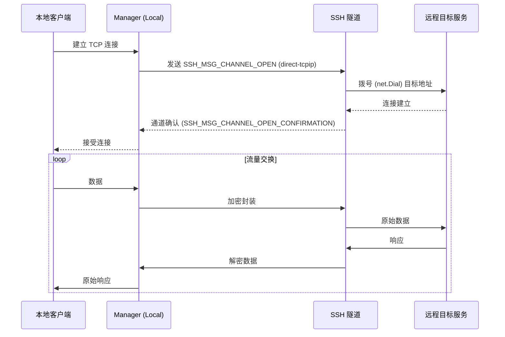
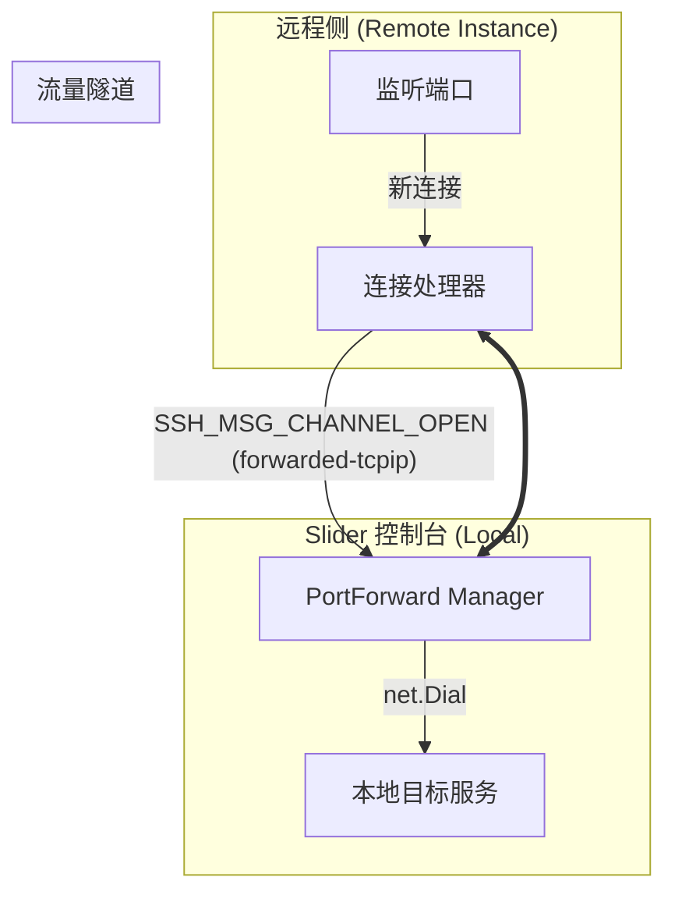
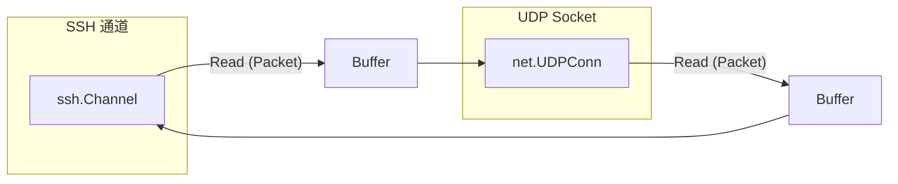
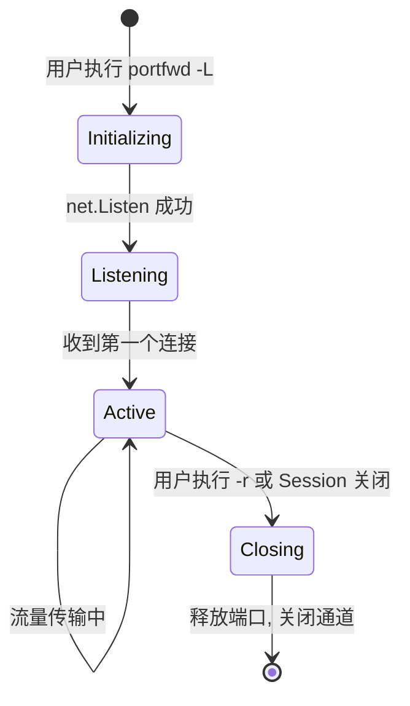

# 端口转发与隧道技术详解

## 目录
1. [模块概览](#模块概览)
2. [引言](#引言)
3. [核心组件](#核心组件)
4. [本地端口转发 (Local Forwarding)](#本地端口转发-local-forwarding)
5. [远程端口转发 (Remote Forwarding)](#远程端口转发-remote-forwarding)
6. [UDP Over SSH 实现机制](#udp-over-ssh-实现机制)
7. [转发管理器设计与生命周期管理](#转发管理器设计与生命周期管理)
8. [协议封装与 SSH 通道应用](#协议封装与-ssh-通道应用)
9. [错误处理与资源清理](#错误处理与资源清理)
10. [关键源码文件](#关键源码文件)

## 模块概览

本模块负责 Slider 系统中的端口转发（Port Forwarding）与隧道技术实现。它允许用户在 Slider 客户端与远程实例之间建立加密的流量隧道，支持 TCP 和 UDP 协议。

**文件统计与范围**：
- **核心目录**：`pkg/instance/portforward/` (7 个实现与测试文件)
- **底层实现**：`pkg/sio/ssh_forwarding.go` (1 个文件)
- **命令接口**：`server/commands_portfwd.go` (1 个文件)
- **协议定义**：`pkg/types/ssh.go` (1 个文件)
- **配置常量**：`pkg/conf/ssh.go`, `pkg/conf/defaults.go` (2 个文件)
- **总计**：约 12 个核心 Go 文件。

**子模块说明**：
- `portforward.Manager`：核心状态容器，维护本地和远程转发规则映射。
- `local_tcp.go` / `local_udp.go`：负责本地 TCP/UDP listener、连接接入和 SSH channel 打开。
- `remote.go`：负责远程/反向转发的请求发送、响应端口解析、目标拨号和取消。
- `handler.go`, `handler_tcp.go`, `handler_udp.go`：SSH 服务端侧的转发请求和 channel 处理逻辑。
- `sio`：提供底层的流量交换逻辑，特别是针对 UDP 的包交换实现。
- `commands`：控制台命令解析与执行逻辑。

## 引言

端口转发是 Slider 的核心功能之一，它通过 SSH 协议提供的加密隧道，将本地端口的流量安全地传输到远程实例，或者反之（远程转发）。Slider 不仅实现了标准的 SSH TCP 转发（RFC 4254），还通过自定义扩展实现了高效的 **UDP Over SSH**。

在 Slider 架构中，端口转发不仅仅是简单的 Socket 代理，它深度集成了 SSH 的通道（Channel）机制，确保所有流量都在现有的加密会话中传输，无需额外开启监听端口或建立新的 TCP 连接。这种设计使得 Slider 能够穿透复杂的防火墙环境，同时保证数据传输的私密性与完整性。

## 核心组件

端口转发模块由几个关键的数据结构和接口组成，它们协同工作以管理复杂的连接状态。

### Manager 结构体
`Manager` 是整个模块的大脑，负责存储和协调所有的转发规则。

```go
// pkg/instance/portforward/manager.go

type Manager struct {
	logger         *slog.Logger
	sessionID      int64
	conn           ChannelOpener
	remoteMappings map[string]*RemoteForward
	localMappings  map[string]*LocalForward
	mutex          sync.Mutex
}
```

- `remoteMappings`：存储远程转发（`-R`）的规则，键为 `protocol:port` 格式。
- `localMappings`：存储本地转发（`-L`）的规则。
- `mutex`：保护两个映射，`Get*Mappings` 返回副本，避免调用方直接修改内部状态。

### 数据流控制结构
为了优雅地处理异步连接，Slider 使用了带有通道（Channel）的结构体来管理每个转发任务。

```go
type RemoteForward struct {
	RcvChan    chan *types.CustomTcpIpChannelMsg
	CancelChan chan struct{}
	OwnerID    uint64
	cancelOnce sync.Once
	*types.CustomTcpIpChannelMsg
}
```

- `RcvChan`：用于接收新连接的通知。
- `CancelChan`：用于信号通知远程转发任务结束，触发清理逻辑。
- `OwnerID`：标识某个 SSH endpoint 连接创建的远程转发，便于连接关闭时批量取消 SSH 远程转发。

**核心组件源码参考**:
- [manager.go](pkg/instance/portforward/manager.go)
- [types/ssh.go](pkg/types/ssh.go)

## 本地端口转发 (Local Forwarding)

本地端口转发（`-L`）允许用户将本地机器上的某个端口映射到远程实例能访问的某个目标。

### 实现流程
1. **监听本地端口**：`StartLocalForward` 在本地启动一个 TCP 或 UDP 监听器。
2. **接受连接**：当有本地客户端连接到该端口时，`Manager` 会拦截该连接。
3. **开启 SSH 通道**：对于 TCP，发送 `direct-tcpip` 通道请求；对于 UDP，发送自定义的 `direct-udp` 请求。
4. **流量桥接**：使用 `sio.PipeWithCancel`（TCP）或自定义的包交换逻辑（UDP）将本地 Socket 与 SSH 通道绑定。

下图展示了本地 TCP 转发的详细序列：



在上述流程中，`Manager` 扮演了透明代理的角色。它通过 `net.Listen` 捕获流量，并将其封装进 SSH 通道。这种方式的优势在于，远程目标服务看到的连接来源是远程实例本身，从而实现了内网穿透。

**章节源码参考**:
- [local_tcp.go](pkg/instance/portforward/local_tcp.go)
- [local_udp.go](pkg/instance/portforward/local_udp.go)
- [manager.go](pkg/instance/portforward/manager.go)

## 远程端口转发 (Remote Forwarding)

远程端口转发（`-R`，又称反向转发）允许将远程实例上的某个端口映射回本地或本地可达的其他目标。

### 实现逻辑
与本地转发不同，远程转发需要通知远程侧开启监听。
1. **发送全局请求**：`Manager` 向远程侧发送 `tcpip-forward`（TCP）或 `slider-udp-forward`（UDP）全局请求。
2. **远程监听**：远程侧（通常是 Slider 客户端或 SSH 服务端）在指定端口启动监听。
3. **反向通道**：当远程端口收到连接时，远程侧会主动向 Slider 开启一个 `forwarded-tcpip` 或 `forwarded-udp` 通道。
4. **本地拨号**：Slider 收到通道请求后，拨号连接到本地的目标服务。



远程转发的关键在于 `StartRemoteForward`、`HandleTCPIPForwardRequest` 和 `HandleDirectTCPIPChannel`。`StartRemoteForward` 根据协议选择发送 `tcpip-forward` 或 `slider-udp-forward` 请求；handler 层在远端监听收到连接后打开 `forwarded-tcpip` 或 `forwarded-udp` 通道；`Manager` 根据 `protocol:port` 的键查找映射并完成对接。

**章节源码参考**:
- [remote.go](pkg/instance/portforward/remote.go)
- [handler.go](pkg/instance/portforward/handler.go)
- [handler_tcp.go](pkg/instance/portforward/handler_tcp.go)
- [handler_udp.go](pkg/instance/portforward/handler_udp.go)

## UDP Over SSH 实现机制

标准的 SSH 协议并不原生支持 UDP 转发。Slider 通过自定义通道类型和应用层封装实现了这一功能。

### 自定义协议定义
Slider 定义了两种新的 SSH 通道/请求类型：
- `direct-udp`：用于本地到远程的 UDP 转发。
- `slider-udp-forward` / `forwarded-udp`：用于远程到本地的 UDP 转发。

### 状态化 UDP 管理
由于 UDP 是无连接的，`Manager` 必须在应用层模拟“会话”状态。在 `StartLocalUDPForward` 中，Slider 使用了一个 `sessions` 映射表来跟踪源地址与 SSH 通道之间的关系。

```go
// pkg/instance/portforward/local_udp.go

// 映射用于根据源地址跟踪活跃的“会话”
// Key: Source IP:Port (string), Value: SSH Channel
sessions := make(map[string]ssh.Channel)
```

### 数据交换逻辑
UDP 转发不使用 `io.Copy`，而是使用基于包的交换逻辑。`HandleForwardedUDPChannel` 展示了这一过程：



1. **包定界**：每个 `channel.Write` 对应一个 UDP 数据包。
2. **并发处理**：为每个方向开启独立的 goroutine 进行双向拷贝。
3. **MTU 处理**：使用 `conf.MaxUDPPacketSize` (65535 字节) 确保能够承载最大的 UDP 包。

**章节源码参考**:
- [sio/ssh_forwarding.go:L19-L148](pkg/sio/ssh_forwarding.go#L19-L148)
- [local_udp.go](pkg/instance/portforward/local_udp.go)
- [request_forward_udp.go](pkg/session/request_forward_udp.go)

## 转发管理器设计与生命周期管理

`portforward.Manager` 采用了线程安全的设计，通过 `sync.Mutex` 保护其内部状态。

### 核心数据流逻辑
`Manager` 使用 Go 的 `select` 机制来监听任务状态。例如在 `StartLocalForward` 中：

```go
for {
    select {
    case <-mapping.DoneChan:
        // 执行清理逻辑
        return
    default:
        // 接受新连接并处理
    }
}
```

### 动态端口分配
Slider 支持绑定到端口 `0`，此时系统会自动分配一个可用端口。`Manager` 会在请求成功后从 SSH 响应中解析出 `BoundPort` 并更新映射关系。



**章节源码参考**:
- [manager.go](pkg/instance/portforward/manager.go)

## 协议封装与 SSH 通道应用

Slider 在转发过程中使用了多种数据结构进行封装，以支持跨平台的元数据传输。

### 消息格式
- **TCP 消息**：使用标准的 `TcpIpChannelMsg`，包含目标主机、目标端口、源主机和源端口。
- **自定义扩展**：`CustomTcpIpFwdRequest` 增加了 `Protocol` 字段，允许在同一套逻辑中区分 TCP 和 UDP。

### 通道复用
所有的转发流量都复用同一个 SSH 连接。这意味着：
- **拥塞控制**：TCP 转发受限于 SSH 连接本身的 TCP 拥塞窗口。
- **安全性**：流量继承了 SSH 的强加密特性。
- **开销**：每个转发连接会增加少量的 SSH 通道管理开销。

**章节源码参考**:
- [types/ssh.go:L17-L64](pkg/types/ssh.go#L17-L64)
- [conf/ssh.go](pkg/conf/ssh.go)

## 错误处理与资源清理

优雅的清理是端口转发模块的关键，否则会导致端口占用或内存泄漏。

### 清理流程
1. **信号触发**：通过向 `DoneChan` 发送数据触发退出。
2. **关闭监听器**：调用 `listener.Close()` 释放系统端口。
3. **关闭通道**：遍历并关闭所有关联的 SSH 通道。
4. **移除映射**：从 `Manager` 的内部 Map 中删除记录。

### 冲突处理
在 `StartRemoteForward` 中，如果远程端口已被占用，SSH 服务器会拒绝请求。Slider 会捕获此错误并通过 `notifier` 通道反馈给用户界面。

```go
if rErr != nil || !ok {
    if rErr == nil {
        rErr = fmt.Errorf("request was rejected, port likely in use")
    }
    notifier <- fmt.Errorf("failed to send request - %v", rErr)
    return
}
```

**章节源码参考**:
- [manager.go:L530-L558](pkg/instance/portforward/manager.go#L530-L558)
- [commands_portfwd.go:L254-L363](server/commands_portfwd.go#L254-L363)

## 关键源码文件

以下是实现端口转发与隧道技术的核心文件：

- `pkg/instance/portforward/manager.go`: 转发管理器的状态容器，维护本地与远程映射。
- `pkg/instance/portforward/local_tcp.go`: 本地 TCP 转发监听和 `direct-tcpip` 通道打开。
- `pkg/instance/portforward/local_udp.go`: 本地 UDP 转发监听和按源地址复用 `direct-udp` 通道。
- `pkg/instance/portforward/remote.go`: 远程转发请求发送、取消和本地目标拨号。
- `pkg/instance/portforward/handler.go`: 处理远程转发请求入口和通用分发。
- `pkg/instance/portforward/handler_tcp.go`: TCP 通道处理。
- `pkg/instance/portforward/handler_udp.go`: UDP 通道处理。
- `pkg/sio/ssh_forwarding.go`: 提供 UDP 转发的底层数据交换实现。
- `server/commands_portfwd.go`: 控制台 `portfwd` 命令的逻辑实现。
- `pkg/types/ssh.go`: 定义了转发过程中使用的各种协议数据结构。
- `pkg/conf/ssh.go`: 定义了 SSH 通道和请求类型的常量。
