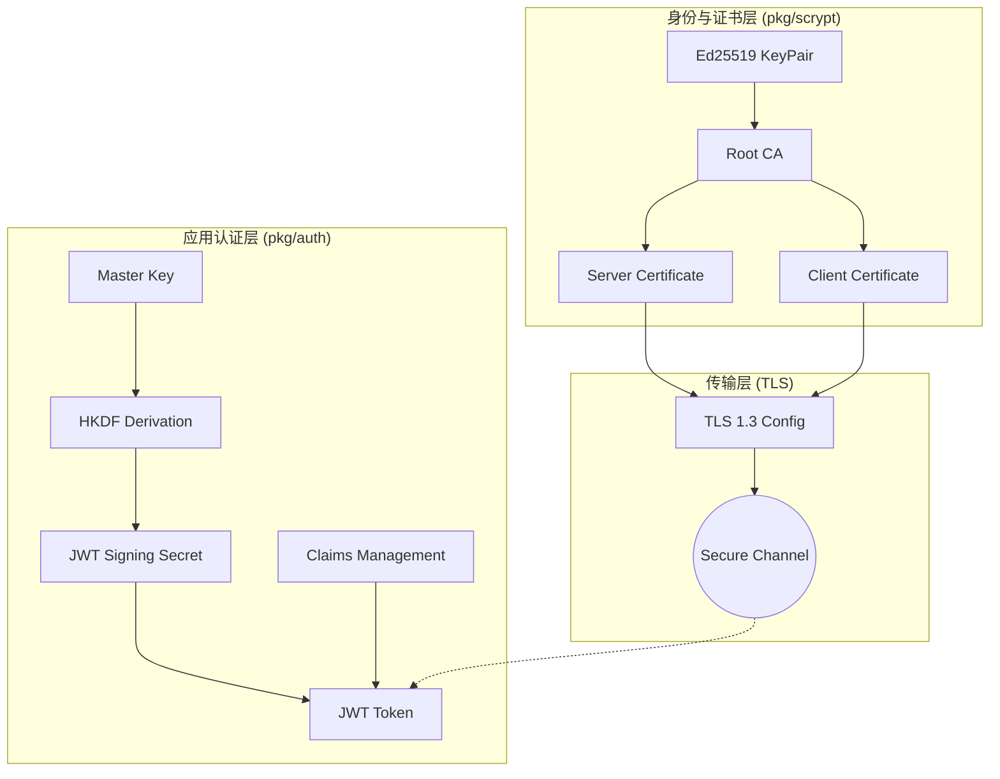
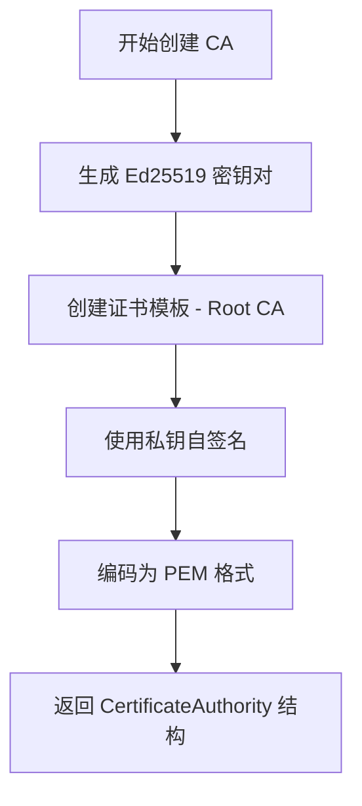
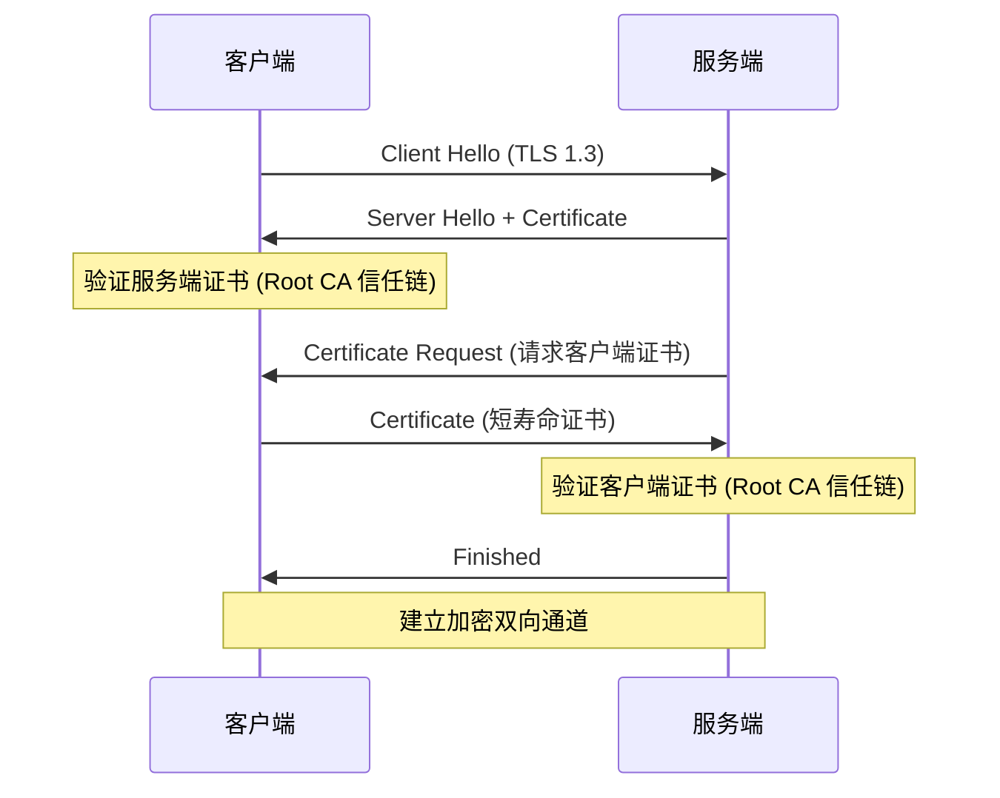
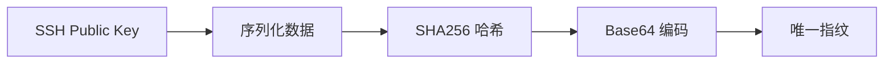

# 安全机制与身份验证

## 目录
1. [模块概览](#模块概览)
2. [安全模型综述](#安全模型综述)
3. [基于 Ed25519 的证书体系](#基于-ed25519-的证书体系)
   - [证书颁发机构 (CA) 的构建](#证书颁发机构-ca-的构建)
   - [证书签发与生命周期管理](#证书签发与生命周期管理)
4. [双向 TLS (mTLS) 与传输安全](#双向-tls-mtls-与传输安全)
   - [TLS 1.3 强制配置](#tls-13-强制配置)
   - [身份验证流程](#身份验证流程)
5. [JWT 身份验证与声明管理](#jwt-身份验证与声明管理)
   - [声明结构与校验逻辑](#声明结构与校验逻辑)
   - [令牌编解码实现](#令牌编解码实现)
6. [密钥派生与机密信息处理](#密钥派生与机密信息处理)
   - [基于 HKDF 的密钥分离](#基于-hkdf-的密钥分离)
   - [指纹生成与校验](#指纹生成与校验)
7. [安全实践与威胁模型](#安全实践与威胁模型)
   - [机密性与完整性保障](#机密性与完整性保障)
   - [中间人攻击 (MITM) 防护](#中间人攻击-mitm-防护)
8. [核心组件](#核心组件)
9. [文件参考](#文件参考)

## 模块概览

Slider 的安全机制主要分布在两个核心子模块中：`pkg/scrypt` 和 `pkg/auth`。这两个模块共同构建了一个多层次的安全防御体系，确保了在不安全网络环境下的通信机密性、完整性和身份真实性。

在本次代码探索中，我们识别并分析了以下关键组件：
- **文件总数**: 5 个核心实现文件（不含测试文件）。
- **子模块分布**:
    - `pkg/scrypt`: 负责底层的加密算法实现、证书管理以及 TLS 配置。包含 `scrypt.go` 和 `certificate.go`。
    - `pkg/auth`: 负责高层的身份验证逻辑，包括 JWT 令牌的处理和密钥派生。包含 `jwt.go`、`claims.go` 和 `secret.go`。

本章节将深入探讨 Slider 如何利用 Ed25519 异步加密技术、mTLS 双向验证以及 JWT 声明管理来构建其安全基石。我们将详细分析证书的自动化生成与更新流程，以及如何通过 HKDF 算法实现密钥的科学分离与派生。

## 安全模型综述

Slider 的安全模型旨在解决分布式系统在开放网络环境下的典型安全挑战。其核心设计哲学是“零信任”与“深度防御”。系统不依赖于网络边界的安全性，而是通过端到端的加密和严格的身份验证来确保每一条指令和数据的安全。

Slider 的安全架构可以分为三个主要层次：
1.  **传输层安全 (TLS)**: 使用 TLS 1.3 协议，通过 mTLS（双向 TLS）确保通信双方的身份真实性。
2.  **身份层验证 (JWT)**: 在建立安全连接后，使用 JWT 令牌进行细粒度的会话管理和权限控制。
3.  **密钥管理层 (HKDF & Secret)**: 通过根密钥派生出不同用途的子密钥，确保存储和传输中的敏感信息不被泄露。

下面的架构图展示了这些组件之间的相互作用：



该架构确保了即使攻击者能够监听网络流量，也无法解密数据（机密性）；即使攻击者尝试篡改数据，也会因为签名校验失败而被拦截（完整性）；即使攻击者尝试冒充服务端或客户端，也会因为缺乏有效的 CA 签名证书而被拒绝连接（身份真实性）。

## 基于 Ed25519 的证书体系

Slider 选择了 Ed25519 作为其核心的异步加密算法。相比于传统的 RSA 或 ECDSA，Ed25519 具有更高的性能、更小的密钥尺寸以及更强的抗侧信道攻击能力。在 `pkg/scrypt` 模块中，Slider 实现了一套完整的内部证书颁发机构 (CA) 系统。

### 证书颁发机构 (CA) 的构建

Slider 在启动时会自动生成一个自签名的根 CA。这个 CA 是整个集群信任的根源。`CreateCA` 函数负责生成 Ed25519 密钥对，并构建一个有效期长达 99 年的根证书。



在 `pkg/scrypt/certificate.go` 中，`CertificateAuthority` 结构体不仅保存了证书的 PEM 编码，还直接持有了 `ed25519.PrivateKey`，这使得它能够为其他组件签发证书。

### 证书签发与生命周期管理

Slider 的证书签发逻辑非常灵活。它支持签发服务端证书和客户端证书。一个显著的设计细节是：**客户端证书的有效期被设置为极短的 1 分钟**。

这种短寿命证书的设计大大降低了证书泄露带来的风险。客户端在每次需要进行身份验证时，都会请求 CA 签发一个新的临时证书。而服务端证书则相对长久（10 年），以保证服务的稳定性。

```go
// CreateCertificate 签发由 CA 签名的证书
func (ca *CertificateAuthority) CreateCertificate(isServer bool) (*GeneratedCertificate, error) {
    // ... 生成 Ed25519 密钥对 ...
    notBefore := time.Now()
    notAfter := notBefore.Add(time.Minute) // 客户端证书仅 1 分钟有效
    if isServer {
        notAfter = notBefore.AddDate(10, 0, 0) // 服务端证书 10 年有效
    }
    // ... 构建模板并使用 CA 私钥签名 ...
}
```

这种机制确保了身份验证的实时性。如果一个客户端的权限被撤销，它将无法再从 CA 获取新的证书，从而在极短时间内失去访问权限。

**本节源码参考**:
- [pkg/scrypt/certificate.go](pkg/scrypt/certificate.go)
- [pkg/scrypt/scrypt.go](pkg/scrypt/scrypt.go)

## 双向 TLS (mTLS) 与传输安全

传输安全是 Slider 安全模型的第二道防线。Slider 并没有简单地使用标准的 HTTPS，而是强制执行了 TLS 1.3 协议，并采用了双向验证 (mTLS) 模式。

### TLS 1.3 强制配置

在 `pkg/scrypt/certificate.go` 中，`GetTLSServerConfig` 和 `GetTLSClientConfig` 函数对 TLS 配置进行了严格限制。它不仅要求最小版本为 `VersionTLS13`，还限制了加密套件为 `TLS_AES_256_GCM_SHA384`，这是目前公认最安全的配置之一。

```go
tlsConfig := &tls.Config{
    Certificates: []tls.Certificate{serverCert.TLSCert},
    MinVersion:   tls.VersionTLS13,
    CipherSuites: []uint16{
        tls.TLS_AES_256_GCM_SHA384,
    },
}
```

### 身份验证流程

在 mTLS 模式下，握手过程不仅是服务端向客户端证明身份，客户端也必须向服务端出示由受信任 CA 签名的证书。



这种机制彻底杜绝了中间人攻击。因为攻击者无法伪造由 Slider 内部 CA 签名的证书，也就无法介入握手过程。

**本节源码参考**:
- [pkg/scrypt/certificate.go](pkg/scrypt/certificate.go)

## JWT 身份验证与声明管理

在建立了安全的传输通道后，Slider 使用 JWT (JSON Web Token) 来管理具体的业务请求授权。JWT 提供了一种无状态的验证方式，非常适合分布式场景。

### 声明结构与校验逻辑

Slider 的 JWT 声明定义在 `pkg/auth/claims.go` 中。除了标准的 `iss` (发行者)、`sub` (主体)、`exp` (过期时间) 外，还包含了一个自定义的 `CertID` 字段，用于关联特定的证书标识。

```go
type Claims struct {
    Issuer    string `json:"iss"`
    Subject   string `json:"sub"` // 通常是证书指纹
    IssuedAt  int64  `json:"iat"`
    ExpiresAt int64  `json:"exp"`
    CertID    int64  `json:"cert_id,omitempty"`
}
```

`IsValid` 方法实现了严格的校验逻辑，包括检查必填字段、验证时间戳的合理性以及检查令牌是否已过期。这种在结构体层面封装校验逻辑的做法，保证了代码的健壮性。

### 令牌编解码实现

`pkg/auth/jwt.go` 实现了基于 HS256 算法的 JWT 编解码。虽然 TLS 已经提供了加密，但 JWT 的签名仍然至关重要，它确保了应用层数据的不可篡改性。

```go
func Encode(claims *Claims, secret []byte) (string, error) {
    // ... 序列化 Header 和 Claims ...
    message := headerB64 + "." + claimsB64
    signature := sign(message, secret)
    // ... 组合为 Token ...
}
```

Slider 在这里使用了 `crypto/hmac` 进行签名生成，并使用 `hmac.Equal` 进行恒定时间比较，以防止计时攻击。

**本节源码参考**:
- [pkg/auth/claims.go](pkg/auth/claims.go)
- [pkg/auth/jwt.go](pkg/auth/jwt.go)

## 密钥派生与机密信息处理

安全系统的强度往往取决于其密钥管理的科学性。Slider 并没有在代码中硬编码各种密钥，而是采用了一种基于 HKDF (HMAC-based Extract-and-Expand Key Derivation Function) 的密钥派生机制。

### 基于 HKDF 的密钥分离

在 `pkg/auth/secret.go` 中，`DeriveSecret` 函数展示了 Slider 如何从一个主密钥 (Master Key) 派生出不同用途的子密钥。

```go
func DeriveSecret(masterKey []byte, info string) []byte {
    h := hkdf.New(sha256.New, masterKey, nil, []byte(info))
    secret := make([]byte, 32)
    _, _ = h.Read(secret)
    return secret
}
```

通过传入不同的 `info` 字符串（例如 "jwt-signing"、"data-encryption"），系统可以从同一个根密钥生成完全不同的、在密码学上相互独立的子密钥。这种做法实现了“密钥分离”原则：即使其中一个子密钥被破解，也不会威胁到其他用途的密钥安全。

### 指纹生成与校验

为了快速标识和验证公钥，Slider 实现了指纹生成逻辑。在 `pkg/scrypt/scrypt.go` 中，`GenerateFingerprint` 函数对公钥的二进制数据进行 SHA256 哈希，并进行 Base64 编码。



这种指纹被广泛用于 `Claims.Subject` 中，作为实体的唯一身份标识，既安全又高效。

**本节源码参考**:
- [pkg/auth/secret.go](pkg/auth/secret.go)
- [pkg/scrypt/scrypt.go](pkg/scrypt/scrypt.go)

## 安全实践与威胁模型

Slider 的安全设计充分考虑了在“敌对网络”环境下的生存能力。通过上述机制的组合，Slider 有效应对了多种安全威胁。

### 机密性与完整性保障

- **机密性**: 所有的应用数据都在 TLS 1.3 隧道中传输，使用 AES-256-GCM 对称加密。即使攻击者截获了报文，也无法获取原始内容。
- **完整性**: TLS 层的 GCM 模式提供了内置的完整性校验。同时，应用层的 JWT 签名提供了二次保障。任何对报文的微小改动都会导致校验失败，从而被系统丢弃。

### 中间人攻击 (MITM) 防护

Slider 的核心防护在于其**闭环的证书信任体系**。
1.  服务端和客户端只信任由 Slider 根 CA 签名的证书。
2.  攻击者无法获得根 CA 的私钥，因此无法伪造合法证书。
3.  即使攻击者使用了合法的商业证书（如 Let's Encrypt），因为其根 CA 不在 Slider 的信任池中，连接依然会被拒绝。

这种设计使得 Slider 能够安全地部署在任何公共云或不可信的局域网中。

## 核心组件

以下是 Slider 安全模块中最重要的几个代码片段和接口定义。

### 1. 服务器密钥对结构 (pkg/scrypt/scrypt.go)
这是服务端持久化身份的核心结构。
```go
type ServerKeyPair struct {
    *CertificateAuthority `json:"CertificateAuthority"`
    *KeyPair              `json:"KeyPair"`
}

type KeyPair struct {
    PrivateKey    string `json:"PrivateKey"`
    SSHPrivateKey string `json:"SSHPrivateKey"`
    SSHPublicKey  string `json:"SSHPublicKey"`
    FingerPrint   string `json:"FingerPrint"`
}
```

### 2. JWT 解码与校验逻辑 (pkg/auth/jwt.go)
展示了如何安全地解析和验证令牌。
```go
func Decode(token string, secret []byte) (*Claims, error) {
    parts := strings.Split(token, ".")
    if len(parts) != 3 {
        return nil, ErrInvalidToken
    }

    // 验证签名
    message := parts[0] + "." + parts[1]
    expectedSignature := sign(message, secret)
    if !hmac.Equal([]byte(parts[2]), []byte(base64.RawURLEncoding.EncodeToString(expectedSignature))) {
        return nil, ErrInvalidSignature
    }

    // ... 解析并调用 claims.IsValid() ...
}
```

## 文件参考

以下是本章节涉及的核心源文件列表：

- [pkg/scrypt/scrypt.go](pkg/scrypt/scrypt.go): 定义了密钥对生成、指纹计算以及密钥持久化逻辑。
- [pkg/scrypt/certificate.go](pkg/scrypt/certificate.go): 实现了内部 CA、证书签发流程以及 TLS 1.3 的安全配置。
- [pkg/auth/jwt.go](pkg/auth/jwt.go): 实现了 JWT 的标准编解码和签名校验。
- [pkg/auth/claims.go](pkg/auth/claims.go): 定义了身份验证的声明结构及其业务校验逻辑。
- [pkg/auth/secret.go](pkg/auth/secret.go): 封装了基于 HKDF 的密钥派生算法，确保密钥使用的安全性。
