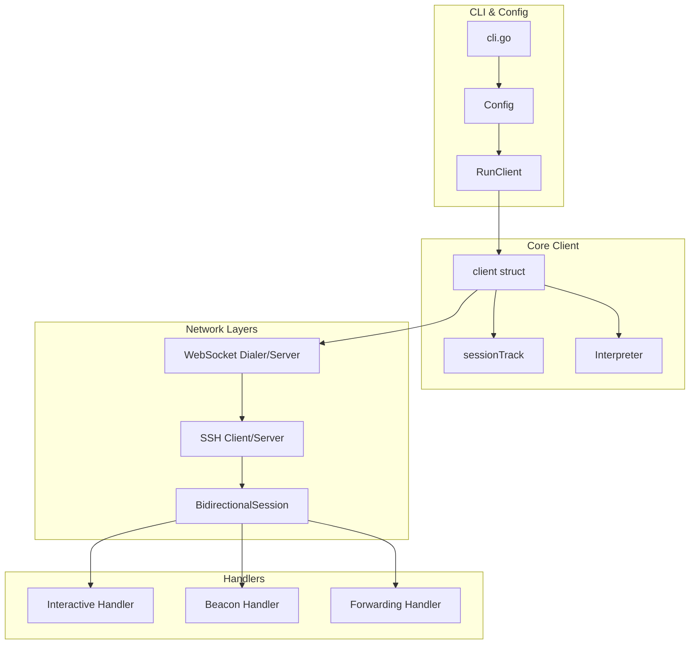
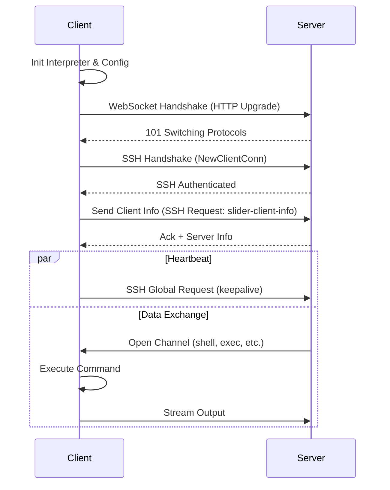
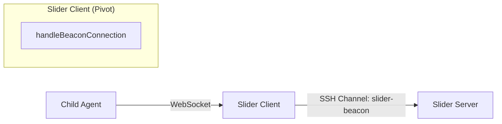
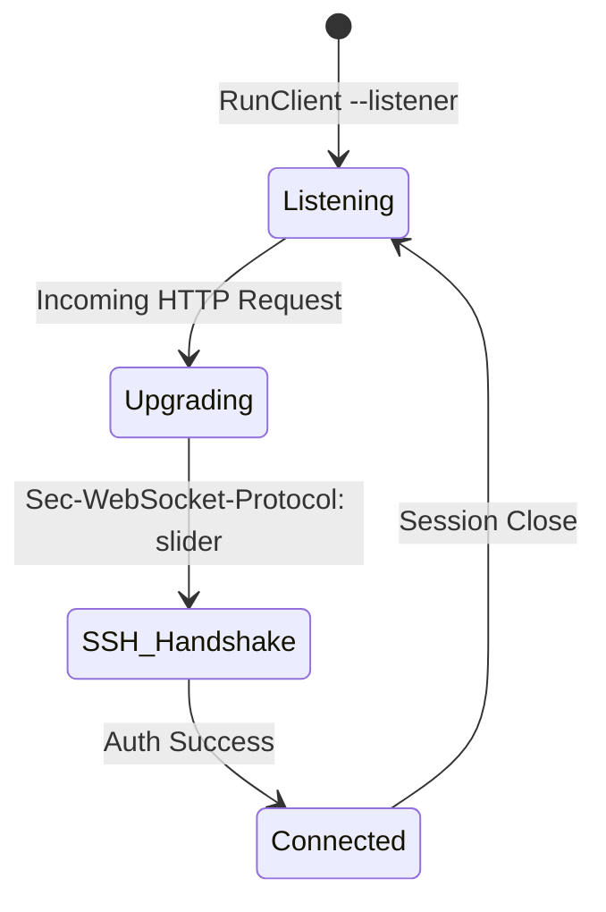
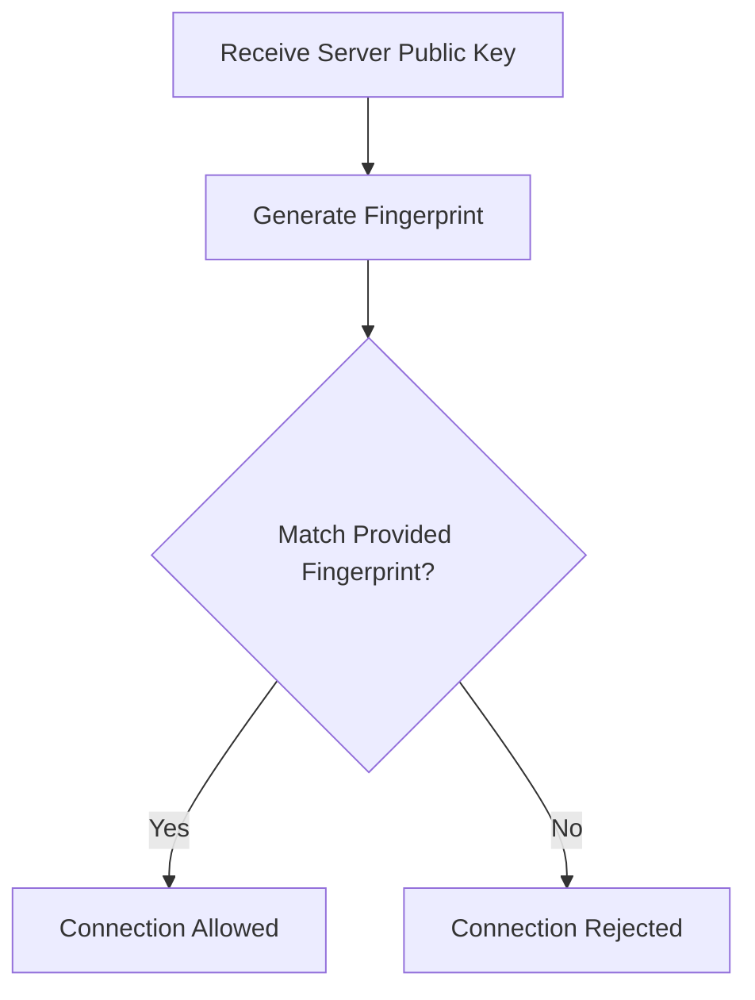

# 客户端实现详解

## 目录
1. [模块概览](#模块概览)
2. [引言](#引言)
3. [架构设计](#架构设计)
4. [核心组件实现](#核心组件实现)
5. [连接生命周期管理](#连接生命周期管理)
6. [Beacon 模式与 Pivot 实现](#beacon-模式与-pivot-实现)
7. [Listener 模式与反向连接](#listener-模式与反向连接)
8. [配置与命令行交互](#配置与命令行交互)
9. [心跳维持与重连机制](#心跳维持与重连机制)
10. [关键算法与逻辑分析](#关键算法与逻辑分析)
11. [文件参考](#文件参考)

## 模块概览

Slider 客户端模块是整个系统的核心组件之一，负责建立与服务端的安全通信隧道，并执行服务端下发的各类指令。在 Scope Assessment 阶段，我们对 `client/` 目录进行了深入探索。

该模块共包含 7 个核心 Go 源文件，总计约 1,500 行代码（不含测试文件）。此外，它还深度依赖 `pkg/session`、`pkg/sconn` 和 `pkg/interpreter` 等公共包。

**子模块与覆盖范围**：
- `client/` (根目录): 包含客户端的主逻辑、配置处理和 CLI 定义。这是本章节的重点分析对象。
- `client/cmd/`: 包含客户端的可执行文件入口 `main.go`。
- `pkg/session/client_mode.go`: 专门处理客户端模式下的会话逻辑，如反向端口转发。

本章节将详细剖析客户端的生命周期、三种运行模式（常规 Agent、Beacon、Listener）以及其内部的指令处理逻辑。

## 引言

Slider 客户端（Client）在 Slider 架构中扮演着多重角色。它不仅是连接的**发起者**，也是**指令的执行载体**，同时还可以作为**流量的中转站**（Pivot）。

客户端的主要职责包括：
1. **安全握手**：通过 WebSocket 承载 SSH 协议，实现对服务端的身份验证（指纹校验）和加密通信。
2. **环境感知**：启动时自动收集宿主机的系统信息（OS、架构、用户、网络等），并上报给服务端。
3. **指令执行**：处理来自服务端的交互式 Shell、文件传输、端口转发等请求。
4. **链路维持**：通过应用层心跳（Keepalive）确保长连接在复杂网络环境下的稳定性。
5. **多模式运行**：支持主动连接（Agent 模式）、被动等待（Listener 模式）以及级联代理（Beacon 模式）。

通过这种灵活的设计，Slider 客户端能够适应各种网络拓扑，包括 NAT 后端的内网穿透和多级内网的横向移动。

## 架构设计

Slider 客户端采用了分层通信架构。最底层是基于 HTTP/HTTPS 的 WebSocket 协议，中间层是标准的 SSH 协议，最上层是 Slider 自定义的指令协议。

下面的架构图展示了客户端内部组件的协作关系：



该架构设计的核心思想是**协议封装**。通过将 SSH 流量封装在 WebSocket 中，客户端可以轻易穿透防火墙和代理服务器，因为 WebSocket 流量在外观上与普通的 HTTPS 流量无异。`client` 结构体作为控制器，协调 `sessionTrack` 进行多会话管理，并利用 `Interpreter` 获取系统上下文。

**架构设计要点**：
- **解耦**：CLI 解析与核心运行逻辑分离，方便嵌入到其他程序中。
- **并发**：每个连接和心跳任务都在独立的 goroutine 中运行，互不干扰。
- **状态追踪**：`sessionTrack` 实时记录活动会话，支持优雅关闭和重连。

**Diagram sources**:
- [client.go:L34-L51](client/client.go#L34-L51)
- [config.go:L53-L258](client/config.go#L53-L258)

## 核心组件实现

客户端的核心由 `client` 结构体定义，它维护了所有必要的运行时状态。

### Client 结构体
`client` 结构体是客户端的“大脑”，包含了日志记录器、服务端 URL、SSH 配置、会话追踪器以及解释器。

```go
type client struct {
	Logger            *slog.Logger
	serverURL         *url.URL
	keepalive         time.Duration
	wsConfig          *websocket.Dialer
	httpHeaders       http.Header
	sshConfig         *ssh.ClientConfig
	shutdown          chan bool
	serverFingerprint []string
	sessionTrack      *sessionTrack
	sessionTrackMutex sync.Mutex
	isListener        bool
	isBeacon          bool
	firstRun          bool
	customProto       string
	interpreter       *interpreter.Interpreter
	*listenerConf
}
```

### 会话追踪 (sessionTrack)
为了支持多连接（特别是在 Listener 模式下），客户端使用 `sessionTrack` 来管理所有的 `BidirectionalSession`。

```go
type sessionTrack struct {
	SessionCount  int64                                   // 已创建会话数
	SessionActive int64                                   // 当前活动会话数
	Sessions      map[int64]*session.BidirectionalSession // 会话映射表
}
```

每个会话都有一个唯一的 ID，通过 `sessionTrackMutex` 保证并发安全。当连接断开时，`dropWebSocketSession` 会负责清理相关资源。

### 解释器 (Interpreter)
`interpreter` 组件负责在连接建立时收集客户端的元数据，包括主机名、内核版本、当前用户等。这些信息会被编码为 JSON 并通过 SSH 的 Global Request 发送给服务端。

**核心组件源码**:
- [client.go](client/client.go)
- [pkg/session/session.go](pkg/session/session.go)

## 连接生命周期管理

客户端的生命周期从 `RunClient` 开始，经历配置加载、握手建立、数据交换到最终关闭。

下面的时序图展示了一个标准 Agent 模式下的连接建立过程：



### 1. WebSocket 握手
在 `startConnection` 函数中，客户端首先将服务端 URL 转换为 WebSocket URL。如果指定了自定义 DNS，客户端会手动解析 IP 并替换 Host 头部，以绕过环境中的 DNS 污染或监控。

### 2. SSH 升级
一旦 WebSocket 连接成功，`newSSHClient` 会接管底层的 `net.Conn`。它使用 `golang.org/x/crypto/ssh` 包创建一个 SSH 客户端连接。特别的是，Slider 并没有将 `newChan` 和 `reqChan` 交给 SSH 客户端默认处理，而是通过 `sess.HandleIncomingChannels` 和 `sess.HandleIncomingRequests` 进行手动路由。这种设计允许客户端更灵活地处理自定义的通道类型（如 `slider-beacon`）。

### 3. 应用层握手
连接建立后的第一件事是调用 `sendClientInfo`。客户端将 `interpreter.Info` 序列化为 JSON，通过 `slider-client-info` 请求发送。服务端收到后会返回其自身的系统信息，完成双向身份确认。

**Section sources**:
- [client.go:L64-L102](client/client.go#L64-L102) (`startConnection`)
- [client.go:L104-L152](client/client.go#L104-L152) (`newSSHClient`)

## Beacon 模式与 Pivot 实现

Beacon 模式是 Slider 的高级特性，允许客户端作为中转节点（Pivot）。在这种模式下，客户端既连接到上游服务端，又监听本地端口等待下游 Agent 的连接。

### 级联代理逻辑
当一个下游 Agent 连接到处于 Beacon 模式的客户端时，客户端会触发 `handleBeaconConnection` 逻辑。



`handleBeaconConnection` 的核心流程如下：
1. **升级连接**：将下游的 HTTP 请求升级为 WebSocket。
2. **寻找上游**：通过 `getUpstreamSession` 找到与服务端的活动连接。
3. **开启隧道**：在上游 SSH 连接中开启一个名为 `slider-beacon` 的自定义通道。
4. **流量透明传输**：使用 `sio.PipeWithCancel` 将下游 WebSocket 的数据流与上游 SSH 通道进行双向绑定。

这种设计使得服务端可以像管理直接连接的 Agent 一样管理多级跳板后的 Agent，实现了极佳的横向移动能力。

**Section sources**:
- [handler_beacon.go:L16-L66](client/handler_beacon.go#L16-L66)
- [handler.go:L89-L108](client/handler.go#L89-L108)

## Listener Mode 与反向连接

在某些受限环境中，服务端无法主动连接到客户端，或者为了隐藏服务端的 IP，客户端可以运行在 Listener 模式下。

### 工作原理
在 Listener 模式下，客户端启动一个 HTTP/HTTPS 服务（由 `buildRouter` 定义），模拟一个普通的 Web 服务器。



### 伪装与安全
- **HTTP 伪装**：客户端可以配置 `TemplatePath` 来返回真实的 HTML 页面，并自定义 `Server` 响应头和状态码，使其看起来像是一个 Nginx 或 Apache 服务器。
- **TLS 支持**：支持加载证书（`--listener-cert`）和双向 TLS 认证（mTLS），确保只有持有特定证书的服务端才能连接。
- **路由分发**：`buildRouter` 会根据 `Sec-WebSocket-Operation` 头部判断连接意图。如果是 `OperationAgent` 且开启了 Beacon 模式，则进入 Beacon 处理逻辑；否则作为正常的 Listener 接收服务端连接。

**Section sources**:
- [handler.go:L12-L61](client/handler.go#L12-L61) (`buildRouter`)
- [config.go:L185-L207](client/config.go#L185-L207) (Listener Start)

## 配置与命令行交互

Slider 客户端的配置通过 `Config` 结构体承载，并由 `cobra` 库提供强大的 CLI 支持。

### 命令行参数分类
1. **基础连接**：`server_address`（位置参数）、`--key`（身份私钥）、`--dns`（自定义解析）。
2. **模式切换**：`--listener`、`--beacon`。
3. **隐蔽性配置**：`--http-template`、`--http-server-header`、`--proto`（自定义 WebSocket 子协议）。
4. **网络维护**：`--keepalive`、`--retry`。

### 互斥校验
`cli.go` 中定义了严格的标志位校验逻辑。例如，`--listener` 模式与 `--retry`、`--key` 是互斥的，因为在被动监听模式下，重连和主动认证逻辑是不适用的。

```go
cmd.MarkFlagsMutuallyExclusive("listener", "beacon")
cmd.MarkFlagsMutuallyExclusive("listener", "retry")
```

这种校验确保了用户不会配置出逻辑矛盾的运行参数。

**Section sources**:
- [cli.go](client/cli.go)
- [config.go:L23-L50](client/config.go#L23-L50)

## 心跳维持与重连机制

为了在不稳定的网络中保持长连接，客户端实现了双层心跳和自动重连。

### 1. SSH Keepalive
在 `newSSHClient` 中，客户端会启动一个独立的 goroutine 执行 `sess.KeepAlive(c.keepalive)`。它通过发送 SSH Global Request 来探测链路可用性。如果服务端在超时时间内未响应，心跳函数会触发会话关闭。

### 2. 自动重连 (Retry)
在 `RunClient` 的主循环中，如果启用了 `--retry` 标志，客户端会在连接断开后进入等待状态，然后重新调用 `startConnection`。

```go
for loop := true; loop; {
    c.startConnection(cfg.CustomDNS)
    select {
    case <-shutdown:
        loop = false
    default:
        if !cfg.Retry || c.firstRun {
            loop = false
            continue
        }
        time.Sleep(c.keepalive)
    }
}
```

> 💡 **注意**：重连间隔由 `keepalive` 参数控制，最小值为 5 秒。这可以防止在网络彻底瘫痪时因频繁重连而导致的资源耗尽。

**Section sources**:
- [client.go:L139](client/client.go#L139)
- [config.go:L232-L247](client/config.go#L232-L247)

## 关键算法与逻辑分析

### 身份验证与指纹校验
客户端通过 `verifyServerKey` 函数实现对服务端的身份校验。这防止了中间人攻击（MITM）。



客户端支持从字符串或文件中加载多个合法的指纹。如果配置了指纹，`sshConfig.HostKeyCallback` 会被设置为 `verifyServerKey`，在 SSH 握手阶段强制执行校验。

### 反向端口转发 (Reverse Port Forwarding)
当服务端请求在客户端侧开启反向转发时，客户端的 `BidirectionalSession` 会调用 `AddReversePortForward`。它维护一个 `revPortFwdMap`，并监听来自服务端的 `forwarded-tcpip` 通道请求。一旦收到请求，客户端会调用 `net.Dial` 连接到本地目标地址，并将流量桥接到 SSH 通道中。

**Section sources**:
- [client.go:L223-L235](client/client.go#L223-L235) (`verifyServerKey`)
- [pkg/session/client_mode.go:L95-L198](pkg/session/client_mode.go#L95-L198) (`HandleForwardedTCPIPChannel`)

## 文件参考

本章节分析涉及以下核心源文件：

- [client/client.go](client/client.go): 客户端核心结构体定义与连接生命周期管理。
- [client/handler.go](client/handler.go): HTTP 路由构建与 WebSocket 升级逻辑。
- [client/handler_beacon.go](client/handler_beacon.go): Beacon 模式下的透明代理实现。
- [client/cli.go](client/cli.go): 基于 Cobra 的命令行接口定义与参数校验。
- [client/config.go](client/config.go): 客户端启动入口 `RunClient` 与配置解析。
- [pkg/session/client_mode.go](pkg/session/client_mode.go): 客户端特有的会话逻辑（反向转发、心跳）。
- [pkg/interpreter/interpreter.go](pkg/interpreter/interpreter.go): 系统信息收集组件。
- [client/cmd/main.go](client/cmd/main.go): 客户端二进制文件入口。
