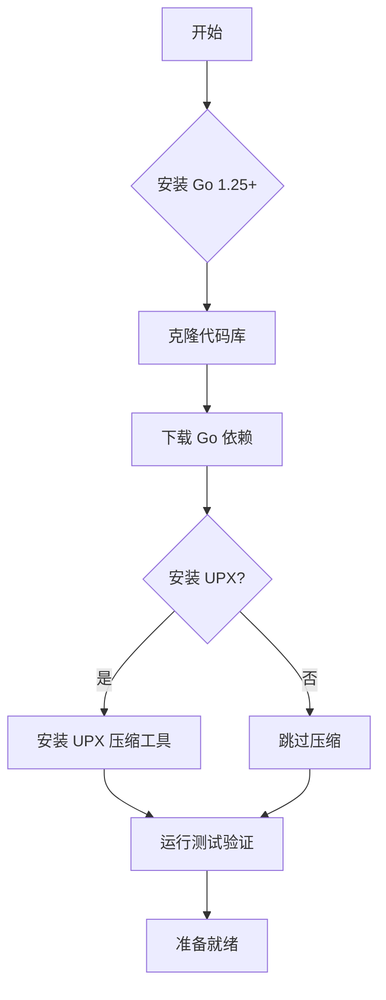
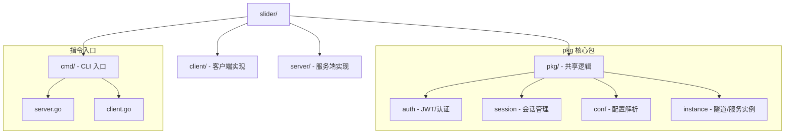
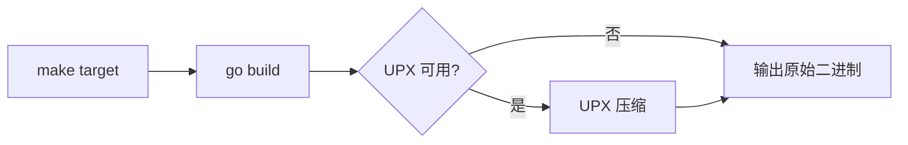
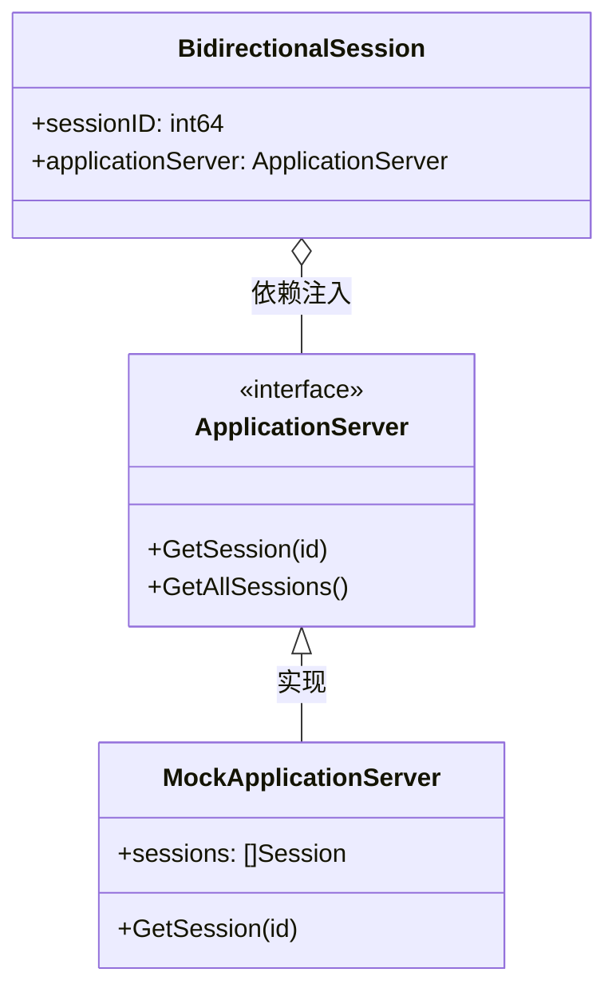
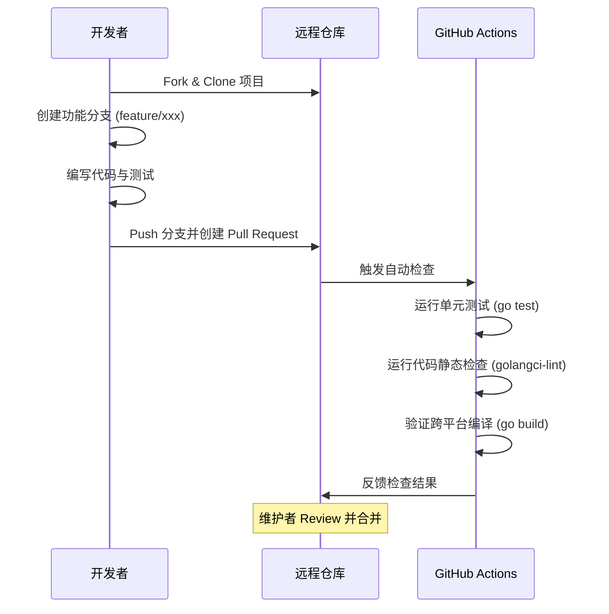
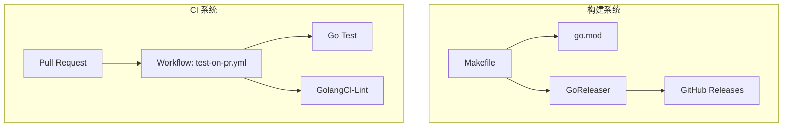

# 开发指南与贡献流程

## 目录
1. [模块概览](#模块概览)
2. [本地开发环境搭建](#本地开发环境搭建)
3. [项目目录结构与职责](#项目目录结构与职责)
4. [构建系统与依赖管理](#构建系统与依赖管理)
5. [代码规范与测试要求](#代码规范与测试要求)
6. [贡献流程与 CI 检查](#贡献流程与-ci-检查)
7. [核心组件](#核心组件)
8. [文件参考](#文件参考)

## 模块概览

Slider 项目是一个基于 Go 语言开发的高性能远程管理工具，采用了典型的客户端-服务端架构，并集成了 Web 控制台和多种隧道技术。在进行开发之前，了解项目的整体规模和模块划分至关重要。

根据对代码库的扫描，Slider 的核心代码分布如下：
- **总文件数**：约 110 个 Go 源文件。
- **子目录/子模块**：
    - `client/`：客户端（Beacon）核心逻辑实现。
    - `server/`：服务端（Gateway）逻辑、控制台指令及 Web UI。
    - `pkg/`：共享功能库，涵盖认证、配置、会话管理、SOCKS 代理等。
    - `cmd/`：基于 Cobra 的命令行入口，定义了客户端和服务端的启动指令。
    - `.github/`：包含 CI/CD 工作流定义。

本指南将重点介绍如何参与这些模块的开发，以及如何确保代码符合项目的质量标准。

## 本地开发环境搭建

为了能够顺利地进行 Slider 的开发，你需要配置一套标准的 Go 开发环境，并安装一些必要的辅助工具。

### 环境准备流程

下面的流程图展示了从零开始搭建开发环境的典型步骤。



上述流程确保了开发者在开始编写代码前，拥有一个完整且经过验证的开发环境。安装 Go 1.25 是硬性要求，因为它利用了最新的语言特性和性能改进。UPX 虽然是可选的，但如果你需要生成生产环境级别的二进制文件，它是必不可少的。

### 1. 安装 Go 语言环境
Slider 要求使用 **Go 1.25** 或更高版本。你可以通过以下命令检查本地版本：
```bash
go version
```

### 2. 安装 UPX (可选但推荐)
Slider 的 `Makefile` 默认使用 [UPX](https://upx.github.io/) 对生成的二进制文件进行压缩。
- **macOS**: `brew install upx`
- **Linux**: `sudo apt install upx-ucl`

## 项目目录结构与职责

Slider 的目录设计遵循了 Go 社区的推荐实践，将核心逻辑与外围接口清晰地分离。



该架构图清晰地展示了项目的模块化设计。`pkg/` 目录作为项目的“心脏”，承载了大部分可重用的业务逻辑，而 `client/` 和 `server/` 则像是两个不同的“外壳”，根据运行模式的不同调用不同的核心功能。

以下是主要目录的职责说明：
- **`cmd/`**: 存放程序的入口点。Slider 使用 `spf13/cobra` 管理命令行。
- **`pkg/`**: 整个项目的核心代码库，包含了认证、会话、配置和具体的隧道服务。
- **`client/` & `server/`**: 包含特定于角色（客户端或服务端）的业务逻辑。

## 构建系统与依赖管理

Slider 使用 `Makefile` 来简化跨平台构建流程，并依赖 `go.mod` 进行版本管理。

### 构建流程分析

`Makefile` 封装了复杂的编译参数，包括 `trimpath` 和 `ldflags` 以减小体积并保护源代码路径信息。



构建流程从执行 `make` 目标开始，首先调用 Go 编译器进行编译，随后会自动检测系统中是否存在 UPX 工具。如果存在，它将对生成的二进制文件进行高倍率压缩，这对于需要远程部署的客户端程序尤为重要。

### 构建指令示例
以下是 `Makefile` 中定义的跨平台构建逻辑片段，展示了如何针对不同架构进行编译：

```makefile
# Linux (amd64) 构建示例
.PHONY: linux-amd64
linux-amd64:
	@echo "Building for Linux (amd64)..."
	GOOS=linux GOARCH=amd64 go build -trimpath -ldflags="-s -w" -o $(BUILD_DIR)/slider-linux-amd64 main.go
ifeq ($(UPX_AVAILABLE),yes)
	@echo "Compressing with UPX..."
	$(UPX_CMD) $(BUILD_DIR)/slider-linux-amd64 || echo "UPX compression failed"
endif
```

### 关键依赖项
Slider 的 `go.mod` 文件列出了项目运行所需的关键库。开发者在添加新功能时，应尽量复用现有依赖，避免引入冗余的包。

```go
require (
	github.com/armon/go-socks5 v0.0.0-20160902184237-e75332964ef5
	github.com/gorilla/websocket v1.5.3
	github.com/pkg/sftp v1.13.10
	github.com/spf13/cobra v1.10.2
	golang.org/x/crypto v0.46.0
)
```

**Section sources**:
- [Makefile](Makefile)
- [go.mod](go.mod)

## 代码规范与测试要求

高质量的代码和完善的测试是 Slider 项目长期维护的保证。

### 测试策略与模式

Slider 采用了基于 Mock 的单元测试策略，确保核心逻辑可以在没有网络连接的情况下进行验证。



如类图所示，`BidirectionalSession` 依赖于 `ApplicationServer` 接口。在测试中，我们通过注入 `MockApplicationServer` 来模拟各种复杂的服务器状态，从而实现对会话生命周期的精确控制。

### 测试代码示例
所有新功能都应包含相应的单元测试。以下是一个典型的测试实现示例：

```go
func TestSessionLifecycle(t *testing.T) {
    // 初始化 Mock 服务器
    mockSrv := NewMockApplicationServer()

    // 使用 Builder 创建测试会话
    session := NewTestSession(101).
        WithRole(GatewayListener).
        WithApplicationServer(mockSrv).
        Build()

    // 执行断言
    if session.GetID() != 101 {
        t.Errorf("期望 ID 为 101, 实际得到 %d", session.GetID())
    }
}
```

**测试运行指令**：`go test -v ./...`

**Diagram sources**:
- [pkg/session/session_test.go:L135-L200](pkg/session/session_test.go#L135-L200)

## 贡献流程与 CI 检查

我们欢迎任何形式的贡献，包括修复 Bug、改进文档或增加新功能。

### 提交 PR 的步骤



上述序列图展示了一个标准的开源贡献周期。CI 检查是自动化的“守门人”，它确保了只有符合质量要求的代码才能进入主分支。

### CI 检查项
每当你提交 PR 时，GitHub Actions 会自动执行以下任务：
1. **Run Tests**: 执行 `go test -v ./...`。
2. **Run Linting**: 使用 `golangci-lint` 检查代码风格。
3. **Verify Build**: 确保代码在 Linux 环境下能够成功编译。

## 核心组件

在开发过程中，你会频繁接触到以下核心组件的配置和定义。

### 构建系统组件交互



构建系统与 CI 系统紧密结合。`Makefile` 负责本地和发布阶段的构建逻辑，而 GitHub Actions 工作流则负责在 PR 阶段进行质量把关。这种双重保障机制确保了代码在从开发到发布的每一个环节都是可靠的。

### 1. 构建脚本 (Makefile)
`Makefile` 是项目的指挥中心，它不仅负责编译，还处理了 UPX 压缩逻辑和 GoReleaser 的发布配置。

### 2. 依赖声明 (go.mod)
定义了项目所需的最小 Go 版本（1.25）以及所有直接和间接依赖。

## 文件参考

以下是参与开发时最常参考的文件列表：

- [Makefile](Makefile): 构建任务定义。
- [go.mod](go.mod): 依赖管理。
- [.github/workflows/test-on-pr.yml](.github/workflows/test-on-pr.yml): CI 配置。
- [main.go](main.go): 程序主入口。
- [pkg/session/session_test.go](pkg/session/session_test.go): 测试模式参考。
- [client/client.go](client/client.go): 客户端核心实现。
- [server/server.go](server/server.go): 服务端核心实现。
- [cmd/root.go](cmd/root.go): 命令行结构定义。
