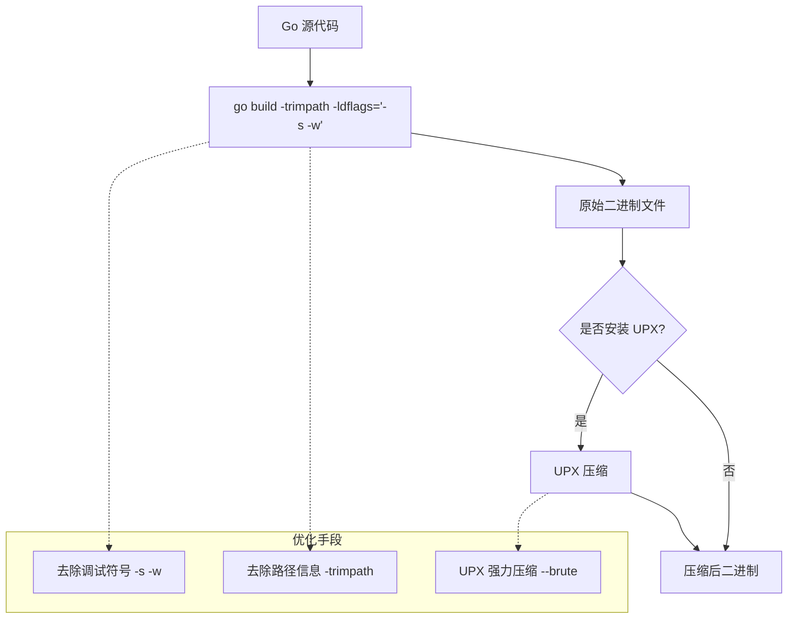
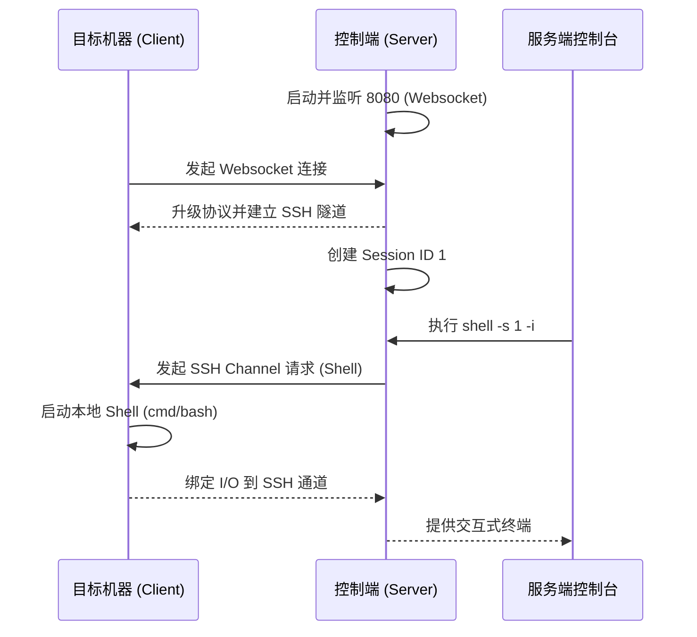
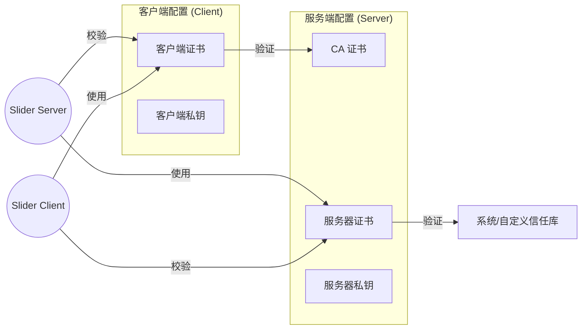
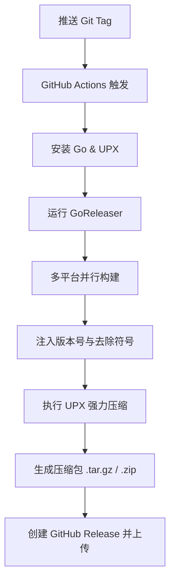

# 快速开始与部署指南

## 目录
1. [模块概览](#模块概览)
2. [简介](#简介)
3. [编译环境准备与 Makefile 使用](#编译环境准备与-makefile-使用)
4. [快速启动：建立第一个反向 Shell](#快速启动建立第一个反向-shell)
5. [生产环境部署建议](#生产环境部署建议)
   - [systemd 服务配置](#systemd-服务配置)
   - [防火墙策略](#防火墙策略)
   - [TLS/mTLS 证书配置](#tlsmtls-证书配置)
6. [自动化发布流程](#自动化发布流程)
7. [核心组件分析](#核心组件分析)
8. [文件参考清单](#文件参考清单)

## 模块概览

Slider 项目是一个功能丰富的远程管理与渗透测试工具，其代码库结构清晰，涵盖了从底层通信协议到上层控制台交互的完整实现。

- **总文件数**: 约 110 个 Go 源文件，以及若干配置文件和模板。
- **核心子模块**:
  - `client/`: 客户端逻辑实现，包括 Beacon 模式和 Listener 模式。
  - `server/`: 服务端逻辑实现，包含 Web 控制台、SFTP 处理和会话管理。
  - `cmd/`: 命令行入口，使用 Cobra 框架构建。
  - `pkg/`: 共享包，包含认证 (`auth`)、配置 (`conf`)、实例管理 (`instance`)、解释器 (`interpreter`)、监听器 (`listener`)、加密与证书 (`scrypt`) 等。
- **覆盖深度**: 本指南将重点介绍 `client` 和 `server` 的部署与运行，深入分析 `pkg/scrypt` 中的证书处理逻辑，并涵盖 `Makefile` 和 `.github/goreleaser.yml` 定义的构建流程。

## 简介

Slider 是一个将服务端和客户端集成在单个二进制文件中的工具，旨在为远程管理和渗透测试提供轻量级、易传输且功能强大的解决方案。它通过 Websocket 建立初始连接，随后将其转换为加密的 SSH 隧道，确保了通信的安全性和双向身份验证。

Slider 的核心优势在于其极小的体积（经过 UPX 压缩后可达 3MB 左右）和丰富的功能集，包括交互式反向 Shell、远程命令执行、文件上传下载、反向 SOCKS5 代理以及 TCP/UDP 端口转发。

## 编译环境准备与 Makefile 使用

在开始部署 Slider 之前，首先需要准备 Go 编译环境并利用项目提供的 `Makefile` 进行构建。Slider 对二进制体积有严格要求，因此构建流程中深度集成了 `upx` 压缩工具。

### 编译环境要求
- **Go 版本**: 推荐使用最新稳定版（如 1.21+）。
- **UPX**: 用于压缩二进制文件。如果未安装，`Makefile` 会发出警告但仍能完成编译。

### 使用 Makefile 构建
项目根目录下的 `Makefile` 定义了针对不同平台的构建目标。

```bash
# 构建所有平台的二进制文件
make all

# 仅构建 Linux amd64 版本
make linux-amd64

# 使用最高强度的 UPX 压缩（耗时较长）
make linux-amd64 UPX_BRUTE=yes
```

下列图表展示了 Slider 的构建与压缩流程：



构建流程首先通过 `go build` 命令并配合 `-ldflags="-s -w"` 参数来移除 DWARF 调试信息和符号表，这是减小体积的第一步。接着，`Makefile` 会检查系统中是否存在 `upx`。如果存在，它将根据 `UPX_BRUTE` 变量决定压缩强度。最终生成的二进制文件存放在 `build/` 目录下，文件名格式为 `slider-<os>-<arch>`。

**Section sources**:
- [Makefile](Makefile)
- [README.md](README.md)

## 快速启动：建立第一个反向 Shell

建立第一个反向 Shell 连接是熟悉 Slider 工作流的最佳方式。Slider 的基本运行模式是服务端监听，客户端主动连接。

### 第一步：启动服务端
在控制端服务器上运行：
```bash
./slider server --port 8080 --verbose debug
```
启动后，按 `CTRL+C` 进入交互式控制台。

### 第二步：启动客户端
在目标机器上运行：
```bash
./slider client <SERVER_IP>:8080 --retry
```
`--retry` 参数确保客户端在连接断开时会自动尝试重新连接。

### 第三步：建立交互式 Shell
回到服务端控制台，执行以下命令：
```text
Slider# sessions
# 查看当前会话列表，假设 Session ID 为 1

Slider# shell -s 1 -i
# 进入会话 1 的交互式 Shell
```

下图描述了反向 Shell 建立的完整生命周期：



在这个流程中，客户端首先通过 HTTP(S) Websocket 连接到服务端，这有助于穿透某些只允许 Web 流量的防火墙。连接建立后，双方会协商升级为 SSH 协议，所有的后续操作（如 Shell 交互、文件传输）都在这个加密的 SSH 隧道内完成。服务端通过 `sessions` 管理所有连接，用户可以通过控制台指令动态地与任何一个客户端建立交互。

**Section sources**:
- [client/client.go](client/client.go)
- [server/server.go](server/server.go)
- [server/console.go](server/console.go)

## 生产环境部署建议

在生产环境中部署 Slider 时，安全性和稳定性是首要考虑因素。

### systemd 服务配置
为了确保服务端在重启或崩溃后能自动恢复，建议使用 `systemd` 进行管理。

创建一个服务文件 `/etc/systemd/system/slider-server.service`:
```ini
[Unit]
Description=Slider Server Service
After=network.target

[Service]
Type=simple
User=slider
WorkingDirectory=/opt/slider
Environment=S_HOME=/opt/slider/data
Environment=S_CERT_JAR=true
ExecStart=/opt/slider/slider server --port 443 --auth --ca-store --http-console --http-health
Restart=always
RestartSec=5

[Install]
WantedBy=multi-user.target
```

### 防火墙策略
Slider 服务端通常监听在 `8080` 或 `443` 端口。建议仅开放必要的端口，并使用 `iptables` 或 `ufw` 限制访问。
```bash
# 仅允许特定 IP 访问控制台（如果启用了 http-console）
ufw allow from <ADMIN_IP> to any port 443
```

### TLS/mTLS 证书配置
Slider 支持使用 TLS 加密 Websocket 连接，并支持双向认证 (mTLS)。

1.  **启用 TLS**: 使用 `--listener-cert` 和 `--listener-key` 提供证书。
2.  **强制身份验证**: 使用 `--auth` 要求客户端提供有效的 Ed25519 密钥。
3.  **mTLS**: 使用 `--listener-ca` 验证客户端证书。



在 mTLS 配置下，服务端会检查客户端提供的证书是否由 `--listener-ca` 指定的 CA 签名。这提供了极强的安全性，即使攻击者知道了服务器地址和端口，没有合法的证书也无法建立连接。Slider 内置的 `certs` 命令可以方便地导出 CA 证书和私钥，用于生成新的客户端证书。

**Section sources**:
- [pkg/conf/conf.go](pkg/conf/conf.go)
- [pkg/scrypt/certificate.go](pkg/scrypt/certificate.go)
- [server/certs.go](server/certs.go)

## 自动化发布流程

Slider 使用 `GoReleaser` 配合 GitHub Actions 实现自动化构建与发布。这确保了每个版本的二进制文件都是在干净的环境中构建的，并经过了统一的优化处理。

### GoReleaser 配置分析
`.github/goreleaser.yml` 定义了多平台的编译矩阵和 UPX 压缩策略。

```yaml
builds:
  - id: combined
    binary: slider_{{ .Os }}_{{ .Arch }}
    main: .
    ldflags:
      - -s -w
      - -X slider/pkg/conf.Version={{.Version}}
upx:
  - enabled: true
    goos: ['linux', 'windows']
    goarch: ['amd64', '386']
    brute: true
```

自动化流程图如下：



当开发者向仓库推送一个新的版本标签（如 `v1.0.0`）时，GitHub Actions 会启动。它首先配置 Go 环境并安装 `upx`。随后调用 `goreleaser`，按照配置文件中的矩阵同时为 Linux、Windows 和 macOS 的多种架构（amd64, arm64, 386）生成二进制文件。`ldflags` 动态注入了版本号、提交哈希和构建日期。最后，所有构建好的文件会被打包并自动上传到 GitHub Release 页面。

**Section sources**:
- [.github/goreleaser.yml](.github/goreleaser.yml)
- [Makefile](Makefile)

## 核心组件分析

理解 Slider 的核心组件有助于更深入地进行定制和部署。

### 1. 证书管理 (`pkg/scrypt/certificate.go`)
该组件负责 CA 的创建、证书的签发以及 TLS 配置的生成。它使用了 Ed25519 算法，这是一种现代且高效的加密算法。

```go
// CreateCertificate 为服务器或客户端创建签名的证书
func (ca *CertificateAuthority) CreateCertificate(isServer bool) (*GeneratedCertificate, error) {
    // 生成 Ed25519 密钥对
    publicKey, privateKey, _ := ed25519.GenerateKey(rand.Reader)

    // 配置证书模板，设置过期时间
    certTemplate := &x509.Certificate{
        // ... 省略部分配置
        NotAfter: time.Now().AddDate(10, 0, 0), // 服务端证书默认 10 年
    }

    // 使用 CA 签名
    certDER, _ := x509.CreateCertificate(rand.Reader, certTemplate, ca.Template, publicKey, ca.CAPrivateKey)
    // ...
}
```

### 2. 服务端引擎 (`server/server.go`)
服务端是 Slider 的大脑，负责处理 Websocket 升级、会话追踪以及控制台交互。它通过 `certJar` 管理所有允许连接的客户端公钥。

### 3. 配置解析 (`pkg/conf/conf.go`)
负责处理环境变量（如 `S_HOME`）和默认路径。它确保了 Slider 在不同操作系统上的行为一致性，例如在 Windows 上使用 `%USERPROFILE%\slider` 而在 Linux 上使用 `~/.slider`。

**Section sources**:
- [pkg/scrypt/certificate.go](pkg/scrypt/certificate.go)
- [server/server.go](server/server.go)
- [pkg/conf/conf.go](pkg/conf/conf.go)

## 文件参考清单

以下是本指南涉及的核心源文件，建议在深入研究时参考：

- `Makefile`: 构建系统的核心定义。
- `README.md`: 官方使用文档和功能列表。
- `.github/goreleaser.yml`: 自动化构建与压缩配置。
- `client/client.go`: 客户端启动与重连逻辑。
- `server/server.go`: 服务端核心引擎。
- `server/certs.go`: 服务端证书 Jar 管理逻辑。
- `pkg/scrypt/certificate.go`: 底层加密与 TLS 实现。
- `pkg/conf/conf.go`: 全局配置与环境路径处理。
- `cmd/root.go`: 命令行框架根定义。
- `pkg/instance/tls.go`: TLS 实例配置处理。

**Section sources**:
- [client/client.go](client/client.go)
- [server/server.go](server/server.go)
- [pkg/scrypt/certificate.go](pkg/scrypt/certificate.go)
- [pkg/conf/conf.go](pkg/conf/conf.go)
