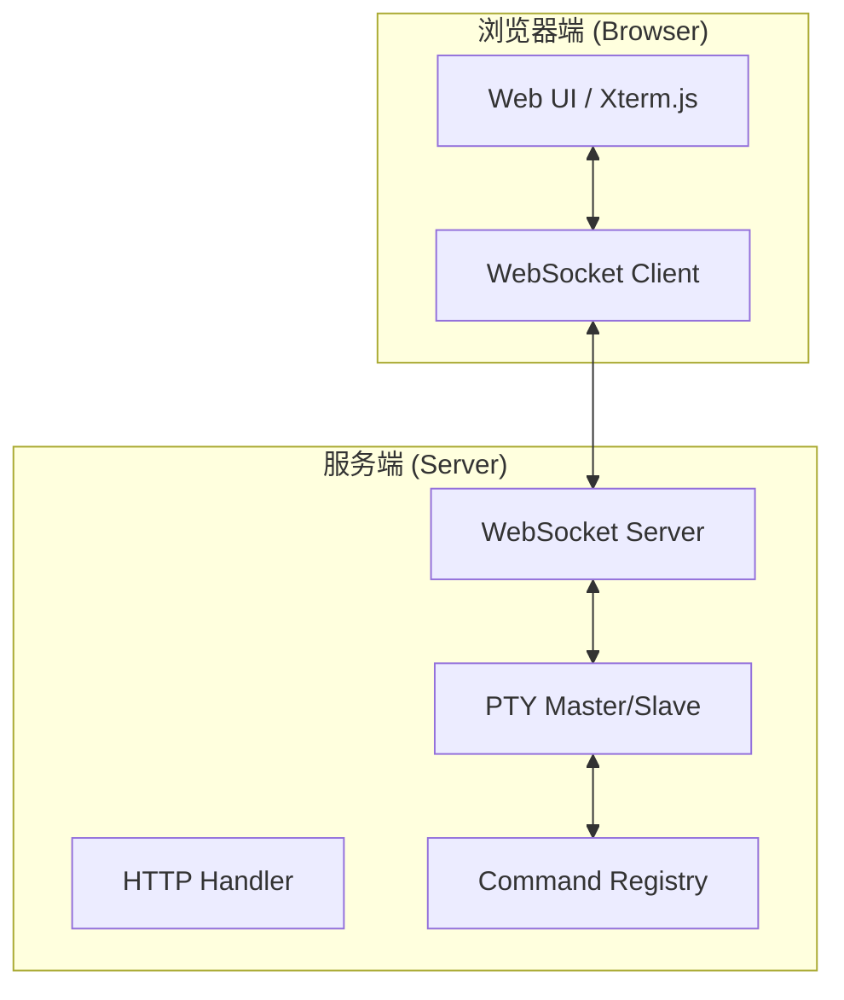
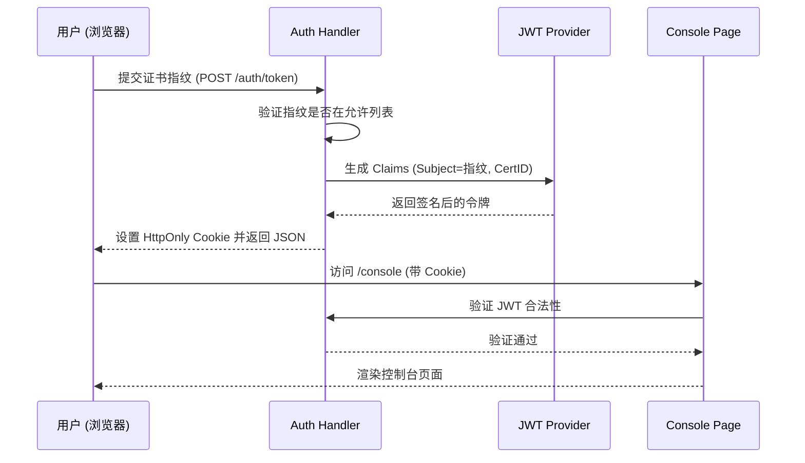
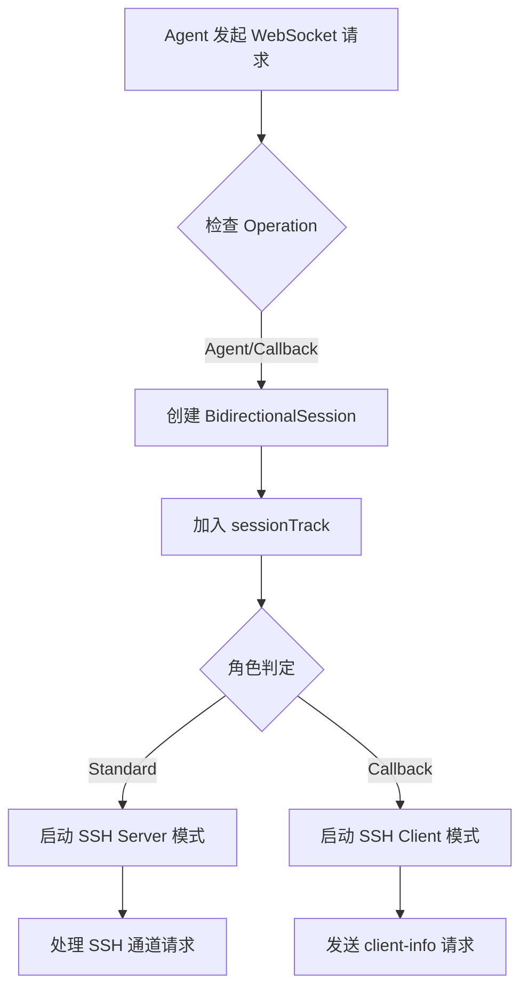
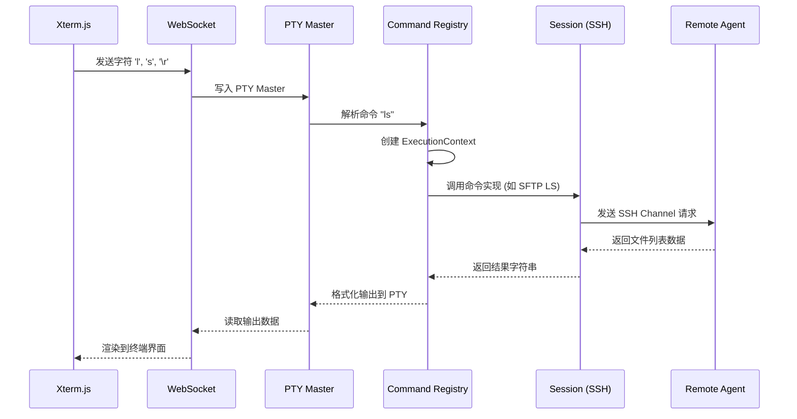

# 服务端实现与 Web 控制台

## 目录
1. [模块概览](#模块概览)
2. [核心架构与服务端生命周期](#核心架构与服务端生命周期)
   - [服务端核心结构](#服务端核心结构)
   - [会话管理与追踪](#会话管理与追踪)
   - [SSH 服务端与客户端的双重角色](#ssh-服务端与客户端的双重角色)
3. [Web 控制台与 UI 实现](#web-控制台与-ui-实现)
   - [Web 控制台架构](#web-控制台架构)
   - [模板渲染与静态资源管理](#模板渲染与静态资源管理)
   - [WebSocket 通信协议与 PTY 桥接](#websocket-通信协议与-pty-桥接)
4. [命令处理器体系](#命令处理器体系)
   - [命令注册与分发机制](#命令注册与分发机制)
   - [执行上下文](#执行上下文)
   - [核心命令实现分析](#核心命令实现分析)
5. [认证与权限控制](#认证与权限控制)
   - [基于 JWT 的身份验证流程](#基于-jwt-身份验证流程)
   - [证书指纹验证与令牌颁发](#证书指纹验证与令牌颁发)
   - [认证中间件实现](#认证中间件实现)
6. [交互流程与数据流](#交互流程与数据流)
   - [客户端连接与升级流程](#客户端连接与升级流程)
   - [Web 控制台命令执行流程](#web-控制台命令执行流程)
7. [核心组件](#核心组件)
8. [文件参考](#文件参考)

## 模块概览

Slider 的服务端模块（位于 `server/` 目录）是整个系统的核心协调者。它不仅负责管理所有接入的客户端连接（Beacons 和 Operators），还提供了一个功能丰富的 Web 管理控制台，允许用户通过浏览器直接控制远程系统。

在本次代码库探索中，我们发现了以下关键信息：
- **文件总数**：服务端目录包含 50 余个 Go 源文件，核心调度、命令实现、Web Console、会话解析和代理状态已经拆分到更细粒度的文件中。
- **子模块分布**：
  - `cmd/`：包含服务端的启动入口和 Makefile。
  - `web/` 与 `server/web/dist`：前端源码由 Vite/TypeScript 构建，构建产物通过 `go:embed` 嵌入服务端。
  - **核心逻辑**：`server.go`, `bootstrap.go`, `runtime.go`, `gateway.go`, `handler.go` 等文件定义服务端骨架、启动和 HTTP/SSH 生命周期。
  - **命令系统**：`commands_*.go` 保留命令入口，复杂逻辑进一步拆到 `sessions_*`, `shell_*`, `socks_*`, `console_*` 等专责文件。
  - **认证系统**：`handler_auth.go` 和 `middleware_auth.go` 负责系统的安全性。

本章节将深入探讨这些组件的内部实现，解释 Slider 如何在复杂的网络环境下维持稳定的连接并提供流畅的交互体验。

---

## 核心架构与服务端生命周期

Slider 服务端的设计目标是高并发和灵活性。它采用了一种混合架构，既能作为标准的 SSH 服务端接受连接，也能在网关模式下作为 SSH 客户端连接到其他服务端。

### 服务端核心结构

服务端的灵魂在于 `server` 结构体。它集成了日志记录、SSH 配置、会话追踪、命令注册表以及各种功能开关。

```go
type server struct {
	*slog.Logger
	sshConf              *ssh.ServerConfig
	sessionTrack         *sessionTrack
	sessionTrackMutex    sync.Mutex
	console              Console
	serverInterpreter    *interpreter.Interpreter
	certTrack            *scrypt.CertTrack
	// ... 其他字段
	gateway              bool
	commandRegistry      *CommandRegistry
	remoteSessions       map[string]*RemoteSessionState
}
```

`server` 实例由 `newConfiguredServer` 组装，启动流程再由 `RunServer` 调用 `startHTTPListener`、`startStartupCallback` 和 `runUntilShutdown` 串联。特别值得注意的是 `commandRegistry`，它在服务端启动时完成所有内置命令的注册，确保本地控制台和 Web 控制台使用同一套命令实现。

### 会话管理与追踪

Slider 使用 `sessionTrack` 结构来维护当前所有活跃的连接。每个连接都被抽象为一个 `BidirectionalSession`，它封装了底层的网络连接（可能是原始 TCP 或 WebSocket）以及在其之上的 SSH 隧道。

服务端通过 `sessionTrackMutex` 确保在并发环境下对会话列表的修改是线程安全的。每当有新客户端通过 WebSocket 升级接入时，服务端会为其分配一个唯一的会话 ID，并将其加入追踪列表。

### SSH 服务端与客户端的双重角色

Slider 服务端最独特的特性之一是其角色的动态切换。

1.  **标准模式 (SSH Server)**：在大多数情况下，服务端通过 `NewSSHServer` 方法接受来自 Agent 或 Operator 的连接。它验证客户端证书，并升级传输层为 SSH。
2.  **网关模式 (SSH Client)**：当服务端配置为网关或执行回调连接时，它会调用 `NewSSHClient`。此时，服务端主动向目标发起连接，并作为 SSH 客户端进行身份验证。这种模式允许 Slider 构建多级的跳板网络。

**Section sources**:
- [server/server.go](server/server.go)
- [server/gateway.go](server/gateway.go)

---

## Web 控制台与 UI 实现

Web 控制台是 Slider 提供给用户的可视化管理界面。它通过现代 Web 技术实现了类似于本地终端的交互体验。

### Web 控制台架构

Web 控制台的实现结合了 HTTP 服务、WebSocket 通信和伪终端（PTY）。

下图展示了 Web 控制台的整体架构：



在服务端，`handleWebSocketConsole` 函数负责处理来自浏览器的 WebSocket 升级请求。一旦连接建立，服务端会创建一个 PTY 对。

### 模板渲染与静态资源管理

Slider 使用 Go 内置的 `html/template` 包渲染页面，但页面源码已经迁移到 `web/`，由 Vite/TypeScript 构建后输出到 `server/web/dist`。为了简化部署，`handler_pages.go` 使用 `//go:embed web/dist` 将构建产物嵌入到二进制文件中。

- `web/auth.html` 与 `web/src/auth.ts`：负责用户登录、challenge 获取和 Ed25519 私钥签名。
- `web/console.html` 与 `web/src/console.ts`：承载 `@xterm/xterm` 终端容器、WebSocket 连接和 resize 控制消息。
- `server/web/dist`：提交到仓库的构建产物，Go 端直接嵌入并服务 `/console` 下的静态 assets。

`handler_pages.go` 中的 `handleConsolePage` 函数会注入必要的配置信息（如 WebSocket 路径、认证状态等）到模板中，确保前端能正确连接到后端。

### WebSocket 通信协议与 PTY 桥接

WebSocket 在这里充当了透明的传输管道。服务端开启了两个并发的 goroutine：
1.  **用户输入流**：监听 WebSocket 的消息，将其写入 PTY 的 Master 端。
2.  **终端输出流**：读取 PTY Master 端的输出，将其封装为 WebSocket 二进制消息发回浏览器。

这种桥接方式使得前端的 Xterm.js 能够像操作本地 Shell 一样操作 Slider 的命令环境。此外，系统还支持特殊的 JSON 消息来处理终端窗口大小的调整（Resize），确保远程输出在不同尺寸的屏幕上都能正确对齐。

**Section sources**:
- [server/handler_console_ws.go](server/handler_console_ws.go)
- [server/handler_pages.go](server/handler_pages.go)
- [server/console.go](server/console.go)
- [web/src/console.ts](web/src/console.ts)

---

## 命令处理器体系

Slider 的强大功能通过其可扩展的命令体系实现。无论是查看会话、开启代理还是进入远程 Shell，都是通过统一的命令接口完成的。

### 命令注册与分发机制

`CommandRegistry` 是命令系统的核心。它在服务端初始化时（`initRegistry`）加载所有可用的命令对象。

```go
type Command interface {
	Name() string
	Description() string
	Usage() string
	Run(ctx *ExecutionContext, args []string) error
	IsRemoteCompletion() bool
}
```

当用户在控制台输入指令时，系统会将其拆分为命令名和参数，然后在注册表中查找匹配的实现并调用其 `Run` 方法。

### 执行上下文

为了让命令实现能够访问服务端资源，Slider 引入了 `ExecutionContext`。它封装了：
- 当前服务端实例 (`server`)
- 当前操作的会话 (`session`)
- 用户界面接口 (`ui`)，用于输出信息。

这种设计实现了命令逻辑与具体 UI 实现（如 Web 控制台或本地命令行）的解耦。

### 核心命令实现分析

- **`sessions` 命令**：这是最复杂的命令之一。`commands_sessions.go` 负责参数解析，`sessions_list.go` 输出统一会话表，`sessions_interact.go` 进入本地或远程 SFTP 交互，`session_resolver.go` 负责稳定的 `UnifiedID` 分配和跨 Gateway 远程会话归一化。
- **`shell` 命令**：负责在指定的会话上开启交互式 Shell。`commands_shell.go` 负责命令入口，`shell_local.go`、`shell_remote.go` 和 `shell_interactive.go` 分别处理本地会话、远程会话和 mTLS 交互式桥接。
- **`sftp` 命令**：Slider 内置了 SFTP 客户端支持。`sessions -i <ID>` 会进入一个专门的 SFTP 交互环境，允许用户像在本地文件系统中一样浏览远程文件。

**Section sources**:
- [server/command.go](server/command.go)
- [server/commands_sessions.go](server/commands_sessions.go)
- [server/session_resolver.go](server/session_resolver.go)
- [server/sessions_list.go](server/sessions_list.go)
- [server/sessions_interact.go](server/sessions_interact.go)
- [server/commands_basic.go](server/commands_basic.go)

---

## 认证与权限控制

安全性是 Slider 的重中之重。服务端通过多层次的验证机制确保只有授权用户才能访问控制台。

### 基于 JWT 的身份验证流程

Slider 采用 JWT (JSON Web Token) 作为主要的 Web 身份凭证。



### 证书指纹验证与令牌颁发

在 `handleAuthToken` 中，服务端会检查用户提供的指纹。如果指纹与服务端证书匹配，或者存在于已导入的客户端证书库（`certTrack`）中，则认为身份合法。

令牌的签名密钥是动态生成的，通常派生自服务端的 CA 私钥，这保证了即使服务端重启，只要密钥材料不变，之前的令牌依然有效（在有效期内）。

### 认证中间件实现

`middleware_auth.go` 中定义的 `authMiddleware` 拦截了所有敏感的 HTTP 请求。它从 Cookie 或 Authorization 头部提取令牌，调用 `validateToken` 进行校验。如果验证失败，它会自动重定向用户到登录页面，实现了无缝的安全防护。

**Section sources**:
- [server/handler_auth.go](server/handler_auth.go)
- [server/middleware_auth.go](server/middleware_auth.go)

---

## 交互流程与数据流

为了更好地理解服务端的工作原理，我们需要观察数据在不同阶段的流动方式。

### 客户端连接与升级流程

当一个 Agent 尝试连接到服务端时，它首先发起一个带有特殊头部（如 `Sec-WebSocket-Operation`）的 WebSocket 请求。



这个流程确保了每个连接在建立之初就明确了其在拓扑结构中的位置和权限。

### Web 控制台命令执行流程

当用户在 Web 界面输入命令并回车时，数据经历了一次从前端到后端再到远程 Agent 的完整循环。



这个过程虽然涉及多个层级，但由于采用了高效的 PTY 桥接和异步处理，用户感知的延迟非常低。

**Section sources**:
- [server/handler.go](server/handler.go)
- [server/handler_console_ws.go](server/handler_console_ws.go)
- [server/server.go](server/server.go)
- [server/command.go](server/command.go)

---

## 核心组件

本模块的核心组件定义了服务端的行为逻辑：

| 组件名称 | 类型 | 职责 |
| :--- | :--- | :--- |
| `server` | `struct` | 服务端主对象，管理配置、会话和生命周期。 |
| `CommandRegistry` | `struct` | 命令注册表，负责命令的存储、查找和自动补全建议。 |
| `ExecutionContext` | `struct` | 命令执行时的环境上下文，连接了服务端、会话和 UI。 |
| `BidirectionalSession` | `struct` | 会话对象，统一承载 WebSocket/原始连接、SSH client/server、角色、对端信息和 endpoint 实例。 |
| `UserInterface` | `interface` | UI 抽象接口，定义了向用户输出信息的标准方法。 |
| `Console` | `struct` | `UserInterface` 的具体实现，封装了终端读写和历史记录。 |

---

## 文件参考

以下是本章节涉及的关键源文件：

- `server/server.go`: 服务端核心结构与 SSH 生命周期管理。
- `server/bootstrap.go`: 服务端配置、解释器、证书和命令注册表初始化。
- `server/runtime.go`: HTTP/HTTPS 监听器启动、Callback 启动和控制台阻塞循环。
- `server/gateway.go`: 网关模式下的 SSH 客户端实现。
- `server/handler.go`: HTTP 路由分发与 Agent/Gateway WebSocket 升级处理。
- `server/handler_console_ws.go`: Web 控制台 WebSocket 与 PTY 桥接。
- `server/console.go`: Web 控制台后端逻辑与 PTY 桥接。
- `server/ui.go`: 用户界面接口定义。
- `server/command.go`: 命令系统框架与注册机制。
- `server/handler_auth.go`: 基于 JWT 的身份验证处理器。
- `server/handler_pages.go`: HTML 模板渲染与页面逻辑。
- `server/middleware_auth.go`: 认证中间件，保护敏感路由。
- `server/commands_sessions.go`: 会话管理命令实现。
- `server/session_resolver.go`: 本地/远程会话归一化和稳定 UnifiedID 分配。
- `server/commands_basic.go`: 基础控制命令（help, exit, bg）。
- `web/`: Vite/TypeScript 前端源码。
- `server/web/dist`: 嵌入到服务端二进制中的前端构建产物。
