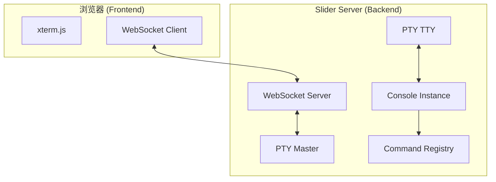
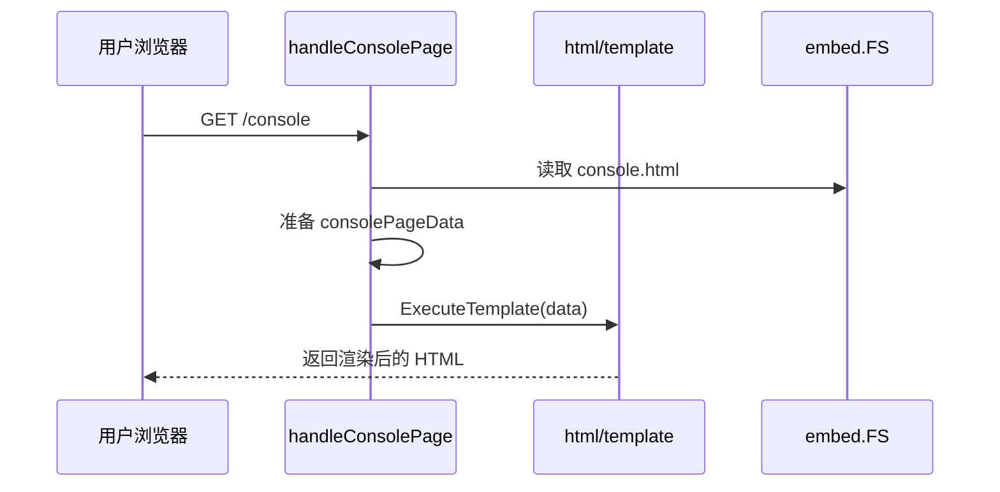
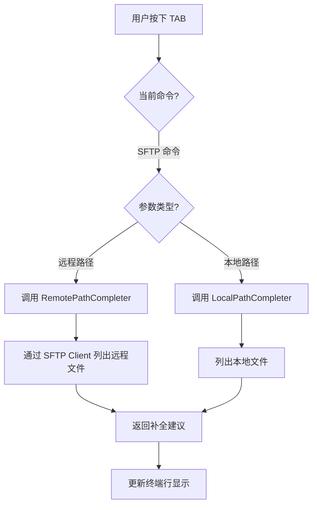

# Web 控制台与 UI 实现

## 目录
1. [模块概览](#模块概览)
2. [Web 控制台架构设计](#web-控制台架构设计)
   - [WebSocket 与 PTY 桥接机制](#websocket-与-pty-桥接机制)
   - [实时交互协议](#实时交互协议)
3. [UI 渲染与静态资源管理](#ui-渲染与静态资源管理)
   - [模板渲染流程](#模板渲染流程)
   - [前端终端实现](#前端终端实现)
4. [核心组件实现](#核心组件实现)
   - [Console 结构体](#console-结构体)
   - [UserInterface 接口](#userinterface-接口)
5. [SFTP 界面集成与交互](#sftp-界面集成与交互)
   - [交互式 SFTP 会话](#交互式-sftp-会话)
   - [路径自动补全机制](#路径自动补全机制)
6. [并发访问与多用户控制](#并发访问与多用户控制)
7. [输出流处理与格式化](#输出流处理与格式化)
8. [文件引用](#文件引用)

## 模块概览

Slider 的 Web 控制台模块负责为用户提供一个基于浏览器的交互式管理界面。该模块集成了实时终端模拟、身份认证、文件管理（SFTP）以及系统状态监控等功能，使得管理员可以通过 Web 浏览器远程控制 Slider 服务端及其连接的 Agent。

根据对当前代码的扫描，该模块涉及服务端 Go 代码、前端 TypeScript 源码以及构建后的嵌入式静态资源，核心逻辑分布在以下子模块中：

- **核心逻辑 (`server/console.go`, `server/console_out.go`)**: 处理控制台的生命周期、命令解析与输出格式化。
- **Web 路由与 UI (`server/handler_pages.go`)**: 负责从 `server/web/dist` 加载嵌入式页面和静态资源。
- **实时通信 (`server/handler_console_ws.go`)**: 实现浏览器控制台 WebSocket 升级逻辑以及与 PTY 的双向桥接。
- **文件管理 (`server/console_sftp.go`)**: 将 SFTP 功能映射到 Web 控制台的交互式会话中。
- **前端源码 (`web/`)**: 使用 Vite + TypeScript 构建 `auth.html`、`console.html`、`web/src/console.ts` 和 `web/src/auth.ts`，并输出到 `server/web/dist` 供 Go 端嵌入。

本章节将深入探讨这些组件如何协作，构建出一个高性能、低延迟的 Web 管理界面。

## Web 控制台架构设计

Slider 的 Web 控制台采用了典型的“前端终端模拟器 + 后端 PTY 桥接”架构。这种设计能够完美复现原生终端的交互体验，包括 ANSI 颜色支持、光标移动、实时回显以及窗口缩放。

### WebSocket 与 PTY 桥接机制

Web 控制台的核心在于如何将浏览器的 WebSocket 连接与服务端的伪终端（PTY）进行对接。

1.  **连接升级**: 浏览器加载 `/console` 后，由前端连接 `/console/ws`。服务端在 `handleWebSocketConsole` 中验证 JWT Token 后，完成 WebSocket 升级。
2.  **PTY 创建**: 后端使用 `github.com/creack/pty` 创建一对 PTY 设备（Master/TTY）。
3.  **双向桥接**:
    - **输入流**: 启动一个协程监听 WebSocket 的 `ReadMessage`，将接收到的用户按键数据直接写入 PTY Master。
    - **输出流**: 启动另一个协程从 PTY Master 读取数据，并通过 WebSocket 发送给前端。
4.  **控制台绑定**: `Console` 实例被绑定到 PTY 的 TTY 端，所有的命令执行结果都通过 TTY 输出，最终流向前端。

下展示了 Web 控制台的整体通信架构：



该架构确保了前端操作与后端执行的解耦。`xterm.js` 仅负责渲染 ANSI 流，而复杂的命令逻辑和状态维护由后端的 `Console` 实例处理。

**Diagram sources**:
- [server/handler_console_ws.go](server/handler_console_ws.go)
- [server/handler_pages.go](server/handler_pages.go)
- [server/console.go](server/console.go)

### 实时交互协议

为了支持终端的高级功能（如窗口缩放），Slider 定义了一套简单的 JSON 协议，混杂在原始的二进制/文本流中。

- **控制消息**: 当浏览器窗口大小改变时，前端会发送一个 JSON 消息：
  ```json
  {
    "type": "resize",
    "cols": 120,
    "rows": 40
  }
  ```
- **数据流**: 除控制消息外，所有的输入（按键）和输出（回显）均以原始字节流形式传输，确保了对 ANSI 转义序列的完整支持。

后端在接收到 `resize` 消息后，会调用 `pty.Setsize` 更新 PTY 的窗口大小，并通知 `Console` 实例更新其内部的 `term.Terminal` 尺寸。

**Section sources**:
- [server/handler_console_ws.go](server/handler_console_ws.go)
- [server/console.go](server/console.go)

## UI 渲染与静态资源管理

Slider 的前端界面由 Vite 和 TypeScript 构建。源码位于 `web/`，构建结果输出到 `server/web/dist`，再由 `server/handler_pages.go` 通过 `go:embed` 嵌入到二进制文件中，实现“单文件部署”的便利性。

### 模板渲染流程

UI 的渲染由 `handler_pages.go` 中的处理器负责。

1.  **前端构建**: `npm run build:web` 调用 Vite，将 `web/auth.html`、`web/console.html` 和 `web/src/*.ts` 打包到 `server/web/dist`。
2.  **资源嵌入**: `server/handler_pages.go` 使用 `//go:embed web/dist` 将构建产物打包进 Go 二进制。
3.  **数据绑定**: `consolePageData` 结构体包含前端所需的配置信息，如 WebSocket 路径、认证开关、登录和登出路径。
4.  **执行渲染**: `handleConsolePage` 与 `handleAuthPage` 将动态数据注入 `console.html` 和 `auth.html`；`handleConsoleAsset` 负责带长期缓存头的静态资源响应。



通过这种方式，前端可以动态获取当前服务端的配置（例如是否启用了认证），从而展示不同的 UI 元素（如登出按钮）。

**Diagram sources**:
- [server/handler_pages.go:L12-L108](server/handler_pages.go#L12-L108)

### 前端终端实现

`web/console.html` 和 `web/src/console.ts` 是 Web 控制台的核心前端实现。代码使用 `@xterm/xterm` 与 `@xterm/addon-fit`，构建后由 Vite 写入 `server/web/dist/console.html` 和对应的 assets。

- **初始化**: 页面加载后，通过 `new Terminal()` 创建终端实例，并加载 `FitAddon` 适应容器尺寸。
- **事件处理**:
    - `term.onData`: 捕获用户输入并通过 WebSocket 发送。
    - `ws.onmessage`: 接收后端输出并调用 `term.write()` 渲染。
- **主题支持**: `web/src/theme.ts` 管理主题初始化和切换，终端颜色配置在 `web/src/console.ts` 中显式定义。

**Section sources**:
- [web/console.html](web/console.html)
- [web/src/console.ts](web/src/console.ts)
- [web/src/auth.ts](web/src/auth.ts)
- [web/src/theme.ts](web/src/theme.ts)
- [server/handler_pages.go](server/handler_pages.go)

## 核心组件实现

Web 控制台的后端实现高度依赖于 `Console` 结构体及其关联的接口。

### Console 结构体

`Console` 是所有交互操作的核心容器，它封装了底层的读写器、历史记录管理以及自动补全逻辑。

```go
type Console struct {
	Term       *term.Terminal
	InitState  *term.State
	FirstRun   bool
	History    *session.CustomHistory
	ReadWriter io.ReadWriter
	ResizeChan chan types.TermDimensions
}
```

- `Term`: 使用 `golang.org/x/term` 提供的终端抽象，处理行编辑、历史记录和 ANSI 解析。
- `ReadWriter`: 在 Web 模式下，这通常指向 PTY 的 TTY 端。
- `ResizeChan`: 用于在窗口大小变化时通知正在执行的命令（如交互式 Shell）。

### UserInterface 接口

为了保持代码的通用性，Slider 定义了 `UserInterface` 接口。这使得相同的命令逻辑既可以在物理终端上运行，也可以在 Web 控制台上运行。

```go
type UserInterface interface {
	PrintInfo(format string, args ...any)
	PrintWarn(format string, args ...any)
	PrintError(format string, args ...any)
	PrintSuccess(format string, args ...any)
	// ... 其他格式化输出方法
	Writer() io.Writer
}
```

`server/console_out.go` 实现了该接口，通过 `fmt.Fprintf(c.Term, ...)` 将带颜色的格式化字符串输出到终端。

**Section sources**:
- [server/console.go](server/console.go)
- [server/ui.go](server/ui.go)
- [server/console_out.go](server/console_out.go)

## SFTP 界面集成与交互

Slider 的 Web 控制台不仅仅是一个 Shell，它还深度集成了 SFTP 文件管理功能。

### 交互式 SFTP 会话

当用户在控制台中输入 `sftp` 相关命令时，系统会切换到一个专门的 SFTP 交互模式。这一逻辑在 `server/console_sftp.go` 中实现。

1.  **环境初始化**: 获取本地和远程的工作目录，初始化 SFTP 客户端。
2.  **专用注册表**: 使用 `initSftpRegistry` 创建一套独立的 SFTP 命令集（如 `ls`, `cd`, `put`, `get`）。
3.  **提示符切换**: 终端提示符会动态变为 `(S1) user@host:path$ `，提示用户当前处于文件管理模式。

### 路径自动补全机制

SFTP 模式下最复杂的功能之一是路径自动补全。Slider 通过 `setSftpConsoleAutoComplete` 实现了智能补全：

- **本地路径**: 当执行 `put` 命令时，补全逻辑会扫描本地文件系统。
- **远程路径**: 当执行 `cd` 或 `ls` 时，补全逻辑会通过 SFTP 客户端实时查询远程目录结构。



这种双向补全极大地提升了用户在 Web 界面进行文件操作的效率。

**Diagram sources**:
- [server/console_sftp.go:L293-L379](server/console_sftp.go#L293-L379)

**Section sources**:
- [server/console_sftp.go](server/console_sftp.go)
- [server/commands_sftp_basic.go](server/commands_sftp_basic.go)

## 并发访问与多用户控制

Slider 支持多用户同时访问 Web 控制台。为了确保安全性和隔离性，系统采取了以下措施：

1.  **会话隔离**: 每次 WebSocket 连接都会触发 `handleWebSocketConsole`，从而创建一个全新的 PTY 对和 `Console` 实例。这意味着不同用户的环境变量、历史记录和当前路径是完全独立的。
2.  **认证保护**: 如果启用了 `authOn`，每个连接都必须携带有效的 JWT Token。Token 与用户的证书指纹绑定，确保了访问权限的精确控制。
3.  **并发执行**: 由于每个 `Console` 运行在独立的 goroutine 中，多个用户可以同时执行不同的命令而互不干扰。

## 输出流处理与格式化

为了在 Web 终端中提供丰富的视觉反馈，Slider 使用了 `pkg/escseq` 包来生成 ANSI 转义序列。

- **颜色编码**:
    - `PrintInfo`: 蓝色 `[*]` 前缀。
    - `PrintWarn`: 黄色 `[!]` 前缀。
    - `PrintError`: 红色 `[-]` 前缀。
    - `PrintSuccess`: 绿色 `[+]` 前缀。
- **光标控制**: 支持 `clearScreen` 和 `CursorHome` 等操作，用于实现全屏交互界面。

这些格式化方法在 `console_out.go` 中实现，确保了输出在 `xterm.js` 中能够正确渲染出预期的颜色和布局。

**Section sources**:
- [server/console_out.go](server/console_out.go)
- [pkg/escseq/escseq.go](pkg/escseq/escseq.go)

## 文件引用

本章节涉及的核心源文件如下：

- [server/console.go](server/console.go): 控制台主循环、命令解析和历史状态。
- [server/ui.go](server/ui.go): 用户界面接口定义。
- [server/console_out.go](server/console_out.go): 格式化输出实现。
- [server/console_sftp.go](server/console_sftp.go): 交互式 SFTP 会话逻辑。
- [server/handler_console_ws.go](server/handler_console_ws.go): Web 控制台 WebSocket、PTY 桥接和 resize 控制消息。
- [server/handler_pages.go](server/handler_pages.go): 嵌入式 HTML 渲染与静态资源响应。
- [web/console.html](web/console.html): 控制台页面入口。
- [web/auth.html](web/auth.html): 身份认证页面入口。
- [web/src/console.ts](web/src/console.ts): xterm 终端、WebSocket 数据流和窗口尺寸上报。
- [web/src/auth.ts](web/src/auth.ts): 浏览器侧 challenge 签名登录流程。
