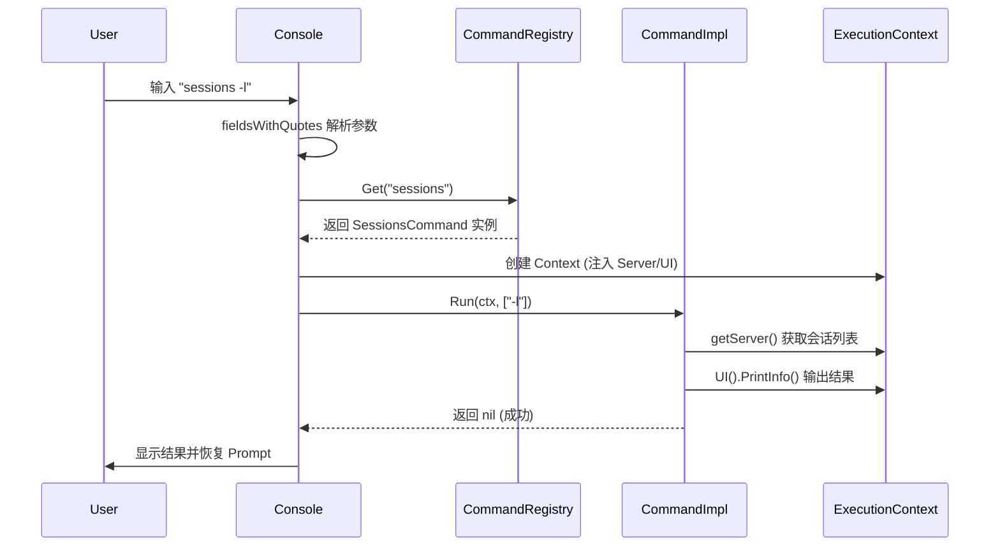
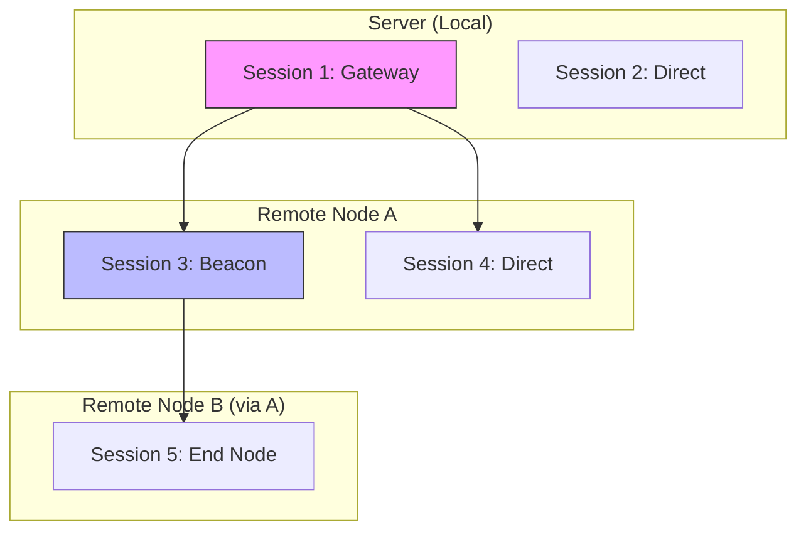
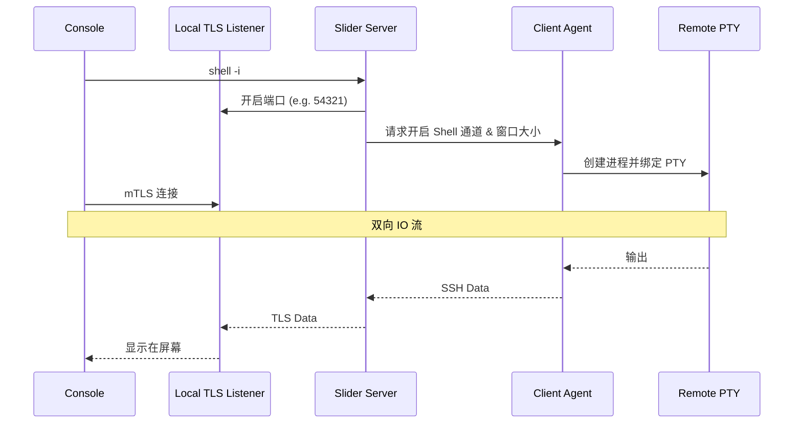
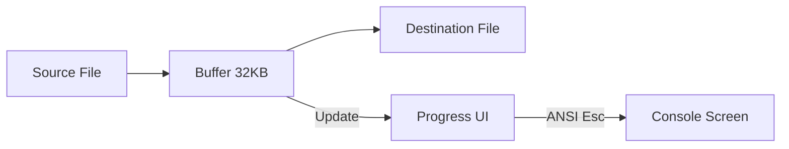
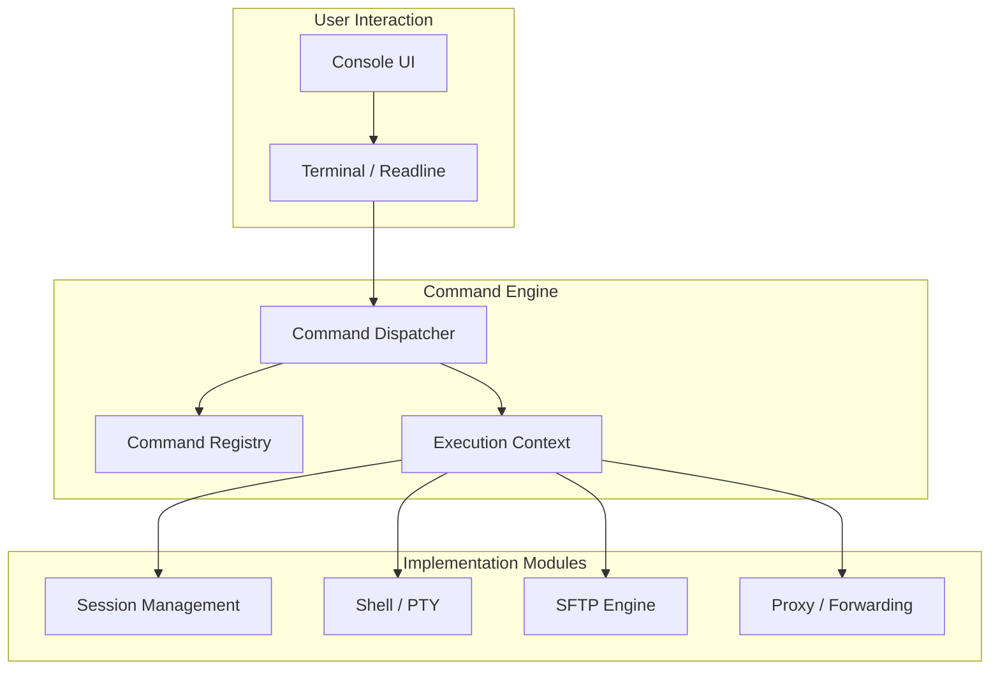

# 命令处理器体系

## 目录
1. [模块概览](#模块概览)
2. [简介](#简介)
3. [核心组件](#核心组件)
   - [Command 接口](#command-接口)
   - [ExecutionContext 执行上下文](#executioncontext-执行上下文)
   - [CommandRegistry 注册表](#commandregistry-注册表)
4. [命令分发与解析机制](#命令分发与解析机制)
   - [命令分发流程](#命令分发流程)
   - [参数解析与验证](#参数解析与验证)
5. [会话交互与管理](#会话交互与管理)
   - [统一会话视图 (Unified Sessions)](#统一会话视图-unified-sessions)
   - [会话操作命令](#会话操作命令)
6. [远程 Shell 实现机制](#远程-shell-实现机制)
   - [交互式 Shell 工作流](#交互式-shell-工作流)
   - [mTLS 安全隧道](#mtls-安全隧道)
7. [SFTP 命令处理器体系](#sftp-命令处理器体系)
   - [SFTP 专用上下文](#sftp-专用上下文)
   - [文件传输流式处理](#文件传输流式处理)
8. [网络代理与转发实现](#网络代理与转发实现)
   - [SOCKS5 代理](#socks5-代理)
   - [端口转发 (Port Forwarding)](#端口转发-port-forwarding)
9. [错误处理与反馈机制](#错误处理与反馈机制)
10. [扩展与自定义命令](#扩展与自定义命令)
11. [架构概览](#架构概览)
12. [文件参考](#文件参考)

## 模块概览

本模块涵盖了 Slider 服务端的所有管理命令实现，主要位于 `server/` 目录下。当前代码已将原先较集中的命令逻辑拆分为命令入口、会话解析、交互执行和代理状态管理等专责文件。

- **总文件数**: 30 余个与命令处理直接相关的 Go 文件
- **子模块划分**:
  - **基础框架**: `command.go`, `commands_basic.go` (定义接口与注册机制)
  - **会话管理**: `commands_sessions.go`, `session_resolver.go`, `sessions_list.go`, `sessions_interact.go`, `commands_connect.go` (多级会话归一化、展示和交互)
  - **远程交互**: `commands_shell.go`, `shell_local.go`, `shell_remote.go`, `shell_interactive.go`, `console.go`, `console_out.go` (PTY 交互与 UI)
  - **SFTP 体系**: `command_sftp.go`, `console_sftp.go` 及所有 `commands_sftp_*.go` 文件 (文件管理)
  - **网络代理**: `commands_socks.go`, `socks_local.go`, `socks_session.go`, `socks_list.go`, `commands_portfwd.go`, `console_forwarding.go` (隧道、代理和端口格式解析)
  - **凭据管理**: `commands_certs.go` (证书与鉴权)

本章节将深入解析这些文件的实现逻辑，展示 Slider 如何通过命令模式 (Command Pattern) 构建一个可扩展、支持多级跳板的远程管理系统。

## 简介

命令处理器体系是 Slider 服务端的核心交互层。它负责接收管理员从控制台（Console）输入的指令，并将其转化为对后端会话、文件系统或网络堆栈的操作。

该体系的设计目标包括：
1. **统一性**: 无论目标是直接连接的客户端，还是通过多级跳板（Beacon/Gateway）接入的远程节点，管理命令的体验应保持一致。
2. **可扩展性**: 开发人员应能通过简单的接口实现快速添加新的管理功能，而无需修改核心分发逻辑。
3. **交互性**: 支持复杂的交互式操作，如流式文件下载、实时 PTY Shell 以及动态端口转发。
4. **安全性**: 所有涉及敏感操作（如 Shell 访问）的命令都必须经过严格的鉴权，并在传输层使用 TLS/mTLS 加密。

在 Slider 中，命令被划分为“全局管理命令”和“会话内命令（如 SFTP）”两个层次。全局命令负责宏观的会话调度和网络配置，而会话内命令则专注于特定目标的细粒度操控。

## 核心组件

### Command 接口

所有管理命令都必须实现 `Command` 接口。该接口定义了命令的基本属性和执行行为。

```go
// server/command.go

type Command interface {
    Name() string              // 命令名称，用于分发
    Description() string       // 简短描述，用于 help 输出
    Usage() string             // 使用说明
    Run(ctx *ExecutionContext, args []string) error // 执行逻辑
    IsRemoteCompletion() bool  // 是否支持远程路径补全
}
```

通过这种接口定义，Slider 实现了命令逻辑与执行引擎的解耦。每个命令只需关注自身的参数解析和业务逻辑，而无需关心 UI 渲染或网络传输细节。

### ExecutionContext 执行上下文

`ExecutionContext` 为命令提供了执行所需的全部环境信息。它像一个“容器”，封装了服务器实例、当前活跃会话、用户界面句柄以及（如果是 SFTP 命令）SFTP 专用上下文。

```go
// server/command.go

type ExecutionContext struct {
    server       *server
    session      *session.BidirectionalSession // 当前选中的会话
    ui           UserInterface                 // UI 交互接口
    sftpCtx      *SftpCommandContext           // SFTP 专用状态
    sftpRegistry *CommandRegistry              // SFTP 命令注册表
}
```

**核心方法说明**:
- `getServer()`: 获取服务器全局状态，用于跨会话操作（如列出所有会话）。
- `RequireSession()`: 辅助方法，用于确保命令在执行前已选中有效会话，否则返回错误。
- `UI()`: 提供 `PrintInfo`, `PrintError` 等方法，确保命令输出风格统一。

### CommandRegistry 注册表

`CommandRegistry` 负责维护命令名称到具体实现类的映射关系。它还支持命令别名（Aliases），例如 `ls` 可以是 `dir` 或 `list` 的别名。

```go
// server/command.go

type CommandRegistry struct {
    commands map[string]Command
    aliases  map[string][]string
}
```

在服务器初始化阶段，`newServerCommandRegistry` 会将所有内置命令注册到全局注册表中。对于 SFTP 这种特定场景，Slider 会创建一个独立的 `CommandRegistry` 实例，以隔离命令空间。

**Section sources**:
- [command.go](server/command.go)
- [commands_basic.go](server/commands_basic.go)
- [ui.go](server/ui.go)

## 命令分发与解析机制

### 命令分发流程

当用户在控制台输入一行文本时，Slider 的分发引擎会经历以下步骤：

1. **字符串拆分**: 使用 `fieldsWithQuotes` 函数处理输入，确保带引号的路径（如 `"C:\Program Files"`）被正确解析为一个参数。
2. **前缀处理**: 检查是否以 `!` 开头（执行本地 Shell 命令）。
3. **注册表检索**: 在当前上下文的 `CommandRegistry` 中查找匹配的命令对象。
4. **上下文组装**: 创建 `ExecutionContext`，注入当前会话状态。
5. **执行**: 调用命令对象的 `Run` 方法，并捕获可能的错误。

下面的序列图展示了一个典型命令的执行生命周期：



该流程确保了命令执行的原子性和环境隔离。如果命令执行过程中发生恐慌（Panic），控制台层会进行捕获，防止整个服务端崩溃。

### 参数解析与验证

Slider 大量使用 `pflag` 库来处理命令行参数。这使得 Slider 的命令行体验非常接近标准的 Linux 工具。

```go
// server/commands_sessions.go 示例

sessionsFlags := pflag.NewFlagSet(sessionsCmd, pflag.ContinueOnError)
sInteract := sessionsFlags.IntP("interactive", "i", 0, "...")
sKill := sessionsFlags.IntP("kill", "k", 0, "...")

if pErr := sessionsFlags.Parse(args); pErr != nil {
    return pErr
}
```

**解析原则**:
- **互斥检查**: 对于像 `--interactive` 和 `--kill` 这样逻辑互斥的参数，命令处理器会显式检查并报错。
- **位置参数**: 严格校验位置参数的数量，防止用户输入歧义。
- **类型安全**: 利用 `pflag` 提供的类型转换，确保 Session ID 等参数是合法的整数。

**Section sources**:
- [command.go](server/command.go)
- [console_sftp.go](server/console_sftp.go)

## 会话交互与管理

### 统一会话视图 (Unified Sessions)

Slider 最强大的特性之一是其多级跳板支持。为了让管理员能够方便地管理通过多个跳板接入的远程节点，Slider 引入了 `UnifiedSession` 概念。

`ResolveUnifiedSessions` 函数位于 `server/session_resolver.go`。它会遍历所有本地直接连接的会话，并递归地向支持 Gateway 模式的会话发送查询请求，获取其下游的远程会话。远程会话通过 `SessionKey{GatewayID, Path, ActualID}` 生成稳定的 `UnifiedID`，因此列表刷新不会因为遍历顺序变化而改变用户看到的 ID。



在 `sessions` 命令的输出中，所有的会话（无论本地还是远程）都会被分配一个全局唯一的 `UnifiedID`。这极大地简化了操作逻辑：管理员只需要记住一个数字，就可以对深层嵌套的会话执行 `use` 或 `kill` 操作。

### 会话操作命令

- **`sessions`**: 列出所有活跃会话。它不仅显示基础的系统信息（OS/Arch），还会显示会话的“角色”（如 Operator, Beacon, Gateway）以及其 IO 方向。
- **`sessions -i <ID>`**: 进入交互模式。如果目标是本地会话，直接开启 SFTP 控制台；如果是远程会话，则通过 `slider-connect` 通道建立多级跳转。
- **`sessions -k <ID>`**: 优雅关闭会话。服务端会向客户端发送一个 `shutdown` 请求，让客户端主动清理资源并退出。
- **`sessions -d <ID>`**: 强制断开连接。直接关闭底层的 WebSocket 或 TCP 连接。

**Section sources**:
- [commands_sessions.go](server/commands_sessions.go)
- [session_resolver.go](server/session_resolver.go)
- [sessions_list.go](server/sessions_list.go)
- [sessions_interact.go](server/sessions_interact.go)
- [commands_connect.go](server/commands_connect.go)

## 远程 Shell 实现机制

### 交互式 Shell 工作流

Slider 的 `shell` 命令并不直接在服务端执行代码，而是利用客户端提供的 PTY（伪终端）功能。

当执行 `shell -s <ID> -i` 时，流程如下：
1. **环境准备**: 服务端获取控制台当前的窗口大小（行列数），并将其发送给客户端。
2. **端点启动**: 服务端在本地启动一个临时的 TLS 监听器，并开启 mTLS 认证。
3. **数据绑定**: 服务端将该监听器接收到的连接与客户端的 SSH Channel 绑定。
4. **本地连接**: 服务端控制台组件通过 `tls.Dial` 连接到这个本地监听器。
5. **双向流转**: 使用 `io.Copy` 在控制台标准输入输出与 TLS 连接之间搬运数据。



### mTLS 安全隧道

为了防止本地其他进程恶意连接到这个临时的 Shell 端口，Slider 在交互式 Shell 场景强制使用 mTLS。
- 服务端会为每次 Shell 会话动态生成一对客户端证书。
- 只有持有这对证书的 `InteractiveConsole` 实例才能成功建立连接。
- 这种机制确保了即使端口暴露在本地，也是绝对安全的。

**Section sources**:
- [commands_shell.go](server/commands_shell.go)
- [shell_local.go](server/shell_local.go)
- [shell_remote.go](server/shell_remote.go)
- [shell_interactive.go](server/shell_interactive.go)

## SFTP 命令处理器体系

### SFTP 专用上下文

SFTP 控制台是一个独立的交互环境，拥有自己的命令集。它的核心是 `SftpCommandContext`，它不仅持有一个 `sftp.Client` 句柄，还维护了本地和远程的当前工作目录（CWD）。

```go
// server/command_sftp.go

type SftpCommandContext struct {
    sftpCli          *sftp.Client
    session          *session.BidirectionalSession
    localCwd         *string
    remoteCwd        *string
    localInterpreter *interpreter.Interpreter
    remoteInfo       interpreter.BaseInfo
    processInfo      interpreter.ProcessInfo
    targetID         int64
}
```

**关键特性**:
- **路径持久化**: 当管理员在 SFTP 控制台中切换目录后，该状态会保存。即使退出控制台再重新进入，也会恢复到之前的目录。
- **多平台兼容**: 通过 `spath` 包处理 Windows (`\`) 和 Unix (`/`) 之间的路径差异。
- **自动补全**: 支持远程文件系统的 TAB 补全。它会实时调用 `sftpCli.ReadDir` 获取远程目录列表。
- **诊断展示**: `processInfo` 仅用于 `sysinfo` 输出，且进入会话和跨网格传递时都会经过清洗，不参与任何路由或授权判断。

### 文件传输流式处理

`get` 和 `put` 命令实现了高性能的文件传输逻辑。它们使用 `copyFileWithProgress` 函数进行流式拷贝。

**传输流程**:
1. **扫描**: 如果是递归下载/上传（`-r`），首先遍历整个目录树，计算文件总数和总大小。
2. **缓冲分配**: 分配一个固定大小的缓冲区（通常为 32KB 或更大），避免大文件占用过多内存。
3. **循环读写**: 从源端读取数据块，写入目标端，并更新已传输字节数。
4. **进度反馈**: 使用 ANSI 转义序列（`escseq`）在控制台同一行实时更新百分比和传输速度，提供良好的用户体验。



**Section sources**:
- [command_sftp.go](server/command_sftp.go)
- [commands_sftp_get.go](server/commands_sftp_get.go)
- [commands_sftp_put.go](server/commands_sftp_put.go)

## 网络代理与转发实现

### SOCKS5 代理

`socks` 命令允许管理员在服务端开启一个 SOCKS5 代理服务器，将流量通过指定的客户端会话转发出去。

- **本地 SOCKS**: 流量通过服务端直接流出。
- **会话 SOCKS**: 流量进入服务端后，被封装进 SSH 通道，发往目标客户端，由客户端代为请求目标地址。
- **远程 SOCKS**: 针对通过跳板连接的节点，Slider 会自动建立多级代理链路。

### 端口转发 (Port Forwarding)

`portfwd` 命令支持标准的 SSH 转发模式：
- **本地转发 (`-L`)**: 在服务端监听端口，将连接转发到远程客户端能访问的地址。
- **远程转发 (`-R`)**: 让远程客户端监听端口，将连接转发回服务端或服务端能访问的地址。

这些功能由命令层解析目标会话和参数，再交给 `instance.Config` 暴露的 forwarding 方法。具体的 TCP/UDP 本地转发、远程转发和取消逻辑由 `pkg/instance/portforward` 下的 `local_tcp.go`、`local_udp.go`、`remote.go` 和 handler 文件承载。

**Section sources**:
- [commands_socks.go](server/commands_socks.go)
- [commands_portfwd.go](server/commands_portfwd.go)

## 错误处理与反馈机制

命令执行过程中的错误处理遵循“逐级冒泡”原则：

1. **底层错误**: 如网络连接中断、文件权限不足。这些错误由 `Run` 方法捕获。
2. **上下文反馈**: 命令处理器调用 `ui.PrintError` 将错误信息格式化并显示给用户。
3. **状态恢复**: 如果是严重错误（如会话失效），命令处理器会返回 `ErrExitConsole`，强制控制台返回到主菜单，防止用户在失效的上下文中继续操作。

> 💡 **提示**: Slider 使用不同的颜色标识错误（红色）、警告（黄色）和成功（绿色），这在 `server/ui.go` 中通过 ANSI 颜色码实现。

## 扩展与自定义命令

开发者可以通过以下步骤为 Slider 添加新命令：

1. **定义结构体**: 创建一个实现 `Command` 接口的新类型。
2. **实现逻辑**: 在 `Run` 方法中编写业务代码。利用 `ExecutionContext` 访问系统资源。
3. **注册命令**: 在 `server/command.go` 的 `initRegistry` 方法中调用 `s.commandRegistry.Register(&MyNewCommand{})`。

**接口扩展示例**:
```go
type MyCommand struct{}

func (c *MyCommand) Name() string { return "mycmd" }
func (c *MyCommand) Run(ctx *ExecutionContext, args []string) error {
    ctx.UI().PrintSuccess("Hello from MyCommand!")
    return nil
}
```

## 架构概览

下图展示了命令处理器体系在整个 Slider 服务端架构中的位置：



该架构体现了典型的“分层防御”思想：UI 层只负责字符输入输出，分发层负责路由和上下文组装，而实现层则专注于具体的业务逻辑。这种结构极大地降低了各功能模块之间的耦合度。

## 文件参考

以下是本章节涉及的关键源文件，建议在深入研究代码时优先阅读：

- **核心接口与注册**:
  - [server/command.go](server/command.go): 定义 `Command` 接口和 `CommandRegistry`。
  - [server/ui.go](server/ui.go): 定义 `UserInterface` 输出规范。
- **基础与会话命令**:
  - [server/commands_basic.go](server/commands_basic.go): 实现 `help`, `exit`, `bg` 等基础命令。
  - [server/commands_sessions.go](server/commands_sessions.go): `sessions` 命令入口与参数解析。
  - [server/session_resolver.go](server/session_resolver.go): 统一会话视图、远程会话归一化和稳定 ID 分配。
  - [server/sessions_list.go](server/sessions_list.go): 会话列表展示。
  - [server/sessions_interact.go](server/sessions_interact.go): 本地与远程 SFTP 交互入口。
- **交互式功能**:
  - [server/commands_shell.go](server/commands_shell.go): Shell 命令入口与参数解析。
  - [server/shell_local.go](server/shell_local.go): 直接会话 Shell endpoint 启停。
  - [server/shell_remote.go](server/shell_remote.go): 跨 Gateway 远程 Shell endpoint 启停。
  - [server/shell_interactive.go](server/shell_interactive.go): 交互式 Shell 的 mTLS 本地桥接。
  - [server/console.go](server/console.go): 控制台主循环与输入解析。
- **SFTP 体系**:
  - [server/command_sftp.go](server/command_sftp.go): SFTP 注册表与上下文。
  - [server/console_sftp.go](server/console_sftp.go): SFTP 交互式控制台实现。
  - [server/commands_sftp_get.go](server/commands_sftp_get.go): 文件下载实现。
  - [server/commands_sftp_put.go](server/commands_sftp_put.go): 文件上传实现。
- **网络服务**:
  - [server/commands_socks.go](server/commands_socks.go): SOCKS5 命令入口。
  - [server/socks_local.go](server/socks_local.go): 独立本地 SOCKS5 服务管理。
  - [server/socks_session.go](server/socks_session.go): 直接和远程会话 SOCKS endpoint 管理。
  - [server/socks_list.go](server/socks_list.go): SOCKS 服务列表展示。
  - [server/commands_portfwd.go](server/commands_portfwd.go): 端口转发管理。
  - [server/console_forwarding.go](server/console_forwarding.go): 端口转发参数解析。
