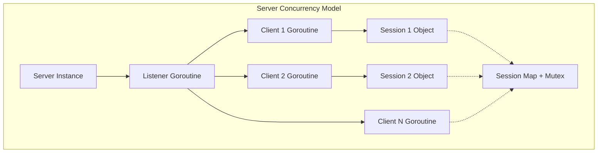
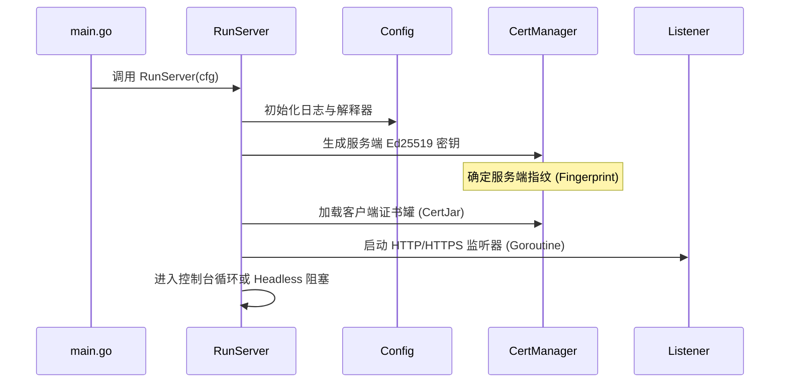
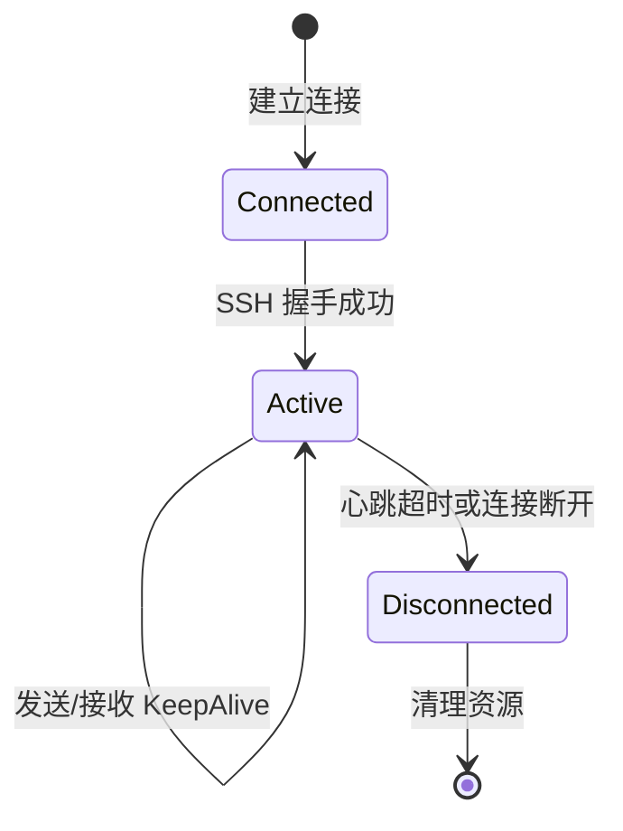
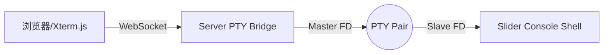

# 服务端核心与生命周期

## 目录
1. [模块概览](#模块概览)
2. [引言](#引言)
3. [服务端核心架构深度解析](#服务端核心架构深度解析)
   - [Server 结构体：系统的中枢神经](#server-结构体系统的中枢神经)
   - [并发模型与同步机制](#并发模型与同步机制)
4. [初始化流程与生命周期管理](#初始化流程与生命周期管理)
   - [从零启动：RunServer 的编排逻辑](#从零启动runserver-的编排逻辑)
   - [配置加载与环境探测](#配置加载与环境探测)
5. [连接升级机制：从 HTTP 到 SSH](#连接升级机制从-http-到-ssh)
   - [WebSocket 隧道化过程](#websocket-隧道化过程)
   - [SSH 握手与身份验证深度分析](#ssh-握手与身份验证深度分析)
6. [会话生命周期管理 (Session Management)](#会话生命周期管理-session-management)
   - [会话的创建与追踪](#会话的创建与追踪)
   - [心跳检测与保活机制](#心跳检测与保活机制)
   - [优雅退出与资源回收](#优雅退出与资源回收)
7. [网关模式与多级跳板实现](#网关模式与多级跳板实现)
   - [网关链式架构设计](#网关链式架构设计)
   - [循环连接检测与重复连接防御](#循环连接检测与重复连接防御)
   - [流量转发与路由逻辑](#流量转发与路由逻辑)
8. [安全基础与证书管理体系](#安全基础与证书管理体系)
   - [Ed25519 密钥对的生成与应用](#ed25519-密钥对的生成与应用)
   - [证书罐 (CertJar) 的持久化设计](#证书罐-certjar-的持久化设计)
   - [TLS 监听器与双向验证](#tls-监听器与双向验证)
9. [交互式控制台与远程终端技术](#交互式控制台与远程终端技术)
   - [PTY 桥接原理与实现](#pty-桥接原理与实现)
   - [命令注册表 (Command Registry) 机制](#命令注册表-command-registry-机制)
10. [文件引用](#文件引用)

## 模块概览

`server/` 模块是 Slider 项目的指挥中心，负责处理所有入站连接、管理复杂的会话状态、执行命令分发以及提供多级网关转发能力。

- **总文件数**: 42 个 Go 源文件。
- **子模块**:
  - `cmd/`: 包含服务端程序的入口点 `main.go`。
  - `templates/`: 包含 Web 控制台所需的 HTML 模板文件。
- **核心职责**:
  - **多协议支持**: 同时处理 HTTP、WebSocket 和 SSH 协议的嵌套与升级。
  - **状态维护**: 利用高效的并发模型管理成百上千个活跃会话。
  - **安全防御**: 实现基于公钥指纹的身份验证和防止循环连接的逻辑。
  - **交互体验**: 提供本地交互式控制台和基于 Web 的全功能终端。

本章节将作为深度技术指南，剖析 `server/` 目录下的每一行核心代码，揭示 Slider 如何构建一个稳健的远程管理平台。

## 引言

Slider 服务端（Slider Server）的设计哲学是“简单而强大”。它通过将复杂的 SSH 协议封装在通用的 HTTP/WebSocket 隧道中，解决了防火墙穿透和协议识别的难题。与此同时，它引入了**网关模式（Gateway Mode）**，使得服务端可以像搭积木一样相互连接，构建出极其复杂的内网穿透和横向移动通道。

在 Slider 的生态系统中，服务端不仅是一个被动的监听器，它还是一个主动的协调者。它能够主动发起连接（Callback 模式），能够自动检测网络拓扑中的循环，还能够通过内置的命令解释器提供实时的交互能力。理解服务端的架构和生命周期，是深入掌握 Slider 核心机制的关键。

## 服务端核心架构深度解析

服务端的架构设计遵循了“高内聚、低耦合”的原则，所有的功能模块都围绕着 `server` 结构体展开。

### Server 结构体：系统的中枢神经

`server` 结构体定义在 `server.go` 中，它是整个服务端的灵魂。它不仅持有了所有的配置信息，还管理着运行时的动态数据。

```go
type server struct {
	*slog.Logger                          // 统一日志记录器
	sshConf              *ssh.ServerConfig // SSH 服务端全局配置
	sessionTrack         *sessionTrack     // 会话追踪器，管理所有活跃会话
	sessionTrackMutex    sync.Mutex        // 保护会话追踪器的互斥锁
	console              Console           // 交互式控制台实例
	serverInterpreter    *interpreter.Interpreter // 本地命令解释器
	certTrack            *scrypt.CertTrack // 客户端证书指纹库
	certTrackMutex       sync.Mutex        // 保护证书库的互斥锁
	certJarFile          string            // 证书罐文件路径
	authOn               bool              // 是否开启强制身份验证
	fingerprint          string            // 服务端自身的指纹
	gateway              bool              // 是否处于网关模式
	CertificateAuthority *scrypt.CertificateAuthority // 内置 CA 机构
	commandRegistry      *CommandRegistry  // 命令注册表，管理所有可用命令
	remoteSessions       map[string]*RemoteSessionState // 远程会话状态映射
}
```

每个字段都承载着特定的职责。例如，`sessionTrack` 负责监控连接的存活，而 `commandRegistry` 则定义了用户在控制台中可以执行的操作。通过将这些组件集成在一个结构体中，Slider 实现了高效的状态共享和方法调用。

### 并发模型与同步机制

由于服务端需要同时处理大量的并发连接和控制台输入，并发安全至关重要。Slider 采用了典型的 Go 并发模式：

1. **互斥锁保护**: 对于 `Sessions` 映射和 `CertTrack` 映射，服务端使用了 `sync.Mutex`。在添加、删除或查询会话时，必须获取相应的锁。
2. **原子操作**: 在更新会话计数器（如 `SessionCount`）时，使用了 `sync/atomic` 包，以减少锁竞争，提高性能。
3. **Goroutine 分发**: 每个新的连接都会启动独立的 Goroutine 进行处理（如 `HandleIncomingChannels` 和 `HandleIncomingRequests`），确保单个连接的阻塞不会影响整个系统的响应。



上图展示了服务端的并发结构。主监听器 Goroutine 负责接受新连接，并为每个连接派生出专门的处理 Goroutine。所有的处理 Goroutine 共享同一个受互斥锁保护的会话映射表，从而实现了全局的状态一致性。

**Section sources**:
- [server/server.go](server/server.go)
- [server/config.go](server/config.go)

## 初始化流程与生命周期管理

服务端的生命周期是一个严谨的编排过程，从参数解析到最终的优雅退出，每一步都经过精心设计。

### 从零启动：RunServer 的编排逻辑

`RunServer` 函数是服务端的启动引擎。它按照预定的顺序执行以下任务：

1. **日志系统初始化**: 根据配置设置日志级别、格式（JSON 或文本）和颜色。
2. **解释器加载**: 初始化 `pkg/interpreter`，检测当前系统的 PTY 支持情况。
3. **身份标识生成**: 生成或加载服务端的 Ed25519 密钥对。如果开启了 `--ca-store`，它会将密钥持久化到磁盘。
4. **安全配置**: 如果开启了 `--auth`，它会加载 `client-certs.json` 并配置 SSH 的 `PublicKeyCallback`。
5. **路由构建**: 调用 `buildRouter` 设置 HTTP 路由。
6. **监听器启动**: 启动 HTTP 或 HTTPS 监听器。



在启动序列中，最关键的一步是生成服务端指纹。这个指纹是服务端的唯一身份标识，在网关模式下用于循环检测。

### 配置加载与环境探测

Slider 的配置非常灵活，可以通过命令行参数（Cobra）或环境变量进行设置。`server/cli.go` 定义了所有可用的 Flag，包括端口、地址、心跳间隔等。

值得注意的是，服务端在启动时会进行**环境探测**。如果它发现当前终端不支持 PTY（例如在某些受限的 Shell 环境中运行），它会打印警告并强制进入 Headless 模式。这种自适应设计保证了 Slider 在各种极端环境下都能正常运行。

**Section sources**:
- [server/config.go](server/config.go)
- [server/cli.go](server/cli.go)
- [server/cmd/main.go](server/cmd/main.go)

## 连接升级机制：从 HTTP 到 SSH

连接升级是 Slider 穿透防火墙的核心技术。它通过三个阶段将一个普通的 HTTP 请求转化为一个功能完备的 SSH 会话。

### WebSocket 隧道化过程

所有的连接首先到达 `buildRouter` 定义的 HTTP 处理器。服务端会检查请求头中的 `Sec-WebSocket-Operation`。

- 如果操作是 `OperationAgent` 或 `OperationOperator`，服务端会调用 `handleWebSocket`。
- `handleWebSocket` 使用 `gorilla/websocket` 进行协议升级（Upgrade）。
- 升级成功后，原本的 HTTP 连接变成了一个持久的双向 WebSocket 隧道。

### SSH 握手与身份验证深度分析

一旦 WebSocket 隧道建立，服务端会将其包装成一个 `net.Conn` 对象，并立即在其上启动 SSH 握手。

```go
func (s *server) NewSSHServer(biSession *session.BidirectionalSession) {
    // ... 将 WebSocket 包装为 netConn
    sshServerConn, newChan, reqChan, err = ssh.NewServerConn(netConn, sshConf)
    // ...
}
```

在 SSH 握手期间，如果服务端开启了认证，`clientVerification` 回调会被触发：

1. **提取公钥**: 从握手报文中提取客户端提供的公钥。
2. **生成指纹**: 计算该公钥的 SHA256 指纹。
3. **比对库文件**: 在内存中的 `certTrack` 指纹库中查找该指纹。
4. **授予权限**: 如果找到匹配项，返回 `ssh.Permissions`，并在扩展字段中记录 `cert_id` 和指纹。

这种基于 SSH 原生机制的身份验证，既保证了安全性，又充分利用了成熟的加密协议标准。

**Section sources**:
- [server/handler.go](server/handler.go)
- [server/server.go](server/server.go)

## 会话生命周期管理 (Session Management)

会话管理是服务端的日常核心工作。它不仅要记录谁在线，还要确保在线的会话是健康的。

### 会话的创建与追踪

每当一个新的连接通过 SSH 验证后，服务端会创建一个 `BidirectionalSession` 对象。

- **唯一 ID**: 每个会话都有一个自增的唯一 ID。
- **角色定义**: 根据连接来源，会话被标记为 `Agent`、`Operator` 或 `Gateway`。
- **状态存储**: 会话对象被存入 `server.sessionTrack.Sessions` 映射表中。

### 心跳检测与保活机制

为了应对不稳定的网络环境，Slider 实现了双向心跳机制。



在 `NewSSHServer` 中，服务端会启动一个专门的 Goroutine 执行 `biSession.KeepAlive(s.keepalive)`。它定期向客户端发送 SSH 全局请求。如果客户端在预定时间内没有响应，服务端会主动关闭连接，防止僵尸连接占用系统资源。

### 优雅退出与资源回收

当连接断开时，服务端会执行一系列清理操作：

1. **从映射表中移除**: 调用 `dropWebSocketSession` 将会话从 `sessionTrack` 中删除。
2. **通知上游**: 如果当前服务端处于网关链中，它会调用 `NotifyUpstreamDisconnect` 向上级服务端发送断开事件。
3. **关闭资源**: 关闭底层的 WebSocket 和 TCP 连接，释放关联的 PTY（如果是控制台会话）。

**Section sources**:
- [server/server.go](server/server.go)
- [server/handler.go](server/handler.go)

## 网关模式与多级跳板实现

网关模式是 Slider 的杀手锏功能，它允许服务端之间进行链式连接。

### 网关链式架构设计

当服务端开启 `--gateway` 标志时，它获得了一种“双重人格”：
- 对于下游（Downstream）客户端，它是一个 **SSH 服务端**。
- 对于上游（Upstream）服务端，它是一个 **SSH 客户端**。

通过这种设计，Slider 可以实现 A -> B -> C 这样的多级跳转，其中 B 是 A 的代理，同时又是 C 的控制器。

### 循环连接检测与重复连接防御

在复杂的网关拓扑中，最担心的是出现 A 连接 B，B 又连接回 A 的死循环。Slider 通过以下机制进行防御：

1. **身份标识**: 每个服务端都有一个 `fingerprint:port` 格式的唯一身份。
2. **自连接检查**: 在发起连接前，`isSelfConnection` 会检查目标是否指向自己。
3. **重复回调检查**: 在 `duplicate_check.go` 中，服务端会检查是否已经存在来自相同 `peerIdentity` 的控制通道。

### 流量转发与路由逻辑

网关模式下的流量转发依赖于自定义的 SSH 渠道。当用户在 A 上执行命令操作 C 时，A 会将命令封装在 `slider-connect` 渠道中发送给 B，B 解析后再转发给 C。这种封装机制使得 Slider 能够透明地管理多级跳板。

**Section sources**:
- [server/gateway.go](server/gateway.go)
- [server/duplicate_check.go](server/duplicate_check.go)

## 安全基础与证书管理体系

Slider 的安全性建立在现代密码学基础之上，完全摒弃了弱口令风险。

### Ed25519 密钥对的生成与应用

Ed25519 是一种高性能、高安全性的椭圆曲线签名算法。Slider 使用它来生成服务端的身份密钥和客户端的访问证书。相比于传统的 RSA 密钥，Ed25519 的密钥更短（公钥仅 32 字节），但安全性更高，且抗侧信道攻击能力强。

### 证书罐 (CertJar) 的持久化设计

`certs.go` 实现了一个轻量级的密钥管理系统。所有的受信任公钥都存储在 `client-certs.json` 中。

- **自动加载**: 服务端启动时自动读取该文件。
- **实时同步**: 当通过控制台添加新证书时，服务端会立即更新内存并同步回磁盘。
- **环境变量控制**: 通过 `SLIDER_SAVE_JAR` 环境变量，用户可以控制是否允许服务端修改该文件。

### TLS 监听器与双向验证

除了 SSH 层的加密，Slider 的 HTTP 监听器还支持 TLS。通过 `--listener-cert` 和 `--listener-key`，服务端可以运行在 HTTPS 模式下。如果进一步提供 `--listener-ca`，服务端还会要求客户端提供合法的 TLS 证书，实现双向 TLS（mTLS）验证，为系统提供第二层防御。

**Section sources**:
- [server/certs.go](server/certs.go)
- [server/server.go](server/server.go)

## 交互式控制台与远程终端技术

Slider 的控制台是操作员与系统交互的主界面，它融合了本地命令行和远程 Web 终端的优点。

### PTY 桥接原理与实现

Web 控制台的实现是 `server/handler.go` 中的一大亮点。它通过 `creack/pty` 库在服务端创建一个伪终端（PTY）。



服务端在 Goroutine 中不断地在 WebSocket 和 PTY Master 端之间搬运字节。这种设计允许用户在浏览器中获得与原生终端完全一致的体验，包括颜色显示、Tab 补全和 Vim 等交互式程序的运行。

### 命令注册表 (Command Registry) 机制

控制台中可执行的所有命令都定义在 `CommandRegistry` 中。每个命令（如 `sessions`, `connect`, `sftp`）都是一个实现了特定接口的对象。

当用户输入一行命令时：
1. **解析**: 服务端将输入行切分为命令名和参数。
2. **查找**: 在注册表中查找对应的命令对象。
3. **执行**: 调用命令对象的 `Execute` 方法，并传入 `ExecutionContext`（包含当前会话、UI 句柄等信息）。

这种插件式的架构使得开发者可以非常容易地为 Slider 添加新的管理功能。

**Section sources**:
- [server/handler.go](server/handler.go)
- [server/console.go](server/console.go)
- [server/ui.go](server/ui.go)

## 文件引用

以下是本章节深入分析的核心源文件，建议在阅读本文档时配合源码查看：

- [server/server.go](server/server.go): 服务端核心数据结构与会话分发逻辑。
- [server/gateway.go](server/gateway.go): 网关模式、链式连接与循环检测实现。
- [server/handler.go](server/handler.go): HTTP 路由、WebSocket 升级与 PTY 桥接技术。
- [server/config.go](server/config.go): 服务端配置解析与 RunServer 启动编排。
- [server/certs.go](server/certs.go): 基于 Ed25519 的证书管理与 CertJar 持久化。
- [server/duplicate_check.go](server/duplicate_check.go): 防止重复回调与拓扑环路的逻辑。
- [server/cmd/main.go](server/cmd/main.go): 程序的二进制入口。
- [server/cli.go](server/cli.go): 命令行参数定义与解析逻辑。
- [server/console.go](server/console.go): 交互式控制台的实现。
- [server/command.go](server/command.go): 命令注册表与执行框架。
