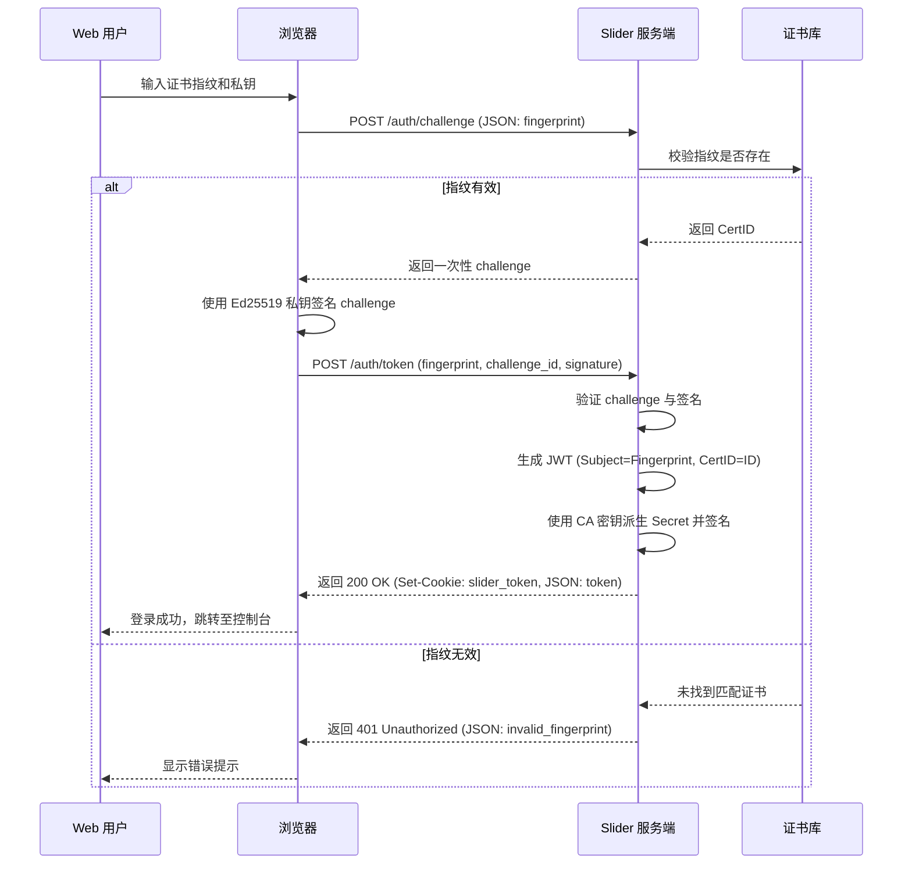
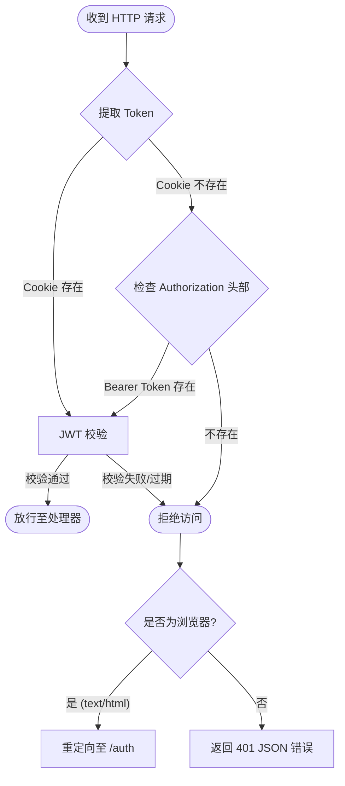
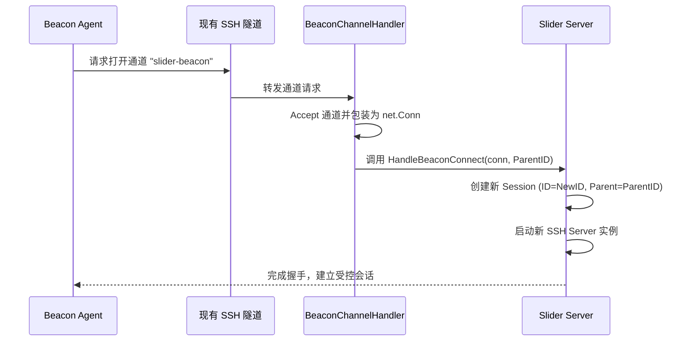

# 认证与权限控制

## 目录
1. [模块概览](#模块概览)
2. [身份验证架构](#身份验证架构)
   - [核心认证流程](#核心认证流程)
   - [JWT 令牌机制](#jwt-令牌机制)
   - [身份验证时序图](#身份验证时序图)
3. [鉴权中间件与安全防线](#鉴权中间件与安全防线)
   - [中间件工作流](#中间件工作流)
   - [浏览器与 API 的差异化处理](#浏览器与-api-的差异化处理)
   - [鉴权流程图](#鉴权流程图)
4. [路由映射与访问控制](#路由映射与访问控制)
   - [公共路由与受保护路由](#公共路由与受保护路由)
   - [静态页面分发](#静态页面分发)
5. [信标 (Beacon) 模式安全细节](#信标-beacon-模式安全细节)
   - [握手与认证流程](#握手与认证流程)
   - [跨 Session 追踪](#跨-session-追踪)
   - [Beacon 连接时序图](#beacon-连接时序图)
6. [核心组件分析](#核心组件分析)
7. [文件引用](#文件引用)

## 模块概览

Slider 服务端的安全模型是整个系统的基石，它不仅保护了 Web 控制台免受未经授权的访问，还确保了 Agent 与 Server 之间通信的合法性。该模块主要集中在 `server/` 目录下，通过一系列 Handler 和中间件实现了基于 Ed25519 挑战签名和 JWT（JSON Web Token）的混合认证体系。

在本次代码探索中，我们共识别出 `server/` 目录下约 42 个 Go 源文件，其中与认证和权限控制直接相关的核心文件包括：
- `server/handler_auth.go`: 负责身份验证请求的处理、令牌发放及注销逻辑。
- `server/middleware_auth.go`: 实现了核心鉴权中间件，拦截并校验所有受保护的 HTTP 请求。
- `server/handler_pages.go`: 管理静态页面（如登录页、控制台主页）的路由与渲染。
- `server/handler_beacon.go`: 专门处理通过 SSH 隧道建立的 Beacon 模式连接。
- `server/handler.go`: 系统的路由分发中心，定义了所有 API 端点与处理器的映射关系。

Slider 的安全设计遵循“最小特权”原则。系统支持通过浏览器访问的 Web 用户和通过 API 访问的程序客户端；两者都必须使用证书私钥完成一次性 challenge 签名，指纹只负责定位证书，不能单独作为凭证。

## 身份验证架构

Slider 的身份验证架构以证书私钥的持有证明为信任根。用户或客户端不需要传统用户名和密码，但必须持有证书库中公钥对应的 Ed25519 私钥。

### 核心认证流程

身份验证分两步完成：
1. 客户端向 `/auth/challenge` 提交证书指纹，服务端确认该指纹存在于证书库并返回短期、一次性的随机 challenge。
2. 客户端使用证书私钥签名 challenge，再向 `/auth/token` 提交指纹、challenge ID 和签名。服务端验证成功后签发 JWT。

服务端自身指纹和原始客户端指纹都不能直接换取 JWT。challenge 使用一次即删除，过期或重放请求会被拒绝。

### JWT 令牌机制

Slider 使用 HS256 算法对 JWT 进行签名。JWT 的 Payload 结构（`Claims`）包含了身份验证的关键元数据：
- `iss` (Issuer): 签发者，固定为 `slider-server`。
- `sub` (Subject): 证书指纹，作为用户唯一标识。
- `exp` (ExpiresAt): 过期时间，默认为 24 小时。
- `cert_id`: 关联的证书 ID，用于后续权限细分。

对于 Web 客户端，服务端会将生成的 JWT 存储在名为 `slider_token` 的 `HttpOnly` Cookie 中。这种做法可以有效防止跨站脚本攻击（XSS）窃取令牌。同时，服务端也会在 JSON 响应体中返回令牌，以供 API 客户端使用。

### 身份验证时序图

下图展示了 Web 客户端从发起登录到获取令牌的完整时序过程。

**时序图说明**：
该图描述了基于 Web 的私钥持有证明过程。服务端在签名验证通过后返回 JSON Token，并利用 `Set-Cookie` 在浏览器中保存会话状态。

**Section sources**:
- [server/handler_auth.go](server/handler_auth.go)
- [pkg/auth/claims.go](pkg/auth/claims.go)
- [pkg/auth/jwt.go](pkg/auth/jwt.go)

## 鉴权中间件与安全防线

鉴权中间件（`authMiddleware`）是 Slider 服务端的“守门人”。它被应用在所有需要权限的路由上，确保只有持有有效令牌的请求才能触达业务处理器。

### 中间件工作流

中间件的执行逻辑非常严密，它会按照以下优先级提取令牌：
1. **Cookie 提取**：首先尝试从请求的 Cookie 中读取 `slider_token`。这是为了照顾通过浏览器访问的 Web 用户。
2. **Header 提取**：如果 Cookie 中没有令牌，则尝试解析 `Authorization: Bearer <token>` 头部。这是为 API 客户端预留的通道。

一旦提取到令牌，中间件会调用 `auth.Decode` 进行校验。校验过程包括签名验证、过期检查以及 Payload 完整性检查。如果任何一步失败，请求将被判定为未授权。

### 浏览器与 API 的差异化处理

Slider 在处理未授权请求时表现出了极高的人性化设计。它会根据请求头中的 `Accept` 字段判断客户端类型：
- **浏览器用户** (`Accept` 包含 `text/html`)：中间件会将用户重定向（303 See Other）到 `/auth` 登录页面。这避免了用户直接看到冷冰冰的 JSON 错误，提升了交互体验。
- **API 客户端**：中间件会返回标准的 401 Unauthorized 状态码及 JSON 格式的错误描述，方便程序进行自动化处理（如重新触发认证流程）。

### 鉴权流程图

下图详细描述了中间件在拦截请求后的决策路径。

**流程图说明**：
此流程图展示了 `authMiddleware` 的核心逻辑。它体现了 Slider 对不同访问媒介的兼容性处理：优先支持 Cookie 认证以优化 Web 体验，同时保留 Header 认证以满足 API 调用需求。最后的“是否为浏览器”分支是实现平滑用户体验的关键。

**Section sources**:
- [server/middleware_auth.go](server/middleware_auth.go)
- [server/handler.go](server/handler.go)

## 路由映射与访问控制

Slider 的路由定义在 `server/handler.go` 的 `buildRouter` 函数中。路由被清晰地划分为“公共区域”和“受保护区域”，这种划分通过中间件的嵌套调用来实现。

### 公共路由与受保护路由

下表梳理了服务端暴露的主要 HTTP 接口及其对应的权限要求：

| 路由路径 | HTTP 方法 | 处理器函数 | 权限级别 | 说明 |
| :--- | :--- | :--- | :--- | :--- |
| `/auth` | GET | `handleAuthPage` | 公开 | 登录页面渲染 |
| `/auth/challenge` | POST | `handleAuthChallenge` | 公开 | 创建一次性签名挑战 |
| `/auth/token` | POST | `handleAuthToken` | 公开 | 验证签名并签发 JWT |
| `/auth/logout` | POST | `handleLogout` | 公开 | 注销登录，清除 Cookie |
| `/console` | GET | `handleConsolePage` | **受限** | Web 控制台主页 |
| `/console/ws` | GET (WS) | `handleWebSocketConsole` | **受限** | 控制台 WebSocket 隧道 |
| `/` | GET (WS) | `handleWebSocket` | 特殊 | Agent/Gateway 连接入口 |

### 静态页面分发

Slider 使用了 Go 1.16 引入的 `embed` 特性，将 HTML 模板直接嵌入到二进制文件中。`handler_pages.go` 负责这些页面的渲染逻辑：
- **登录页 (`/auth`)**：在渲染前会检查用户是否已持有有效令牌。如果已登录，则直接重定向到 `/console`，避免重复登录。
- **控制台页 (`/console`)**：作为单页应用（SPA）的入口，它依赖 `authMiddleware` 确保只有合法用户能加载页面资源。

`/console/ws` 在处理器内部复用同一套 JWT 校验：浏览器使用 HttpOnly Cookie，Hook 客户端使用 `Authorization: Bearer` Header。Token 不放入 URL 查询参数。

**Section sources**:
- [server/handler.go](server/handler.go)
- [server/handler_pages.go](server/handler_pages.go)

## 信标 (Beacon) 模式安全细节

Beacon 模式是 Slider 处理复杂网络环境（如内网穿透或多级跳板）的核心机制。与基于 WebSocket 的标准连接不同，Beacon 连接是“隧道中的隧道”。

### 握手与认证流程

当一个已建立 SSH 连接的 Agent 想要发起 Beacon 连接时，它会请求打开一个名为 `slider-beacon` 的 SSH 通道。
1. **通道建立**：`BeaconChannelHandler` 接收到 SSH 通道请求并接受它。
2. **连接包装**：服务端将该 SSH 通道包装成一个标准的 `net.Conn` 对象，使其看起来像是一个普通的 TCP 连接。
3. **二次认证**：包装后的连接被交给 `HandleBeaconConnect`。虽然该连接是在已认证的 SSH 隧道内传输的，但服务端仍会为其创建一个新的 `BidirectionalSession`，并根据配置再次应用 SSH 层面的身份验证。

### 跨 Session 追踪

为了在多级跳板环境下保持网络拓扑的清晰，Beacon 模式引入了 `ParentSessionID` 概念。
- 当 Beacon 连接建立时，服务端会记录是哪个现有的 Session 承载了这个新的连接。
- 这种父子关系的绑定使得管理员可以在控制台上看到完整的“攻击链”或“管理链”，大大增强了审计能力。

### Beacon 连接时序图

下图展示了 Beacon 模式下的层级化连接过程。

**时序图说明**：
该图揭示了 Beacon 模式的本质：它是在一个已有的安全隧道（父 Session）内部，动态地“孵化”出一个新的安全会话（子 Session）。这种递归式的安全模型是 Slider 实现无限级联跳板的技术基础。

**Section sources**:
- [server/handler_beacon.go](server/handler_beacon.go)
- [pkg/sconn/ssh_conn.go](pkg/sconn/ssh_conn.go)

## 核心组件分析

为了深入理解 Slider 的安全实现，我们需要关注以下几个关键的代码组件：

#### 1. `server.authMiddleware`
这是整个防御体系的核心。它通过高阶函数模式包装了普通的 `http.Handler`。其代码逻辑体现了对安全性的严谨追求，例如在重定向时使用 `http.StatusSeeOther` (303) 以确保浏览器在重定向后发起的是 GET 请求。

#### 2. `server.handleAuthToken`
该处理器在消费一次性 challenge 并验证 Ed25519 签名后颁发 JWT。JWT Secret 通过 `getJWTSecret()` 从 CA 私钥派生。

#### 3. `auth.Claims`
定义了令牌的“载荷”。除了标准的 JWT 声明外，它还携带了 `CertID`。这为未来实现更细粒度的基于角色的访问控制（RBAC）留下了扩展空间。

#### 4. `server.validateToken`
该函数只接受有效 JWT，并再次确认关联证书仍存在于证书库。删除证书后，尚未过期的关联 JWT 也会立即失效。

## 文件引用

以下是本章节涉及的核心源代码文件，建议在深入研究时参考：

- `server/handler.go`: 路由分发与服务器核心逻辑。
- `server/handler_auth.go`: 身份验证与令牌管理。
- `server/middleware_auth.go`: 鉴权中间件实现。
- `server/handler_pages.go`: 静态页面与模板渲染。
- `server/handler_beacon.go`: Beacon 模式处理逻辑。
- `server/server.go`: 服务端结构体定义与初始化。
- `pkg/auth/jwt.go`: JWT 编码与解码工具。
- `pkg/auth/claims.go`: JWT 载荷结构定义。
- `pkg/auth/secret.go`: 密钥派生逻辑。
- `pkg/scrypt/cert.go`: 证书指纹校验逻辑。
- `pkg/listener/router.go`: 基础路由配置。
