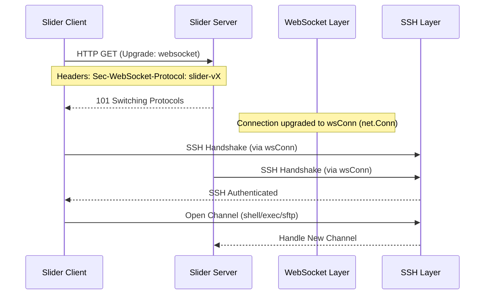
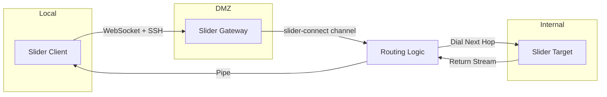
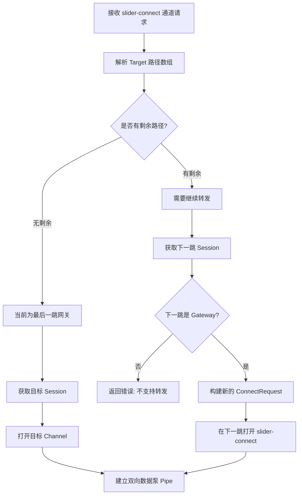
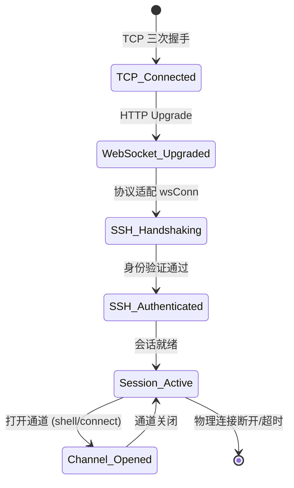
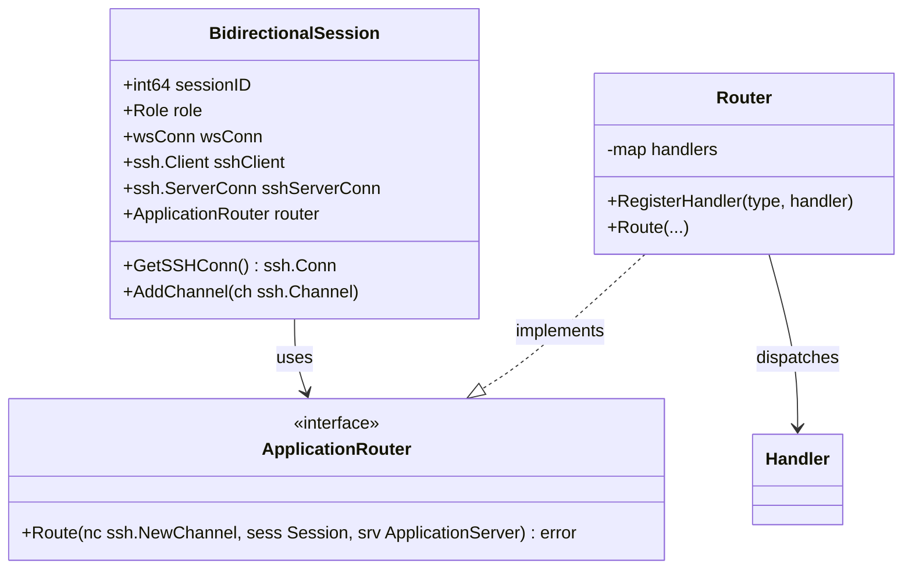

# 核心模式与连接机制

## 目录
1. [模块概述](#模块概述)
2. [核心模式解析](#核心模式解析)
   - [Client 模式：主动连接者](#client-模式主动连接者)
   - [Server 模式：服务监听者](#server-模式服务监听者)
   - [Gateway 模式：多级跳板中转](#gateway-模式多级跳板中转)
   - [Beacon 模式：反向连接与隧道](#beacon-模式反向连接与隧道)
3. [核心组件实现](#核心组件实现)
   - [WebSocket 传输层封装](#websocket-传输层封装)
   - [SSH 隧道适配层](#ssh-隧道适配层)
   - [监听器与路由分发逻辑](#监听器与路由分发逻辑)
4. [架构概览与连接流转](#架构概览与连接流转)
   - [SSH over WebSocket 握手流程](#ssh-over-websocket-握手流程)
   - [多级跳板数据流转](#多级跳板数据流转)
5. [关键算法与逻辑分析](#关键算法与逻辑分析)
   - [多跳路由解析算法](#多跳路由解析算法)
   - [WebSocket 升级与验证](#websocket-升级与验证)
6. [连接状态与生命周期](#连接状态与生命周期)
   - [连接状态机](#连接状态机)
   - [会话组件关系](#会话组件关系)
7. [数据模型与协议定义](#数据模型与协议定义)
8. [文件参考](#文件参考)

## 模块概述

本模块是 Slider 系统的核心通信基石，负责在各种复杂网络环境下建立稳定、安全的加密隧道。Slider 不仅仅是一个简单的 SSH 客户端或服务器，它通过将 SSH 协议封装在 WebSocket 之上，实现了对防火墙和代理的深度穿透，并支持多级跳板（Gateway）和反向连接（Beacon）等高级网络拓扑。

在本次代码审计与文档生成过程中，我们深入探索了以下子模块：
- `pkg/sconn`: 传输层适配，包括 WebSocket 和 SSH Channel 到 `net.Conn` 的转换。
- `pkg/listener`: 监听器实现，负责 HTTP/WebSocket 路由分发与连接升级。
- `pkg/remote`: 远程代理逻辑，实现了多级跳板的核心路由与转发机制。
- `pkg/session`: 会话管理中心，定义了 `BidirectionalSession` 统一处理不同角色的连接。

**统计数据**：
- 发现相关源文件：11 个
- 核心子目录：3 个 (`sconn`, `listener`, `remote`)
- 深度覆盖模块：全部子目录及 `pkg/session` 核心逻辑。

## 核心模式解析

Slider 定义了四种运行模式，每种模式在网络拓扑中承担不同的角色。理解这些模式对于掌握 Slider 的组网能力至关重要。

### Client 模式：主动连接者
Client 模式是 Slider 的发起端。它主动向远程 Server 或 Gateway 发起 WebSocket 连接。连接建立后，Client 会通过 WebSocket 握手升级协议，并在其上启动 SSH 客户端。Client 模式通常用于运维人员的本地终端，作为操作的起点。

### Server 模式：服务监听者
Server 模式负责在特定端口监听 WebSocket 请求。当收到合法的 Slider 升级请求时，它会将连接转换为 SSH 服务端连接，等待 Client 的身份验证和指令执行。Server 模式是 Slider 最基本的部署形态，类似于传统的 SSHD，但具备更好的隐藏性和穿透性。

### Gateway 模式：多级跳板中转
Gateway 是 Slider 最强大的模式之一。它既是一个 Server（接受下游连接），又可以作为一个 Client（连接上游节点）。Gateway 维护了一个会话表，能够解析特殊的 `slider-connect` 协议，将数据流透明地转发到后续节点，从而实现无限层级的跳板访问。Gateway 是构建复杂内网渗透路径的核心。

### Beacon 模式：反向连接与隧道
Beacon 模式主要用于内网穿透。在这种模式下，处于内网的 Slider 节点会主动向外网的 Controller 发起连接（反向连接）。一旦连接建立，外网 Controller 就可以通过这个已有的隧道反向控制内网节点，绕过 NAT 和防火墙限制。Beacon 模式通常与 Gateway 模式结合使用，构建从外到内的双向通道。

## 核心组件实现

### WebSocket 传输层封装

Slider 的底层传输并不是直接基于 TCP，而是通过 `pkg/sconn/wsconn.go` 将 `gorilla/websocket` 封装成标准的 `net.Conn` 接口。这种设计的巧妙之处在于，上层的 SSH 协议栈完全感知不到底层是 WebSocket，从而实现了无缝的协议叠加。

```go
// pkg/sconn/wsconn.go

type wsConn struct {
	*websocket.Conn
	buff []byte
}

func (w *wsConn) Read(p []byte) (int, error) {
	var src []byte
	// 优先从缓冲区读取剩余数据
	if len(w.buff) > 0 {
		src = w.buff
		w.buff = nil
	} else if _, pConn, err := w.ReadMessage(); err == nil {
		src = pConn
	} else {
		return 0, err
	}

	var n int
	dl := len(p)
	if len(src) > dl {
		// 如果 WebSocket 消息大于读取请求，则存入缓冲区
		n = copy(p, src[:dl])
		r := src[dl:]
		w.buff = make([]byte, len(r))
		copy(w.buff, r)
	} else {
		n = copy(p, src)
	}
	return n, nil
}
```

> **注意**：由于 WebSocket 是面向消息的协议，而 `net.Conn` 是面向字节流的，`wsConn` 实现了一个内部缓冲区 `buff`，用于处理 WebSocket 消息大小与 `Read` 请求大小不匹配的情况。

### SSH 隧道适配层

在多级跳板场景中，Slider 需要在一个 SSH 通道（Channel）内再嵌套运行另一个协议或连接。`pkg/sconn/sshchanconn.go` 实现了将 `ssh.Channel` 包装成 `net.Conn` 的逻辑。

```go
// pkg/sconn/sshchanconn.go

type ChannelConn struct {
	ssh.Channel
	localAddr  net.Addr
	remoteAddr net.Addr
}

// SSHChannelToNetConn 将 SSH 通道转换为 net.Conn 接口
func SSHChannelToNetConn(channel ssh.Channel) net.Conn {
	localAddr := &net.TCPAddr{IP: net.IPv4(127, 0, 0, 1), Port: 0}
	remoteAddr := &net.TCPAddr{IP: net.IPv4(127, 0, 0, 1), Port: 0}

	return &ChannelConn{
		Channel:    channel,
		localAddr:  localAddr,
		remoteAddr: remoteAddr,
	}
}
```

### 监听器与路由分发逻辑

`pkg/listener` 负责处理初始的 HTTP/WebSocket 请求。它通过检查特定的 HTTP Header 来识别 Slider 连接。

```go
// pkg/listener/websocket.go

func IsSliderWebSocket(r *http.Request, customProto string, operations []string) bool {
	upgradeHeader := r.Header.Get("Upgrade")
	if strings.ToLower(upgradeHeader) != "websocket" {
		return false
	}
    // 验证 Sec-WebSocket-Protocol 和 Sec-WebSocket-Operation
    // ...
}
```

Slider 使用自定义的 WebSocket 子协议进行版本协商和操作类型指定，这增强了连接的安全性和灵活性。

**Section sources**:
- [wsconn.go](pkg/sconn/wsconn.go)
- [sshchanconn.go](pkg/sconn/sshchanconn.go)
- [websocket.go](pkg/listener/websocket.go)

## 架构概览与连接流转

### SSH over WebSocket 握手流程

Slider 的连接建立是一个多层级升级的过程。下面的序列图展示了从初始 HTTP 请求到最终 SSH 会话建立的全过程。



在握手阶段，`wsConn` 充当了 SSH 协议的物理层。Server 端在接收到 WebSocket 连接后，会调用 `ssh.NewServerConn` 并传入 `wsConn` 实例。这种分层设计使得 Slider 可以轻松地在任何支持 WebSocket 的中间件（如 Nginx, Cloudflare）后运行。

### 多级跳板数据流转

在 Gateway 模式下，数据流转涉及多个节点的嵌套。Slider 通过 `slider-connect` 通道实现这一功能。



当 Client 需要访问 Target 时，它会向 Gateway 发起一个 `slider-connect` 类型的通道请求，Payload 中包含目标路径（如 `[TargetID]`）。Gateway 解析路径后，建立与 Target 的连接，并将 Client 的通道数据与 Target 的连接进行“泵（Pipe）”处理。这种机制允许数据流在多个节点间透明传递，而每个节点只需关注其下一跳。

**Diagram sources**:
- [handlers.go:L106-L151](pkg/remote/handlers.go#L106-L151) - `pipeChannels` 实现
- [proxy.go:L30-L47](pkg/remote/proxy.go#L30-L47) - `OpenChannel` 代理实现

## 关键算法与逻辑分析

### 多跳路由解析算法

Slider 支持任意长度的跳转路径。核心逻辑位于 `pkg/remote/handlers.go` 的 `routeToNextHop` 函数中。它采用递归/迭代的方式解析 `Target` 数组。

下面的流程图展示了路由解析的决策过程：



该算法通过不断剥离 `Target` 数组的第一个元素（`nextHopID`），将请求逐级传递，直到到达最终目标。这种设计保证了路径解析的简洁性和可扩展性。

### WebSocket 升级与验证

为了防止非法的 WebSocket 连接，Slider 在 `pkg/listener/websocket.go` 中实现了一套验证逻辑。它不仅检查标准的 `Upgrade` 头，还通过 `Sec-WebSocket-Protocol` 验证协议版本，并使用 `Sec-WebSocket-Operation` 区分不同的操作意图（如控制台访问或代理连接）。

## 连接状态与生命周期

### 连接状态机

Slider 的连接从物理层到应用层经历了多个状态转换。理解这些状态有助于排查连接中断或握手失败的问题。



状态转换过程中，任何一层的失败都会导致整个连接的销毁。例如，如果 WebSocket 升级失败，连接将在 HTTP 层关闭；如果 SSH 验证失败，物理 WebSocket 连接也会随之断开。

### 会话组件关系

`BidirectionalSession` 是 Slider 会话管理的核心结构。它集成了网络连接、SSH 状态以及各种应用功能模块。



`BidirectionalSession` 通过持有 `ApplicationRouter` 接口，实现了对应用层协议（如 `slider-connect`）的灵活扩展。这使得 Slider 可以在不修改核心会话逻辑的情况下，增加新的功能通道。

**Diagram sources**:
- [session.go:L17-L87](pkg/session/session.go#L17-L87) - `BidirectionalSession` 结构定义
- [router.go:L15-L51](pkg/remote/router.go#L15-L51) - `Router` 实现

## 数据模型与协议定义

### ConnectRequest
用于 `slider-connect` 通道的 Payload，定义了跳转的目标和原始请求信息。
- `Target []int64`: 节点 ID 序列，代表跳转路径。
- `ChannelType string`: 最终要打开的 SSH 通道类型（如 "shell"）。
- `Payload []byte`: 原始通道请求的额外数据。

### ForwardRequestPayload
用于全局请求（Global Request）的转发，如端口转发请求。
- `Target []int64`: 目标路径。
- `ReqType string`: 请求类型。
- `Payload []byte`: 请求负载。

## 文件参考

本章节涉及的核心源文件如下：

- `pkg/sconn/wsconn.go`: WebSocket 到 `net.Conn` 的适配器实现。
- `pkg/sconn/sshchanconn.go`: SSH Channel 到 `net.Conn` 的适配器实现。
- `pkg/listener/websocket.go`: WebSocket 协议检测与升级逻辑。
- `pkg/listener/router.go`: HTTP 路由配置与处理器。
- `pkg/remote/handlers.go`: `slider-connect` 通道处理与多级跳板核心逻辑。
- `pkg/remote/proxy.go`: 远程代理请求的封装。
- `pkg/remote/router.go`: 应用层通道路由器实现。
- `pkg/session/session.go`: 统一会话结构 `BidirectionalSession` 的定义。

**Section sources**:
- [proxy.go](pkg/remote/proxy.go)
- [handlers.go](pkg/remote/handlers.go)
- [session.go](pkg/session/session.go)
