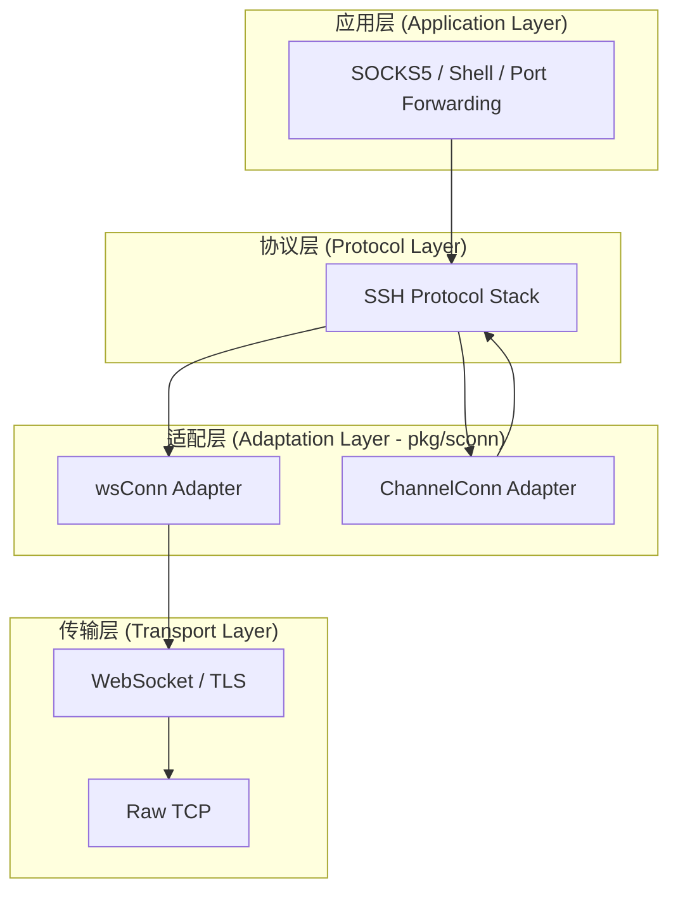
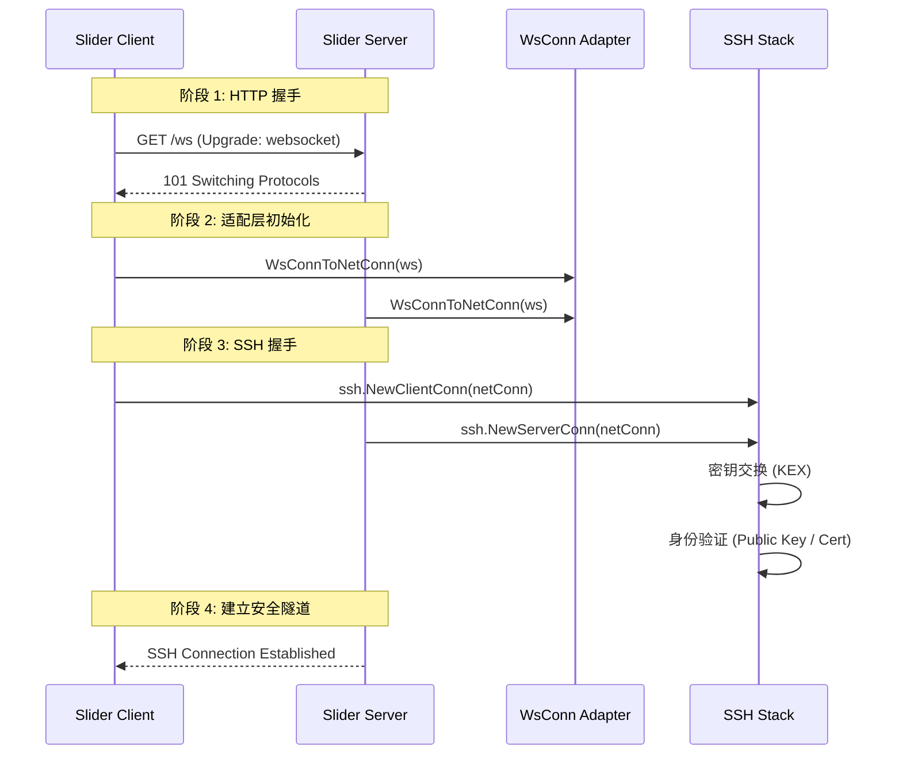

# 传输层实现：SSH over WebSocket

## 目录
1. [模块概览](#模块概览)
2. [引言](#引言)
3. [核心架构](#核心架构)
4. [WebSocket 包装器实现 (wsconn.go)](#websocket-包装器实现-wsconngo)
   - [适配器模式的应用](#适配器模式的应用)
   - [流式读取与内部缓冲机制](#流式读取与内部缓冲机制)
5. [SSH 通道适配器 (sshchanconn.go)](#ssh-通道适配器-sshchanconngo)
   - [嵌套连接的必要性](#嵌套连接的必要性)
   - [虚拟地址与接口兼容性](#虚拟地址与接口兼容性)
6. [连接握手与协议升级流程](#连接握手与协议升级流程)
7. [数据流与状态管理](#数据流与状态管理)
8. [性能与可靠性考量](#性能与可靠性考量)
9. [集成与实际应用场景](#集成与实际应用场景)
10. [测试策略](#测试策略)
11. [文件引用](#文件引用)

## 模块概览

`pkg/sconn` 模块是 Slider 传输层的核心，负责将底层的通信协议（如 WebSocket 或 SSH Channel）适配为 Go 语言标准库中的 `net.Conn` 接口。这种适配器模式使得上层的 SSH 协议栈可以无缝地运行在不同的传输介质之上。

该模块包含以下核心文件：
- `wsconn.go`: 实现 WebSocket 到 `net.Conn` 的转换，是 Slider 穿透防火墙的关键。
- `sshchanconn.go`: 实现 SSH Channel 到 `net.Conn` 的转换，用于支持多级跳板和嵌套隧道。
- `sconn_test.go`: 包含针对这些适配器的单元测试。

**范围说明**：
本页面将深入探讨这两个适配器的内部实现逻辑、它们在 Slider 全局架构中的位置，以及它们如何通过协议升级实现安全隐蔽的通信。

## 引言

在现代网络环境中，防火墙和深度包检测（DPI）系统通常对标准的 SSH 流量（默认端口 22）进行严格限制或完全封锁。然而，HTTPS 流量（默认端口 443）几乎在所有网络中都是被允许的。Slider 的核心设计哲学之一就是利用 WebSocket 协议作为“载体”，在其之上封装 SSH 协议，从而实现隐蔽且强大的远程访问能力。

通过将 SSH 封装在 WebSocket 中，Slider 获得了以下优势：
1. **防火墙穿透**：流量在外观上表现为标准的 HTTP/1.1 或 HTTP/2 升级请求，随后转换为 WebSocket 二进制流，能够轻易绕过只允许 Web 流量的防火墙。
2. **双重加密**：数据首先经过 SSH 的加密（提供身份验证和前向安全性），然后通过 TLS（HTTPS）再次加密，提供了极高的安全性。
3. **协议复用**：同一个 443 端口可以同时提供普通的 Web 服务和 Slider 的后端控制通道。

为了实现这一目标，Slider 需要解决一个核心技术挑战：`gorilla/websocket` 提供的接口是基于“消息”（Message）的，而 `golang.org/x/crypto/ssh` 期望的是一个流式（Stream）的 `net.Conn` 接口。`pkg/sconn` 模块正是为了弥补这一鸿沟而存在的。

## 核心架构

Slider 的传输层采用了典型的分层架构。每一层都为上一层提供抽象，最终在应用层呈现为一个标准的 SSH 连接。



在上述架构中，`pkg/sconn` 扮演了关键的“中间人”角色。它向上提供 `net.Conn` 接口，使得 SSH 协议栈无需关心底层到底是原始 TCP 连接、WebSocket 连接，还是另一个 SSH 通道。这种解耦设计极大地增强了系统的灵活性和可扩展性。

**架构说明**：
- **应用层**：用户最终使用的功能，如 SOCKS5 代理或远程 Shell。
- **协议层**：处理 SSH 握手、密钥交换、加密和多路复用。
- **适配层**：本文重点，负责将非流式接口转换为流式接口。
- **传输层**：底层的物理或逻辑连接。

**Diagram sources**:
- [wsconn.go:L10-L64](pkg/sconn/wsconn.go#L10-L64)
- [sshchanconn.go:L10-L65](pkg/sconn/sshchanconn.go#L10-L65)

## WebSocket 包装器实现 (wsconn.go)

### 适配器模式的应用

`wsconn.go` 定义了一个私有的 `wsConn` 结构体，它嵌入了 `*websocket.Conn` 并实现了 `net.Conn` 接口的所有方法。最核心的挑战在于如何将 WebSocket 的 `ReadMessage`（返回完整的一块数据）适配到 `Read([]byte)`（可能只读取数据的一部分）。

```go
type wsConn struct {
	*websocket.Conn
	buff []byte
}
```

通过 `WsConnToNetConn` 函数，Slider 将一个现有的 WebSocket 连接包装成 `net.Conn`：

```go
func WsConnToNetConn(websocketConn *websocket.Conn) net.Conn {
	w := wsConn{
		Conn: websocketConn,
	}
	return &w
}
```

### 流式读取与内部缓冲机制

在 `Read` 方法中，Slider 实现了一个简单的缓冲区逻辑。如果上一次从 WebSocket 读取的消息没有被完全消费，剩余的数据将存储在 `buff` 中，供下一次 `Read` 调用使用。

```go
func (w *wsConn) Read(p []byte) (int, error) {
	var src []byte

	// 1. 优先从内部缓冲区读取数据
	if len(w.buff) > 0 {
		src = w.buff
		w.buff = nil
	} else if _, pConn, err := w.ReadMessage(); err == nil {
		// 2. 如果缓冲区为空，则从 WebSocket 读取新消息
		src = pConn
	} else {
		return 0, err
	}

	var n int
	dl := len(p)
	// 3. 处理数据拷贝和缓冲区更新
	if len(src) > dl {
		n = copy(p, src[:dl])
		r := src[dl:]
		w.buff = make([]byte, len(r))
		copy(w.buff, r)
	} else {
		n = copy(p, src)
	}

	return n, nil
}
```

这种机制确保了 SSH 协议栈在调用 `Read` 时，即使传入的切片 `p` 小于 WebSocket 消息的大小，也不会丢失数据。这对于处理 SSH 这种对数据完整性要求极高的协议至关重要。

**Section sources**:
- [wsconn.go](pkg/sconn/wsconn.go)

## SSH 通道适配器 (sshchanconn.go)

### 嵌套连接的必要性

在多级跳板（Gateway）场景中，Slider 需要在已建立的 SSH 通道内部再次运行 SSH 协议。例如，客户端连接到 Gateway A，Gateway A 再通过 SSH 通道连接到 Agent B。此时，Agent B 看到的“底层连接”实际上是 Gateway A 开启的一个 SSH Channel。

为了让 SSH 客户端库能够在这种通道上运行，Slider 实现了 `ChannelConn`。

### 虚拟地址与接口兼容性

`ssh.Channel` 本身实现了 `io.ReadWriteCloser`，但 `net.Conn` 还要求实现 `LocalAddr()`、`RemoteAddr()` 和 `SetDeadline()` 等方法。由于 SSH 通道并不直接对应于物理 TCP 端口，Slider 使用了虚拟的环回地址来满足接口要求。

```go
func (cc *ChannelConn) LocalAddr() net.Addr {
	if cc.localAddr == nil {
		return &net.TCPAddr{IP: net.IPv4(127, 0, 0, 1), Port: 0}
	}
	return cc.localAddr
}

func (cc *ChannelConn) SetDeadline(_ time.Time) error {
	// SSH 通道本身不支持截止时间设置，因此这里选择忽略以保持兼容性
	return nil
}
```

这种设计允许 Slider 将 SSH 通道透明地传递给任何期望 `net.Conn` 的组件，例如 SOCKS5 服务器或另一个 SSH 客户端实例。

**Section sources**:
- [sshchanconn.go](pkg/sconn/sshchanconn.go)

## 连接握手与协议升级流程

Slider 的连接建立是一个多阶段的升级过程。理解这个时序对于调试连接问题至关重要。



这个流程展示了 Slider 如何从一个普通的 HTTP 请求逐步演变为一个高度安全的加密隧道。`WsConn` 适配器在阶段 2 介入，为阶段 3 的 SSH 握手铺平了道路。

**流程说明**：
1. **HTTP 握手**：利用标准 Web 协议建立基础连接。
2. **适配层初始化**：将消息驱动的 WebSocket 转换为流驱动的 `net.Conn`。
3. **SSH 握手**：在 WebSocket 隧道内进行标准的 SSH 协商，包括版本交换、算法协商和身份验证。
4. **安全隧道**：握手完成后，所有后续数据都经过 SSH 加密并封装在 WebSocket 帧中传输。

**Diagram sources**:
- [server/server.go:L83-L120](server/server.go#L83-L120)
- [client/client.go:L64-L112](client/client.go#L64-L112)

## 数据流与状态管理

在数据传输阶段，`wsConn` 必须高效地处理从应用层到底层的双向流动。下面的流程图详细描述了 `Read` 操作的逻辑分支和状态转换。

```mermaid
flowchart TD
    Start([调用 Read(p)]) --> CheckBuf{内部缓冲区 w.buff 是否有数据?}
    CheckBuf -- 是 --> UseBuf[从 w.buff 提取数据]
    CheckBuf -- 否 --> FetchWS[调用 w.ReadMessage 读取 WS 消息]

    FetchWS -- 成功 --> UseWS[使用新读取的消息数据]
    FetchWS -- 失败 --> ReturnErr([返回错误/EOF])

    UseBuf --> CalcSize{数据大小是否超过 p 的容量?}
    UseWS --> CalcSize

    CalcSize -- 是 --> SplitData[拷贝部分数据到 p, 剩余存入 w.buff]
    CalcSize -- 否 --> CopyAll[拷贝全部数据到 p]

    SplitData --> End([返回读取字节数 n])
    CopyAll --> End
```

**逻辑深度解析**：
- **零拷贝优化**：虽然代码中使用了 `make` 和 `copy`，但在处理小块数据时，Slider 优先消费缓冲区，减少了对底层 WebSocket 接口的频繁调用。
- **错误处理**：如果底层 WebSocket 连接关闭，`ReadMessage` 会返回错误，该错误会被原封不动地传递给 SSH 协议栈，触发 SSH 层的连接断开逻辑。
- **原子性**：`Read` 操作通过互斥锁（虽然在 `wsConn` 内部未显式定义，但 `gorilla/websocket` 的 `Conn` 在并发读写上有其自身的限制，Slider 通常在更高层确保每个 Session 的串行读写）保证了数据流的顺序性。

**Diagram sources**:
- [wsconn.go:L15-L41](pkg/sconn/wsconn.go#L15-L41)

## 性能与可靠性考量

在 WebSocket 上运行 SSH 虽然隐蔽，但也带来了一些性能挑战：

1. **协议开销**：
   - 每个 SSH 数据包都会被封装在一个 WebSocket 二进制帧中。
   - WebSocket 帧头增加了 2-14 字节的开销。
   - 如果运行在 HTTPS 上，还有 TLS 的记录层开销。
   - **优化建议**：Slider 通过批量写入和合理的缓冲区设置来减轻这种开销。

2. **TCP-in-TCP 问题**：
   - SSH 是基于 TCP 的，WebSocket 也是基于 TCP 的。当底层网络出现丢包时，两层 TCP 协议栈都会尝试重传，可能导致“重传风暴”。
   - **Slider 的应对**：通过 `SetDeadline` 及时发现僵死连接，并利用 SSH 层的 `KeepAlive` 机制维持连接活跃，避免中间防火墙因长时间无流量而切断 TCP 连接。

3. **连接稳定性**：
   - `wsconn.go` 中的 `SetDeadline` 方法直接映射到了底层 WebSocket 的读写截止时间。
   - 这确保了当网络环境极其恶劣时，Slider 能够快速识别失效连接并尝试重新建立（Beacon 模式）。

```go
func (w *wsConn) SetDeadline(t time.Time) error {
	if err := w.SetReadDeadline(t); err != nil {
		return err
	}
	return w.SetWriteDeadline(t)
}
```

**Section sources**:
- [wsconn.go:L50-L55](pkg/sconn/wsconn.go#L50-L55)

## 集成与实际应用场景

`pkg/sconn` 的设计使得 Slider 能够支持复杂的网络拓扑。

### 场景 A：SOCKS5 代理
在 `pkg/session/routing.go` 中，当接收到 `socks5` 类型的通道请求时，Slider 会使用 `SSHChannelToNetConn`：

```go
// Create a net.Conn from the SSH channel
socksConn := sconn.SSHChannelToNetConn(socksChan)
// Create a new SOCKS5 server
server, _ := socks.NewServer()
// Serve the connection
go server.ServeConn(socksConn)
```
这展示了适配器如何让标准的 SOCKS5 服务器运行在非标准的 SSH 通道上。

### 场景 B：Gateway 跳板
在 `server/gateway.go` 中，Gateway 模式下的服务器充当客户端连接到另一个服务器：

```go
func (s *server) NewSSHClient(biSession *session.BidirectionalSession) {
	netConn := sconn.WsConnToNetConn(biSession.GetWebSocketConn())
	cConn, _, _, err := ssh.NewClientConn(netConn, ..., sshConfig)
    // ...
}
```
这里 `WsConnToNetConn` 再次发挥作用，将入站的 WebSocket 连接转化为出站的 SSH 客户端连接。

## 测试策略

为了验证适配器的正确性，Slider 在 `sconn_test.go` 中使用了模拟（Mock）技术。由于 `ssh.Channel` 是一个复杂的接口，测试代码实现了一个 `mockSSHChannel` 来模拟数据的读写和关闭操作。

```go
func TestSSHChannelToNetConn(t *testing.T) {
	mockChannel := &mockSSHChannel{
		reader: bytes.NewReader([]byte("channel data")),
		writer: &bytes.Buffer{},
	}
	netConn := SSHChannelToNetConn(mockChannel)

	// 验证读取逻辑
	buf := make([]byte, 12)
	n, _ := netConn.Read(buf)
	if string(buf) != "channel data" { ... }

    // 验证关闭逻辑
    netConn.Close()
    if !mockChannel.closed { ... }
}
```

这种测试方法确保了即使在没有真实 SSH 环境的情况下，适配器的基本逻辑（如数据拷贝、错误传递）也是可靠的。

**Section sources**:
- [sconn_test.go](pkg/sconn/sconn_test.go)

## 文件引用

以下是本模块涉及的核心源文件，建议在深入研究实现细节时参考：

- [pkg/sconn/wsconn.go](pkg/sconn/wsconn.go): WebSocket 到 `net.Conn` 的适配实现。
- [pkg/sconn/sshchanconn.go](pkg/sconn/sshchanconn.go): SSH Channel 到 `net.Conn` 的适配实现。
- [pkg/sconn/sconn_test.go](pkg/sconn/sconn_test.go): 传输层适配器的单元测试。
- [server/server.go](server/server.go): 服务器端如何使用 `WsConnToNetConn` 升级连接。
- [client/client.go](client/client.go): 客户端如何建立 WebSocket 并将其包装为 SSH 连接。
- [pkg/session/routing.go](pkg/session/routing.go): 展示了 `SSHChannelToNetConn` 在 SOCKS5 代理中的应用。
- [server/gateway.go](server/gateway.go): Gateway 模式下的连接转换逻辑。

---
💡 **提示**：在调试连接中断问题时，应首先检查 `wsconn.go` 中的 `Read` 错误返回，这通常能反映出底层 WebSocket 握手失败或 TLS 证书问题。
