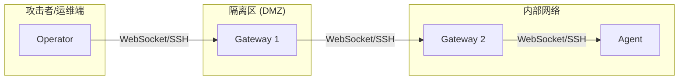
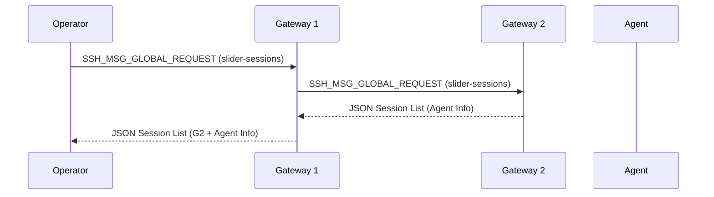
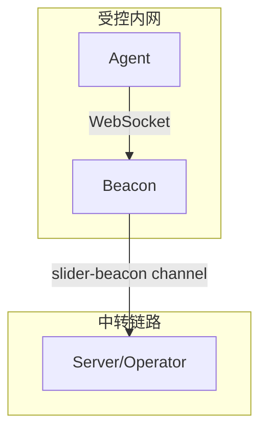
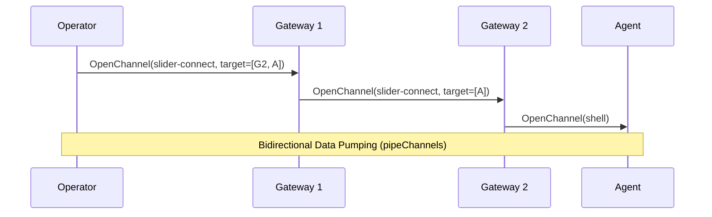
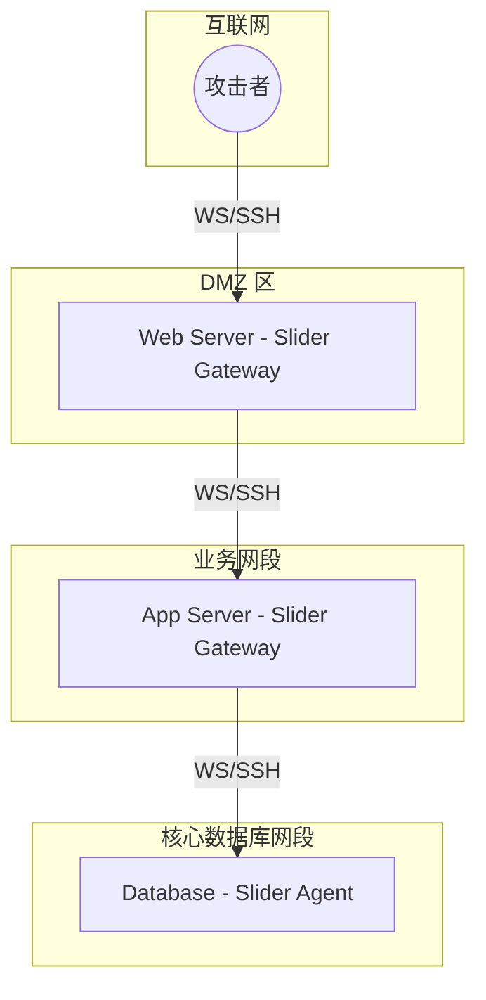

# 扩展拓扑：Gateway 与 Beacon 模式

## 目录
1. [模块概览](#模块概览)
2. [Gateway 模式：多级跳板实现](#gateway-模式多级跳板实现)
   - [级联连接机制](#级联连接机制)
   - [递归会话发现](#递归会话发现)
3. [Beacon 模式：持久化反向信标](#beacon-模式持久化反向信标)
   - [反向隧道原理](#反向隧道原理)
   - [隐蔽性与重连策略](#隐蔽性与重连策略)
4. [远程路由机制 (pkg/remote)](#远程路由机制-pkgremote)
   - [slider-connect 协议详解](#slider-connect-协议详解)
   - [逐跳转发算法](#逐跳转发算法)
5. [数据泵送与请求转发](#数据泵送与请求转发)
6. [应用场景分析](#应用场景分析)
   - [深度内网渗透](#深度内网渗透)
   - [跨云环境运维](#跨云环境运维)
7. [核心组件与接口](#核心组件与接口)
8. [文件参考](#文件参考)

## 模块概览

Slider 的扩展拓扑模块是其作为高级渗透测试与运维工具的核心竞争力所在。通过 `Gateway`（网关）和 `Beacon`（信标）两种模式，Slider 能够构建出远超简单点对点连接的复杂网络架构。

**模块规模统计**：
- **核心文件数**：约 20 个，分布在 `pkg/session`、`pkg/remote`、`server/` 和 `client/` 中。
- **子模块划分**：
  - `pkg/session` (Gateway 逻辑扩展)：负责多级会话的追踪与管理。
  - `pkg/remote` (路由与代理)：实现跨节点的指令转发与数据流泵送。
  - `server/gateway.go` & `client/handler_beacon.go`：提供不同模式下的接入点实现。

本章节将深入探讨 Slider 如何通过 SSH 协议的二次封装实现多级跳板，以及如何利用 Beacon 模式在严苛的内网环境下保持持久化的反向控制通道。

## Gateway 模式：多级跳板实现

Gateway 模式允许一个 Slider Server 实例同时扮演 SSH 服务端和 SSH 客户端的双重角色。这种设计使得 Slider 能够像串联电池一样，将多个节点连接起来，形成一条跨越多个网络边界的通信链路。

### 级联连接机制

在 Gateway 模式下，Slider Server 会主动连接到另一个 Slider Server。这种连接不是简单的 TCP 转发，而是在已有的 WebSocket 通道之上建立一个新的 SSH 客户端连接。

下面的图示展示了典型的 Gateway 级联架构：



当 `Gateway 1` 接收到来自 `Operator` 的连接后，它可以根据配置或指令，启动 `NewSSHClient` 逻辑，向 `Gateway 2` 发起连接。此时，`Gateway 1` 的 `BidirectionalSession` 对象中会同时持有指向 `Operator` 的 `ssh.ServerConn` 和指向 `Gateway 2` 的 `ssh.Client`。

以下是 `server/gateway.go` 中建立级联连接的核心代码：

```go
// NewSSHClient 建立作为客户端的 SSH 连接 (Gateway 模式)
func (s *server) NewSSHClient(
    biSession *session.BidirectionalSession,
    hostKeyCallback ssh.HostKeyCallback,
    clientSigner ssh.Signer,
) {
    netConn := sconn.WsConnToNetConn(biSession.GetWebSocketConn())

    // 配置 SSH 客户端，使用服务器自身的公钥进行身份验证
    sshConfig := &ssh.ClientConfig{
        User:            "slider-server",
        Auth:            []ssh.AuthMethod{ssh.PublicKeys(clientSigner)},
        HostKeyCallback: hostKeyCallback,
        ClientVersion:   "SSH-slider-server-client",
    }

    // 在 WebSocket 之上建立 SSH 握手
    cConn, newChan, reqChan, err := ssh.NewClientConn(netConn, biSession.GetWebSocketConn().RemoteAddr().String(), sshConfig)
    if err != nil {
        return
    }

    // 注入应用程序服务器以访问本地状态
    biSession.SetApplicationServer(s)

    // 启动异步处理器处理传入的通道和请求
    go biSession.HandleIncomingRequests(reqChan)
    go biSession.HandleIncomingChannels(newChan)

    client := ssh.NewClient(cConn, nil, nil)
    biSession.SetSSHClient(client)

    // 阻塞直到连接关闭
    _ = client.Wait()
}
```

出站 Gateway 连接必须提供预期 SSH 指纹；WSS 同时使用系统根证书或显式 CA 验证 TLS。Callback/Listener 连接要求 HTTPS，避免两个传输层同时失去对端身份校验。

### 递归会话发现

为了让 Operator 能够看到整条链路上的所有节点，Slider 实现了 `slider-sessions` 全局请求。这是一个递归的过程：当 Operator 向第一级 Gateway 请求会话列表时，该 Gateway 不仅返回直接连接的节点，还会通过 `SSHRequestSliderSessions` 向其下游的所有 Gateway 发起同样的请求。



在 `pkg/session/gateway_mode.go` 中，`GetRemoteSessions` 函数负责执行这一逻辑。它会将返回的 `RemoteSession` 对象进行路径（Path）标记，确保 Operator 能够知道通过哪些中间节点才能到达目标 Agent。

**Section sources**:
- [pkg/session/gateway_mode.go](pkg/session/gateway_mode.go)
- [server/gateway.go](server/gateway.go)

## Beacon 模式：持久化反向信标

Beacon 模式是专为高对抗环境设计的。与普通 Client 不同，Beacon 旨在通过反向连接穿透防火墙，并利用已有的 Slider 链路进行隐蔽传输。

### 反向隧道原理

Beacon 并不直接暴露 SSH 服务，而是通过一个 WebSocket 监听器接收来自其他 Agent 的连接，并将这些连接封装进一个名为 `slider-beacon` 的 SSH 通道中，转发给上级 Server。



在 `client/handler_beacon.go` 中，客户端处理 Beacon 连接的逻辑如下：

```go
func (c *client) handleBeaconConnection(w http.ResponseWriter, r *http.Request) {
    // 升级为 WebSocket
    wsConn, err := upgrader.Upgrade(w, r, c.httpHeaders)

    // 获取当前与上级服务器的活动会话
    upstreamSess := c.getUpstreamSession()
    upstreamClient := upstreamSess.GetSSHClient()

    // 在上级 SSH 连接中开启一个专用的 Beacon 通道
    channel, reqs, err := upstreamClient.OpenChannel(conf.SSHChannelSliderBeacon, nil)
    if err != nil {
        return
    }
    go ssh.DiscardRequests(reqs)

    // 将 WebSocket 连接包装为 net.Conn 并泵送数据到 SSH 通道
    childConn := sconn.WsConnToNetConn(wsConn)
    tx, rx := sio.PipeWithCancel(childConn, channel)
}
```

这种模式的精妙之处在于，对于防火墙而言，只看到了 Beacon 向外发起的 HTTPS (WebSocket) 流量。而在 Server 端，`server/handler_beacon.go` 会接收此通道并启动新的 SSH 实例：

```go
func (s *server) HandleBeaconConnect(conn net.Conn, parentSessionID int64) {
    // 为 Beacon 代理创建新会话，并记录父级会话 ID 用于路径追踪
    biSession := session.NewServerFromClientSession(...)
    biSession.SetParentSessionID(parentSessionID)
    biSession.SetRole(session.OperatorListener)
    biSession.SetPeerRole(session.AgentConnector)

    // 在此连接上启动 SSH 服务端逻辑
    s.NewSSHServer(biSession)
}
```

### 隐蔽性与重连策略

Beacon 模式在 `client/config.go` 中实现了增强的重连机制。通过 `--retry` 参数，Beacon 会在连接断开后进入无限循环重试模式，并结合 `keepalive` 配置进行指数退避或固定频率的尝试。

此外，Beacon 允许自定义 `customProto`（WebSocket 子协议字符串），这使得通信特征可以根据环境进行伪装，避开深度数据包检测（DPI）的识别。

**Section sources**:
- [client/handler_beacon.go](client/handler_beacon.go)
- [server/handler_beacon.go](server/handler_beacon.go)
- [client/config.go](client/config.go)

## 远程路由机制 (pkg/remote)

当拓扑结构变得复杂（例如 3 级跳板 + 2 级 Beacon）时，如何准确地将指令发送到目标节点？Slider 引入了基于路径数组（`targetPath []int64`）的路由机制。

### slider-connect 协议详解

`slider-connect` 是 Slider 自定义的一种 SSH 通道类型，专门用于跨节点建立连接。其载荷 `ConnectRequest` 包含了两个关键信息：
1. **Target**: 一个整数数组，代表到达目标节点的会话 ID 序列。
2. **ChannelType**: 最终想要在目标节点上开启的通道类型（如 `shell` 或 `sftp`）。

```go
type ConnectRequest struct {
	Target      []int64 `json:"target"`       // 目标路径 (例如 [1, 2, 3])
	ChannelType string  `json:"channel_type"` // 最终通道类型
	Payload     []byte  `json:"payload"`      // 初始载荷
}
```

### 逐跳转发算法

路由逻辑实现在 `pkg/remote/handlers.go` 的 `routeToNextHop` 函数中。每个中间节点在收到 `slider-connect` 请求时，会执行以下逻辑：

1. **解析路径**：取出 `Target` 数组的第一个元素作为 `nextHopID`。
2. **检查剩余路径**：
   - 如果剩余路径为空，说明当前节点的下游直接连接着目标节点。此时直接在下游会话上开启 `ChannelType` 指定的通道。
   - 如果剩余路径不为空，说明还需要继续转发。此时在下游会话上开启一个新的 `slider-connect` 通道，并将缩短后的路径发送过去。



**Section sources**:
- [pkg/remote/proxy.go](pkg/remote/proxy.go)
- [pkg/remote/handlers.go](pkg/remote/handlers.go)

## 数据泵送与请求转发

在多级路由中，最关键的技术点是如何在不破坏 SSH 协议语义的情况下转发数据和控制请求。Slider 使用了 `pipeChannels` 函数来实现这一目标。

```go
func pipeChannels(local, remote ssh.Channel, localReqs, remoteReqs <-chan *ssh.Request) {
    // 1. 数据流双向拷贝 (Stdout/Stderr)
    go func() {
        _, _ = io.Copy(local, remote)
        _ = local.CloseWrite()
    }()
    go func() {
        _, _ = io.Copy(remote, local)
        _ = remote.CloseWrite()
    }()

    // 2. SSH 全局/通道请求双向转发 (例如窗口大小改变、环境变量设置)
    go func() {
        for req := range localReqs {
            ok, _ := remote.SendRequest(req.Type, req.WantReply, req.Payload)
            if req.WantReply {
                _ = req.Reply(ok, nil)
            }
        }
    }()
    // ... 对 remoteReqs 执行同样的逻辑
}
```

这种逐跳转发的机制确保了中间节点不需要知道完整的拓扑结构，只需要知道如何到达“下一跳”。同时，所有的加密都在端到端完成，中间节点仅负责密文的转发，保证了通信的安全性。

**Section sources**:
- [pkg/remote/handlers.go](pkg/remote/handlers.go)

## 应用场景分析

### 深度内网渗透

在典型的渗透测试场景中，攻击者可能首先获取了 DMZ 区一台 Web 服务器的权限。通过在该服务器上部署 Slider 并开启 Gateway 模式，可以进一步渗透第二层甚至第三层业务网段。



在这种结构下，攻击者可以直接在本地通过 `slider-cli` 执行 `proxy --target [WebID, AppID, DBID] shell`，从而获得数据库服务器的交互式 Shell。

### 跨云环境运维

对于管理多个云服务商（如 AWS, Azure, 阿里云）的运维人员，可以在每个云环境的跳板机上部署 Slider Gateway。通过级联连接，运维人员只需维持一个与中心服务器的连接，即可访问所有云环境中的私有实例，无需为每个环境配置复杂的 VPN 或安全组规则。

**Section sources**:
- [pkg/remote/router.go](pkg/remote/router.go)

## 核心组件与接口

### `pkg/remote/Proxy`
`Proxy` 结构体是发起远程连接的客户端封装。它负责构造 `ConnectRequest` 并通过 `slider-connect` 通道将其发送出去。它实现了类似于 `ssh.Client` 的接口，使得上层逻辑可以无感知地进行跨节点操作。

### `pkg/remote/Router`
`Router` 负责在服务端分发自定义通道请求。它维护了一个从通道名称到处理函数（`Handler`）的映射表。在 Gateway 模式下，它会将 `slider-connect` 路由给 `HandleSliderConnect` 函数。

### `pkg/session/BidirectionalSession` (扩展部分)
在 Gateway 模式下，`BidirectionalSession` 增加了对 `remoteSessions` 的管理。它使用读写锁（`remoteSessionsMutex`）保护远程会话列表，并提供了确定性排序的获取方法，这对于 UI 展示和路径计算至关重要。

**Section sources**:
- [pkg/remote/proxy.go](pkg/remote/proxy.go)
- [pkg/remote/router.go](pkg/remote/router.go)
- [pkg/session/gateway_mode.go](pkg/session/gateway_mode.go)

## 文件参考

以下是实现扩展拓扑逻辑的关键源代码文件：

- `pkg/session/gateway_mode.go`: 定义了 Gateway 模式下的会话发现与远程会话管理逻辑。
- `pkg/session/routing.go`: 实现了基础的通道路由逻辑，包括对 `slider-connect` 和 `slider-beacon` 的识别。
- `pkg/remote/proxy.go`: 实现了客户端侧的远程代理逻辑，负责路径封装。
- `pkg/remote/handlers.go`: 核心路由转发算法 `routeToNextHop` 的所在地。
- `server/gateway.go`: 实现了 Server 作为 SSH 客户端连接上游 Gateway 的逻辑。
- `server/handler_beacon.go`: 处理反向信标通道的接入与会话初始化。
- `client/handler_beacon.go`: 客户端侧的 Beacon 监听与隧道封装实现。
- `pkg/remote/router.go`: 通用的应用层通道路由器定义。
