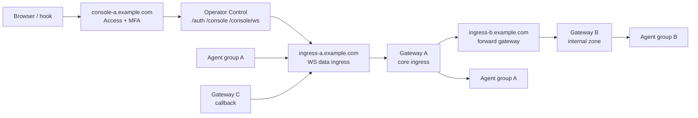

# 控制面与数据面隔离最佳实践

## 目录
1. [设计目标](#设计目标)
2. [推荐拓扑](#推荐拓扑)
3. [边界分层模型](#边界分层模型)
   - [控制面入口](#控制面入口)
   - [数据面入口](#数据面入口)
   - [Gateway 分区](#gateway-分区)
4. [Cloudflare / CDN 配置建议](#cloudflare--cdn-配置建议)
   - [控制面域名](#控制面域名)
   - [数据面域名](#数据面域名)
   - [Origin 防直连](#origin-防直连)
5. [Slider 节点配置模板](#slider-节点配置模板)
   - [Operator 控制节点](#operator-控制节点)
   - [Gateway A：核心接入区](#gateway-a核心接入区)
   - [Gateway B：正向扩展区](#gateway-b正向扩展区)
   - [Gateway C：反向 Callback 区](#gateway-c反向-callback-区)
6. [身份校验与信任锚](#身份校验与信任锚)
7. [运维检查清单](#运维检查清单)
8. [当前实现边界](#当前实现边界)
9. [文件参考](#文件参考)

## 设计目标

在复杂网络中部署 Slider 时，应将控制面和数据面视为两个不同的安全域：

- **控制面**：面向操作者，承载本地 Console、Web Console、`hook` 终端和证书管理等高权限入口。
- **数据面**：面向 Agent、Gateway、Callback 等持久连接，承载 SSH over WebSocket 会话和业务通道。
- **Gateway 分区**：不同 Gateway 扮演不同的 listener 角色，按网络区域、方向和信任等级隔离接入。

当前 Slider 的 Server 进程内部使用一个 HTTP(S) listener 承载多类请求。应用层通过路径和 WebSocket Header 分流：`/console` 与 `/console/ws` 进入 Web Console；带有 `Sec-WebSocket-Protocol` 和 `Sec-WebSocket-Operation` 的 WebSocket 请求进入 Agent/Gateway/Callback 会话。因此，生产部署中的隔离不能只依赖应用路由，还需要在 CDN、反向代理、主机防火墙和进程边界上共同完成。

## 推荐拓扑

推荐使用独立域名表达不同平面，并将 Gateway 作为不同网络区域的受控 listener：



该拓扑将访问路径拆成三类：

1. 操作者只访问 `console-a.example.com`，通过 Web Console 或 `hook` 进入本地控制台。
2. Agent、Gateway peer 和 Callback 只访问 `ingress-*.example.com`，建立 SSH over WebSocket 数据连接。
3. Gateway A/B/C 使用独立身份、独立指纹和独立证书授权，避免一个入口失守后自动扩大到所有网络区域。

## 边界分层模型

### 控制面入口

控制面入口只服务人机交互：

- 允许路径：`/auth`、`/auth/challenge`、`/auth/token`、`/auth/logout`、`/console`、`/console/ws`、`/console/assets/*`。
- 推荐开启 Cloudflare Access、SSO、MFA 和设备策略。
- Slider 仍应开启 `--auth --http-console`，不要只依赖 CDN 登录。
- 如果需要本地 Console 和 Web Console 同时可用，Server 不要使用 `--headless`，但仍显式开启 `--http-console`。

控制面只负责进入当前 Operator Server 的 `Console`。通过该 Console 执行 `connect`、`sessions`、`shell`、`socks`、`portfwd` 后，后续访问下游 Gateway 和 Agent 依赖 SSH 会话层的指纹与证书校验，而不是复用 `/console` 的 JWT。

### 数据面入口

数据面入口只服务长期 WebSocket 会话：

- 允许 WebSocket Upgrade。
- 保留 `Sec-WebSocket-Protocol` 和 `Sec-WebSocket-Operation` Header。
- 按域名或路径规则限制允许的 Operation，例如 `agent`、`operator`、`callback`。
- 禁用缓存和内容改写。
- 不建议对数据面启用 Cloudflare Access，除非客户端代码支持自动携带 Access service token。

当前代码在服务端优先识别 Slider WebSocket Header，不依赖 URL Path 判断 Agent/Gateway 连接。因此，如果一个数据面请求带着合法 Header 到达同一个 origin listener，它会绕过普通 HTTP 路由并进入 SSH 会话处理。外层的 CDN/WAF 规则必须承担 hostname 和 operation 的隔离职责。

### Gateway 分区

Gateway 应按职责拆分：

- **Gateway A**：核心接入区，接受 Operator、Agent 和 Callback，负责统一枚举与路由。
- **Gateway B**：正向扩展区，由 A 使用 `connect --gateway` 主动连接，代表另一个网络区域的 listener。
- **Gateway C**：反向 Callback 区，由 C 主动连接 A，但由 A 控制 C 及其后方会话。

这种设计让每个 Gateway 都像一个受控 listener：它暴露一个明确的接入面，只接受属于该区域的连接，并通过内层 SSH 指纹和证书授权建立信任。

## Cloudflare / CDN 配置建议

### 控制面域名

`console-a.example.com` 建议配置如下：

1. SSL/TLS 使用 `Full (strict)`。
2. 开启 WebSockets。
3. 对 `/auth*`、`/console*` 禁用缓存。
4. 启用 Cloudflare Access、MFA 和最小用户组授权。
5. WAF 拦截带 `Sec-WebSocket-Operation: agent|operator|callback|gateway` 的请求，避免数据面连接误入控制域名。

控制面域名可以暴露 Web Console，但不应作为 Agent 或 Gateway 的公开接入地址。

### 数据面域名

`ingress-a.example.com`、`ingress-b.example.com` 等数据面域名建议配置如下：

1. SSL/TLS 使用 `Full (strict)`。
2. 开启 WebSockets，禁用缓存。
3. 保留 WebSocket Upgrade 相关 Header 和 Slider 自定义 Header。
4. 仅允许所需的 `Sec-WebSocket-Operation` 值：
   - Agent 接入域名：`agent`
   - Operator 到 Gateway 域名：`operator`
   - Callback 域名：`callback`
5. 不启用会改写响应体或注入脚本的功能。

Cloudflare 会终止外层 TLS，因此客户端看到的是 Cloudflare Edge 证书，不是 Slider origin 的 TLS 证书。Slider 的端到端身份应落在内层 SSH HostKey 指纹上：Agent 连接 Gateway 时使用 `--fingerprint`，Operator 连接 Gateway 时 `connect --gateway` 也必须提供 `--fingerprint`。

### Origin 防直连

Origin 防直连是控制面和数据面隔离能否成立的关键：

- 优先使用 Cloudflare Tunnel，让 origin 不暴露公网端口。
- 如果使用公网 origin，只允许 Cloudflare IP 访问 Slider listener。
- 不要在同一个 origin 上同时允许公网直连和 CDN 域名访问。
- 如果 origin 开启 `--listener-ca` 做 mTLS，应认识到 Cloudflare 终止 TLS 后，origin 看到的客户端证书是 Cloudflare 到 origin 的证书，而不是 Slider Agent 的证书。此时应使用 Cloudflare Authenticated Origin Pull 或放弃 origin 层 mTLS，改由内层 SSH 认证承担 Slider 身份校验。

## Slider 节点配置模板

### Operator 控制节点

Operator 控制节点用于承载 Web Console 和本地 Console。若运行在有 TTY 的环境中，可同时保留本地 Console：

```bash
slider server \
  --auth \
  --http-console \
  --listener-cert /etc/slider/operator-origin.crt \
  --listener-key /etc/slider/operator-origin.key \
  --certs /etc/slider/client-certs.json \
  --ca-store \
  --ca-store-path /etc/slider/operator-server-cert.json \
  --keepalive 30s
```

如果以 systemd 或容器方式运行，没有可交互 TTY，则使用 `--headless --http-console`，让 Web Console 成为主要控制入口。

### Gateway A：核心接入区

Gateway A 作为核心 listener，接受来自 Agent、Operator 和 Callback 的会话：

```bash
slider server \
  --gateway \
  --auth \
  --listener-cert /etc/slider/gw-a-origin.crt \
  --listener-key /etc/slider/gw-a-origin.key \
  --certs /etc/slider/gw-a-certs.json \
  --ca-store \
  --ca-store-path /etc/slider/gw-a-server-cert.json \
  --keepalive 30s
```

Operator 连接 A：

```text
Slider# connect --gateway \
  --cert-id 1 \
  --fingerprint <gw-a-slider-ssh-fingerprint> \
  --server-name ingress-a.example.com \
  https://ingress-a.example.com
```

Agent 连接 A：

```bash
slider client https://ingress-a.example.com \
  --key <agent-private-key> \
  --fingerprint <gw-a-slider-ssh-fingerprint> \
  --retry \
  --keepalive 30s
```

### Gateway B：正向扩展区

Gateway B 代表另一个网络区域。A 可以通过 Console 主动连接 B：

```text
Slider# connect --gateway \
  --cert-id 1 \
  --fingerprint <gw-b-slider-ssh-fingerprint> \
  --server-name ingress-b.example.com \
  https://ingress-b.example.com
```

B 的数据面域名只需要允许 `Sec-WebSocket-Operation: operator` 和必要的 Agent 接入策略。若 B 仅作为下游 Gateway，不面向普通 Agent，则可以只放行 `operator`。

### Gateway C：反向 Callback 区

Gateway C 不能被 A 主动访问时，可让 C 主动回连 A：

```bash
slider server \
  --gateway \
  --auth \
  --callback https://ingress-a.example.com \
  --callback-cert-id 1 \
  --callback-server-name ingress-a.example.com \
  --callback-retry \
  --listener-cert /etc/slider/gw-c-origin.crt \
  --listener-key /etc/slider/gw-c-origin.key \
  --certs /etc/slider/gw-c-certs.json \
  --ca-store \
  --ca-store-path /etc/slider/gw-c-server-cert.json
```

当 C 通过 Callback 接入 A 后，A 会把该连接标记为 Gateway 能力会话，Operator 侧可以通过 `sessions` 看到 C 后方可达的远程会话，并通过 `slider-connect` 或 `slider-forward-request` 进行逐跳代理。

## 身份校验与信任锚

当前实现没有 TLS 证书 pinning。TLS/WSS 只使用系统 CA 或 `--server-ca` 指定的 CA 做标准链路校验；真正稳定的 Slider 节点身份来自内层 SSH HostKey 指纹。

建议将信任锚分层管理：

| 层级 | 信任对象 | 推荐配置 |
|---|---|---|
| CDN 到浏览器 | Cloudflare Edge 证书、Access 策略 | `Full (strict)`、Access、MFA |
| CDN 到 Origin | Origin 证书或 Authenticated Origin Pull | 封锁直连，只允许 CDN/Tunnel |
| Slider 会话 | SSH HostKey 指纹 | Agent 和 Gateway 连接均显式 pin `--fingerprint` |
| 操作者身份 | Slider cert jar | `--auth`、独立 cert-id、定期轮换 |
| 会话数据 | SSH Channel / Request | 依赖 SSH 加密和角色路由 |

`--ca-store-path` 应在所有长期节点上固定，否则重启后服务端 SSH 指纹变化，会破坏 Agent 和 Gateway 的 pinning。

## 运维检查清单

部署完成后，应按以下顺序验收：

1. `console-a.example.com` 只能访问 `/auth*`、`/console*`，不能建立 `Sec-WebSocket-Operation: agent|operator|callback` 数据会话。
2. `ingress-a.example.com` 能建立 Agent/Gateway WebSocket，会完整保留 `Sec-WebSocket-Protocol` 和 `Sec-WebSocket-Operation`。
3. Origin 端口无法从公网直连，只能经 Cloudflare Tunnel 或 Cloudflare IP 访问。
4. Operator 连接 Gateway 时必须使用 `connect --gateway --fingerprint <fp>`。
5. Agent 连接 Gateway 时显式使用 `--fingerprint <fp>`，即使外层是 HTTPS。
6. Web Console 登录需要先通过 Cloudflare Access，再通过 Slider `/auth`。
7. `sessions` 能看到 Gateway A 的本地会话、Gateway B 的正向下游会话和 Gateway C 的 Callback 会话。
8. `shell`、`socks`、`portfwd` 对远程会话的操作会通过 `UnifiedSession.Path` 走预期 Gateway，不出现跨区误路由。

## 当前实现边界

需要明确当前代码的边界：

- Server 内部仍是一个 HTTP(S) listener；控制面/数据面的强隔离需要依赖域名、CDN/WAF 规则、origin 防直连或多进程拆分。
- Slider WebSocket 数据会话不依赖 URL Path，合法 Header 到达 origin 后会优先进入 `handleWebSocket`。
- Cloudflare Access 不适合直接套在数据面域名上，因为当前 Agent/Gateway 连接命令没有内置 Access service token Header 注入。
- Cloudflare 会终止外层 TLS；Web Console 页面和登录 JS 对 Cloudflare 可见。高安全场景应将 Cloudflare 视为可信边界，或使用直连/VPN/Tunnel 内部入口。
- 当前没有 TLS leaf/SPKI pinning。如果需要外层 TLS pinning，需要在 `client`、`server.newConnector` 和 `hook` 的 TLS 配置中增加 `VerifyPeerCertificate` 或等效公钥 pinning 逻辑。

## 文件参考

- [server/runtime.go](server/runtime.go): HTTP/HTTPS listener、TLS 配置和 Callback 启动。
- [server/handler.go](server/handler.go): `/console` 路由与 Agent/Gateway WebSocket 分流。
- [server/handler_console_ws.go](server/handler_console_ws.go): Web Console WebSocket 鉴权、PTY 桥接和命令执行。
- [server/connector.go](server/connector.go): Server 主动连接 Client Listener、Gateway 和 Callback 的 TLS/WS/SSH 配置。
- [server/gateway.go](server/gateway.go): Gateway 模式 SSH 客户端、HostKey 指纹校验和 Callback 认证。
- [client/config.go](client/config.go): Client 主动连接的 TLS CA、SNI、客户端证书和 SSH 指纹配置。
- [client/client.go](client/client.go): Client WebSocket 拨号和 SSH HostKey 指纹验证。
- [pkg/listener/websocket.go](pkg/listener/websocket.go): WebSocket Header 检测和 URL scheme 转换。
- [pkg/session/gateway_mode.go](pkg/session/gateway_mode.go): Gateway 递归会话发现。
- [pkg/remote/handlers.go](pkg/remote/handlers.go): `slider-connect` 逐跳路由和数据泵送。

