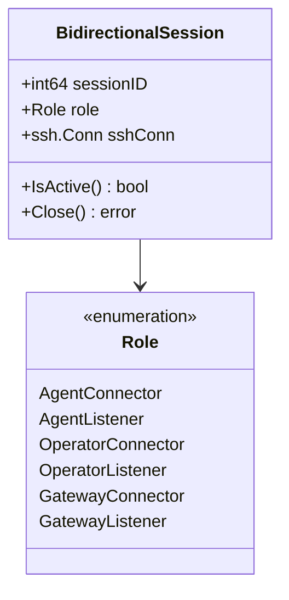
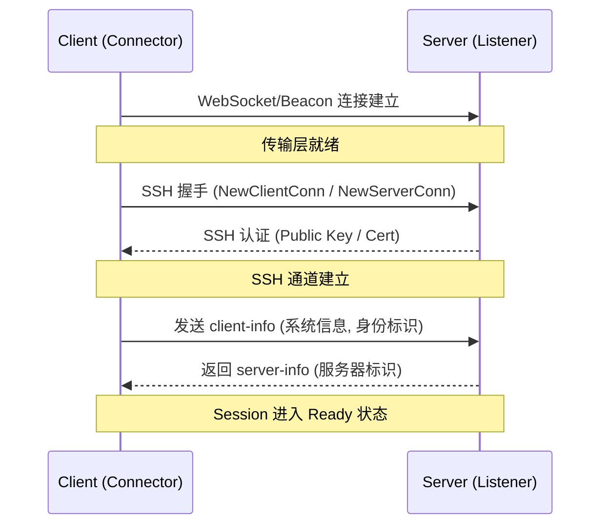
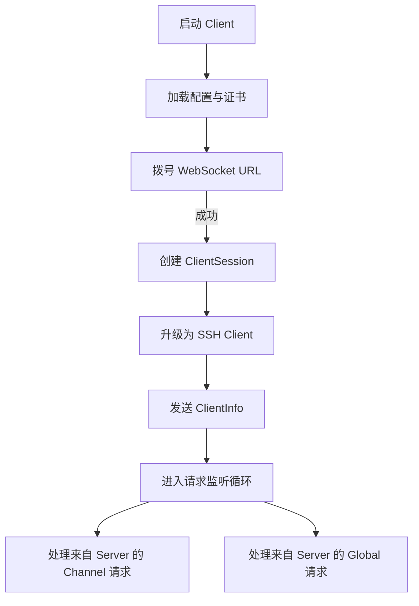
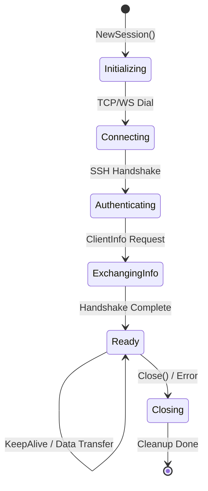

# 核心运行模式：Client 与 Server

## 目录
1. [模块概述](#模块概述)
2. [Session 架构与 BidirectionalSession](#session-架构与-bidirectionalsession)
   - [核心结构体分析](#核心结构体分析)
   - [角色系统 (Role System)](#角色系统-role-system)
3. [Session 生命周期管理](#session-生命周期管理)
   - [连接建立与握手阶段](#连接建立与握手阶段)
   - [身份验证与安全协商](#身份验证与安全协商)
   - [保活机制 (Keep-Alive)](#保活机制-keep-alive)
   - [优雅销毁与资源回收](#优雅销毁与资源回收)
4. [Client 模式深度解析](#client-模式深度解析)
   - [反向连接发起流程](#反向连接发起流程)
   - [客户端并发处理模型](#客户端并发处理模型)
5. [Server 模式深度解析](#server-模式深度解析)
   - [多客户端 Session 管理](#多客户端-session-管理)
   - [重复连接与冲突处理](#重复连接与冲突处理)
6. [状态机与转换逻辑](#状态机与转换逻辑)
   - [Session 状态流转](#session-状态流转)
7. [并发安全与同步设计](#并发安全与同步设计)
8. [核心文件索引](#核心文件索引)

## 模块概述

Slider 的核心运行逻辑建立在 `Client`（客户端）与 `Server`（服务器）的交互之上。与传统的 C/S 架构不同，Slider 引入了 `BidirectionalSession`（双向会话）的概念，使得同一个 Session 对象能够根据配置和连接方向，灵活地扮演发起者（Connector）或接收者（Listener）的角色。

在本次代码探索中，我们深入分析了以下核心目录和文件：
- `pkg/session/`: 包含 13 个核心文件，定义了 Session 的基础结构、路由逻辑、请求处理以及生命周期管理。
- `client/`: 包含 7 个文件，负责客户端模式的启动、配置加载以及与服务器的初始握手。
- `server/`: 包含 42 个文件，不仅实现了服务器的监听和管理逻辑，还涵盖了丰富的控制台指令和网关功能。

本章节将重点解析 `pkg/session` 中的 `session.go`、`lifecycle.go`、`routing.go` 等关键组件，揭示 Slider 如何在复杂的网络环境下维持稳定、安全且高效的双向通信。

**模块统计**:
- 发现相关源文件总数：约 62 个
- 核心子模块：`pkg/session` (基础协议), `client` (主动连接), `server` (被动接收与路由)

## Session 架构与 BidirectionalSession

在 Slider 中，所有的通信逻辑都封装在 `BidirectionalSession` 结构体中。这个设计打破了传统客户端和服务器代码完全分离的限制，允许代码在不同模式间高度复用。

### 核心结构体分析

`BidirectionalSession` 维护了连接的所有元数据，包括底层的网络连接（WebSocket 或 Beacon）、SSH 协议栈、以及用于应用层扩展的路由映射。

```go
// pkg/session/session.go

type BidirectionalSession struct {
	// 核心身份标识
	logger    *slog.Logger
	sessionID int64
	role      Role
	peerRole  Role

	// 网络连接（互斥使用）
	wsConn  *websocket.Conn // WebSocket 连接
	rawConn net.Conn        // 原始 Beacon 连接

	// SSH 连接 - 根据角色设置其中之一
	sshClient     *ssh.Client       // 作为发起者时使用
	sshServerConn *ssh.ServerConn   // 作为接收者时使用
	sshConfig     *ssh.ServerConfig // 服务器配置

	// 会话状态
	localInterpreter *interpreter.Interpreter // 本地系统信息
	peerBaseInfo     interpreter.BaseInfo     // 对端系统信息
	peerProcessInfo  interpreter.ProcessInfo  // 对端进程诊断，仅用于展示
	peerIdentity     string                   // 对端服务端身份 fingerprint:port
	parentSessionID  int64                    // Beacon 父会话
	active           bool
	sessionMutex     sync.Mutex

	// 频道与请求路由
	router ApplicationRouter
	applicationServer ApplicationServer

    // ... 其他扩展字段
}
```

该结构体通过 `sessionMutex` 保证了状态修改的原子性。它不仅存储物理连接，还承载解释器信息、对端服务端身份和进程诊断信息。`peerProcessInfo` 在写入前会经过 `interpreter.SanitizeProcessInfo` 清洗，只用于 `sessions`/`sysinfo` 等展示和排障场景，不参与路由或授权判断。

### 角色系统 (Role System)

Slider 定义了六种细分角色，通过 `Role` 枚举进行区分。这些角色决定了 Session 在接收到特定 SSH 频道请求（如 `shell` 或 `exec`）时的行为。



**角色说明**:
- **Agent**: 通常作为被控端，提供 Shell 或执行命令的能力。
- **Operator**: 通常作为控制端，发起操作请求。
- **Gateway**: 作为中转节点，负责流量的路由和转发。
- **Connector vs Listener**: 区分连接是由谁发起的，这影响了 SSH 握手时的 Client/Server 身份。

**Diagram sources**:
- [pkg/session/types.go:L11-L27](pkg/session/types.go#L11-L27)
- [pkg/session/session.go:L17-L87](pkg/session/session.go#L17-L87)

## Session 生命周期管理

Session 的生命周期从底层的 TCP/WebSocket 连接建立开始，经历 SSH 握手、应用层身份交换，最后进入稳定运行期或关闭。

### 连接建立与握手阶段

无论是 Client 还是 Server，在建立物理连接后，第一步都是将其升级为 SSH 连接。



在 `client/client.go` 中，`newSSHClient` 函数负责这一过程。它首先通过 `sconn.WsConnToNetConn` 将 WebSocket 包装成标准的 `net.Conn`，然后调用 `ssh.NewClientConn`。

### 身份验证与安全协商

Slider 强制要求基于公钥或证书的身份验证。在 Server 端，`clientVerification` 函数会检查客户端提供的公钥指纹。

```go
// server/server.go

func (s *server) clientVerification(conn ssh.ConnMetadata, key ssh.PublicKey) (*ssh.Permissions, error) {
	fp, _ := scrypt.GenerateFingerprint(key)
	if id, ok := scrypt.IsAllowedFingerprint(fp, s.certTrack.Certs); ok {
		return &ssh.Permissions{
			Extensions: map[string]string{
				"fingerprint": fp,
				"cert_id":     fmt.Sprintf("%d", id),
			},
		}, nil
	}
	return nil, fmt.Errorf("client key not authorized")
}
```

这种机制确保了只有持有合法证书的客户端才能建立 Session。验证成功后，证书信息会被存入 `ssh.Permissions`，随后传递给 `BidirectionalSession` 进行持久化。

### 保活机制 (Keep-Alive)

为了应对网络防火墙的超时断开，Slider 实现了应用层的保活机制。`KeepAlive` 方法会启动一个定时器，定期发送 `keepalive@openssh.com` 类型的 SSH 全局请求。

```go
// pkg/session/server_mode.go

func (s *BidirectionalSession) KeepAlive(keepalive time.Duration) {
	s.SetKeepAliveOn(true)
	ticker := time.NewTicker(keepalive)
	defer ticker.Stop()

	for {
		select {
		case <-s.KeepAliveChan:
			return
		case <-ticker.C:
			ok, _, sendErr := s.SendRequest(conf.SSHRequestKeepAlive, true, nil)
			if sendErr != nil || !ok {
				return // 连接可能已断开
			}
		}
	}
}
```

如果保活请求连续失败，Session 会主动关闭并触发清理逻辑。

### 优雅销毁与资源回收

当 Session 关闭时，必须确保所有关联的资源（如 SOCKS 代理、反向端口转发、Shell 进程）都被正确释放。`Close()` 方法通过锁定 `sessionMutex` 来确保清理过程的线程安全。

**Section sources**:
- [pkg/session/lifecycle.go:L290-L365](pkg/session/lifecycle.go#L290-L365)
- [server/server.go:L194-L212](server/server.go#L194-L212)
- [client/client.go:L104-L152](client/client.go#L104-L152)

## Client 模式深度解析

Client 模式（通常对应 `AgentConnector` 角色）是 Slider 的主动端。它的核心职责是突破内网限制，向 Server 发起反向连接。

### 反向连接发起流程

客户端在启动时，根据配置的 `serverURL` 发起 WebSocket 拨号。



与普通 SSH 客户端不同，Slider Client 在建立连接后，会保持一个长连接并监听来自 Server 的 `OpenChannel` 请求。这意味着 Server 可以随时控制 Client 打开一个 Shell 或启动一个 SFTP 会话。

### 客户端并发处理模型

客户端采用了高度并发的模型来处理多路复用请求。

1. **全局请求监听**: `HandleIncomingRequests` 协程负责处理保活、关机等指令。
2. **频道监听**: `HandleIncomingChannels` 协程负责处理 `shell`、`exec`、`direct-tcpip` 等频道请求。
3. **IO 泵**: 对于每一个打开的频道，都会启动一对协程进行双向的数据拷贝（Pipe）。

这种模型保证了即使在执行耗时的 SFTP 传输时，客户端依然能响应来自服务器的控制命令。

**Section sources**:
- [client/client.go:L64-L102](client/client.go#L64-L102)
- [pkg/session/routing.go:L21-L25](pkg/session/routing.go#L21-L25)

## Server 模式深度解析

Server 模式（对应 `OperatorListener` 或 `GatewayListener`）负责管理成百上千个并发的客户端连接。

### 多客户端 Session 管理

服务器维护了一个全局的 `sessionTrack` 结构，通过 `map[int64]*session.BidirectionalSession` 来索引所有活跃的本地会话。通过 Gateway 发现的远程会话不会写入这个 map，而是由 `server/session_resolver.go` 归一化为 `UnifiedSession`，并使用 `SessionKey{GatewayID, Path, ActualID}` 维持稳定的展示 ID。

```go
// server/server.go

type sessionTrack struct {
	Sessions      map[int64]*session.BidirectionalSession
}
```

每当新连接接入，服务器会分配一个唯一的 `sessionID`。通过 `GetAllSessions` 和 `ResolveUnifiedSessions`，管理员可以在控制台查看本地与远程 Agent 的系统信息、角色、连接方向、工作目录和经过清洗的进程诊断。

### 重复连接与冲突处理

在复杂的网络环境中，客户端可能会因为网络波动频繁重连。服务器通过 `duplicate_check.go`（虽然主要代码在 `server.go` 中体现）和 `peerIdentity` 进行冲突检测。如果检测到来自同一指纹的重复连接，服务器可以选择踢掉旧连接或拒绝新连接，以防止状态混乱。

此外，Server 还充当了“应用服务器”的角色，实现了 `ApplicationServer` 接口，为 Session 提供全局的路由发现能力。这在网关模式（Gateway Mode）下尤为重要，因为它允许 Session 跨越多个跳数进行通信。

**Section sources**:
- [server/server.go:L29-L68](server/server.go#L29-L68)
- [pkg/session/types.go:L118-L121](pkg/session/types.go#L118-L121)

## 状态机与转换逻辑

Slider 的 Session 状态转换虽然没有显式的 `state` 变量，但通过 `active` 布尔值和 SSH 连接对象的存在状态，构成了一个隐式的状态机。

### Session 状态流转



1. **Initializing**: 内存对象创建，分配 ID。
2. **Connecting**: 底层传输层正在建立。
3. **Authenticating**: 进行 SSH 密钥交换和证书验证。
4. **ExchangingInfo**: 交换 `interpreter.Info`，确定对端的操作系统环境。
5. **Ready**: 会话完全就绪，可以接受各种 Channel 请求。
6. **Closing**: 正在回收资源，如关闭 SOCKS 端口、停止进程。

这种流转确保了在 `Ready` 状态之前，任何实质性的业务操作（如执行命令）都不会被允许。

**Diagram sources**:
- [pkg/session/lifecycle.go:L21-L212](pkg/session/lifecycle.go#L21-L212)
- [pkg/session/requests.go:L134-L140](pkg/session/requests.go#L134-L140)

## 并发安全与同步设计

由于 Slider 需要在单个连接上处理大量的并发请求（例如同时运行多个 Shell 和端口转发），并发安全是其设计的重中之重。

1. **细粒度锁**: `BidirectionalSession` 使用了多个 Mutex。`sessionMutex` 保护核心状态，`channelsMutex` 保护频道列表，`fwdMutex` 保护转发映射。这种设计减少了锁竞争。
2. **原子计数器**: 使用 `sync/atomic` 来管理全局 Session 计数，避免了在创建高频连接时的性能瓶颈。
3. **通道解耦**: 大量使用 `chan bool` 进行协程间的信号传递（如 `StopChan`、`KeepAliveChan`），避免了复杂的共享内存同步。

```go
// pkg/session/lifecycle.go

func (s *BidirectionalSession) Close() error {
	s.sessionMutex.Lock()
	defer s.sessionMutex.Unlock()

	if !s.active {
		return nil
	}
	s.active = false
    // ... 清理逻辑
}
```

在 `Close` 方法中，通过先设置 `active = false` 再进行资源清理，有效地防止了重入攻击和清理过程中的竞态条件。

## 核心文件索引

以下是本次分析涉及的关键源文件，建议在深入研究代码时优先阅读：

- [pkg/session/session.go](pkg/session/session.go): `BidirectionalSession` 的定义与基础方法。
- [pkg/session/types.go](pkg/session/types.go): 角色定义与核心接口。
- [pkg/session/lifecycle.go](pkg/session/lifecycle.go): Session 的创建与关闭逻辑。
- [pkg/session/routing.go](pkg/session/routing.go): SSH 频道（Channel）的路由与处理。
- [pkg/session/requests.go](pkg/session/requests.go): SSH 全局请求（Global Request）的处理。
- [pkg/session/request_mesh.go](pkg/session/request_mesh.go): 网格会话发现和跨节点请求转发。
- [server/session_resolver.go](server/session_resolver.go): 本地/远程会话统一视图。
- [client/client.go](client/client.go): 客户端连接发起与升级逻辑。
- [server/server.go](server/server.go): 服务器端连接接收与 Session 跟踪。

**Section sources**:
- [pkg/session/session.go](pkg/session/session.go)
- [pkg/session/lifecycle.go](pkg/session/lifecycle.go)
- [client/client.go](client/client.go)
- [server/server.go](server/server.go)
