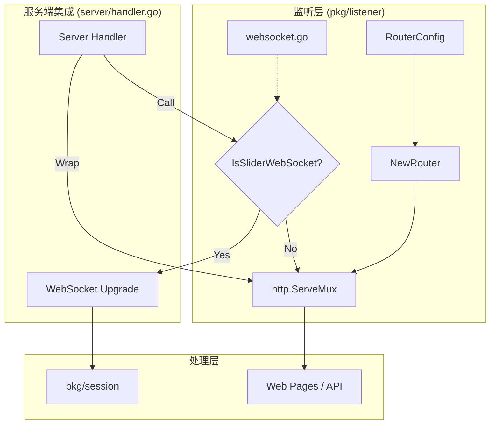
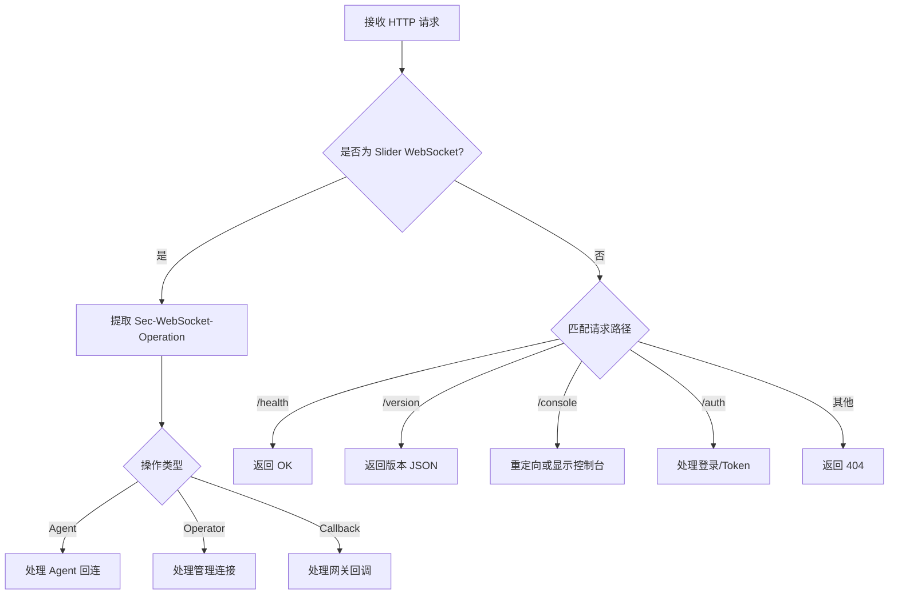
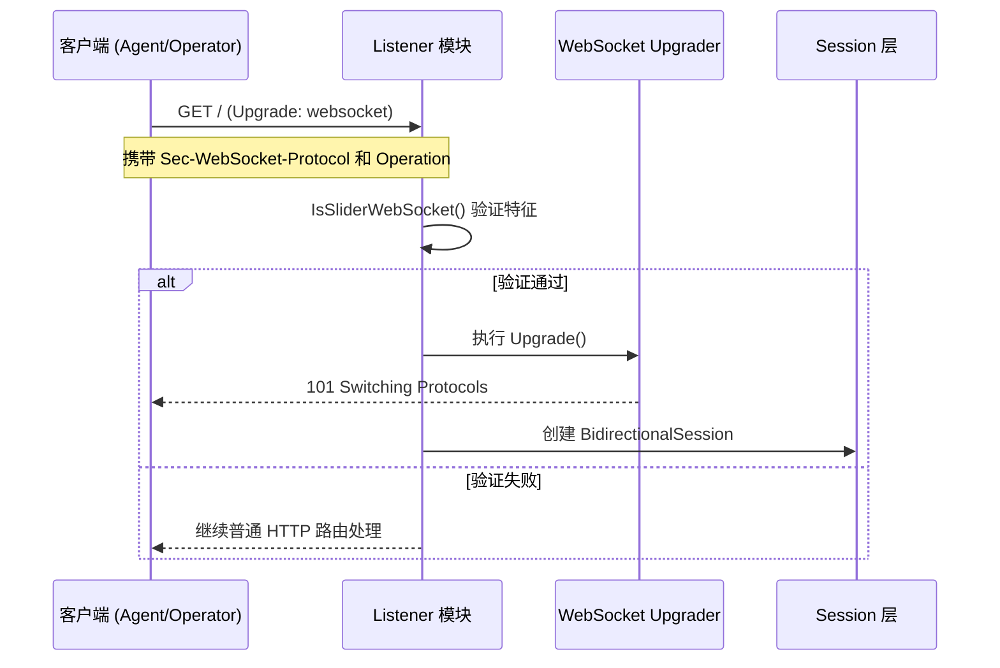

# 监听器与连接路由机制

## 目录
1. [模块概览](#模块概览)
2. [引言](#引言)
3. [统一监听架构](#统一监听架构)
4. [路由分发逻辑](#路由分发逻辑)
5. [WebSocket 升级流程](#websocket-升级流程)
6. [连接上下文与元数据管理](#连接上下文与元数据管理)
7. [核心组件](#核心组件)
8. [关键算法与逻辑](#关键算法与逻辑)
9. [错误处理](#错误处理)
10. [文件引用](#文件引用)

## 模块概览

`pkg/listener` 模块是 Slider Server 的门户，负责处理所有进入系统的网络连接。该模块虽然文件数量不多，但承载了系统最基础的连接接入、路由分发和协议升级逻辑。

- **文件总数**: 5 个 Go 文件（包含 2 个测试文件）
- **核心文件**:
    - `listener.go`: 基础监听工具与通用验证逻辑。
    - `router.go`: 基础 HTTP 路由配置与处理器实现。
    - `websocket.go`: WebSocket 协议升级、验证与 URL 处理工具。
- **覆盖范围**: 本文档将深度覆盖 `pkg/listener` 目录下的所有核心逻辑，并结合 `server/handler.go` 中的集成代码，阐述其在整个系统中的运行机制。

## 引言

在 Slider 的架构中，`pkg/listener` 充当了“流量调度员”的角色。它不仅需要处理常规的 HTTP 请求（如健康检查、版本获取、Web 控制台页面），更重要的是它需要识别并升级来自 Agent、Operator 或 Gateway 的持久化 WebSocket 连接。

Slider 采用了一种**混合路由机制**：
1. **基于路径的路由**: 用于区分 Web UI、API 和基础服务。
2. **基于协议头的路由**: 利用 WebSocket 的 `Sec-WebSocket-Protocol` 和 `Sec-WebSocket-Operation` 自定义头来区分不同的连接角色（如 Agent 控制、Operator 管理等）。

这种设计使得 Slider 能够在一个端口上同时提供 Web 服务和复杂的 SSH-over-WS 隧道服务，极大地简化了部署复杂度。

## 统一监听架构

Slider 的监听架构基于 `RouterConfig` 结构体进行配置，通过 `NewRouter` 工厂函数创建一个标准的 `http.ServeMux`。这个架构的设计哲学是“可插拔”与“配置驱动”。

### 架构组件关系

下面的架构图展示了 `pkg/listener` 如何与外部 Server 逻辑协作：



**图表说明**:
该图展示了 Slider 的统一监听架构。`RouterConfig` 定义了监听器的行为，`NewRouter` 生成基础路由。在实际运行时，`server` 会包装这个路由，首先通过 `IsSliderWebSocket` 判断是否为特有的协议升级请求。如果是，则绕过标准路由进入 WebSocket 升级流程；否则，按常规 HTTP 请求处理。

### 核心设计原则

- **接口统一**: 所有的处理器都遵循标准的 `http.HandlerFunc` 接口，便于与 Go 标准库集成。
- **配置隔离**: `RouterConfig` 将路由逻辑与具体的业务逻辑解耦，使得在不同模式（如只读模式、无 UI 模式）下可以灵活开启或关闭特定端点。
- **透明升级**: 对于客户端而言，它们只需发起一个标准的 HTTP 请求，系统会根据请求特征自动完成从 HTTP 到 WebSocket 的转换。

**Section sources**:
- [router.go](pkg/listener/router.go)
- [listener.go](pkg/listener/listener.go)

## 路由分发逻辑

Slider 的路由分发逻辑分为两个阶段：基础路由阶段和高级分发阶段。

### 1. 基础路由阶段 (router.go)

在 `router.go` 中，系统定义了一系列基础路径常量：
- `/auth`: 身份验证页面。
- `/health`: 健康检查接口，返回简单的 "OK"。
- `/version`: 版本信息接口，返回 JSON 格式的协议版本和软件版本。
- `/console`: Web 控制台入口。

`NewRouter` 函数会根据 `RouterConfig` 中的布尔开关（如 `HealthOn`, `VersionOn`）动态注册这些路径。

### 2. 高级分发阶段 (server/handler.go 集成)

真正的核心路由分发发生在 `server.buildRouter` 中。它不仅使用了 `pkg/listener` 提供的基础路由，还通过闭包包装了整个处理流程，实现了基于 Header 的分发。



**图表说明**:
此流程图详细描述了连接进入系统后的决策树。首要判断标准是协议类型（是否满足 Slider 的 WebSocket 握手特征），其次才是 URL 路径匹配。这种优先级设计确保了隧道连接的响应速度和准确性。

**Section sources**:
- [router.go](pkg/listener/router.go)
- [handler.go](server/handler.go)

## WebSocket 升级流程

WebSocket 升级是 Slider 实现 SSH-over-WS 的核心步骤。该流程在 `websocket.go` 中定义，并在 `server` 中执行。

### 握手验证机制

`IsSliderWebSocket` 函数是升级流程的守门员。它会检查以下特征：
1. **Upgrade Header**: 必须为 `websocket`。
2. **Sec-WebSocket-Protocol**: 必须匹配 Slider 的协议版本（定义在 `conf.Proto`）。
3. **Sec-WebSocket-Operation**: 必须是预定义的合法操作（如 `agent`, `operator`, `callback`）。

### 升级序列图



**图表说明**:
该序列图展示了从客户端发起升级请求到建立 `BidirectionalSession` 的全过程。重点在于 `IsSliderWebSocket` 的前置检查，它决定了请求是走向协议隧道还是走向 Web 页面。

**Section sources**:
- [websocket.go](pkg/listener/websocket.go)
- [handler.go](server/handler.go)

## 连接上下文与元数据管理

在连接建立的初期，`pkg/listener` 协助 `server` 提取关键的元数据，这些数据将被封装进连接上下文，传递给后续的 Session 层和 SSH 层。

### 提取的元数据项

1. **客户端 IP (RemoteAddr)**: 从底层 `net.Conn` 中提取，用于日志记录和安全审计。
2. **操作模式 (Operation)**: 从 `Sec-WebSocket-Operation` 提取，决定了 Session 的角色（是监听者还是连接者）。
3. **认证令牌 (Token)**: 从 `Sec-WebSocket-Protocol` 或 URL 参数中提取，用于后续的身份验证。

### 角色转换逻辑

Slider 支持复杂的拓扑结构，因此连接的角色在接入时就需要明确：
- **Agent 模式**: 客户端主动回连，Server 作为控制端。
- **Callback 模式**: 常用于网关穿透，Server 接收连接但作为 SSH 客户端去控制远端。
- **Operator 模式**: 管理员连接 Server，Server 提供管理接口。

这些逻辑的判断依据全部来自于 `pkg/listener` 解析出的 Header 信息。

**Section sources**:
- [handler.go](server/handler.go)
- [websocket.go](pkg/listener/websocket.go)

## 核心组件

### 1. RouterConfig 结构体
定义了路由器的行为和开启的功能。

```go
// RouterConfig 包含启用/禁用端点的选项
type RouterConfig struct {
	// 响应设置
	TemplatePath string // HTML 模板路径
	ServerHeader string // 自定义 Server 响应头
	StatusCode   int    // 默认响应状态码
	UrlRedirect  *url.URL

	// 可切换的端点
	HealthOn  bool // 是否开启 /health
	VersionOn bool // 是否开启 /version

	// 控制台功能
	ConsoleOn bool // 是否开启 Web 控制台
	AuthOn    bool // 是否开启身份验证
}
```

### 2. WebSocket 验证函数
用于识别 Slider 特有的 WebSocket 连接。

```go
// IsSliderWebSocket 检查请求是否为 Slider WebSocket 升级请求
func IsSliderWebSocket(r *http.Request, customProto string, operations []string) bool {
	upgradeHeader := r.Header.Get("Upgrade")
	if strings.ToLower(upgradeHeader) != "websocket" {
		return false
	}

	proto := HttpVersionResponse.ProtoVersion
	if customProto != "" && customProto != HttpVersionResponse.ProtoVersion {
		proto = customProto
	}

	secProto := r.Header.Get("Sec-WebSocket-Protocol")
	secOperation := r.Header.Get("Sec-WebSocket-Operation")

	if secProto != proto {
		return false
	}

	for _, op := range operations {
		if secOperation == op {
			return true
		}
	}
	return false
}
```

### 3. 路由工厂函数
创建基础的 `http.ServeMux`。

```go
// NewRouter 创建带有配置处理器的 http.ServeMux
func NewRouter(cfg *RouterConfig) *http.ServeMux {
	mux := http.NewServeMux()

	// 始终注册根处理器（模板或默认响应）
	mux.HandleFunc("/", templateHandler(cfg))

	// 条件注册处理器
	if cfg.HealthOn {
		mux.HandleFunc("/health", healthHandler(cfg))
	}
	if cfg.VersionOn {
		mux.HandleFunc("/version", versionHandler(cfg))
	}

	return mux
}
```

**Section sources**:
- [router.go](pkg/listener/router.go)
- [websocket.go](pkg/listener/websocket.go)

## 关键算法与逻辑

### 1. 模板验证逻辑 (`CheckTemplate`)
在加载 Web UI 模板前，系统会进行严格的安全性与合规性检查：
- 检查文件是否存在且不是目录。
- 限制模板大小（默认为 2MB），防止恶意大文件导致内存溢出。
- 该逻辑确保了 Web 服务的稳定性。

### 2. URL 协议转换 (`FormatToWS`)
Slider 需要在 HTTP(S) 和 WS(S) 协议之间进行转换。`FormatToWS` 函数实现了这一逻辑，它会根据原始 URL 的 Scheme（http/https）自动推断对应的 WebSocket Scheme（ws/wss），并处理空 Scheme 的默认情况。

### 3. 状态码白名单 (`CheckStatusCode`)
为了确保响应的规范性，`CheckStatusCode` 函数定义了一组被允许的 HTTP 状态码。这在自定义响应行为时非常有用，防止返回非标准的错误代码。

**Section sources**:
- [listener.go](pkg/listener/listener.go)
- [websocket.go](pkg/listener/websocket.go)

## 错误处理

`pkg/listener` 模块在错误处理上遵循“快速失败”和“清晰反馈”的原则。

- **连接升级失败**: 在 `server/handler.go` 中，如果 `upgrader.Upgrade` 失败，系统会记录错误日志并直接关闭连接，不会尝试继续处理该请求。
- **非法路径访问**: `templateHandler` 会检查 `r.URL.Path`。如果不是精确匹配 `/`，则返回 404，防止路径遍历或非法探测。
- **非 WebSocket 请求到 WS 端点**: 如果客户端向 `/console/ws` 发送了普通的 GET 请求，系统会返回 400 Bad Request，并提示 "This endpoint requires a WebSocket connection"，而不是模糊的 404。

这种细致的错误处理机制提高了系统的可调试性和安全性。

**Section sources**:
- [router.go](pkg/listener/router.go)
- [handler.go](server/handler.go)

## 文件引用

以下是本模块涉及的核心源文件：

- [pkg/listener/listener.go](pkg/listener/listener.go): 包含 `CheckTemplate`, `CheckStatusCode` 等基础工具。
- [pkg/listener/router.go](pkg/listener/router.go): 包含 `RouterConfig` 定义及基础路由实现。
- [pkg/listener/websocket.go](pkg/listener/websocket.go): 包含 WebSocket 验证与 URL 处理逻辑。
- [pkg/listener/router_test.go](pkg/listener/router_test.go): 路由逻辑的单元测试。
- [server/handler.go](server/handler.go): 展示了如何集成监听器与执行高级分发（作为外部参考）。
