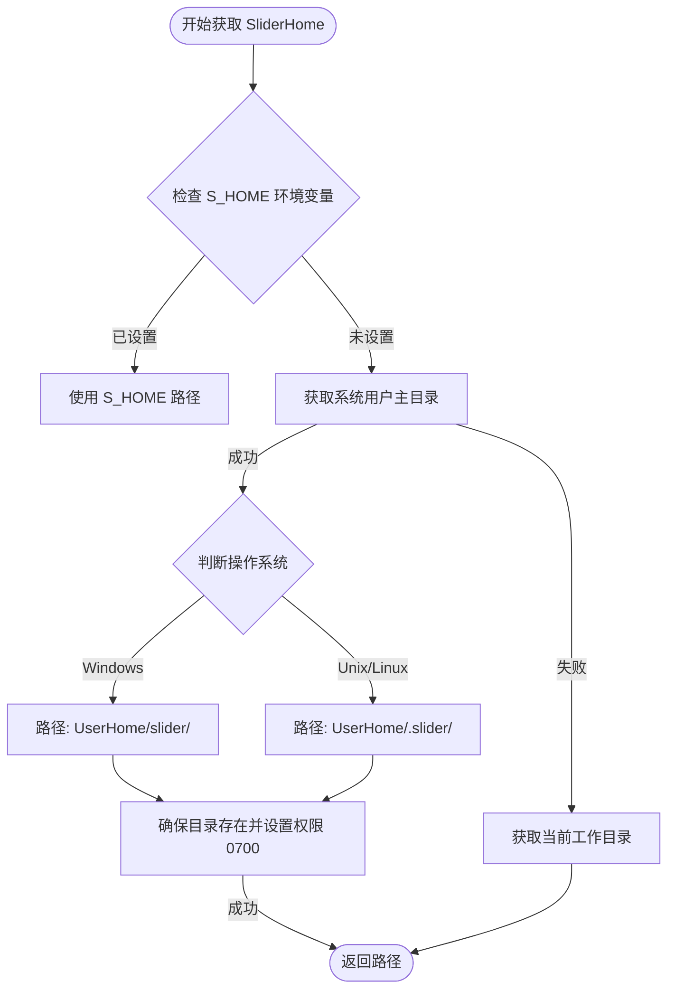
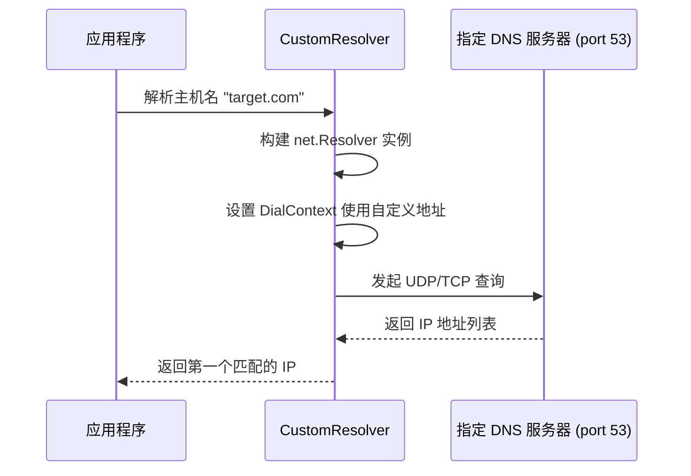
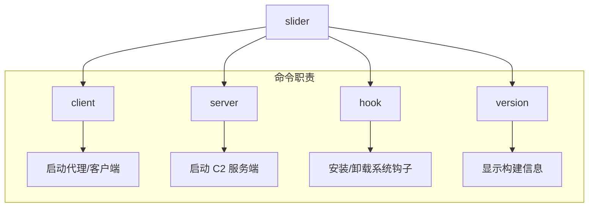
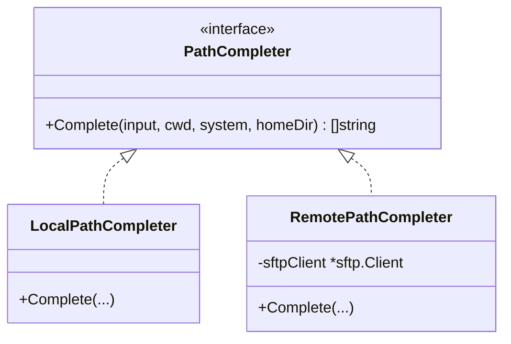
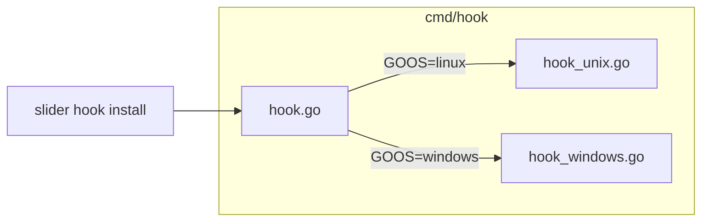

# 配置管理与 CLI 交互

## 目录
1. [模块概览](#模块概览)
2. [配置管理系统](#配置管理系统)
   - [配置优先级与加载逻辑](#配置优先级与加载逻辑)
   - [环境变量与默认值](#环境变量与默认值)
   - [自定义 DNS 解析机制](#自定义-dns-解析机制)
3. [命令行接口 (CLI) 设计](#命令行接口-cli-设计)
   - [Cobra 命令树结构](#cobra-命令树结构)
   - [核心子命令与运行模式](#核心子命令与运行模式)
   - [客户端 TLS 与指纹校验参数](#客户端-tls-与指纹校验参数)
   - [扩展新的 CLI 命令](#扩展新的-cli-命令)
4. [命令行自动补全逻辑](#命令行自动补全逻辑)
   - [补全系统架构](#补全系统架构)
   - [本地与远程路径补全实现](#本地与远程路径补全实现)
5. [跨平台适配与 Hook 机制](#跨平台适配与-hook-机制)
   - [路径与环境适配](#路径与环境适配)
   - [平台特定 Hook 实现](#平台特定-hook-实现)
6. [文件参考](#文件参考)

## 模块概览

Slider 的配置管理与 CLI 交互模块是整个系统的入口和控制中心。它负责解析用户的操作意图，加载运行所需的参数，并为交互式终端提供智能补全支持。该模块的设计哲学是“约定优于配置”，通过智能的默认值和环境变量覆盖机制，极大地降低了用户的部署成本。

该模块主要由以下核心组件构成：
- **配置系统 (`pkg/conf`)**：这是系统的“大脑”，存储了所有的协议常量、超时设置和环境探测逻辑。它不仅定义了 Slider 如何在不同操作系统上寻找自己的“家”，还实现了一套自定义的 DNS 解析机制，以应对复杂的网络对抗环境。
- **CLI 框架 (`cmd/`)**：基于 `spf13/cobra` 构建，提供了结构化的命令分发机制。它将命令的定义（CLI 层）与逻辑的实现（Service 层）清晰地分离开来，支持多级子命令和灵活的参数解析。
- **自动补全 (`pkg/completion`)**：这是提升用户体验的关键。它通过一套统一的接口，实现了对本地文件系统和远程 SFTP 目标的路径补全，支持 `~` 展开、空格转义和跨平台路径转换。

**项目规模统计**：
- **总文件数**：17 个 Go 源文件。
- **子模块分布**：
    - `pkg/conf` (7 个文件)：定义了 50+ 个核心常量，涵盖了从 SSH 通道类型到网络超时的方方面面。
    - `cmd/` (6 个文件)：构建了包含 `client`、`server`、`hook` 在内的多级命令树。
    - `pkg/completion` (4 个文件)：实现了复杂的路径解析与匹配算法。

本章节将深入探讨这些组件的内部实现机制，帮助开发者理解 Slider 的启动流程及扩展方法。

## 配置管理系统

Slider 的配置系统旨在提供零配置的开箱即用体验。它没有依赖外部的配置文件（如 `.yaml` 或 `.json`），而是通过一套严谨的优先级逻辑来管理配置项。

### 配置优先级与加载逻辑

Slider 的配置加载遵循以下优先级顺序：
1.  **环境变量**：以 `S_` 为前缀的环境变量具有最高优先级。
2.  **默认值**：在 `pkg/conf/defaults.go` 中定义的硬编码常量。

这种设计使得 Slider 非常适合在容器化环境或临时渗透测试中使用，因为用户可以通过一行命令设置环境变量来改变程序的行为，而无需担心配置文件的路径问题。

下面的流程图展示了 Slider 如何确定其工作目录（SliderHome），这是所有持久化数据（如证书、日志）的根路径：



在获取 `SliderHome` 后，系统会自动在其下创建 `ssh/` 目录。`ensurePath` 函数会强制执行 `0700` 权限。这是因为 SSH 协议对私钥文件的权限要求非常严格，如果权限过大（如 `0777`），许多 SSH 客户端会出于安全考虑拒绝加载该证书。Slider 在代码层面保证了这种安全性。

### 环境变量与默认值

Slider 定义了一系列关键的环境变量，用于微调其运行行为：

| 环境变量 | 对应常量 | 说明 |
| :--- | :--- | :--- |
| `S_HOME` | `SliderHomeEnvVar` | Slider 的工作根目录 |
| `S_CERT_JAR` | `SliderCertJarEnvVar` | 证书存储路径，默认为 `$S_HOME/ssh/` |
| `S_ALT_SHELL` | `SliderAltShellEnvVar` | 是否在执行时尝试使用备用 Shell（如 `/bin/sh` vs `/bin/bash`） |
| `S_EXEC_PTY` | `SliderExecPtyEnvVar` | 远程执行命令时是否强制请求 PTY 终端 |

在 `pkg/conf/defaults.go` 中，Slider 预设了大量的网络参数。例如，`SFTPBufferSize` 被设定为 32KB，这是经过性能调优后的平衡点，既能保证大文件传输的吞吐量，又不会消耗过多的内存。

### 自定义 DNS 解析机制

为了在受限网络环境下生存，Slider 在 `pkg/conf/resolver.go` 中实现了一个自定义的 DNS 解析器。它允许程序绕过系统的 `/etc/resolv.conf` 设置，直接向指定的 DNS 服务器发起查询。



该解析器支持 `host:port` 格式的配置，如果用户只提供了主机名，它会自动补全默认的 53 端口。这种灵活性使得 Slider 可以通过隧道或代理向特定的 DNS 服务器进行查询，有效规避了 DNS 投毒或审计。

**Section sources**:
- [pkg/conf/conf.go](pkg/conf/conf.go)
- [pkg/conf/defaults.go](pkg/conf/defaults.go)
- [pkg/conf/environment.go](pkg/conf/environment.go)
- [pkg/conf/resolver.go](pkg/conf/resolver.go)

## 命令行接口 (CLI) 设计

Slider 的命令行接口采用了经典的 Cobra 架构，旨在提供清晰的命令层次结构和强大的参数验证能力。

### Cobra 命令树结构

Slider 的根命令 `slider` 作为一个分发器，将功能划分为几个主要的子命令。



每个子命令的定义都遵循“声明与实现分离”的原则。在 `cmd/` 目录下的文件中，我们只看到命令的 UI 定义（如 `Use`, `Short`, `Long` 描述）以及参数的绑定。具体的业务逻辑被封装在对应的包中，例如 `cmd/client.go` 实际上是调用了 `slider/client` 包提供的功能。

### 核心子命令与运行模式

在 `pkg/conf/operations.go` 中，Slider 定义了四种核心运行模式，这些模式直接决定了 CLI 命令的行为：

1.  **Operator (操作员模式)**：主动连接并管理 Peer。
2.  **Gateway (网关模式)**：作为中转站，允许其他 Peer 穿透。
3.  **Agent (代理模式)**：请求被 Peer 控制（通常用于主动上线）。
4.  **Callback (回调模式)**：虽然由 Gateway 发起连接，但请求被 Peer 反向控制。

这些复杂的逻辑通过简单的 CLI 参数传递给底层的 SSH 引擎。Slider 的 CLI 设计确保了即使是复杂的隧道配置，也能通过直观的子命令参数来完成。

### 客户端 TLS 与指纹校验参数

当前客户端连接安全分为传输层 TLS 校验和 SSH HostKey 校验两层：

- `--server-ca`：为出站 HTTPS/WSS 连接提供自定义 CA 证书池。
- `--server-name`：覆盖 TLS 校验使用的 ServerName；未设置时使用服务端 URL 的主机名。
- `--fingerprint`：校验服务端 SSH HostKey 指纹，可传入单个指纹或包含多个指纹的文件。
- `--tls-cert` / `--tls-key`：为客户端出站连接提供 TLS 客户端证书。

当服务端 URL 不是 HTTPS 时，客户端必须提供 `--fingerprint`，否则 `RunClient` 会拒绝启动。这避免了明文 WebSocket 和 SSH HostKey 两层都没有对端身份校验的配置。`--server-ca` 与 `--server-name` 只适用于主动连接模式，因此与 `--listener` 互斥。

**Section sources**:
- [client/cli.go](client/cli.go)
- [client/config.go](client/config.go)

### 扩展新的 CLI 命令

由于采用了 Cobra 框架，扩展 Slider 的功能非常简单。开发者只需在 `cmd/` 下创建一个新的 `.go` 文件，并利用 `init()` 函数的自动注册机制即可。

```go
// 示例：添加一个新的 'debug' 命令
package cmd

import "github.com/spf13/cobra"

var debugCmd = &cobra.Command{
    Use:   "debug",
    Short: "运行系统诊断",
    Run: func(cmd *cobra.Command, args []string) {
        // 诊断逻辑
    },
}

func init() {
    rootCmd.AddCommand(debugCmd)
}
```

这种插件式的命令注册方式，使得 Slider 的功能可以水平扩展，而不会导致 `root.go` 文件变得臃肿。

**Section sources**:
- [cmd/root.go](cmd/root.go)
- [cmd/client.go](cmd/client.go)
- [cmd/server.go](cmd/server.go)
- [pkg/conf/operations.go](pkg/conf/operations.go)

## 命令行自动补全逻辑

为了在交互式 Shell 中提供类似原生 Bash/Zsh 的体验，Slider 实现了一套完整的路径补全系统。这套系统不仅能补全本地路径，还能通过 SSH/SFTP 补全远程目标的路径。

### 补全系统架构

补全系统的核心是 `PathCompleter` 接口。它定义了一个统一的契约，使得上层 Shell 逻辑无需关心路径是来自本地磁盘还是远端服务器。



### 本地与远程路径补全实现

**补全算法流程**：
1.  **输入解析 (`parsePathInput`)**：将用户输入的字符串拆分为“目录部分”和“前缀部分”。在此过程中，它会处理 `~` 符号的展开，并根据目标操作系统识别路径分隔符（Windows 的 `\` 或 Unix 的 `/`）。
2.  **条目获取**：
    - `LocalPathCompleter` 使用 `os.ReadDir` 读取本地目录。
    - `RemotePathCompleter` 通过 `sftp.Client.ReadDir` 发起远程请求。
3.  **过滤与匹配 (`filterEntries`)**：执行不区分大小写的前缀匹配。为了性能考虑，它会将匹配结果限制在 `maxEntries` (100) 以内。
4.  **结果构建 (`buildResult`)**：计算所有匹配项的最长公共前缀。如果路径中包含空格，它会自动处理引号转义。

特别值得注意的是 `RemotePathCompleter` 对跨平台路径的转换逻辑。如果远程目标是 Windows，而本地是 Linux，它会自动将 SFTP 返回的 Unix 风格路径转换为 Windows 风格的显示格式（例如将 `/` 替换为 `\`），从而保证了用户交互的一致性。

**Section sources**:
- [pkg/completion/completer.go](pkg/completion/completer.go)
- [pkg/completion/local_path.go](pkg/completion/local_path.go)
- [pkg/completion/remote_path.go](pkg/completion/remote_path.go)

## 跨平台适配与 Hook 机制

Slider 作为一个跨平台的 C2 工具，在代码中大量使用了条件编译和运行时检测来确保在不同操作系统上的兼容性。

### 路径与环境适配

在 `pkg/conf/conf.go` 中，Slider 通过 `runtime.GOOS` 动态调整路径生成逻辑。例如，在处理用户主目录时：
- **Windows**: 拼接 `UserHome + \ + slider + \`。
- **Unix**: 拼接 `UserHome + / + .slider + /`。

这种细微的差别确保了 Slider 能够完美融入目标操作系统的文件系统规范，减少被管理员发现的风险。

### 平台特定 Hook 实现

Slider 的 `cmd/` 目录下包含了 `hook.go`、`hook_unix.go` 和 `hook_windows.go`。这表明 Slider 支持安装系统级的钩子（如持久化或监控）。



这种结构允许开发者为不同平台编写完全不同的底层实现，而对外暴露统一的 CLI 接口。例如，在 Windows 上，`hook` 可能涉及注册表操作或服务创建；而在 Linux 上，则可能涉及 `systemd` 单元文件或 `crontab` 的修改。

**Section sources**:
- [cmd/hook.go](cmd/hook.go)
- [cmd/hook_unix.go](cmd/hook_unix.go)
- [cmd/hook_windows.go](cmd/hook_windows.go)
- [pkg/conf/conf.go](pkg/conf/conf.go)

## 文件参考

以下是本章节涉及的核心源文件及其在项目中的位置：

- [pkg/conf/conf.go](pkg/conf/conf.go): 核心路径处理与环境探测逻辑。
- [pkg/conf/defaults.go](pkg/conf/defaults.go): 系统默认常量（超时、缓冲区等）。
- [pkg/conf/environment.go](pkg/conf/environment.go): 环境变量名称定义。
- [pkg/conf/resolver.go](pkg/conf/resolver.go): 自定义 DNS 解析器实现。
- [pkg/conf/ssh.go](pkg/conf/ssh.go): SSH 通道与请求类型定义。
- [cmd/root.go](cmd/root.go): CLI 根命令与全局配置。
- [cmd/client.go](cmd/client.go): 客户端子命令定义。
- [cmd/server.go](cmd/server.go): 服务端子命令定义。
- [cmd/hook.go](cmd/hook.go): 系统钩子命令入口。
- [pkg/completion/completer.go](pkg/completion/completer.go): 路径补全核心算法。
- [pkg/completion/local_path.go](pkg/completion/local_path.go): 本地路径补全器。
- [pkg/completion/remote_path.go](pkg/completion/remote_path.go): 远程路径补全器。
