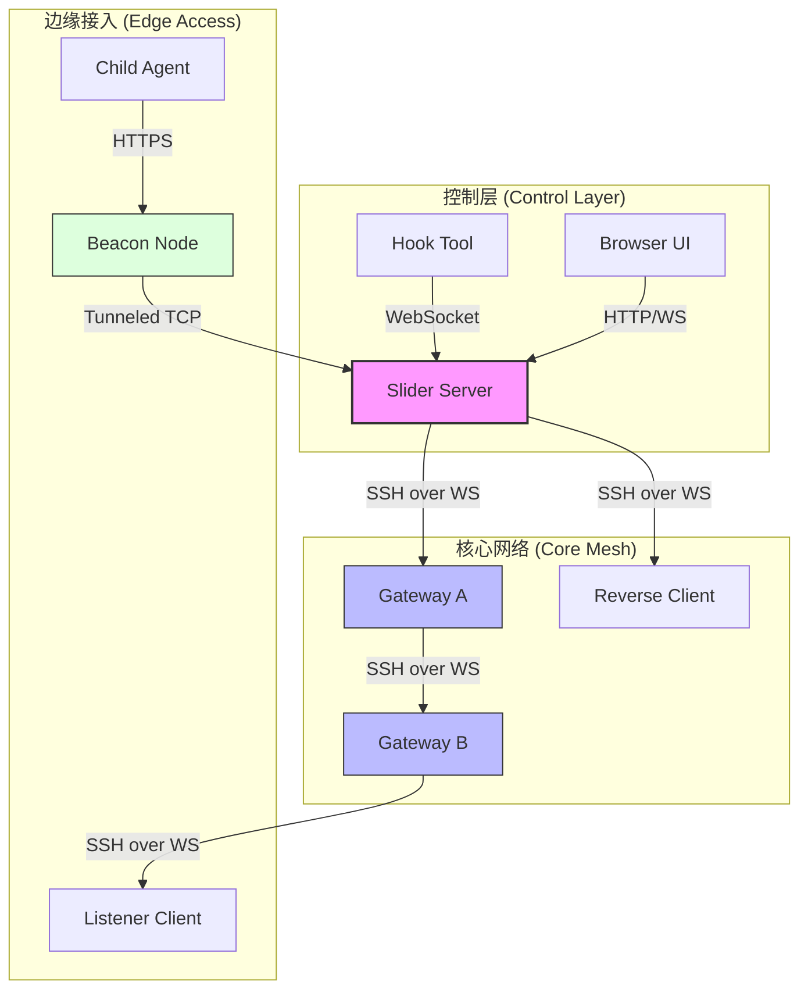
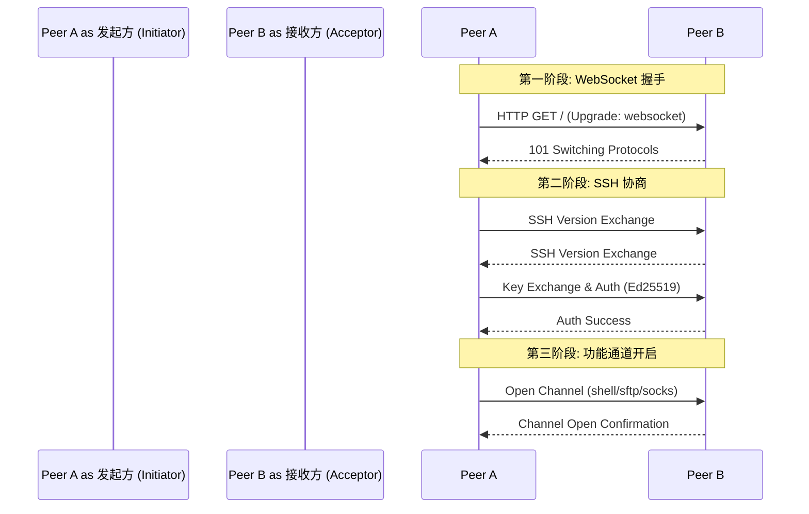
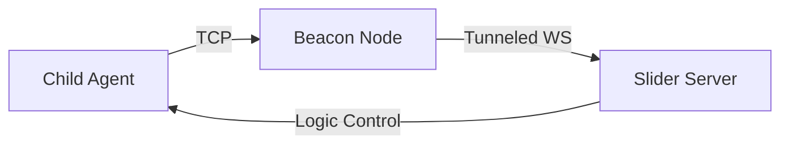

# 项目概览与架构设计

## 目录
1. [模块概览](#模块概览)
2. [项目起源与核心价值](#项目起源与核心价值)
3. [整体架构设计](#整体架构设计)
   - [核心角色定义](#核心角色定义)
   - [连接生命周期](#连接生命周期)
4. [多模式运行机制](#多模式运行机制)
   - [单二进制文件实现](#单二进制文件实现)
   - [Gateway 与网格路由](#gateway-与网格路由)
   - [Beacon 代理模式](#beacon-代理模式)
5. [核心基础组件](#核心基础组件)
   - [日志系统 (pkg/slog)](#日志系统-pkgslog)
   - [通用类型定义 (pkg/types)](#通用类型定义-pkgtypes)
6. [文件参考](#文件参考)

## 模块概览

Slider 是一个采用 Go 语言编写的高度集成的远程管理工具（RAT）和 C2 框架。它通过将复杂的远程控制逻辑封装在单一二进制文件中，实现了极简的部署体验和强大的多跳路由能力。本项目旨在为系统管理员和渗透测试人员提供一个轻量级、安全且易于扩展的远程访问解决方案。

在本次架构探索中，我们对整个项目进行了系统性的梳理：
- **代码规模**：项目包含约 120 个 Go 源文件，涵盖了从底层网络协议到上层控制台交互的完整实现。
- **核心模块**：
    - `client/` 与 `server/`：分别实现了受控端（Agent）和控制端（Operator）的核心逻辑。
    - `pkg/session/`：实现了核心的 `BidirectionalSession` 类型，这是 Slider 支持多模式运行的关键。
    - `pkg/listener/`：负责 WebSocket 协议的升级与路由分发。
    - `pkg/instance/`：提供了 Shell、SOCKS5 代理、端口转发等具体功能的实例管理。
- **覆盖范围**：本章节将重点介绍项目的宏观架构、连接模型以及底层基础组件，为后续深入研究各子模块打下基础。

## 项目起源与核心价值

Slider 的诞生源于对现有远程管理工具在特定环境下局限性的思考。许多成熟的 C2 框架由于许可限制、体积庞大或依赖复杂，在快速响应的渗透测试或受限的系统管理场景中显得力不从心。

Slider 的核心价值体现在以下四个方面：
1. **轻量化与易传输**：通过 Go 语言编写，编译后的单二进制文件配合 UPX 压缩可控制在 3MB-6MB 左右，极易在目标系统间传输。
2. **基于 SSH over WebSockets 的安全性**：利用 WebSocket 作为传输层以穿透防火墙，同时在内部建立 SSH 隧道，利用 Ed25519 密钥对实现双向身份验证和全流量加密。
3. **极简的部署模式**：一个二进制文件即可充当服务器、客户端、网关或 Beacon，无需复杂的安装过程。
4. **强大的路由能力**：内置 Gateway 模式，支持多级跳转（Multi-hop），能够构建复杂的管理网格。

## 整体架构设计

Slider 的架构设计围绕着“会话（Session）”展开。无论节点处于何种运行模式，最终都会抽象为一个双向会话。

### 核心角色定义

在 Slider 网络中，存在以下五种核心角色：

- **Server (Operator)**：控制中心，负责管理所有接入的客户端，提供交互式控制台。
- **Client (Agent)**：受控端，执行来自 Server 的指令，支持反向连接（Reverse）或监听模式（Listener）。
- **Gateway**：中继节点，既能接受连接也能发起连接，实现多级跳板功能。
- **Beacon**：特殊的代理节点，用于在受限网络中隧道化其他 Agent 的连接。
- **Hook**：轻量级控制台接入工具，允许用户从终端直接挂载到远程 Server 的 Web 控制台。

下图展示了这些组件之间的物理与逻辑连接关系：



该架构图展示了 Slider 如何通过 `Gateway` 构建多级跳板，以及 `Beacon` 如何在复杂网络拓扑中提供接入点。`Server` 作为核心，通过 SSH over WebSockets 协议与所有节点通信。

### 连接生命周期

Slider 的连接过程是一个典型的协议升级过程。它首先通过标准 HTTP/HTTPS 发起 WebSocket 握手，一旦握手成功，底层连接将被“劫持”并交给 SSH 协议栈接管。



连接流程从基础的 HTTP 升级开始，确保了良好的防火墙兼容性。进入 SSH 协商阶段后，Slider 利用 Ed25519 密钥对完成身份验证，确保了连接的安全性。最后，在加密的 SSH 隧道内开启各种功能通道。

**Section sources**:
- [README.md](README.md)
- [pkg/session/session.go](pkg/session/session.go)
- [pkg/listener/websocket.go](pkg/listener/websocket.go)

## 多模式运行机制

Slider 的强大之处在于其“单二进制、多模式”的设计理念。

### 单二进制文件实现

Slider 使用了 `spf13/cobra` 库来管理命令行参数。在 `main.go` 中，程序调用 `cmd.Execute()`，根据用户输入的子命令（如 `server` 或 `client`）初始化不同的运行逻辑。

```go
// cmd/root.go 中的根命令定义
var rootCmd = &cobra.Command{
	Use:   "slider",
	Short: "Slider - A Command & Control (C2) application",
	Long: `Slider is a program able to run as:
* Server with the basic functionality of a Command & Control (C2) application.
* Client acting as an Agent that connects back to the Server counterpart, or listens for connections.`,
}

// cmd/server.go 中注册服务器子命令
func init() {
	rootCmd.AddCommand(server.NewCommand())
}
```

这种设计使得开发者可以在同一套代码库中共享大量的网络处理、加密和日志逻辑，同时为用户提供统一的交互界面。

### Gateway 与网格路由

当以 `--gateway` 模式启动 Server 时，它会开启路由转发功能。Gateway 节点维护一张远程会话表，能够将来自上游 Operator 的指令透明地转发给下游节点。这种网格化的设计允许攻击者或管理员通过一个入口点控制整个内网环境。

### Beacon 代理模式

Beacon 模式是为特殊场景设计的。它不同于 Gateway 的协议层转发，Beacon 在网络层起作用。它接受来自 Child Agent 的连接，并将原始 TCP 流隧道化到主 Server。这对于绕过严格的出站限制非常有效。



在 Beacon 模式下，中间节点（Beacon）并不解密流量，它仅仅扮演一个传输隧道。真正的 SSH 协商发生在 `Child Agent` 和 `Server` 之间，保证了端到端的安全性。

**Section sources**:
- [main.go](main.go)
- [cmd/root.go](cmd/root.go)
- [cmd/server.go](cmd/server.go)
- [pkg/session/gateway_mode.go](pkg/session/gateway_mode.go)

## 核心基础组件

Slider 的稳定运行依赖于几个精心设计的底层组件。

### 日志系统 (pkg/slog)

`pkg/slog` 提供了一个功能丰富的结构化日志工具。它不仅支持传统的控制台输出，还支持 JSON 格式，便于与 ELK 等日志分析系统集成。

**核心特性**：
- **多级别控制**：支持 DEBUG, INFO, WARN, ERROR, FATAL 五个级别。
- **调用者追踪**：能够自动记录产生日志的文件名和行号。
- **输出缓冲**：通过 `LogBuff` 结构，可以将日志暂时存储在内存中，待控制台就绪后再统一输出，避免了并发写入导致的混乱。

```go
// pkg/slog/slog.go 核心结构
type Logger struct {
	logLevel int
	logger   *log.Logger
	logBuff  *LogBuff
	sync.Mutex
	colorOn  bool
	callerOn bool
	jsonOn   bool
	prefix   string
}

// 带有结构化字段的日志记录
func (l *Logger) InfoWith(msg string, fields ...Field) {
    // ... 实现逻辑
}
```

### 通用类型定义 (pkg/types)

为了在 SSH 隧道中传输各种控制指令，Slider 定义了一系列标准化的消息结构。这些结构遵循 RFC4254 的建议，同时针对 C2 场景进行了扩展。

**关键结构体**：
- `PtyRequest`：用于协商伪终端（PTY）的尺寸和环境变量。
- `TcpIpChannelMsg`：用于端口转发请求的元数据。
- `CustomCmd`：Slider 特有的命令执行负载，包含执行路径和具体指令。

```go
// pkg/types/ssh.go
type CustomCmd struct {
	Path    string `json:"path"`
	Command string `json:"command"`
}
```

这些通用的类型定义确保了 Client 和 Server 在解释二进制流时能够达成共识，是实现跨平台交互的基础。

**Section sources**:
- [pkg/slog/slog.go](pkg/slog/slog.go)
- [pkg/types/ssh.go](pkg/types/ssh.go)

## 文件参考

以下是本章节涉及的核心源文件，建议在深入阅读后续章节前先熟悉这些文件：

| 文件路径 | 描述 |
| :--- | :--- |
| `main.go` | 程序入口，调用命令行解析。 |
| `cmd/root.go` | 定义基础命令行结构和全局标志。 |
| `pkg/session/session.go` | 核心会话管理逻辑，定义了 `BidirectionalSession`。 |
| `pkg/slog/slog.go` | 结构化日志系统的实现。 |
| `pkg/types/ssh.go` | 协议层使用的通用数据结构定义。 |
| `pkg/listener/websocket.go` | 处理 WebSocket 升级和基础网络监听。 |
| `server/gateway.go` | Gateway 模式的特定逻辑实现。 |
| `client/handler_beacon.go` | Beacon 代理模式的处理逻辑。 |

**Diagram sources**:
- [README.md:L222-L240](README.md#L222-L240)
- [pkg/session/session.go:L17-L87](pkg/session/session.go#L17-L87)
- [pkg/listener/websocket.go:L50-L100](pkg/listener/websocket.go#L50-L100)
